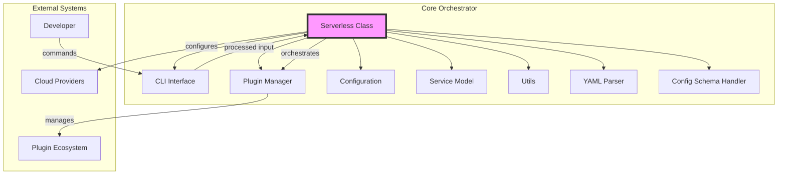
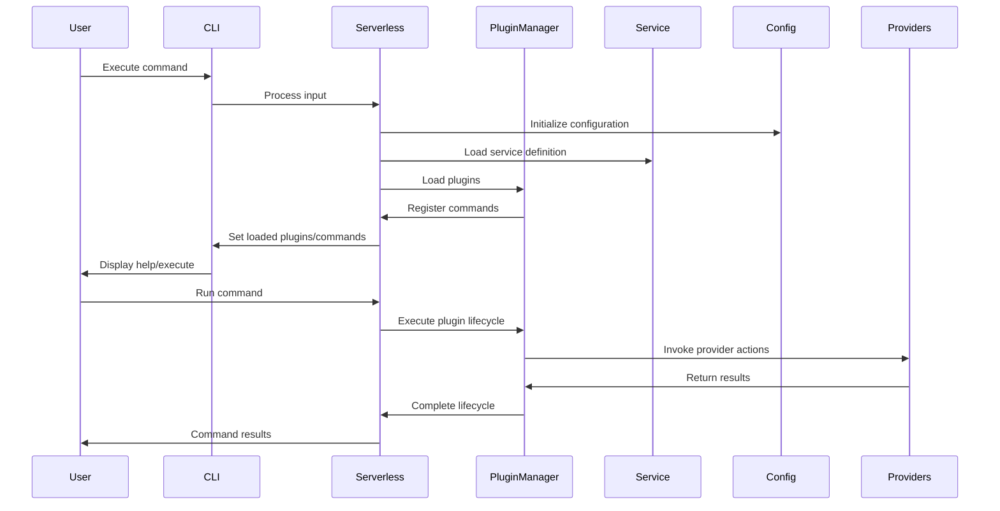
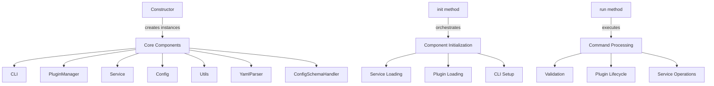
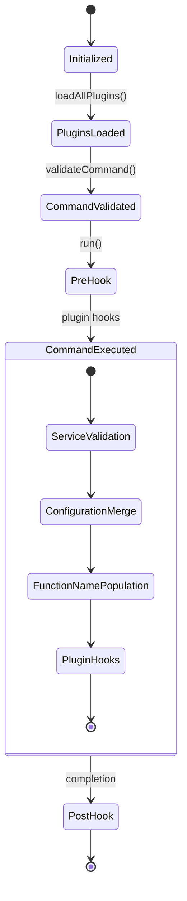
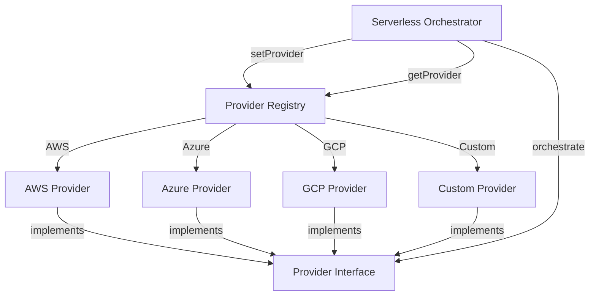
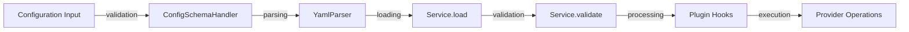

# Core Orchestrator Module

## Introduction

The Core Orchestrator module serves as the central coordination hub of the Serverless Framework, managing the entire lifecycle of serverless application deployment and operations. It acts as the main entry point that orchestrates all framework components, plugins, and provider integrations to deliver a unified serverless development experience.

## Architecture Overview

The Core Orchestrator is built around the `Serverless` class, which serves as the primary facade and lifecycle manager for the entire framework. It coordinates between configuration management, plugin system, service model, and CLI interface to provide a cohesive development workflow.



## Core Components

### Serverless Class (`lib.serverless.Serverless`)

The `Serverless` class is the central orchestrator that manages the entire framework lifecycle. It provides the main API surface and coordinates all subsystems.

#### Key Responsibilities:
- **Lifecycle Management**: Controls initialization, configuration loading, and command execution
- **Component Coordination**: Manages interactions between CLI, plugins, configuration, and service components
- **Provider Abstraction**: Provides a unified interface for different cloud providers
- **Configuration Management**: Handles service configuration validation and extension
- **Plugin Orchestration**: Coordinates plugin loading and lifecycle hooks

#### Constructor Parameters:
```javascript
{
  version,              // Framework version
  orgId, orgName,       // Organization information
  accessKey,            // Access credentials
  commands,             // CLI commands
  options,              // CLI options
  servicePath,          // Service directory path
  serviceConfigFileName, // Configuration file name
  service,              // Service configuration object
  credentialProviders,  // Credential provider plugins
  region,               // Target region
  compose,              // Compose integration data
  instanceId            // Unique instance identifier
}
```

## Data Flow Architecture



## Component Interactions

### Initialization Flow



### Plugin Lifecycle Management

The Core Orchestrator manages the plugin lifecycle through the PluginManager, providing hooks for different phases of command execution:



## Integration Points

### Configuration Management Integration
The orchestrator integrates with the [configuration-management module](configuration-management.md) through:
- **Config Class**: Manages framework-wide configuration settings
- **ConfigSchemaHandler**: Validates service configuration against schemas
- **YamlParser**: Parses and processes YAML configuration files

### Plugin System Integration
Coordinates with the [plugin-management module](plugin-management.md) via:
- **PluginManager**: Loads and manages plugin lifecycle
- **TerminateHookChain**: Handles plugin termination sequences

### Service Model Integration
Works with the [service-model module](service-model.md) through:
- **Service Class**: Represents the serverless service definition
- **Service Loading**: Dynamically loads service configurations
- **Service Validation**: Validates service structure and dependencies

### CLI Interface Integration
Interfaces with the [cli-interface module](cli-interface.md) via:
- **CLI Class**: Handles command-line interaction
- **Command Processing**: Parses and validates user commands
- **Help System**: Provides command documentation

## Provider Abstraction Layer

The Core Orchestrator provides a provider abstraction that allows seamless integration with different cloud providers:



## Service Lifecycle Management

### Service Configuration Flow



### Configuration Extension Mechanism

The orchestrator provides a configuration extension mechanism that allows plugins to modify the service configuration during initialization:

```javascript
// Configuration extension example
serverless.extendConfiguration(['custom', 'newSetting'], value)
```

This mechanism ensures that plugins can contribute to the service configuration while maintaining validation and type safety.

## Error Handling and Validation

The Core Orchestrator implements comprehensive error handling and validation:

- **Input Validation**: Validates all constructor parameters using type checking
- **Configuration Validation**: Ensures service configuration adheres to schemas
- **Command Validation**: Validates command existence and parameters
- **Service Validation**: Validates service structure and dependencies
- **Deprecation Logging**: Tracks and logs deprecated features

## Output Management

The orchestrator provides structured output management through:

- **Service Outputs**: Stores service-level output sections
- **Plugin Outputs**: Manages plugin-generated output sections
- **Progress Tracking**: Integrates with progress indicators
- **Logging**: Coordinates logging across all components

## Integration with Framework Commands

The Core Orchestrator integrates with various command modules:

- **[core-commands](core-commands.md)**: Basic framework commands (deploy, remove, etc.)
- **[aws-commands](aws-commands.md)**: AWS-specific command implementations
- **[plugin-system](plugin-system.md)**: Plugin management commands

## Best Practices

### For Plugin Developers
1. **Lifecycle Awareness**: Understand the plugin lifecycle and hook into appropriate phases
2. **Configuration Extension**: Use `extendConfiguration()` for modifying service config
3. **Error Handling**: Properly handle and propagate errors through the orchestrator
4. **Provider Abstraction**: Use provider interfaces rather than direct cloud API calls

### For Framework Maintainers
1. **Backward Compatibility**: Maintain API compatibility in the Serverless class
2. **Performance**: Optimize initialization and plugin loading sequences
3. **Modularity**: Keep the orchestrator focused on coordination, not implementation
4. **Testing**: Ensure comprehensive testing of lifecycle scenarios

## Future Considerations

The Core Orchestrator is designed to be extensible and can accommodate:

- **Multi-Provider Deployments**: Coordinating deployments across multiple clouds
- **Service Composition**: Managing complex service dependencies
- **Advanced Plugin Patterns**: Supporting more sophisticated plugin architectures
- **Performance Optimization**: Improving initialization and execution performance

## Related Documentation

- [Configuration Management](configuration-management.md) - Service configuration handling
- [Plugin Management](plugin-management.md) - Plugin system coordination
- [Service Model](service-model.md) - Service definition and validation
- [CLI Interface](cli-interface.md) - Command-line interaction
- [Core Commands](core-commands.md) - Basic framework commands
- [AWS Commands](aws-commands.md) - AWS-specific implementations