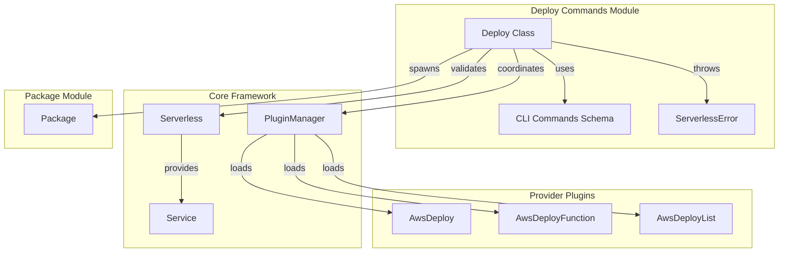
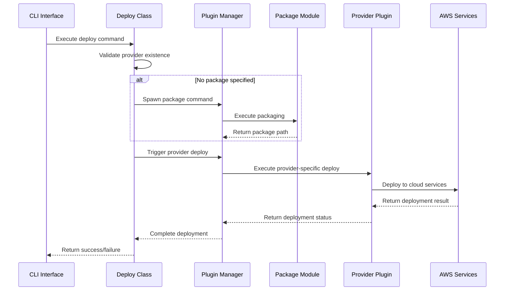
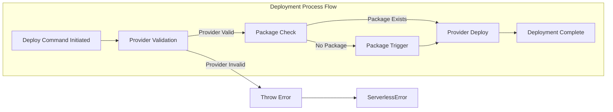

# Deploy Commands Module Documentation

## Introduction

The deploy-commands module is a core component of the Serverless Framework that provides the foundational deployment functionality for serverless applications. It serves as the primary interface for deploying entire services, individual functions, and managing deployment lists. This module acts as a command orchestrator that coordinates with provider-specific deployment implementations and the packaging system to ensure seamless application deployment.

## Architecture Overview

The deploy-commands module follows a plugin-based architecture where it defines the command structure and lifecycle hooks while delegating the actual deployment implementation to provider-specific plugins. This design enables the framework to support multiple cloud providers while maintaining a consistent command interface.



## Core Components

### Deploy Class (`lib.plugins.deploy.Deploy`)

The Deploy class is the main component of the deploy-commands module. It implements the command structure and lifecycle management for deployment operations.

#### Key Responsibilities:
- **Command Definition**: Defines the hierarchical command structure for deploy operations
- **Provider Validation**: Validates the existence of the specified provider before deployment
- **Package Coordination**: Automatically triggers packaging if no package path is specified
- **Lifecycle Management**: Manages pre and post-deployment hooks

#### Command Structure:
```
deploy
├── function          # Deploy individual functions
└── list             # List deployment information
    └── functions    # List deployed functions
```

## Data Flow



## Component Interactions



## Lifecycle Hooks

The deploy-commands module implements two critical lifecycle hooks:

### Before Deploy Hook (`before:deploy:deploy`)
- **Provider Validation**: Ensures the specified provider exists in the system
- **Package Coordination**: Automatically triggers packaging if no package path is provided
- **Error Handling**: Throws `ServerlessError` for invalid providers

### After Deploy Hook (`after:deploy:deploy`)
- **Completion Handling**: Provides a hook for post-deployment operations
- **Success Confirmation**: Returns true to indicate successful deployment

## Dependencies

### Core Framework Dependencies
- **[`core-framework.md`](core-framework.md)**: Provides the main Serverless class and plugin management system
- **[`configuration-management.md`](configuration-management.md)**: Handles service configuration and validation
- **[`cli-interface.md`](cli-interface.md)**: Provides command-line interface functionality

### Related Command Modules
- **[`package-commands.md`](package-commands.md)**: Coordinates with packaging before deployment
- **[`aws-deploy.md`](aws-deploy.md)**: Provider-specific deployment implementation for AWS
- **[`aws-deploy-function.md`](aws-deploy-function.md)**: Handles individual function deployments
- **[`aws-deploy-list.md`](aws-deploy-list.md)**: Manages deployment listing functionality

## Error Handling

The module implements comprehensive error handling through the `ServerlessError` class:

- **Invalid Provider Error**: Thrown when the specified provider doesn't exist
- **Error Code**: `INVALID_PROVIDER`
- **User-Friendly Message**: "The specified provider "{provider}" does not exist."

## Command Schema Integration

The deploy-commands module integrates with the CLI commands schema system to provide:
- **Command Definitions**: Structured command and subcommand definitions
- **Help Text**: Automatic help generation for deploy commands
- **Validation**: Input validation based on schema specifications
- **Options**: Command-specific options and flags

## Provider Abstraction

The module implements a provider abstraction pattern that allows it to:
- **Support Multiple Providers**: Work with AWS, Azure, Google Cloud, etc.
- **Consistent Interface**: Provide the same command structure regardless of provider
- **Dynamic Loading**: Load provider-specific plugins at runtime
- **Extensibility**: Easy addition of new cloud providers

## Best Practices

### Deployment Workflow
1. **Validate Provider**: Always ensure the provider exists before deployment
2. **Package Coordination**: Automatically handle packaging when needed
3. **Error Handling**: Provide clear, actionable error messages
4. **Hook System**: Utilize lifecycle hooks for customization

### Extension Points
- **Custom Providers**: Implement provider plugins following the established pattern
- **Pre/Post Hooks**: Add custom logic using lifecycle hooks
- **Command Extensions**: Extend the command structure through plugin development

## Integration Examples

### Basic Deployment
```bash
serverless deploy
```

### Deploy Specific Function
```bash
serverless deploy function -f myFunction
```

### List Deployments
```bash
serverless deploy list
serverless deploy list functions
```

This modular design ensures that the deploy-commands module remains focused on command orchestration while delegating provider-specific implementation details to dedicated plugins, maintaining clean separation of concerns and enabling extensibility across different cloud platforms.