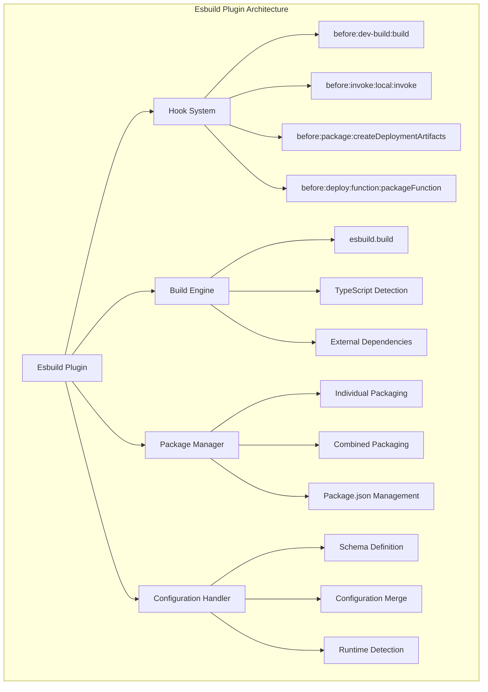
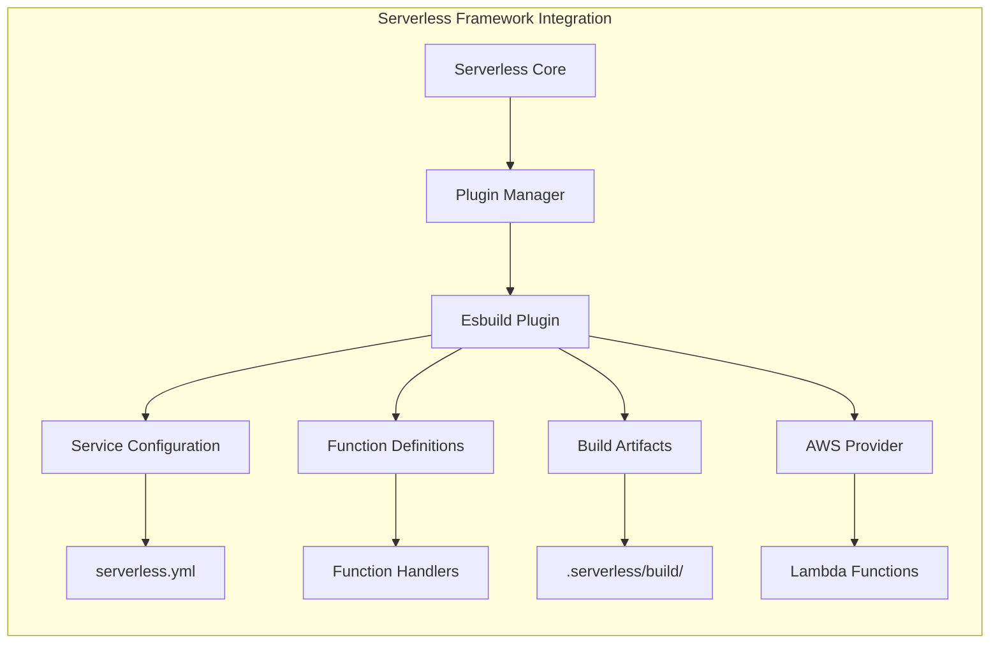
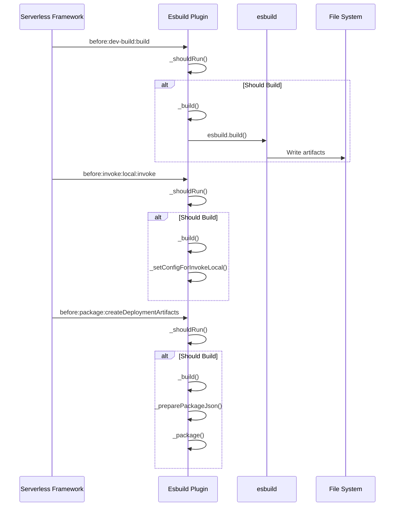
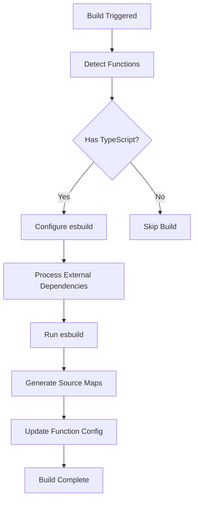
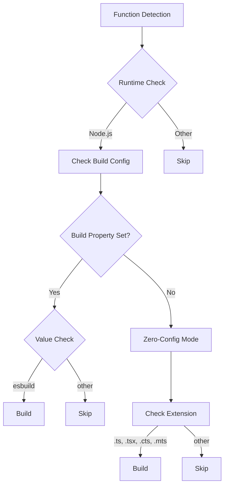
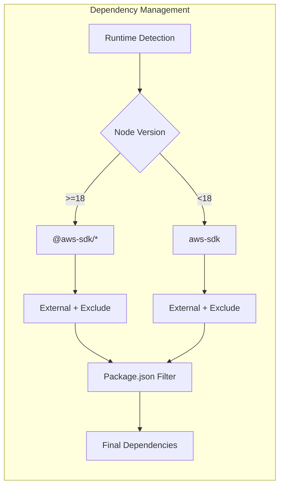
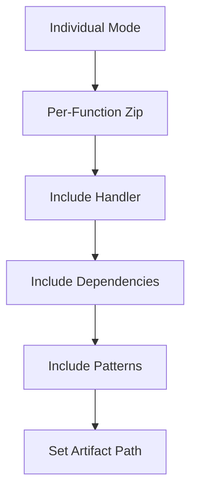
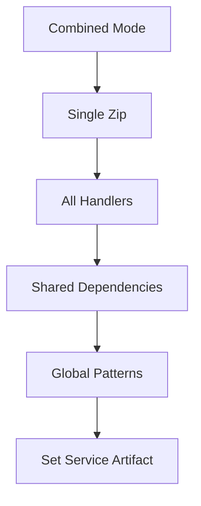

# Esbuild Plugin Module Documentation

## Introduction

The esbuild-plugin module is a critical component of the Serverless Framework that provides TypeScript and modern JavaScript bundling capabilities for AWS Lambda functions. It integrates the high-performance esbuild bundler to transform, optimize, and package serverless functions written in TypeScript or modern JavaScript syntax into deployment-ready artifacts.

This plugin automatically detects TypeScript functions, applies intelligent bundling strategies, manages external dependencies, and creates optimized deployment packages while maintaining compatibility with the AWS Lambda runtime environment.

## Architecture Overview

### Core Architecture



### Integration with Serverless Framework



## Component Details

### Esbuild Class

The `Esbuild` class is the main component that orchestrates the entire build and packaging process. It implements the Serverless Framework plugin interface and provides comprehensive TypeScript/JavaScript bundling capabilities.

#### Key Responsibilities:
- **Hook Registration**: Registers lifecycle hooks for various Serverless commands
- **Function Detection**: Identifies which functions require esbuild processing
- **Build Configuration**: Manages esbuild configuration and options
- **Dependency Management**: Handles external dependencies and AWS SDK exclusions
- **Artifact Creation**: Creates deployment-ready packages

#### Constructor and Initialization

```javascript
constructor(serverless, options) {
  this.serverless = serverless
  this.options = options || {}
  this._functions = undefined
  
  this._buildProperties = _.memoize(this._buildProperties.bind(this))
  this._readPackageJson = _.memoize(this._readPackageJson.bind(this))
}
```

The constructor initializes the plugin with the Serverless instance and options, setting up memoized functions for performance optimization.

### Hook System

The plugin registers hooks for critical Serverless Framework lifecycle events:

#### Build Hooks



### Build Process Flow



### Function Detection Logic

The plugin uses sophisticated logic to determine which functions should be processed:



### Dependency Management

The plugin implements intelligent dependency management for AWS SDK packages:



### Packaging Strategy

The plugin supports two packaging modes:

#### Individual Packaging


#### Combined Packaging


## Configuration Schema

The plugin defines a comprehensive configuration schema:

```javascript
{
  esbuild: {
    external: ['array', 'of', 'modules'],     // Don't bundle these
    exclude: ['array', 'of', 'modules'],      // Don't include in package.json
    packages: 'external',                      // Package strategy
    buildConcurrency: 10,                      // Build concurrency
    bundle: true,                              // Enable bundling
    minify: false,                             // Enable minification
    sourcemap: true | {                        // Source map configuration
      type: 'inline' | 'linked' | 'external',
      setNodeOptions: true
    }
  }
}
```

## Key Features

### 1. Zero-Configuration TypeScript Support
Automatically detects TypeScript files and applies appropriate build settings without explicit configuration.

### 2. AWS SDK Optimization
Intelligently handles AWS SDK dependencies based on Node.js runtime version, excluding built-in SDKs for Node.js 18+.

### 3. Flexible Build Configuration
Supports both simple boolean configuration and advanced object-based configuration with custom esbuild options.

### 4. Source Map Support
Comprehensive source map support with multiple output formats and automatic NODE_OPTIONS configuration.

### 5. Concurrent Building
Configurable concurrency for building multiple functions simultaneously, optimizing build performance.

### 6. Multiple Package Manager Support
Automatically detects and uses the appropriate package manager (npm, yarn, pnpm) based on lock files.

## Integration Points

### With Plugin Manager
The plugin integrates with the Serverless Framework's plugin manager through lifecycle hooks and command registration.

### With Configuration System
Leverages the configuration schema handler to validate and merge build properties from multiple sources.

### With Service Model
Interacts with the service model to access function definitions, provider settings, and package configurations.

### With AWS Provider
Works closely with the AWS provider to ensure compatibility with Lambda runtime requirements and deployment processes.

## Error Handling

The plugin implements comprehensive error handling with specific error codes:

- **ESBUILD_CONFIG_ERROR**: Configuration file export validation
- **ESBULD_BUILD_ERROR**: Build process failures
- **ESBULD_PACKAGE_ERROR**: Packaging failures
- **ESBULD_PACKAGE_ALL_ERROR**: Combined packaging failures

## Performance Optimizations

### Memoization
Critical functions are memoized to avoid redundant operations:
- `_buildProperties()`: Configuration computation
- `_readPackageJson()`: Package.json parsing

### Concurrent Processing
Uses `p-limit` for controlled concurrency during build and packaging operations.

### Selective Building
Only processes functions that actually require building, skipping unnecessary work.

## File Structure

```
.serverless/
└── build/
    ├── package.json          # Filtered dependencies
    ├── node_modules/         # Production dependencies
    ├── function1.js          # Built handler
    ├── function1.js.map      # Source map
    ├── function2.js
    ├── function2.js.map
    └── service.zip           # Deployment artifact
```

## Dependencies

### External Dependencies
- **esbuild**: Core bundling engine
- **archiver**: ZIP file creation
- **globby**: File pattern matching
- **micromatch**: Pattern matching for dependencies
- **p-limit**: Concurrency control
- **lodash**: Utility functions

### Framework Dependencies
- **@serverlessinc/sf-core**: Core framework utilities
- **Plugin Manager**: Lifecycle hook integration
- **Configuration Schema Handler**: Build property validation

## Best Practices

### 1. Configuration Management
- Use function-level build configuration for granular control
- Leverage external configuration files for complex esbuild setups
- Set appropriate concurrency limits for large projects

### 2. Dependency Management
- Explicitly configure external dependencies for optimal bundling
- Use exclude patterns to remove unnecessary packages
- Understand AWS SDK exclusion rules based on runtime

### 3. Performance Optimization
- Enable source maps for development, disable for production
- Use appropriate build concurrency based on system resources
- Consider individual vs. combined packaging based on deployment patterns

### 4. Debugging
- Enable debug logging to troubleshoot build issues
- Check .serverless/build directory for intermediate artifacts
- Verify function configurations match expected build behavior

## Related Documentation

- [Plugin Management System](plugin-management.md) - Understanding the plugin architecture
- [Configuration Management](configuration-management.md) - Service configuration handling
- [AWS Provider](aws-provider.md) - AWS-specific functionality
- [Package Compilation](aws-package-compile.md) - Build and packaging processes

## Conclusion

The esbuild-plugin module provides a robust, high-performance solution for TypeScript and modern JavaScript bundling in the Serverless Framework. Its intelligent detection mechanisms, flexible configuration options, and seamless integration with the framework's lifecycle make it an essential component for modern serverless development workflows. The plugin's architecture ensures optimal performance while maintaining compatibility with AWS Lambda requirements and deployment processes.