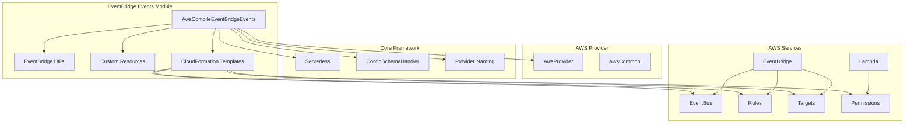
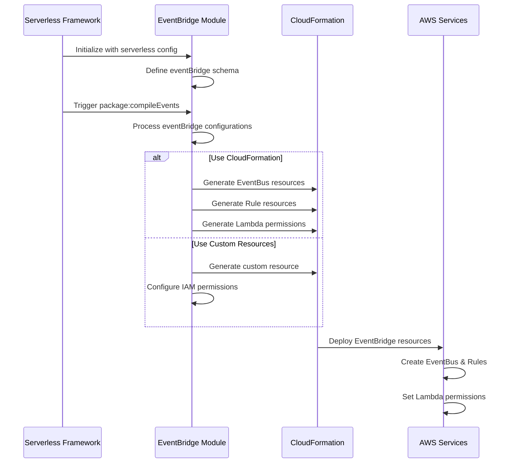
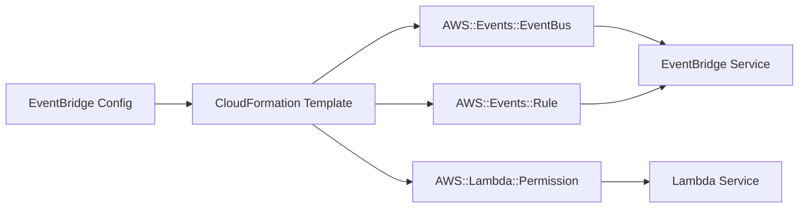
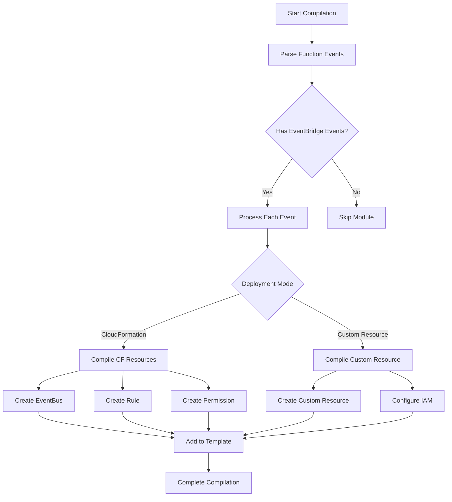

# EventBridge Events Module

The EventBridge Events module provides comprehensive support for AWS EventBridge integration in Serverless Framework, enabling serverless functions to be triggered by EventBridge events. This module handles the compilation and configuration of EventBridge rules, event buses, and targets as part of the AWS deployment process.

## Overview

The EventBridge Events module (`lib.plugins.aws.package.compile.events.event-bridge.index.AwsCompileEventBridgeEvents`) is responsible for:
- Compiling EventBridge event configurations into CloudFormation resources
- Managing EventBridge rules, event buses, and Lambda function permissions
- Supporting both CloudFormation-native and custom resource deployment approaches
- Handling various input configurations (input, inputPath, inputTransformer)
- Managing retry policies and dead letter queue configurations

## Architecture

### Component Structure



### Data Flow



## Core Functionality

### Event Configuration Processing

The module processes EventBridge event configurations defined in the `serverless.yml` file:

```yaml
functions:
  myFunction:
    handler: index.handler
    events:
      - eventBridge:
          eventBus: custom-event-bus
          pattern:
            source:
              - myapp.orders
            detail-type:
              - Order Placed
          inputTransformer:
            inputTemplate: '{"orderId": <orderId>, "status": <status>}'
            inputPathsMap:
              orderId: $.detail.orderId
              status: $.detail.status
```

### Deployment Modes

The module supports two deployment approaches:

#### 1. CloudFormation-Native (Recommended)

Uses native AWS CloudFormation resources for EventBridge integration:



#### 2. Custom Resources (Legacy)

Uses custom Lambda resources for EventBridge management (deprecated):


### Configuration Schema

The module defines a comprehensive schema for EventBridge events:

```javascript
{
  type: 'object',
  properties: {
    eventBus: { /* EventBus reference */ },
    schedule: { pattern: '^(?:cron|rate)\\(.+\\)$' },
    name: { type: 'string', pattern: '[a-zA-Z0-9-_.]+' },
    description: { type: 'string', maxLength: 512 },
    enabled: { type: 'boolean' },
    pattern: { /* Event pattern object */ },
    input: { type: 'object' },
    inputPath: { type: 'string', minLength: 1, maxLength: 256 },
    inputTransformer: { /* Input transformation config */ },
    retryPolicy: { /* Retry configuration */ },
    deadLetterQueueArn: { /* DLQ configuration */ }
  },
  anyOf: [{ required: ['pattern'] }, { required: ['schedule'] }]
}
```

## Key Features

### Event Pattern Matching

Supports complex event patterns for filtering:

```javascript
pattern: {
  source: ['myapp.orders'],
  'detail-type': ['Order Placed'],
  detail: {
    status: ['confirmed'],
    amount: [{ numeric: ['>', 100] }]
  }
}
```

### Input Transformation

Three methods for transforming input to Lambda:

1. **Direct Input**: Static JSON object
2. **Input Path**: JSONPath expression
3. **Input Transformer**: Template-based transformation

### Retry and Dead Letter Configuration

Supports EventBridge retry policies and dead letter queues:

```javascript
retryPolicy: {
  maximumEventAge: 3600,
  maximumRetryAttempts: 2
},
deadLetterQueueArn: 'arn:aws:sqs:region:account:dlq-name'
```

## Dependencies

### Internal Dependencies

- **[aws-provider](../aws-provider.md)**: Core AWS provider functionality
- **[aws-common](../aws-common.md)**: Shared AWS utilities and configurations
- **[custom-resources](../custom-resources.md)**: Custom resource management for legacy deployments

### External Dependencies

- **AWS EventBridge**: Event routing service
- **AWS Lambda**: Compute service for function execution
- **AWS IAM**: Identity and access management

## Process Flow

### Compilation Process



### Resource Naming

Uses standardized naming conventions for CloudFormation resources:
- EventBus: `{stackName}-{eventBusName}-EventBridgeEventBus`
- Rule: `{stackName}-{functionName}-{index}-EventBridgeRule`
- Permission: `{stackName}-{functionName}-{index}-EventBridgeLambdaPermission`

## Error Handling

The module implements comprehensive error handling for:

- **Configuration Validation**: Invalid event patterns or input configurations
- **Resource Conflicts**: Duplicate rule names or invalid references
- **Deployment Errors**: CloudFormation stack failures
- **Permission Issues**: Insufficient IAM permissions

Common error scenarios:

```javascript
// Multiple input properties
throw new ServerlessError(
  'You can only set one of input, inputPath, or inputTransformer properties',
  'EVENTBRIDGE_MULTIPLE_INPUT_PROPERTIES'
)

// Custom resource limitations
throw new ServerlessError(
  'Configuring RetryPolicy is not supported for EventBridge integration backed by Custom Resources',
  'ERROR_INVALID_RETRY_POLICY_TO_EVENT_BUS_CUSTOM_RESOURCE'
)
```

## Best Practices

### 1. Use CloudFormation-Native Deployment

Always use the default CloudFormation deployment mode for better reliability and maintainability.

### 2. Event Pattern Design

- Use specific event patterns to minimize Lambda invocations
- Leverage content-based filtering to reduce function complexity
- Test patterns using EventBridge schema registry

### 3. Error Handling

- Configure dead letter queues for critical events
- Set appropriate retry policies based on function characteristics
- Monitor EventBridge metrics for failed invocations

### 4. Resource Management

- Use meaningful rule names for better traceability
- Clean up unused event buses and rules
- Monitor CloudFormation stack resources

## Migration Guide

### From Custom Resources to CloudFormation

1. Remove `provider.eventBridge.useCloudFormation: false` from configuration
2. Validate all event configurations work with CloudFormation
3. Test deployment in staging environment
4. Update monitoring and alerting configurations

### Configuration Updates

Review and update configurations to use CloudFormation-compatible features:

```yaml
# Before (Custom Resource)
eventBridge:
  useCloudFormation: false
  
# After (CloudFormation)
# Remove useCloudFormation setting (defaults to true)
```

## Monitoring and Troubleshooting

### CloudWatch Metrics

Monitor key EventBridge metrics:
- `MatchedEvents`: Events matching the rule pattern
- `FailedInvocations`: Failed Lambda invocations
- `InvocationsSentToDlq`: Events sent to dead letter queue

### Common Issues

1. **Rule Not Triggering**: Check event pattern syntax and event source
2. **Permission Errors**: Verify Lambda function permissions
3. **Event Bus Issues**: Ensure event bus exists and is accessible
4. **Input Transformation**: Validate JSONPath expressions and templates

## Related Documentation

- [AWS Provider Module](../aws-provider.md) - Core AWS provider functionality
- [AWS Events Module](../aws-events.md) - General AWS events documentation
- [Custom Resources Module](../custom-resources.md) - Custom resource management
- [Configuration Management](../configuration-management.md) - Configuration schema handling