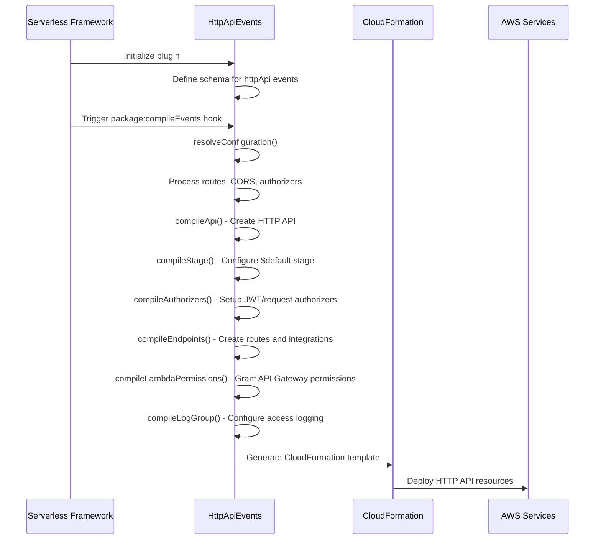
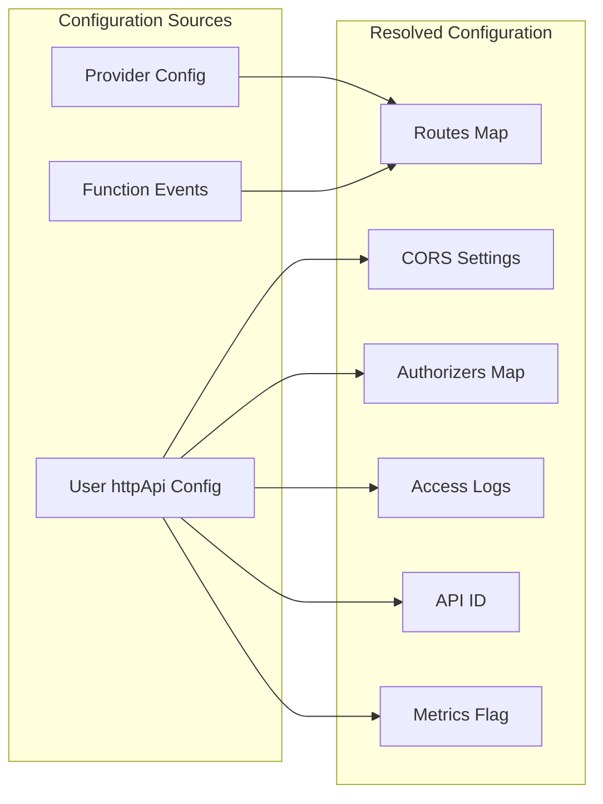
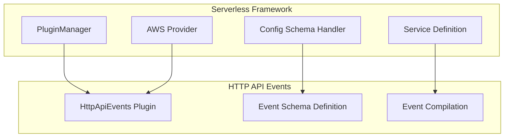

# HTTP API Events Module Documentation

## Introduction

The HTTP API Events module is a specialized component within the AWS provider plugin system that handles the compilation and configuration of HTTP API Gateway events for AWS Lambda functions. This module transforms HTTP API event definitions in serverless.yml into AWS CloudFormation resources, enabling serverless applications to expose HTTP endpoints through AWS API Gateway v2 (HTTP APIs).

## Module Overview

The HTTP API Events module (`lib.plugins.aws.package.compile.events.http-api.HttpApiEvents`) is responsible for:
- Compiling HTTP API Gateway configurations from serverless service definitions
- Creating CloudFormation resources for HTTP APIs, routes, integrations, and authorizers
- Managing CORS (Cross-Origin Resource Sharing) configurations
- Handling JWT and custom request authorizers
- Configuring access logging and monitoring
- Setting up Lambda permissions for API Gateway integration

## Architecture

### Component Structure

```mermaid
graph TB
    subgraph "HTTP API Events Module"
        HttpApiEvents[HttpApiEvents Class]
        
        subgraph "Core Methods"
            resolveConfiguration[resolveConfiguration]
            compileApi[compileApi]
            compileStage[compileStage]
            compileAuthorizers[compileAuthorizers]
            compileEndpoints[compileEndpoints]
            compileIntegration[compileIntegration]
            compileLambdaPermissions[compileLambdaPermissions]
            compileLogGroup[compileLogGroup]
        end
        
        subgraph "Configuration Resolution"
            routeConfig[Route Configuration]
            corsConfig[CORS Configuration]
            authorizerConfig[Authorizer Configuration]
            logConfig[Access Log Configuration]
        end
    end
    
    subgraph "External Dependencies"
        serverless[Serverless Framework]
        provider[AWS Provider]
        naming[AWS Naming Service]
        cfTemplate[CloudFormation Template]
    end
    
    HttpApiEvents --> serverless
    HttpApiEvents --> provider
    HttpApiEvents --> naming
    HttpApiEvents --> cfTemplate
    
    resolveConfiguration --> routeConfig
    resolveConfiguration --> corsConfig
    resolveConfiguration --> authorizerConfig
    resolveConfiguration --> logConfig
    
    compileApi --> cfTemplate
    compileStage --> cfTemplate
    compileAuthorizers --> cfTemplate
    compileEndpoints --> cfTemplate
    compileIntegration --> cfTemplate
    compileLambdaPermissions --> cfTemplate
    compileLogGroup --> cfTemplate
```



### Data Flow



## Core Components

### HttpApiEvents Class

The main class that orchestrates HTTP API event compilation. It extends the Serverless plugin architecture and integrates with the AWS provider system.

**Key Properties:**
- `serverless`: Reference to the Serverless Framework instance
- `provider`: AWS provider instance for accessing AWS-specific utilities
- `config`: Resolved HTTP API configuration object
- `cfTemplate`: CloudFormation template reference

**Hook Integration:**
- `initialize`: Validates deprecated configurations
- `package:compileEvents`: Main compilation lifecycle hook

### Configuration Resolution

The module resolves HTTP API configuration from multiple sources:



## CloudFormation Resource Generation

### HTTP API Resource (`AWS::ApiGatewayV2::Api`)

Creates the main HTTP API Gateway resource with:
- Protocol type: HTTP
- CORS configuration (if specified)
- Tags from provider configuration
- Optional default endpoint disabling

### Stage Resource (`AWS::ApiGatewayV2::Stage`)

Configures the `$default` stage with:
- Auto-deployment enabled
- Detailed metrics configuration
- Access log settings (if configured)
- Provider tags

### Route Resources (`AWS::ApiGatewayV2::Route`)

Creates routes for each HTTP method/path combination:
- Route key format: `METHOD /path` (e.g., `GET /users`)
- Integration targeting
- Authorization configuration
- Wildcard route support (`$default`)

### Integration Resources (`AWS::ApiGatewayV2::Integration`)

Sets up Lambda proxy integrations with:
- AWS_PROXY integration type
- Lambda function ARN resolution
- Payload format version configuration
- 30-second timeout

### Authorizer Resources (`AWS::ApiGatewayV2::Authorizer`)

Supports multiple authorizer types:

#### JWT Authorizers
- JWT configuration with audience and issuer
- Identity source configuration
- Authorization scopes support

#### Request Authorizers
- Custom Lambda function authorization
- Simple responses support
- Result TTL and caching
- Payload format version

#### AWS IAM Authorizers
- Native AWS IAM authentication
- No additional configuration required

## Event Configuration Schema

### String Format
```yaml
functions:
  myFunction:
    events:
      - httpApi: 'GET /users'
      - httpApi: '*'  # Catch-all route
```

### Object Format
```yaml
functions:
  myFunction:
    events:
      - httpApi:
          method: GET
          path: /users
          authorizer:
            name: jwtAuthorizer
            scopes: ['read:users']
```

## CORS Configuration

### Default CORS Settings
```javascript
{
  allowedOrigins: ['*'],
  allowedHeaders: [
    'Content-Type',
    'X-Amz-Date',
    'Authorization',
    'X-Api-Key',
    'X-Amz-Security-Token',
    'X-Amz-User-Agent',
    'X-Amzn-Trace-Id'
  ],
  allowedMethods: ['OPTIONS'] // Auto-populated
}
```

### Custom CORS Configuration
```yaml
provider:
  httpApi:
    cors:
      allowedOrigins: ['https://example.com']
      allowedHeaders: ['Content-Type', 'Authorization']
      allowedMethods: ['GET', 'POST', 'OPTIONS']
      allowCredentials: true
      exposedResponseHeaders: ['X-Custom-Header']
      maxAge: 86400
```

## Authorizer Configuration

### JWT Authorizer
```yaml
provider:
  httpApi:
    authorizers:
      jwtAuthorizer:
        type: jwt
        identitySource: $request.header.Authorization
        issuerUrl: https://auth.example.com
        audience: ['my-api']
```

### Request Authorizer
```yaml
provider:
  httpApi:
    authorizers:
      customAuthorizer:
        type: request
        functionName: authorizerFunction
        identitySource: $request.header.Authorization
        resultTtlInSeconds: 300
        enableSimpleResponses: true
```

## Access Logging

### Default Log Format
```json
{
  "requestId": "$context.requestId",
  "ip": "$context.identity.sourceIp",
  "requestTime": "$context.requestTime",
  "httpMethod": "$context.httpMethod",
  "routeKey": "$context.routeKey",
  "status": "$context.status",
  "protocol": "$context.protocol",
  "responseLength": "$context.responseLength"
}
```

### Custom Log Format
```yaml
provider:
  logs:
    httpApi:
      format: '{"requestId":"$context.requestId","status":"$context.status"}'
```

## Integration with Serverless Framework

### Plugin Registration
The module integrates with the Serverless Framework through the plugin system:



### Event Schema Definition
The module defines the schema for `httpApi` events, validating:
- Method and path formats
- Authorizer configurations
- CORS settings
- Integration properties

## Dependencies

### Core Framework Dependencies
- [Configuration Management](configuration-management.md): Uses config schema handler for validation
- [Service Model](service-model.md): Integrates with service function definitions
- [AWS Provider](aws-provider.md): Leverages AWS-specific utilities and naming conventions

### AWS-Specific Dependencies
- [AWS Package Compile](aws-package-compile.md): Part of the compilation pipeline
- [AWS Common](aws-common.md): Uses shared AWS utilities and constants

## Error Handling

The module implements comprehensive error handling for:
- Invalid HTTP methods or paths
- Duplicate route definitions
- Missing authorizer configurations
- External API conflicts (CORS, authorizers, logs)
- Function timeout validation (30-second limit)

## Performance Considerations

### Memoization
Key methods are memoized for performance:
- `resolveConfiguration()`: Caches resolved configuration
- `compileIntegration()`: Reuses integration configurations
- `resolveTargetConfig()`: Caches Lambda target resolution

### Timeout Validation
Warns about function timeouts that may conflict with HTTP API's 30-second integration timeout.

## Best Practices

1. **Route Organization**: Group related routes under common path prefixes
2. **Authorizer Reuse**: Define authorizers at the provider level for reuse across functions
3. **CORS Configuration**: Configure CORS at the provider level for consistent behavior
4. **Access Logging**: Enable access logs for monitoring and debugging
5. **Timeout Settings**: Keep function timeouts below 30 seconds for HTTP APIs

## Related Documentation

- [API Gateway Events](api-gateway-events.md) - REST API event configuration
- [Websocket Events](websocket-events.md) - WebSocket API event configuration
- [AWS Provider](aws-provider.md) - Core AWS provider functionality
- [AWS Package Compile](aws-package-compile.md) - Package compilation process