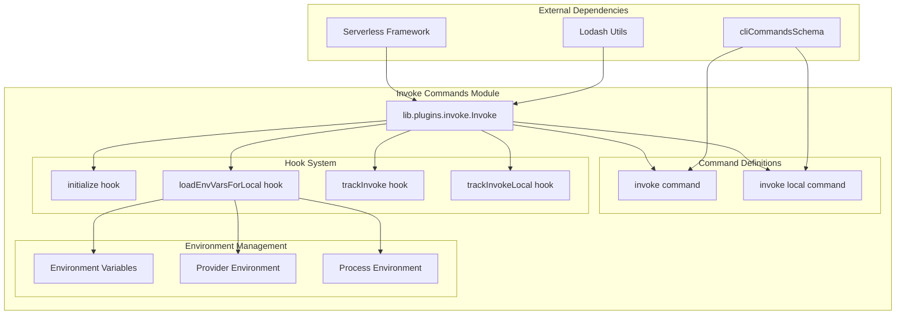
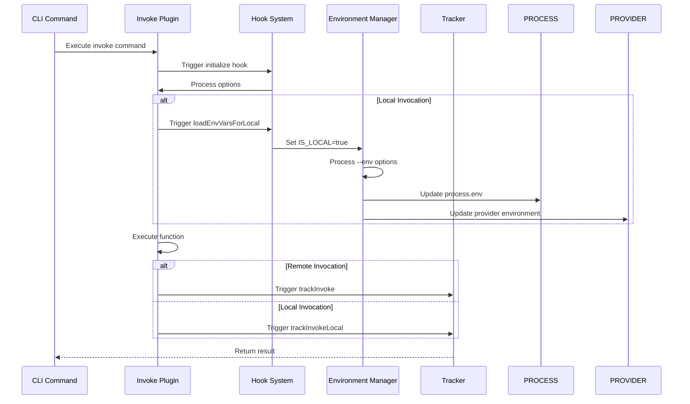
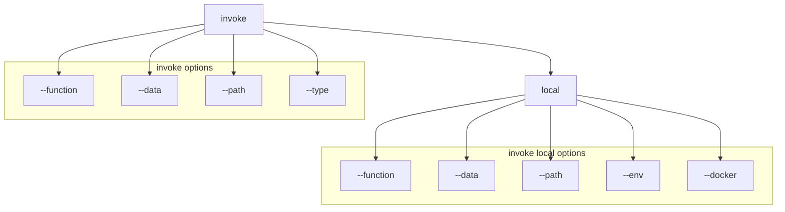
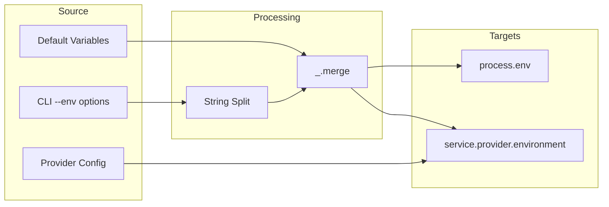
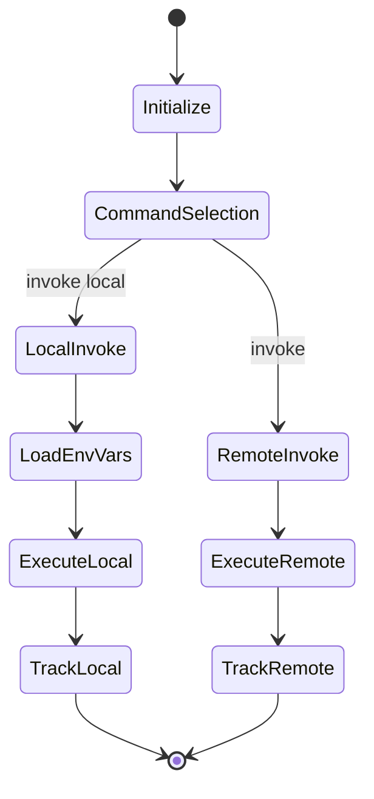

# Invoke Commands Module Documentation

## Overview

The invoke-commands module provides the core functionality for invoking serverless functions both locally and remotely. It serves as the primary interface for function execution within the serverless framework, handling environment setup, command routing, and execution tracking.

## Purpose and Core Functionality

The invoke-commands module is responsible for:

- **Function Invocation**: Executing serverless functions both locally and in cloud environments
- **Environment Management**: Setting up provider-independent environment variables for local development
- **Command Structure**: Defining the CLI command hierarchy for invoke operations
- **Execution Tracking**: Providing hooks for monitoring and analytics of function invocations
- **Local Development Support**: Enabling local function testing with proper environment simulation

## Architecture

### Component Structure



### Data Flow Architecture



## Core Components

### lib.plugins.invoke.Invoke

The main class that orchestrates function invocation functionality. It extends the serverless plugin architecture and provides:

- **Command Registration**: Defines the `invoke` and `invoke local` CLI commands
- **Hook Management**: Implements lifecycle hooks for initialization and tracking
- **Environment Setup**: Configures environment variables for local execution
- **Option Processing**: Handles command-line options and parameters

#### Key Methods

- `constructor(serverless, options)`: Initializes the plugin with serverless instance and options
- `loadEnvVarsForLocal()`: Sets up provider-independent environment variables for local execution
- `trackInvoke()`: Hook for tracking remote function invocations (currently no-op)
- `trackInvokeLocal()`: Hook for tracking local function invocations (currently no-op)

## Command Structure



## Environment Variable Management

The module implements a sophisticated environment variable management system for local development:

### Default Environment Variables

- `IS_LOCAL`: Set to `'true'` to indicate local execution context
- Provider-specific variables are handled by respective provider plugins

### Environment Variable Propagation



## Integration with Serverless Framework

### Plugin Registration

The invoke-commands module integrates with the serverless framework through:

1. **Plugin System**: Registered as a core plugin in the serverless plugin manager
2. **Command Schema**: Uses `cliCommandsSchema` for command definition and validation
3. **Hook System**: Leverages serverless lifecycle hooks for execution flow
4. **Service Integration**: Accesses service configuration and provider settings

### Dependencies

- **Core Framework**: Depends on [core-framework](core-framework.md) for base functionality
- **CLI Interface**: Integrates with [cli-interface](cli-interface.md) for command processing
- **Configuration Management**: Uses [configuration-management](configuration-management.md) for service configuration
- **Provider Plugins**: Works with provider-specific invoke implementations (e.g., [aws-invoke-local](aws-invoke-local.md))

## Hook System

The module implements a comprehensive hook system for extensibility:

### Lifecycle Hooks

1. **initialize**: Processes input options and prepares the plugin
2. **invoke:local:loadEnvVars**: Sets up environment variables for local execution
3. **after:invoke:invoke**: Post-execution hook for remote invocations
4. **after:invoke:local:invoke**: Post-execution hook for local invocations

### Hook Execution Flow



## Error Handling and Validation

The module includes built-in validation and error handling:

- **Command Validation**: Uses CLI schema for option validation
- **Environment Validation**: Ensures proper environment variable setup
- **Provider Integration**: Delegates provider-specific validation to respective plugins

## Extension Points

The invoke-commands module provides several extension points:

1. **Custom Hooks**: Other plugins can hook into the invoke lifecycle
2. **Provider Overrides**: Provider plugins can override default behavior
3. **Custom Trackers**: Analytics and monitoring plugins can extend tracking functionality
4. **Environment Customization**: Plugins can modify environment variable handling

## Usage Examples

### Local Function Invocation

```bash
# Invoke function locally with data
serverless invoke local --function myFunction --data '{"key": "value"}'

# Invoke with environment variables
serverless invoke local --function myFunction --env VAR1=value1 --env VAR2=value2

# Invoke with data file
serverless invoke local --function myFunction --path ./data.json
```

### Remote Function Invocation

```bash
# Invoke function remotely
serverless invoke --function myFunction --data '{"key": "value"}'

# Invoke with specific type
serverless invoke --function myFunction --type RequestResponse
```

## Best Practices

1. **Environment Isolation**: Use `--env` options to isolate local development environments
2. **Data Management**: Use `--path` for complex data payloads instead of inline `--data`
3. **Local Testing**: Always test functions locally before deployment using `invoke local`
4. **Hook Utilization**: Leverage hooks for custom pre/post-processing logic
5. **Provider Integration**: Understand provider-specific invoke implementations for optimal usage

## Related Documentation

- [Core Framework](core-framework.md) - Base serverless framework functionality
- [CLI Interface](cli-interface.md) - Command-line interface components
- [Configuration Management](configuration-management.md) - Service configuration handling
- [AWS Invoke Local](aws-invoke-local.md) - AWS-specific local invocation implementation
- [AWS Commands](aws-commands.md) - AWS provider command implementations