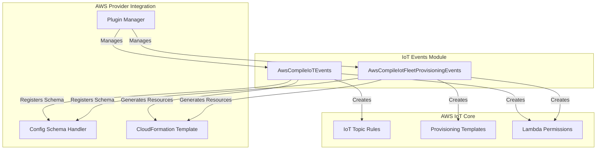
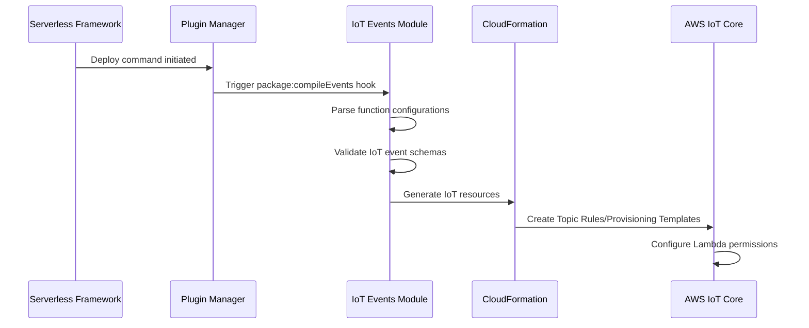

# IoT Events Module Documentation

## Overview

The IoT Events module is a specialized component within the AWS provider plugin system that handles the compilation and configuration of AWS IoT event sources for AWS Lambda functions. This module enables serverless applications to respond to IoT device events, messages, and fleet provisioning requests through AWS IoT Core integration.

## Purpose

The module provides two primary capabilities:

1. **IoT Topic Rule Events**: Allows Lambda functions to be triggered by AWS IoT Topic Rules based on SQL queries against IoT message streams
2. **IoT Fleet Provisioning Events**: Enables Lambda functions to serve as pre-provisioning hooks for IoT device fleet provisioning workflows

## Architecture



## Core Components

### 1. IoT Topic Rule Events
- **Purpose**: Compiles IoT Topic Rule events for Lambda functions
- **Location**: `lib/plugins/aws/package/compile/events/iot.js`
- **Hook**: `package:compileEvents`
- **Documentation**: [iot-topic-rule-events.md](iot-topic-rule-events.md)
- **Key Features**:
  - Processes function-level IoT event configurations
  - Generates AWS::IoT::TopicRule CloudFormation resources
  - Creates Lambda permissions for IoT service invocation
  - Supports SQL-based message filtering with configurable SQL versions

### 2. IoT Fleet Provisioning Events
- **Purpose**: Compiles IoT Fleet Provisioning template hooks
- **Location**: `lib/plugins/aws/package/compile/events/iot-fleet-provisioning.js`
- **Hook**: `package:compileEvents`
- **Documentation**: [iot-fleet-provisioning-events.md](iot-fleet-provisioning-events.md)
- **Key Features**:
  - Creates IoT provisioning templates with Lambda pre-provisioning hooks
  - Validates single provisioning template per function
  - Generates AWS::IoT::ProvisioningTemplate CloudFormation resources
  - Manages Lambda permissions for IoT provisioning service

## Event Configuration Schema

### IoT Topic Rule Events
```yaml
functions:
  myFunction:
    handler: index.handler
    events:
      - iot:
          sql: "SELECT * FROM 'my/topic' WHERE temperature > 30"
          sqlVersion: "2016-03-23"
          name: "HighTemperatureRule"
          enabled: true
          description: "Triggers when temperature exceeds 30°C"
```

### IoT Fleet Provisioning Events
```yaml
functions:
  provisioningFunction:
    handler: index.handler
    events:
      - iotFleetProvisioning:
          templateName: "MyDeviceTemplate"
          templateBody:
            Parameters:
              DeviceId:
                Type: String
            Resources:
              certificate:
                Type: AWS::IoT::Certificate
                Properties:
                  CertificateId: {Ref: DeviceCertificateId}
          provisioningRoleArn: "arn:aws:iam::123456789012:role/IoTProvisioningRole"
          enabled: true
```

## Integration Points

### Dependencies
- **AWS Provider**: Integrates with the broader AWS provider plugin system
- **Plugin Manager**: Registers event compilation hooks
- **Config Schema Handler**: Defines validation schemas for event configurations
- **CloudFormation Template**: Generates infrastructure-as-code resources
- **Lambda Target Resolution**: Uses utility functions to resolve Lambda function ARNs

### Related Modules
- [aws-events](aws-events.md): Parent module containing all AWS event types
- [aws-provider](aws-provider.md): Core AWS provider functionality
- [core-framework](core-framework.md): Serverless Framework core services

## Data Flow



## Error Handling

The module implements several validation and error handling mechanisms:

1. **Schema Validation**: Uses JSON Schema validation for event configurations
2. **Function-Level Validation**: Ensures only one fleet provisioning event per function
3. **Resource Dependencies**: Properly manages CloudFormation resource dependencies
4. **Permission Management**: Automatically creates required Lambda permissions

## Security Considerations

- **IAM Permissions**: Automatically generates Lambda permissions for IoT service principal
- **Resource Isolation**: Each function gets isolated IoT rules and permissions
- **ARN Resolution**: Uses secure Lambda target resolution utilities
- **Template Validation**: Validates provisioning template structures before deployment

## Usage Examples

### Basic IoT Topic Rule
```yaml
functions:
  temperatureAlert:
    handler: temperature.handler
    events:
      - iot:
          sql: "SELECT temperature, deviceId FROM 'sensors/temperature' WHERE temperature > 40"
          name: "TemperatureAlertRule"
```

### IoT Fleet Provisioning
```yaml
functions:
  deviceValidator:
    handler: validate.handler
    events:
      - iotFleetProvisioning:
          templateBody:
            Parameters:
              SerialNumber:
                Type: String
            Resources:
              thing:
                Type: AWS::IoT::Thing
                Properties:
                  ThingName: {"Fn::Join": ["-", ["Device", {"Ref": "SerialNumber"}]]}
          provisioningRoleArn: "arn:aws:iam::123456789012:role/IoTDeviceProvisioningRole"
```

This module provides essential functionality for IoT-enabled serverless applications, enabling seamless integration between AWS IoT Core and Lambda functions for both message processing and device provisioning workflows.