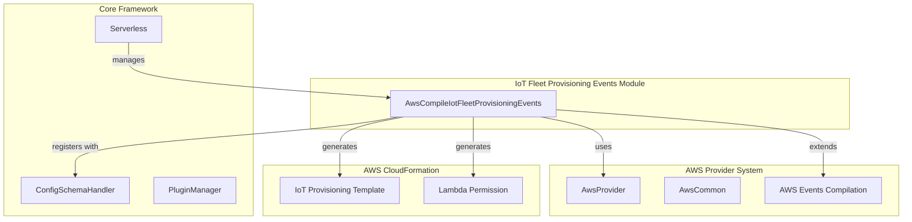
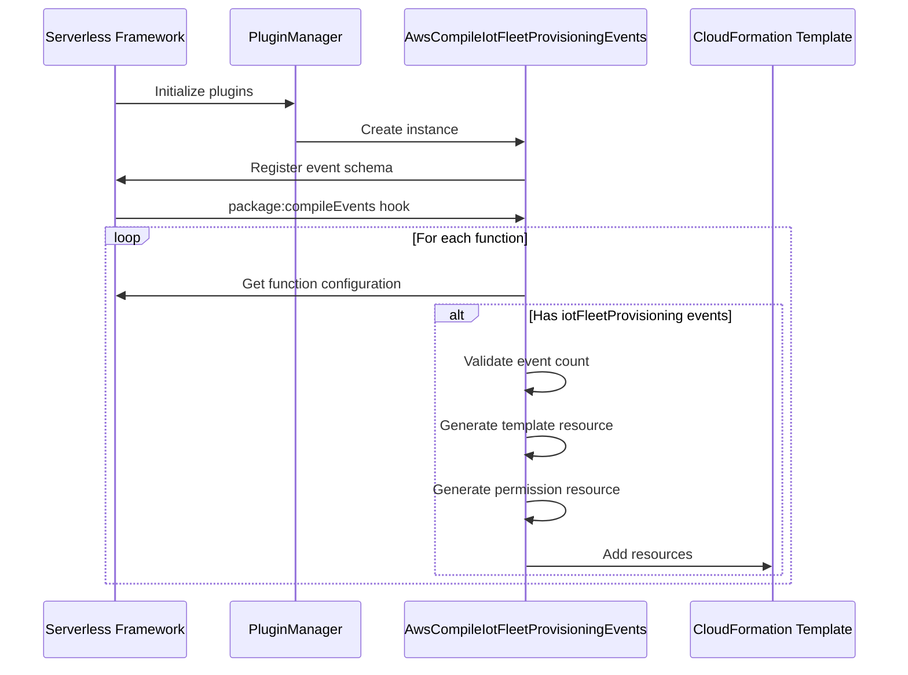
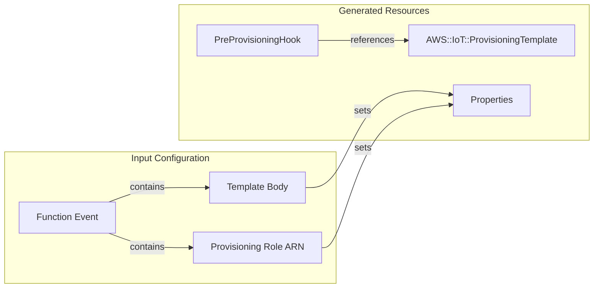
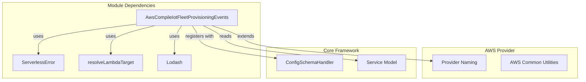
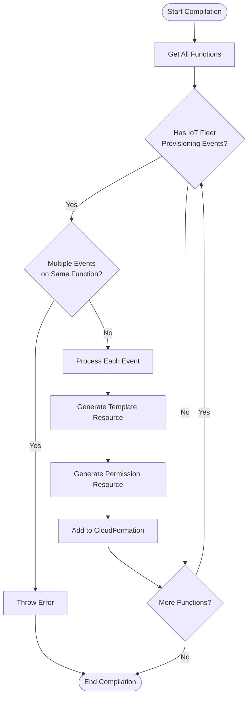

# IoT Fleet Provisioning Events Module

## Introduction

The IoT Fleet Provisioning Events module is a specialized AWS event compilation component within the Serverless Framework that handles the creation and configuration of AWS IoT Fleet Provisioning templates. This module enables serverless applications to respond to device provisioning requests through AWS IoT Core's fleet provisioning feature, allowing automated device onboarding and certificate management at scale.

## Module Overview

The module is responsible for translating `iotFleetProvisioning` function events into AWS CloudFormation resources, specifically creating IoT provisioning templates and associated Lambda permissions. It integrates with the broader AWS events compilation system and follows the standard Serverless Framework plugin architecture.

## Core Architecture

### Component Structure



### Event Processing Flow



## Core Components

### AwsCompileIotFleetProvisioningEvents

The main class responsible for compiling IoT Fleet Provisioning events into CloudFormation resources.

**Key Responsibilities:**
- Event schema definition and validation
- CloudFormation resource generation
- Lambda permission configuration
- Template property management

**Constructor Parameters:**
- `serverless`: Serverless framework instance

**Hook Registration:**
- `package:compileEvents`: Triggers the compilation process

## Configuration Schema

The module defines a strict schema for `iotFleetProvisioning` events:

```yaml
iotFleetProvisioning:
  type: object
  properties:
    enabled: boolean              # Optional: Enable/disable the template
    provisioningRoleArn: string   # Required: IAM role ARN for provisioning
    templateBody: object          # Required: Provisioning template body
    templateName: string          # Optional: Custom template name
  required: ['templateBody', 'provisioningRoleArn']
```

## CloudFormation Resource Generation

### IoT Provisioning Template Resource



### Lambda Permission Resource

The module automatically creates Lambda permissions to allow IoT service invocation:

- **Principal**: `iot.amazonaws.com`
- **Action**: `lambda:InvokeFunction`
- **Function**: Target Lambda function

## Dependencies and Integration

### Internal Dependencies



### External Module References

- [aws-provider.md](aws-provider.md): Base AWS provider functionality
- [aws-events.md](aws-events.md): General AWS events compilation patterns
- [core-framework.md](core-framework.md): Core Serverless Framework architecture

## Error Handling

The module implements specific error handling for configuration validation:

### Multiple Event Validation
```javascript
if (functionObj.events.filter((event) => event.iotFleetProvisioning).length > 1) {
  throw new ServerlessError(
    `Found more than one iotFleetProvision event for function ${functionName}`,
    'MULTIPLE_IOT_PROVISIONING_TEMPLATE_HOOK',
  )
}
```

**Error Code**: `MULTIPLE_IOT_PROVISIONING_TEMPLATE_HOOK`
**Description**: Prevents multiple IoT Fleet Provisioning events on a single function

## Usage Examples

### Basic Configuration

```yaml
functions:
  deviceProvisioner:
    handler: handler.provisionDevice
    events:
      - iotFleetProvisioning:
          provisioningRoleArn: ${cf:iot-provisioning-role.Arn}
          templateBody:
            Parameters:
              SerialNumber:
                Type: String
            Resources:
              certificate:
                Type: AWS::IoT::Certificate
                Properties:
                  CertificateId:
                    Ref: AWS::IoT::Certificate::Id
                  Status: Active
```

### Advanced Configuration

```yaml
functions:
  customProvisioner:
    handler: handler.customProvision
    events:
      - iotFleetProvisioning:
          enabled: true
          templateName: custom-device-template
          provisioningRoleArn: arn:aws:iam::123456789012:role/IoTProvisioningRole
          templateBody:
            Parameters:
              DeviceId:
                Type: String
              Model:
                Type: String
            Resources:
              thing:
                Type: AWS::IoT::Thing
                Properties:
                  ThingName:
                    Ref: DeviceId
                  AttributePayload:
                    model:
                      Ref: Model
```

## Process Flow

### Compilation Process



## Security Considerations

### IAM Role Requirements
The provisioning role must have appropriate permissions:
- `iot:CreateThing`
- `iot:CreateKeysAndCertificate`
- `iot:AttachThingPrincipal`
- `iot:AttachPolicy`

### Lambda Permissions
The module automatically creates the necessary Lambda permission for IoT service invocation, ensuring secure communication between IoT Core and Lambda functions.

## Best Practices

1. **Template Validation**: Ensure template bodies are valid JSON and follow AWS IoT provisioning template syntax
2. **Role Management**: Use IAM roles with least-privilege access for provisioning
3. **Error Handling**: Implement proper error handling in Lambda functions for provisioning failures
4. **Monitoring**: Enable CloudWatch logging for both IoT and Lambda to track provisioning activities

## Related Documentation

- [iot-events.md](iot-events.md): General IoT event handling
- [aws-package-compile.md](aws-package-compile.md): AWS package compilation process
- [configuration-management.md](configuration-management.md): Configuration schema handling
- [service-model.md](service-model.md): Service definition and function management