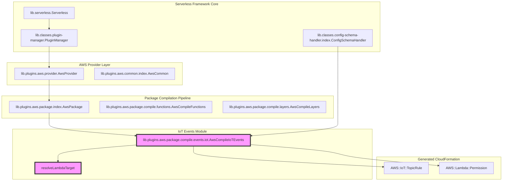
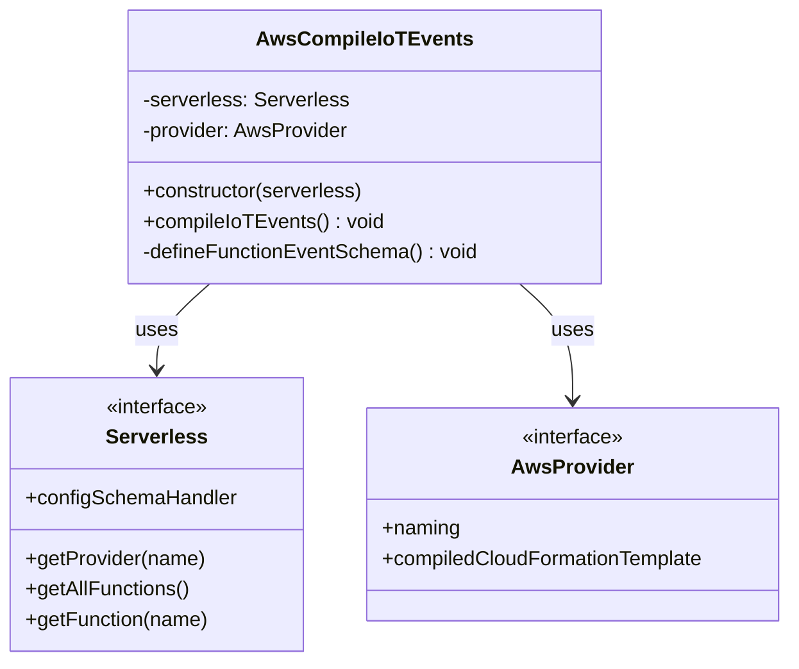
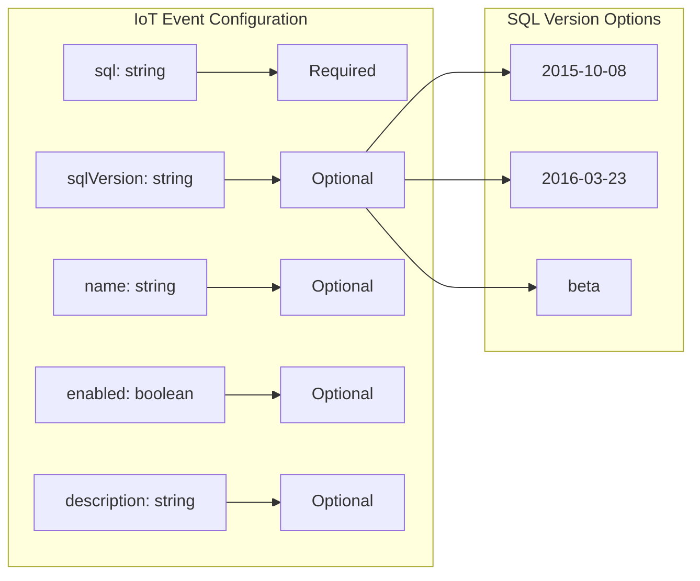
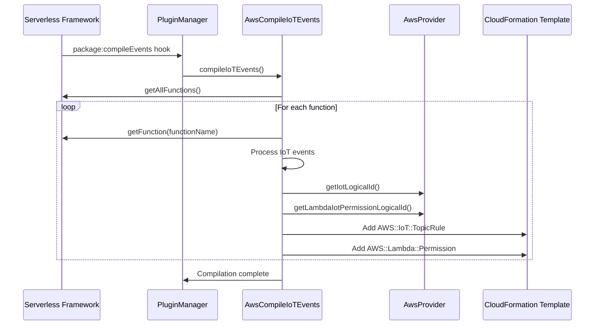
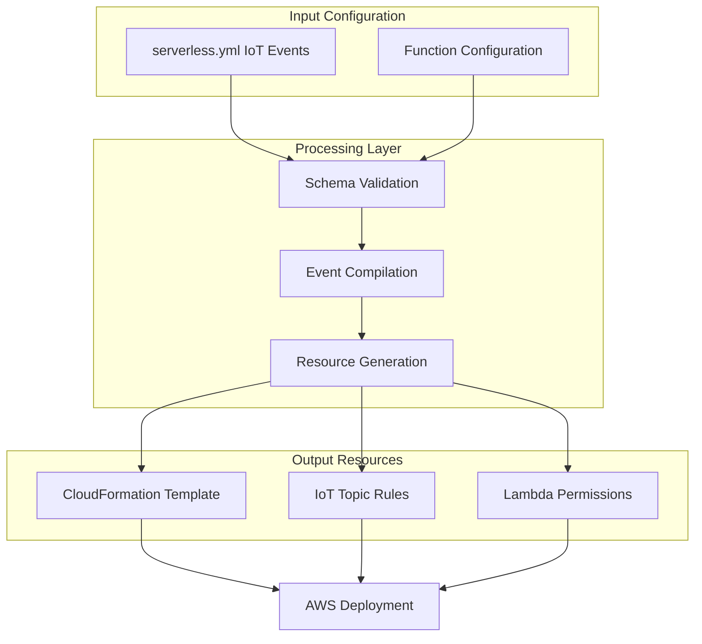

# IoT Topic Rule Events Module

## Introduction

The IoT Topic Rule Events module is a specialized AWS event compilation component within the Serverless Framework that enables serverless functions to be triggered by AWS IoT Core topic rules. This module translates IoT event configurations into AWS CloudFormation resources, establishing the infrastructure needed for Lambda functions to respond to IoT device messages and telemetry data based on SQL-like queries.

## Architecture Overview

The module operates as part of the AWS events compilation pipeline, specifically handling IoT Core integration patterns. It transforms declarative IoT event configurations into imperative CloudFormation template resources that define IoT topic rules and their associated Lambda function permissions.



## Core Components

### AwsCompileIoTEvents Class

The primary component of this module is the `AwsCompileIoTEvents` class, which implements the compilation logic for IoT events. This class integrates with the Serverless Framework's plugin system and follows the established patterns for AWS event compilation.



## Configuration Schema

The module defines a strict JSON schema for IoT function events, ensuring configuration validation and providing IntelliSense support for developers.



### Configuration Properties

| Property | Type | Required | Description |
|----------|------|----------|-------------|
| `sql` | string | Yes | SQL-like query that filters IoT messages |
| `sqlVersion` | string | No | AWS IoT SQL version (2015-10-08, 2016-03-23, beta) |
| `name` | string | No | Custom name for the IoT rule |
| `enabled` | boolean | No | Whether the rule is enabled (default: true) |
| `description` | string | No | Description of the IoT rule |

## Compilation Process Flow

The compilation process transforms IoT event configurations into CloudFormation resources through a systematic approach:



## Resource Generation

### IoT Topic Rule Resource

The module generates `AWS::IoT::TopicRule` resources with the following structure:

```yaml
Type: AWS::IoT::TopicRule
DependsOn: [FunctionAlias]
Properties:
  RuleName: [Optional custom name]
  TopicRulePayload:
    RuleDisabled: [true/false]
    Sql: [SQL query]
    Description: [Optional description]
    AwsIotSqlVersion: [Optional SQL version]
    Actions:
      - Lambda:
          FunctionArn: [Lambda function ARN]
```

### Lambda Permission Resource

To enable IoT Core to invoke the Lambda function, the module creates `AWS::Lambda::Permission` resources:

```yaml
Type: AWS::Lambda::Permission
DependsOn: [FunctionAlias]
Properties:
  FunctionName: [Lambda function ARN]
  Action: lambda:InvokeFunction
  Principal: iot.amazonaws.com
  SourceArn:
    Fn::Join:
      - ''
      - - 'arn:'
        - Ref: AWS::Partition
        - ':iot:'
        - Ref: AWS::Region
        - ':'
        - Ref: AWS::AccountId
        - ':rule/'
        - Ref: [IoTRuleLogicalId]
```

## Dependencies and Integration

### Core Dependencies

The module relies on several core framework components:

- **[core-framework](core-framework.md)**: Provides the foundational Serverless Framework infrastructure
- **[aws-provider](aws-provider.md)**: Supplies AWS-specific functionality and naming conventions
- **[aws-package-compile](aws-package-compile.md)**: Integrates with the package compilation pipeline

### Utility Dependencies

- **resolveLambdaTarget**: Resolves the correct Lambda function ARN, supporting function aliases and versions
- **lodash**: Provides utility functions for object manipulation and merging

## Data Flow Architecture



## Error Handling and Validation

The module implements several layers of validation and error handling:

1. **Schema Validation**: Configuration is validated against the defined JSON schema
2. **SQL Sanitization**: SQL queries are sanitized to remove newline characters
3. **Dependency Resolution**: Resources are properly ordered using `DependsOn` properties
4. **Permission Scoping**: Lambda permissions are scoped to specific IoT rule ARNs

## Usage Examples

### Basic IoT Event Configuration

```yaml
functions:
  processTemperature:
    handler: handler.processTemperature
    events:
      - iot:
          sql: "SELECT * FROM 'device/temperature' WHERE temperature > 30"
          description: "Process high temperature alerts"
```

### Advanced Configuration with All Options

```yaml
functions:
  deviceMonitor:
    handler: handler.deviceMonitor
    events:
      - iot:
          name: "DeviceMonitoringRule"
          sql: "SELECT deviceId, temperature, humidity FROM 'device/data'"
          sqlVersion: "2016-03-23"
          enabled: true
          description: "Monitor device telemetry data"
```

## Best Practices

1. **SQL Query Optimization**: Write efficient SQL queries to minimize IoT Core processing costs
2. **Rule Naming**: Use descriptive rule names for better resource management
3. **Version Control**: Specify SQL versions explicitly for consistent behavior
4. **Security**: Leverage the automatically generated Lambda permissions for secure invocation
5. **Monitoring**: Use the description field to document rule purposes for operational clarity

## Related Modules

- **[iot-fleet-provisioning-events](iot-fleet-provisioning-events.md)**: Handles IoT device fleet provisioning events
- **[streaming-events](streaming-events.md)**: Manages streaming data event sources
- **[aws-events](aws-events.md)**: Parent module for all AWS event types

## Conclusion

The IoT Topic Rule Events module provides a robust, scalable solution for integrating serverless functions with AWS IoT Core. By abstracting the complexity of CloudFormation resource creation and providing a declarative configuration interface, it enables developers to focus on business logic while the framework handles the underlying infrastructure requirements. The module's integration with the broader AWS event ecosystem ensures consistent patterns and reliable deployment across different event sources.