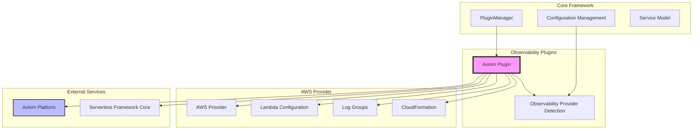
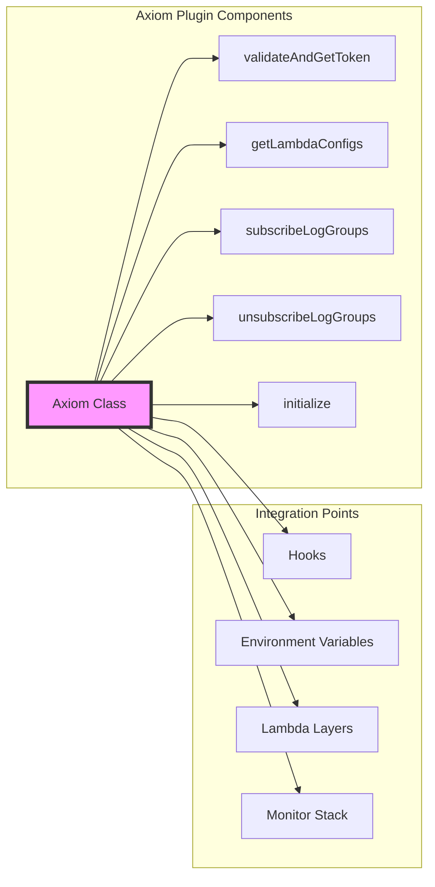
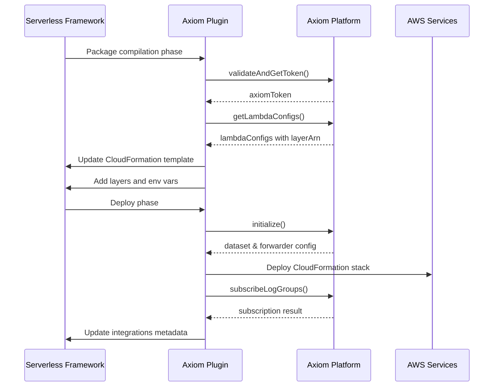
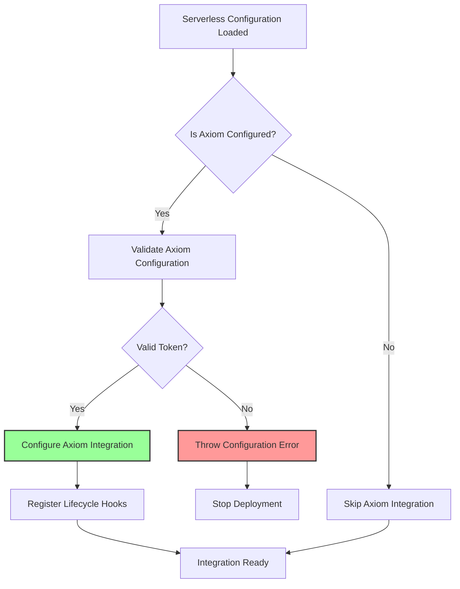

# Observability Plugins Module

## Introduction

The observability-plugins module provides integration with external observability platforms to enhance monitoring, logging, and analytics capabilities for serverless applications. Currently, the module implements integration with Axiom, a modern observability platform that provides log aggregation, metrics collection, and distributed tracing for AWS Lambda functions.

This module automatically configures Lambda functions with the necessary layers, environment variables, and log group subscriptions to send telemetry data to the configured observability provider, enabling comprehensive monitoring and debugging capabilities for serverless applications.

## Architecture

### High-Level Architecture



### Component Structure



## Core Components

### Axiom Plugin Class

The `Axiom` class is the main component of the observability-plugins module. It extends the Serverless Framework plugin architecture to provide seamless integration with the Axiom observability platform.

**Key Responsibilities:**
- Detects when Axiom is configured as the observability provider
- Automatically configures Lambda functions with Axiom integration layers
- Manages environment variables for Axiom authentication and configuration
- Subscribes CloudWatch log groups to Axiom for log ingestion
- Handles deployment lifecycle hooks for proper integration setup
- Manages cleanup during stack removal

**Constructor Parameters:**
- `serverless`: Serverless framework instance
- `options`: Command-line options

### Core Methods

#### `addEnvVarsAndLayer()`
Configures all Lambda functions in the service with Axiom integration by:
- Validating Axiom token and credentials
- Retrieving Lambda-specific configuration from Axiom
- Adding the Axiom Lambda layer to function configurations
- Setting required environment variables (AXIOM_TOKEN, AXIOM_DATASET)
- Validating Lambda layer limits (maximum 5 layers per function)

#### `addEnvVarsAndLayerToFunction()`
Targeted configuration for single function deployment, applying the same integration logic as `addEnvVarsAndLayer()` but for a specific function.

#### `subscribeLogGroups()`
Establishes the complete Axiom integration pipeline:
- Initializes Axiom dataset and forwarder infrastructure
- Subscribes CloudWatch log groups to Axiom for real-time log ingestion
- Monitors CloudFormation stack deployment status
- Updates serverless integrations metadata

#### `unsubscribeLogGroups()`
Handles cleanup during stack removal by unsubscribing log groups and removing Axiom integration resources.

## Integration Flow

### Deployment Integration Flow



### Configuration Detection Flow



## Configuration

### Serverless Configuration

The Axiom plugin integrates with the Serverless Framework configuration through the `stages` section:

```yaml
stages:
  prod:
    observability:
      dataset: production-logs
  default:
    observability:
      dataset: development-logs
```

### Environment Variables

The plugin automatically configures the following environment variables for Lambda functions:

- `AXIOM_TOKEN`: Authentication token for Axiom API access
- `AXIOM_DATASET`: Target dataset name for log aggregation

### Lambda Layer Integration

The plugin adds the official Axiom Lambda layer to functions, which provides:
- Automatic log forwarding to Axiom
- Metrics collection and aggregation
- Distributed tracing capabilities
- Performance monitoring

## Dependencies

### Core Framework Dependencies

- **Plugin Management**: Integrates with the [plugin-management](plugin-management.md) module for lifecycle hook registration
- **Configuration Management**: Uses [configuration-management](configuration-management.md) for parsing observability settings
- **Service Model**: Leverages [service-model](service-model.md) for function configuration access

### AWS Provider Dependencies

- **AWS Provider**: Depends on [aws-provider](aws-provider.md) for AWS service interactions
- **AWS Package Compile**: Integrates with [aws-package-compile](aws-package-compile.md) during function compilation
- **AWS Commands**: Coordinates with [aws-commands](aws-commands.md) during deployment phases

### External Dependencies

- **Serverless Framework Core**: Uses `@serverlessinc/sf-core` for observability utilities
- **AWS SDK**: Leverages AWS SDK for Lambda and CloudFormation operations
- **Axiom SDK**: Integrates with Axiom platform APIs for configuration and management

## Error Handling

The plugin implements comprehensive error handling for common scenarios:

### Lambda Layer Limit Validation
```javascript
if (lambdaResource.Properties.Layers && lambdaResource.Properties.Layers.length >= 5) {
  throw new ServerlessError(
    `Lambda function ${lambdaConfig.name} already has the maximum number of layers (5)`,
    'MAX_LAYERS_EXCEEDED'
  )
}
```

### Resource Validation
```javascript
if (!lambdaResource) {
  throw new ServerlessError(
    `Lambda function ${lambdaConfig.name} not found in compiled CloudFormation template`,
    'LAMBDA_NOT_FOUND'
  )
}
```

## Lifecycle Hooks

The plugin registers hooks based on the configured observability provider:

### When Axiom is Configured
- `after:package:compileFunctions`: Adds layers and environment variables
- `after:deploy:deploy`: Subscribes log groups to Axiom
- `before:deploy:function:deploy`: Configures single function integration

### When Axiom is Not Configured
- `after:deploy:deploy`: Unsubscribes log groups (cleanup)

## Security Considerations

### Token Management
- Axiom tokens are validated and cached during deployment
- Tokens are never exposed in CloudFormation templates
- Environment variables are securely injected into Lambda functions

### Access Control
- Uses AWS credentials for CloudFormation operations
- Validates organization and account ownership
- Implements stage-based configuration isolation

## Performance Impact

### Cold Start Considerations
- The Axiom layer adds minimal cold start overhead
- Layer caching reduces repeated download impact
- Environment variables are pre-configured to avoid runtime overhead

### Resource Usage
- Additional memory usage from the observability layer
- Network overhead for log forwarding
- CloudWatch log group subscription filters

## Monitoring and Troubleshooting

### Integration Status
The plugin updates the serverless integrations metadata:
```javascript
this.serverless.integrations[ObservabilityProvider.AXIOM] = {
  dataset: {
    name: initializeResult.dataset.dataset.name,
    id: initializeResult.dataset.dataset.id,
    created: initializeResult.dataset.dataset.created,
  },
}
```

### Stack Monitoring
Uses the `monitorStack` utility to track CloudFormation deployment progress for Axiom infrastructure components.

## Future Extensibility

The module is designed to support additional observability providers through:
- Provider detection abstraction
- Pluggable integration patterns
- Standardized lifecycle hooks
- Common configuration schema

This architecture allows for easy addition of other observability platforms like Datadog, New Relic, or custom solutions while maintaining consistent integration patterns.