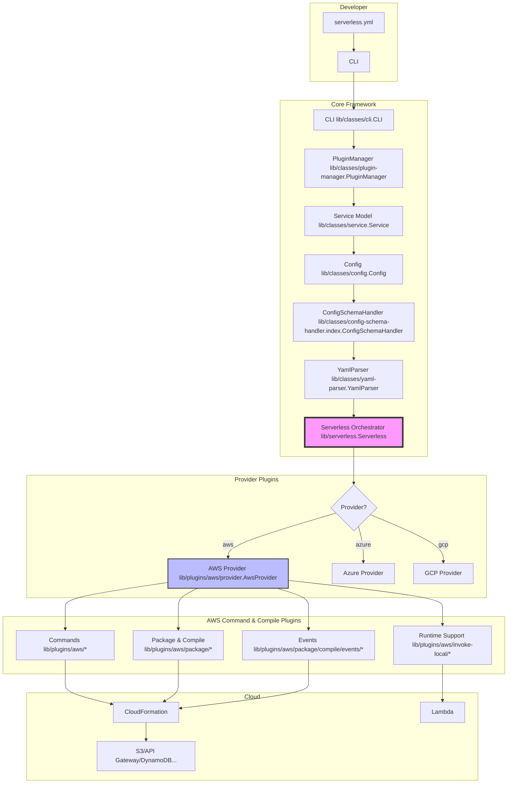

# Serverless Framework Repository Overview

## Purpose

The `serverless--serverless` repository is the official, open-source **Serverless Framework**—a CLI and plugin-based toolkit that lets developers build, package, and deploy serverless applications to any cloud provider with minimal configuration.  
It translates a concise `serverless.yml` service definition into provider-native resources (AWS CloudFormation, Azure ARM, etc.) and automates the entire lifecycle: development, packaging, deployment, monitoring, and rollback.

## End-to-End Architecture

## Core Module Documentation

| Module | Path | Purpose | Docs |
|--------|------|---------|------|
| **core-framework** | `lib/classes` | Foundation classes that orchestrate the framework (CLI, Config, PluginManager, Service, Utils, YamlParser, Serverless) | [core-framework.md](core-framework.md) |
| **aws-provider** | `lib/plugins/aws` | AWS cloud integration layer—credentials, regions, CloudFormation, Lambda, IAM, etc. | [aws-provider.md](aws-provider.md) |
| **aws-package-compile** | `lib/plugins/aws/package` | Compiles `serverless.yml` into CloudFormation templates and deployment artifacts | [aws-package-compile.md](aws-package-compile.md) |
| **aws-events** | `lib/plugins/aws/package/compile/events` | Generates CloudFormation for 20+ AWS event sources (API Gateway, S3, SNS, EventBridge, Kafka, IoT, etc.) | [aws-events.md](aws-events.md) |
| **aws-commands** | `lib/plugins/aws/*` | CLI commands for deploy, invoke, logs, metrics, rollback, remove | [aws-commands.md](aws-commands.md) |
| **aws-runtime-support** | `lib/plugins/aws/invoke-local/runtime-wrappers` | Local Lambda execution engine for Node.js, Python, Java | [aws-runtime-support.md](aws-runtime-support.md) |
| **core-commands** | `lib/plugins` | Provider-agnostic CLI commands (deploy, package, print, info, dev) | [core-commands.md](core-commands.md) |
| **plugin-system** | `lib/plugins/plugin` | Plugin discovery, listing, and search | [plugin-system.md](plugin-system.md) |
| **esbuild-plugin** | `lib/plugins/esbuild` | Zero-config TypeScript / modern-JS bundling with esbuild | [esbuild-plugin.md](esbuild-plugin.md) |
| **observability-plugins** | `lib/plugins/observability` | Auto-instrumentation for Axiom, Datadog, etc. | [observability-plugins.md](observability-plugins.md) |

## Quick Start

1. Install: `npm i -g serverless`
2. Create: `serverless create --template aws-nodejs --path my-service`
3. Deploy: `cd my-service && serverless deploy`
4. Invoke: `serverless invoke -f hello`
5. Logs: `serverless logs -f hello -t`

All commands are extensible—each lifecycle hook can be intercepted by community or custom plugins.