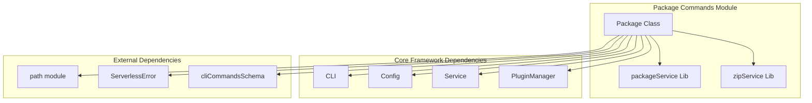
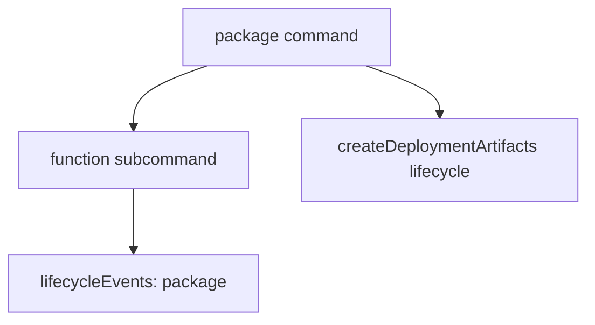
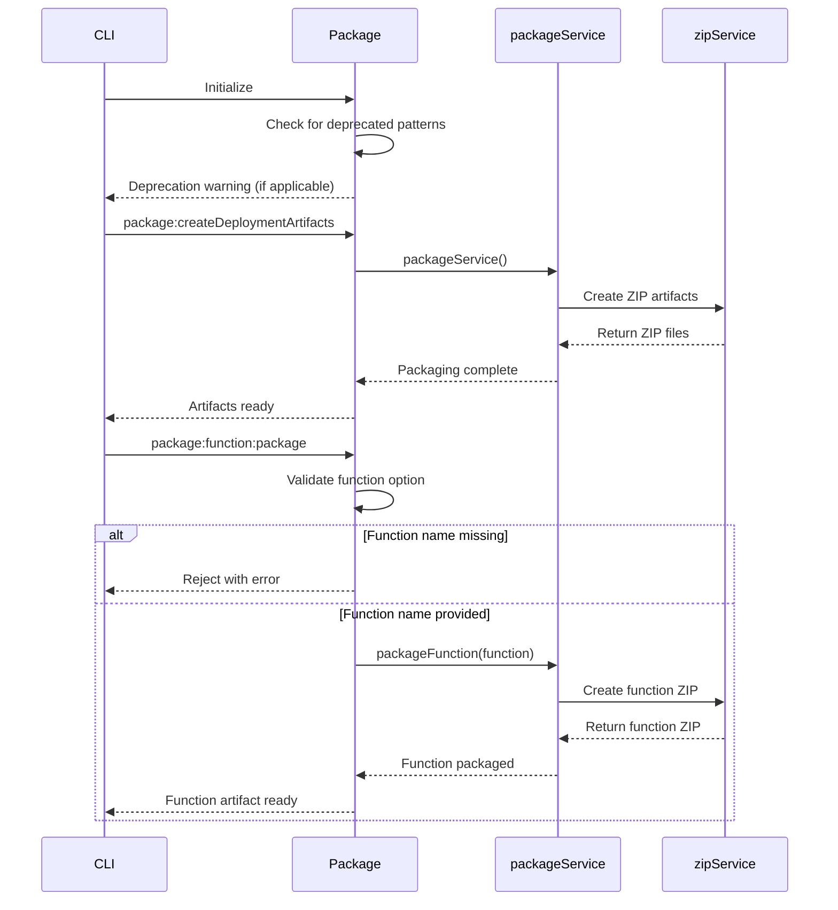
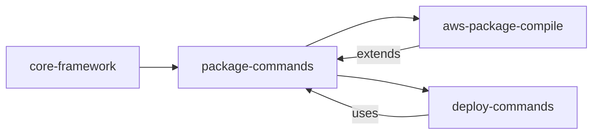

# Package Commands Module Documentation

## Introduction

The package-commands module provides the core packaging functionality for the Serverless Framework. It handles the creation of deployment artifacts by packaging services, functions, and layers into distributable formats (primarily ZIP files) that can be deployed to cloud providers. This module serves as a foundational component that bridges the gap between development and deployment phases.

## Architecture Overview

The package-commands module is built around the `Package` class, which integrates with the Serverless Framework's plugin system and provides both service-level and function-level packaging capabilities.



## Core Components

### Package Class (`lib.plugins.package.package.Package`)

The main class that orchestrates packaging operations within the Serverless Framework. It extends the framework's plugin capabilities by providing packaging-specific commands and lifecycle hooks.

#### Key Responsibilities:
- **Command Registration**: Registers the `package` command with subcommands for different packaging scenarios
- **Lifecycle Management**: Hooks into the framework's lifecycle events to execute packaging at appropriate times
- **Path Resolution**: Determines output paths for packaged artifacts
- **Deprecation Handling**: Warns users about deprecated packaging patterns
- **Function-specific Packaging**: Supports packaging individual functions or entire services

#### Constructor Parameters:
- `serverless`: The Serverless Framework instance
- `options`: Command-line options and configuration

#### Key Properties:
- `servicePath`: Base path of the serverless service
- `packagePath`: Output directory for packaged artifacts (defaults to `.serverless`)

## Command Structure



### Available Commands:

1. **package**: Main packaging command
   - Creates deployment artifacts for the entire service
   - Triggered by `package:createDeploymentArtifacts` lifecycle event

2. **package function**: Function-specific packaging
   - Packages a single function when `--function` option is provided
   - Validates function name before processing

## Lifecycle Integration

The module integrates with the Serverless Framework's lifecycle system through well-defined hooks:



## Configuration and Patterns

### Deprecation Management
The module actively monitors for deprecated packaging patterns and warns users:

- **Deprecated**: `package.include` and `package.exclude`
- **Recommended**: `package.patterns`
- **Scope**: Service-level, function-level, and layer-level configurations

### Path Resolution
The module uses a hierarchical approach to determine output paths:

1. Command-line `--package` option (highest priority)
2. Service configuration `serverless.service.package.path`
3. Default `.serverless` directory (lowest priority)

## Dependencies

### Internal Dependencies
- **lib/serverless-error.js**: Custom error handling for Serverless-specific errors
- **lib/cli/commands-schema.js**: Command schema definitions and validation
- **lib/package/lib/package-service.js**: Core packaging logic for services
- **lib/package/lib/zip-service.js**: ZIP file creation and management

### External Dependencies
- **path**: Node.js path module for file system operations

## Integration with Other Modules

The package-commands module serves as a foundation for deployment operations and integrates with several other modules:



### Related Modules:
- **[aws-package-compile](aws-package-compile.md)**: Extends packaging for AWS-specific compilation
- **[deploy-commands](deploy-commands.md)**: Uses packaged artifacts for deployment
- **[core-framework](core-framework.md)**: Provides foundational services and configuration

## Error Handling

The module implements comprehensive error handling for common packaging scenarios:

- **Missing Function Name**: Returns `PACKAGE_MISSING_FUNCTION_OPTION` error when function option is required but not provided
- **Validation Errors**: Uses ServerlessError for consistent error reporting across the framework

## Usage Examples

### Package Entire Service
```bash
serverless package
```

### Package Specific Function
```bash
serverless package function --function myFunction
```

### Custom Output Directory
```bash
serverless package --package dist/
```

## Best Practices

1. **Use Patterns**: Prefer `package.patterns` over deprecated `include/exclude` options
2. **Function Packaging**: Use function-specific packaging for faster deployments when only one function has changed
3. **Path Configuration**: Set custom package paths in `serverless.yml` for CI/CD pipelines
4. **Artifact Management**: Clean package directories regularly to avoid stale artifacts

## Future Considerations

The module is designed to evolve with the Serverless Framework:

- **Pattern Migration**: Full migration from include/exclude to patterns in future versions
- **Multi-Runtime Support**: Enhanced support for different runtime packaging requirements
- **Performance Optimization**: Improved packaging speed for large services
- **Artifact Caching**: Potential implementation of intelligent artifact caching mechanisms