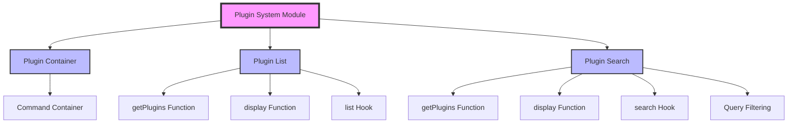
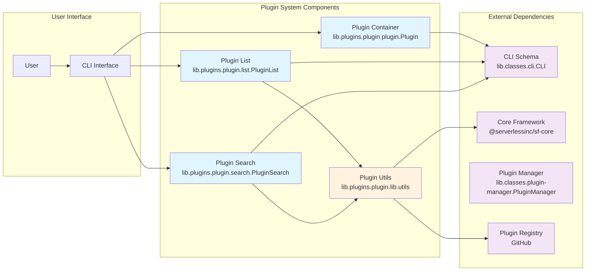
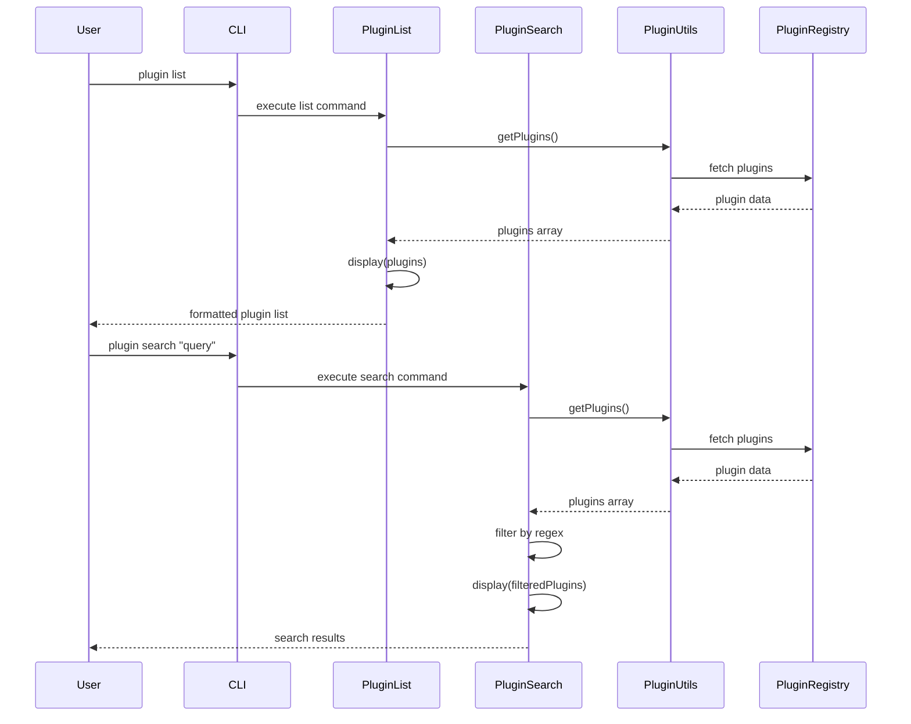

# Plugin System Module

## Introduction and Purpose

The plugin-system module provides essential functionality for managing Serverless Framework plugins. It serves as the central hub for plugin discovery, listing, and search operations within the Serverless Framework ecosystem. This module enables developers to explore available plugins, search for specific functionality, and manage plugin installations.

## Architecture Overview

The plugin-system module is built around three core components that work together to provide comprehensive plugin management capabilities:

### High-Level Architecture



### Detailed Component Architecture



## Core Components

### 1. Plugin Container (`lib.plugins.plugin.plugin.Plugin`)
The base plugin container that provides the foundational command structure for all plugin-related operations. It acts as a parent command container that groups all plugin management sub-commands.

**Key Features:**
- Defines the `plugin` command namespace
- Serves as a container for all plugin sub-commands
- Provides the base structure for plugin management operations

### 2. Plugin List (`lib.plugins.plugin.list.PluginList`)
Handles the listing and display of available Serverless Framework plugins. This component retrieves plugin information and presents it to users in a readable format.

**Key Features:**
- Retrieves comprehensive plugin information
- Formats and displays plugin data
- Integrates with CLI command schema for consistent command structure
- Implements the `plugin:list` command

### 3. Plugin Search (`lib.plugins.plugin.search.PluginSearch`)
Provides search functionality to help users find specific plugins based on name or description patterns. This component filters available plugins using regular expression matching.

**Key Features:**
- Pattern-based plugin search using regular expressions
- Searches across plugin names and descriptions
- Provides search result statistics
- Integrates with CLI command schema

## Data Flow



## Integration with Core Framework

The plugin-system module integrates with the broader Serverless Framework through:

1. **CLI Integration**: Uses the CLI command schema system for consistent command structure
2. **Plugin Manager**: Works with the core PluginManager for plugin discovery and management
3. **Service Integration**: Operates within the serverless service context
4. **Utility Functions**: Leverages shared utility functions for common operations

## Dependencies

The plugin-system module depends on several core framework components:

- **CLI Command Schema** (`lib.classes.cli.CLI`): For command structure and validation
- **Plugin Manager** (`lib.classes.plugin-manager.PluginManager`): For plugin discovery and management
- **Utility Functions** (`lib.classes.utils.Utils`): For common operations
- **Core Framework** (`@serverlessinc/sf-core`): For logging and core functionality

## Utility Functions

The plugin system includes a dedicated utility module (`lib.plugins.plugin.lib.utils`) that provides:

### Plugin Discovery
- **getPlugins()**: Fetches plugin data from the official Serverless plugins registry
- Supports HTTPS proxy configuration for corporate environments
- Retrieves plugin information from GitHub-hosted plugins.json

### Plugin Display
- **display()**: Formats and displays plugin information in a user-friendly manner
- Orders plugins alphabetically by name
- Provides installation instructions
- Uses consistent styling through the core framework's style system

## Error Handling and Security

### Network Security
- HTTPS proxy support for corporate environments
- Secure fetching from official GitHub repository
- Environment variable-based proxy configuration

### Error Management
- Graceful handling of network failures
- Empty state handling when no plugins are available
- User-friendly error messages through the core logging system

### Data Validation
- JSON parsing with proper error handling
- Plugin data structure validation
- Safe display formatting to prevent injection attacks

## Usage Examples

### Listing Plugins
```bash
serverless plugin list
```
This command retrieves and displays all available Serverless Framework plugins.

### Searching Plugins
```bash
serverless plugin search "aws"
```
This command searches for plugins containing "aws" in their name or description.

## Related Documentation

For more information about related modules:
- [Core Framework Components](core-framework.md)
- [Plugin Management](plugin-management.md)
- [CLI Interface](cli-interface.md)

## Summary

The plugin-system module serves as the central nervous system for plugin management within the Serverless Framework. It provides a clean, user-friendly interface for discovering, listing, and searching plugins while maintaining security and reliability standards. The modular architecture ensures extensibility and maintainability, making it easy to add new plugin management features in the future.

Key strengths of the plugin-system module:
- **User-Friendly**: Intuitive commands and clear output formatting
- **Secure**: HTTPS proxy support and safe data handling
- **Extensible**: Modular architecture allows for easy feature additions
- **Integrated**: Seamless integration with the broader Serverless Framework ecosystem
- **Reliable**: Robust error handling and network resilience

The plugin-system module exemplifies the Serverless Framework's commitment to developer experience by providing powerful functionality through simple, consistent interfaces.