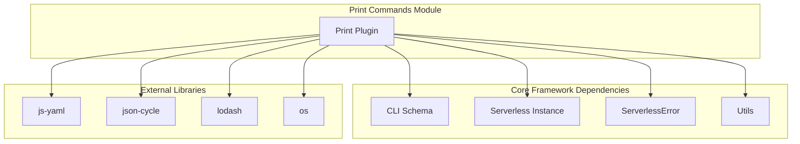
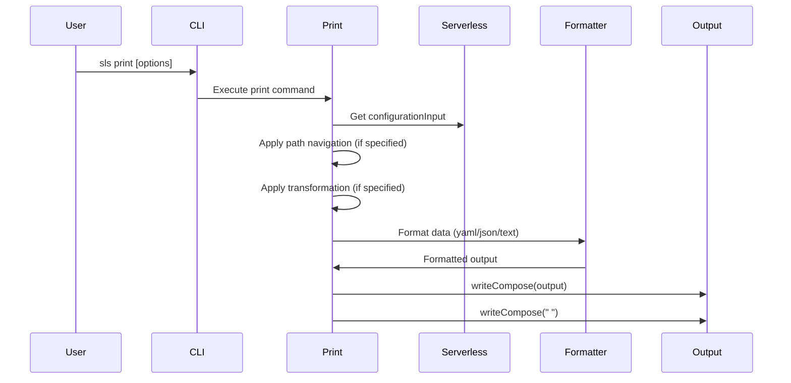
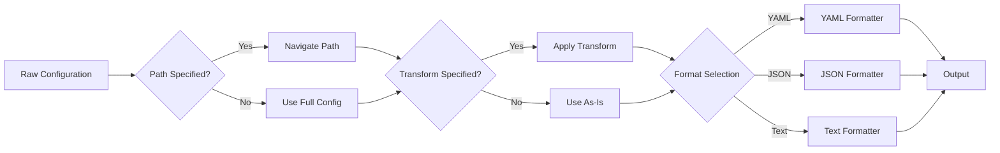
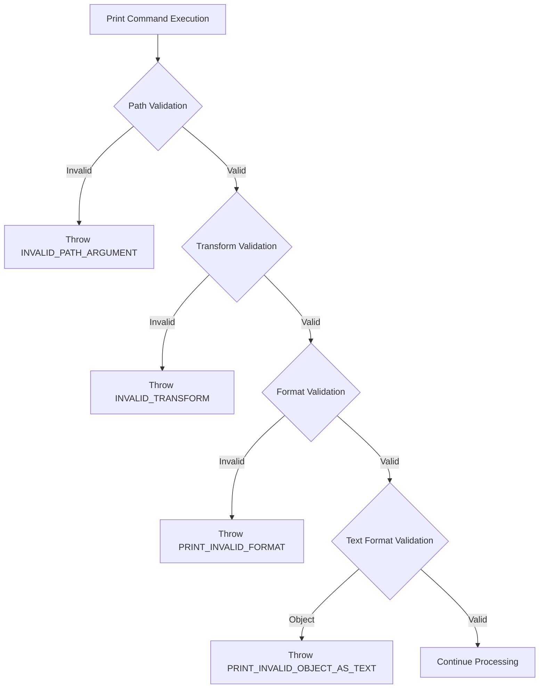
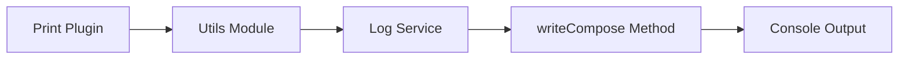

# Print Commands Module Documentation

## Introduction

The print-commands module provides functionality to display and export Serverless Framework configuration data in various formats. It serves as a diagnostic and debugging tool that allows developers to inspect their serverless configuration at any point in the deployment process.

## Architecture Overview

The print-commands module is built around a single core component that integrates with the Serverless Framework's plugin system to provide configuration introspection capabilities.



## Core Components

### Print Plugin (`lib.plugins.print.Print`)

The Print class is the main component of the print-commands module. It provides a command-line interface for displaying serverless configuration data in multiple formats with optional filtering and transformation capabilities.

#### Key Features:
- **Path-based configuration navigation**: Navigate nested configuration objects using dot notation
- **Multiple output formats**: Support for YAML, JSON, and plain text output
- **Data transformation**: Optional transformation of configuration data (e.g., extract keys)
- **Error handling**: Comprehensive validation and error reporting

#### Constructor Parameters:
- `serverless`: Serverless framework instance
- `options`: Command-line options object

#### Command Configuration:
```javascript
{
  print: {
    // CLI schema configuration
  }
}
```

#### Hook Registration:
- `print:print`: Executes the print functionality

## Data Flow



## Configuration Processing Pipeline



## Error Handling

The module implements comprehensive error handling for various scenarios:



## Integration Points

### CLI Integration
The print-commands module integrates with the Serverless Framework's CLI system through the commands schema:


### Logging Integration
The module uses the Serverless Framework's logging utilities for output:



## Usage Examples

### Basic Usage
```bash
# Print full configuration as YAML
sls print

# Print specific path as JSON
sls print --path provider --format json

# Print function names only
sls print --path functions --transform keys

# Print as plain text
sls print --path service --format text
```

### Path Navigation
The module supports dot notation for navigating nested configuration:
- `provider.name` - Access provider name
- `functions.myFunction.events` - Access function events
- `custom.stages` - Access custom configuration

### Format Options
- **YAML**: Human-readable format (default)
- **JSON**: Machine-readable format with proper indentation
- **Text**: Plain text format for simple values

## Dependencies

### Core Framework Dependencies
- [CLI Interface](cli-interface.md): Command schema and execution
- [Configuration Management](configuration-management.md): Configuration input handling
- [Core Framework](core-framework.md): Base Serverless functionality

### External Dependencies
- **js-yaml**: YAML parsing and serialization
- **json-cycle**: JSON serialization with circular reference handling
- **lodash**: Utility functions for object manipulation
- **os**: Operating system utilities for line endings

## Error Codes

| Error Code | Description | Trigger Condition |
|------------|-------------|-------------------|
| `INVALID_PATH_ARGUMENT` | Invalid path specified | Path navigation fails |
| `INVALID_TRANSFORM` | Invalid transform option | Transform is not "keys" |
| `PRINT_INVALID_FORMAT` | Invalid format specified | Format is not yaml/json/text |
| `PRINT_INVALID_OBJECT_AS_TEXT` | Cannot print object as text | Object type with text format |

## Extension Points

The print-commands module can be extended through:

1. **Additional Transform Options**: New transformation functions can be added
2. **Custom Formatters**: New output formats can be implemented
3. **Path Navigation Enhancements**: Advanced path navigation features

## Performance Considerations

- **Caching**: The module includes a cache mechanism for repeated operations
- **Memory Usage**: Large configurations are processed efficiently using streaming where possible
- **Error Handling**: Early validation prevents unnecessary processing

## Security Considerations

- **Configuration Exposure**: The print command exposes sensitive configuration data
- **Access Control**: Consider restricting access in production environments
- **Data Sanitization**: No automatic sanitization of sensitive data (API keys, etc.)

## Testing Strategy

The module should be tested for:
- Path navigation accuracy
- Format conversion correctness
- Error handling completeness
- Edge cases (empty configs, circular references)
- Performance with large configurations

## Maintenance Guidelines

1. **Dependency Updates**: Keep external dependencies current
2. **Format Compatibility**: Ensure compatibility with Serverless Framework versions
3. **Error Message Clarity**: Maintain clear and actionable error messages
4. **Performance Monitoring**: Monitor execution time for large configurations