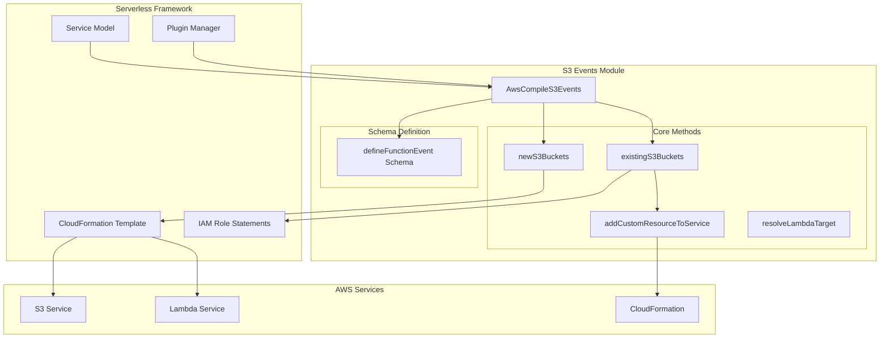
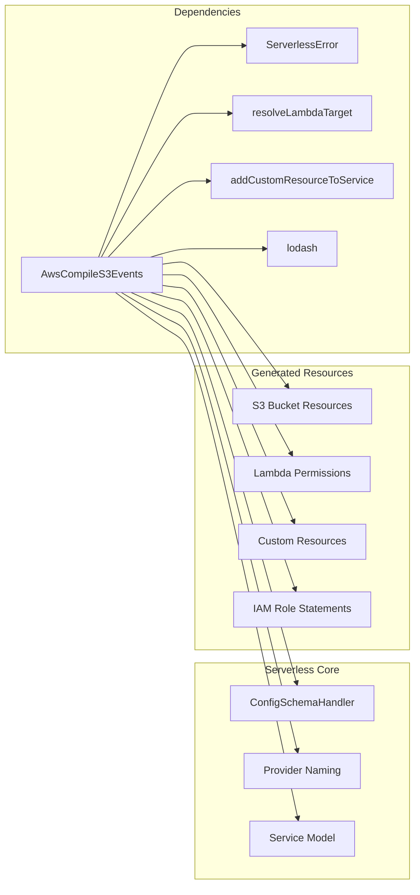
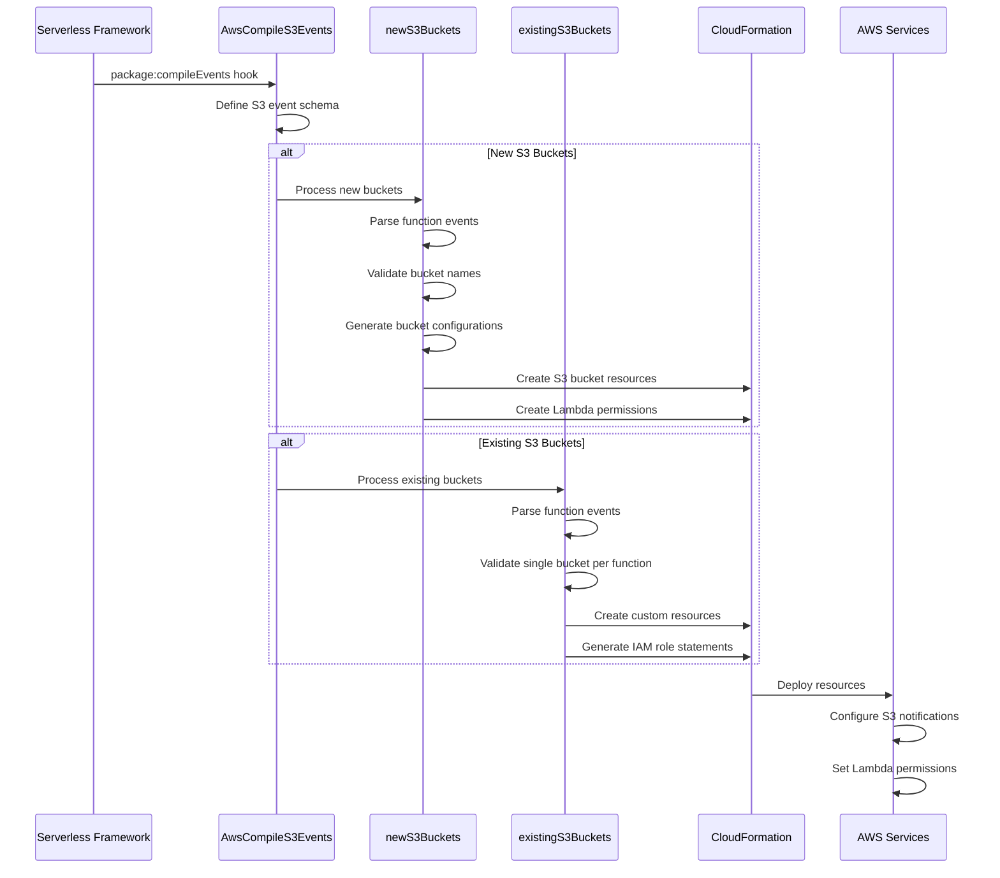
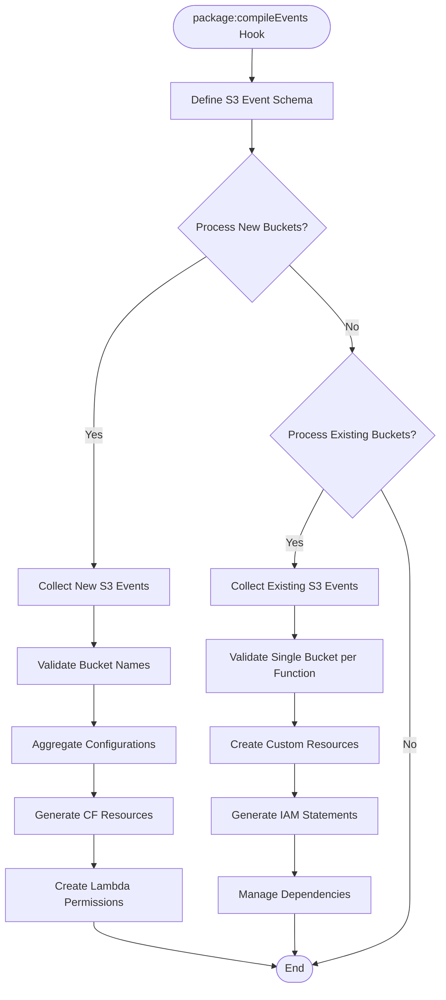

# S3 Events Module Documentation

## Introduction

The S3 Events module is a critical component of the Serverless Framework's AWS provider plugin system, responsible for configuring and managing S3 bucket event triggers for AWS Lambda functions. This module enables developers to automatically invoke Lambda functions in response to S3 bucket events such as object creation, deletion, or modification.

The module handles both new S3 buckets created within the Serverless service and existing S3 buckets that need to be configured with Lambda event notifications. It generates the necessary CloudFormation resources and IAM permissions to establish secure, reliable event-driven architectures between S3 and Lambda services.

## Architecture Overview



## Component Relationships



## Data Flow



## Core Functionality

### Event Schema Definition

The module defines a comprehensive schema for S3 function events that supports multiple configuration patterns:

```javascript
{
  anyOf: [
    { type: 'string' },                    // Simple bucket name
    {
      type: 'object',
      properties: {
        bucket: { /* string or CloudFormation function */ },
        event: { type: 'string', pattern: '^s3:.+$' },
        existing: { type: 'boolean' },      // Use existing bucket
        forceDeploy: { type: 'boolean' },   // Force deployment
        rules: [                            // Filter rules
          {
            type: 'object',
            properties: {
              prefix: { /* string or CF function */ },
              suffix: { /* string or CF function */ }
            },
            maxProperties: 1
          }
        ]
      },
      required: ['bucket']
    }
  ]
}
```

### New S3 Bucket Processing

The `newS3Buckets()` method handles the creation and configuration of new S3 buckets:

1. **Event Collection**: Iterates through all functions and collects S3 events
2. **Bucket Validation**: Validates bucket names against AWS naming patterns
3. **Configuration Aggregation**: Groups Lambda configurations by bucket name
4. **CloudFormation Generation**: Creates S3 bucket resources with notification configurations
5. **Permission Setup**: Generates Lambda permissions for S3 to invoke functions

### Existing S3 Bucket Processing

The `existingS3Buckets()` method manages configuration of pre-existing S3 buckets:

1. **Custom Resource Creation**: Uses CloudFormation custom resources to configure existing buckets
2. **IAM Role Management**: Creates necessary IAM permissions for bucket notification management
3. **Dependency Management**: Handles dependencies between multiple custom resources
4. **Validation**: Ensures only one S3 bucket per function for existing configurations

## Process Flow



## Integration Points

### Serverless Framework Integration

The module integrates deeply with the Serverless Framework's plugin system:

- **Hook Registration**: Registers for the `package:compileEvents` lifecycle hook
- **Schema Registration**: Defines event schemas through `configSchemaHandler`
- **Service Model Access**: Accesses function configurations and provider settings
- **CloudFormation Template**: Modifies the compiled CloudFormation template

### AWS Provider Dependencies

The module relies on several AWS provider components:

- **[aws-provider.md](aws-provider.md)**: Core AWS provider functionality
- **[aws-package-compile.md](aws-package-compile.md)**: Package compilation infrastructure
- **[aws-common.md](aws-common.md)**: Common AWS utilities and helpers

### Custom Resource Framework

For existing bucket management, the module leverages the custom resource framework:

- **Custom Resource Function**: Creates Lambda functions for bucket configuration
- **IAM Role Statements**: Generates necessary permissions for bucket management
- **Dependency Management**: Handles complex dependencies between resources

## Security Considerations

### IAM Permissions

The module generates minimal IAM permissions following the principle of least privilege:

- **S3 Permissions**: `s3:PutBucketNotification`, `s3:GetBucketNotification` for existing buckets
- **Lambda Permissions**: `lambda:AddPermission`, `lambda:RemovePermission` for permission management
- **Resource Scoping**: Permissions are scoped to specific buckets and functions

### Source ARN Validation

Lambda permissions include source ARN validation to ensure only authorized S3 buckets can invoke functions:

```javascript
SourceArn: {
  'Fn::Join': ['', ['arn:', { Ref: 'AWS::Partition' }, `:s3:::${bucketName}`]]
}
```

## Error Handling

The module implements comprehensive error handling for various scenarios:

### Validation Errors

- **Invalid Bucket Names**: Validates against AWS S3 bucket naming patterns
- **CloudFormation Function Restrictions**: Prevents CF functions for new buckets
- **Multiple Buckets per Function**: Enforces single bucket per function for existing configurations

### Custom Error Types

```javascript
throw new ServerlessError(
  'When specifying "s3.bucket" with CloudFormation intrinsic function, you need to specify that the bucket is existing via "existing: true" property.',
  'S3_INVALID_NEW_BUCKET_FORMAT'
)
```

## Best Practices

### Bucket Configuration

1. **Use Existing Buckets**: For production environments, use existing buckets with proper `existing: true` configuration
2. **Event Filtering**: Utilize prefix/suffix rules to minimize Lambda invocations
3. **Naming Conventions**: Follow AWS S3 bucket naming conventions and patterns

### Performance Optimization

1. **Batch Processing**: The module processes all S3 events in a single compilation pass
2. **Dependency Optimization**: Minimizes CloudFormation dependencies to reduce deployment time
3. **Resource Reuse**: Reuses custom resources for multiple functions targeting the same bucket

### Deployment Strategies

1. **Force Deploy**: Use `forceDeploy: true` for existing buckets when configuration changes don't trigger updates
2. **Staged Rollouts**: Consider bucket-specific deployments for large-scale applications
3. **Monitoring**: Implement proper monitoring for S3 event processing and Lambda invocations

## Related Documentation

- **[aws-events.md](aws-events.md)**: Overview of all AWS event types
- **[aws-package-compile.md](aws-package-compile.md)**: Package compilation process
- **[aws-provider.md](aws-provider.md)**: AWS provider configuration and setup
- **[core-framework.md](core-framework.md)**: Core Serverless Framework architecture