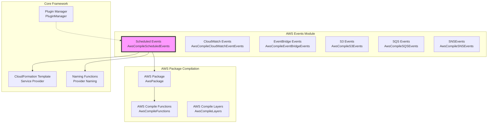
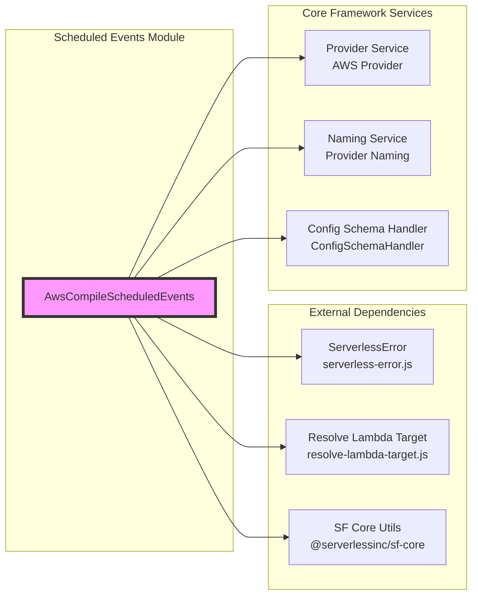
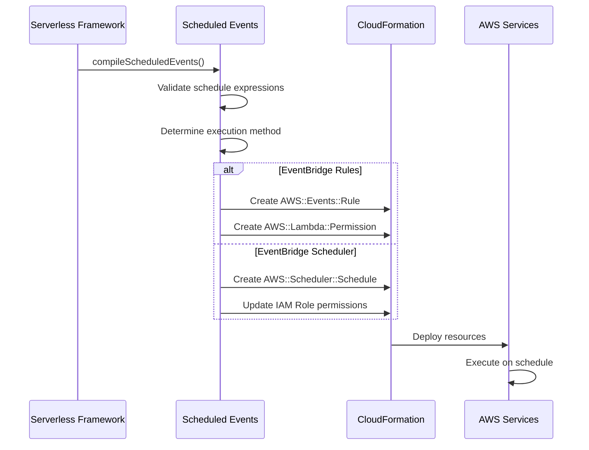

# Scheduled Events Module

## Introduction

The scheduled-events module is a specialized AWS event compilation component within the Serverless Framework that handles the creation and configuration of scheduled event triggers for AWS Lambda functions. This module enables developers to schedule Lambda function executions using either AWS EventBridge (CloudWatch Events) rules or the newer AWS EventBridge Scheduler service, providing flexible time-based function triggering capabilities.

## Architecture Overview

The scheduled-events module is part of the AWS events compilation pipeline and integrates with the broader AWS provider ecosystem within the Serverless Framework.



## Core Components

### AwsCompileScheduledEvents

The primary class responsible for compiling scheduled events into AWS CloudFormation resources. This component:

- Validates schedule expressions (rate and cron syntax)
- Supports both EventBridge Rules and EventBridge Scheduler methods
- Generates appropriate CloudFormation templates
- Manages IAM permissions and roles
- Handles input transformations and configurations

## Dependencies and Integration



## Configuration Schema

The module defines a comprehensive schema for schedule event configuration:

### Basic String Format
```yaml
functions:
  myFunction:
    events:
      - schedule: rate(5 minutes)
      - schedule: cron(0 12 * * ? *)
```

### Advanced Object Format
```yaml
functions:
  myFunction:
    events:
      - schedule:
          rate:
            - rate(5 minutes)
            - cron(0 12 * * ? *)
          enabled: true
          name: my-schedule
          description: Runs every 5 minutes
          input:
            key: value
          method: eventBus
```

## Supported Features

### Schedule Expression Types

1. **Rate Expressions**: Simple recurring intervals
   - `rate(1 minute)` - Every minute
   - `rate(5 minutes)` - Every 5 minutes
   - `rate(1 hour)` - Every hour
   - `rate(1 day)` - Every day

2. **Cron Expressions**: Complex scheduling patterns
   - `cron(0 12 * * ? *)` - Daily at 12:00 PM
   - `cron(0/5 * * * ? *)` - Every 5 minutes
   - `cron(0 8 ? * MON-FRI *)` - Weekdays at 8:00 AM

### Execution Methods

1. **EventBridge Rules** (Default)
   - Uses AWS CloudWatch Events/EventBridge
   - Supports input transformations
   - Supports input paths
   - No timezone support

2. **EventBridge Scheduler** (Newer method)
   - Uses AWS EventBridge Scheduler service
   - Supports timezones
   - No input transformation support
   - More flexible scheduling options

## Data Flow



## CloudFormation Resource Generation

### EventBridge Rules Method

Generates two CloudFormation resources:

1. **AWS::Events::Rule**: Defines the schedule trigger
2. **AWS::Lambda::Permission**: Grants invocation permission

### EventBridge Scheduler Method

Generates:

1. **AWS::Scheduler::Schedule**: Defines the scheduled task
2. **IAM Role Updates**: Adds scheduler invocation permissions

## Error Handling

The module implements comprehensive error handling for:

- Invalid schedule expression syntax
- Unsupported parameter combinations
- Missing required fields
- Configuration conflicts

Common error scenarios:
- `SCHEDULE_NAME_NOT_ALLOWED_MULTIPLE_RATES`: Name specified with multiple rates
- `SCHEDULE_PARAMETER_NOT_SUPPORTED`: Incompatible parameter for selected method

## IAM Permissions

### EventBridge Rules
- Automatically creates Lambda invocation permissions
- Uses `events.amazonaws.com` as principal
- Links permission to event rule ARN

### EventBridge Scheduler
- Updates existing IAM role with scheduler permissions
- Adds `lambda:InvokeFunction` action
- Supports both function ARN and version ARNs

## Best Practices

1. **Choose the Right Method**:
   - Use EventBridge Rules for simple schedules with transformations
   - Use EventBridge Scheduler for timezone support and advanced features

2. **Naming Conventions**:
   - Use descriptive names for schedules
   - Follow AWS naming constraints (1-64 characters, alphanumeric plus .-_)

3. **Input Handling**:
   - Keep input payloads under size limits
   - Use input transformers for complex data manipulation
   - Validate JSON input format

4. **Performance Considerations**:
   - Consider function cold starts for frequent schedules
   - Use appropriate memory allocation for scheduled functions
   - Monitor execution costs for high-frequency schedules

## Integration with Other Modules

The scheduled-events module integrates with:

- **[AWS Provider Module](aws-provider.md)**: Core AWS provider functionality
- **[AWS Package Compilation](aws-package-compile.md)**: Part of the compilation pipeline
- **[Configuration Management](configuration-management.md)**: Schema validation and configuration handling
- **[Core Framework](core-framework.md)**: Plugin system and service model

## Migration Considerations

When migrating from traditional cron jobs or other scheduling systems:

1. Review schedule expression syntax differences
2. Consider timezone requirements (EventBridge Scheduler only)
3. Evaluate input format and transformation needs
4. Test with both execution methods to determine optimal choice
5. Monitor initial executions for timing accuracy

## Monitoring and Troubleshooting

### CloudWatch Metrics
- `Invocations`: Number of scheduled invocations
- `Errors`: Failed invocations
- `Duration`: Function execution time

### CloudWatch Logs
- Schedule execution logs in `/aws/lambda/function-name`
- EventBridge rule execution logs
- Scheduler execution history (for EventBridge Scheduler method)

### Common Issues
- Schedule not triggering: Check IAM permissions and rule state
- Wrong timing: Verify timezone settings and cron expression syntax
- Input format errors: Validate JSON input and transformation rules