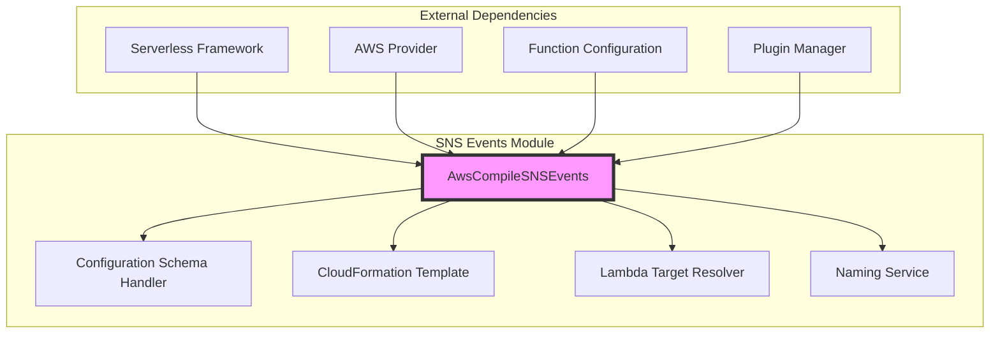
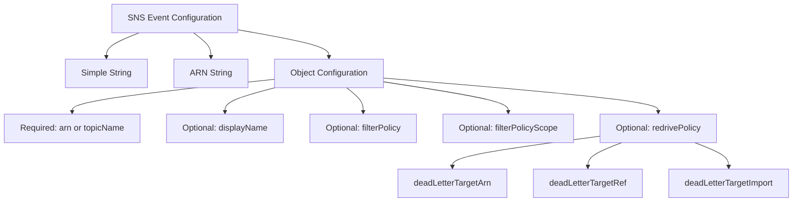
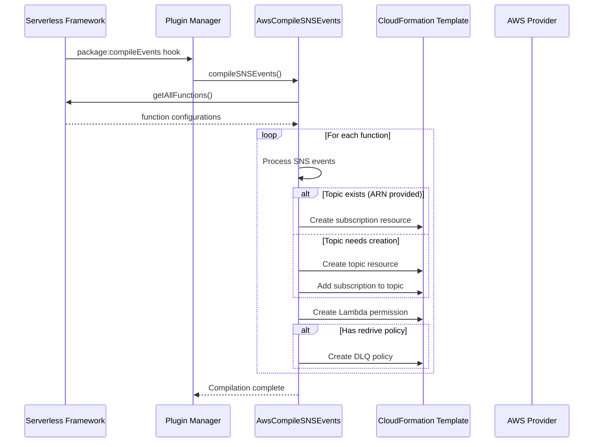
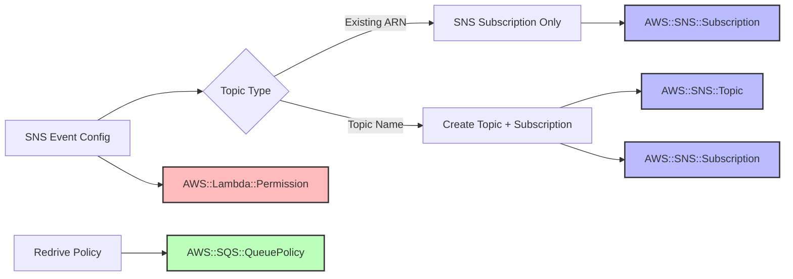
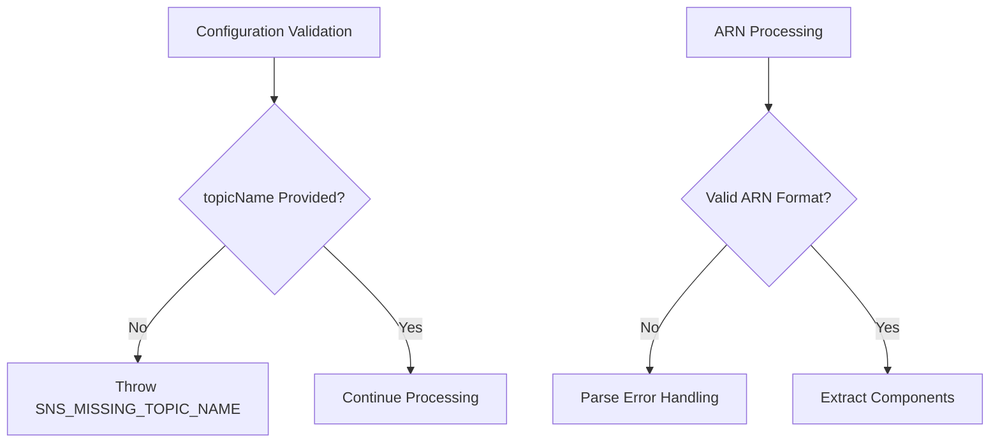

# SNS Events Module Documentation

## Introduction

The SNS Events module is a specialized component within the AWS provider plugin system that handles the compilation and configuration of AWS Simple Notification Service (SNS) event sources for AWS Lambda functions. This module transforms SNS event definitions in the Serverless Framework configuration into AWS CloudFormation resources, enabling Lambda functions to be triggered by SNS topic messages.

## Module Overview

The SNS Events module is part of the [aws-events](aws-events.md) module group and specifically handles SNS (Simple Notification Service) event source mapping. It integrates with the broader [aws-package-compile](aws-package-compile.md) system to generate the necessary CloudFormation resources for SNS-to-Lambda integrations.

## Core Component: AwsCompileSNSEvents

### Purpose
The `AwsCompileSNSEvents` class is responsible for:
- Validating SNS event configurations
- Generating CloudFormation resources for SNS topics and subscriptions
- Creating Lambda permissions for SNS invocations
- Handling dead letter queue (DLQ) configurations
- Managing cross-region SNS topic support

### Architecture



### Configuration Schema

The module defines a comprehensive schema for SNS event configuration that supports multiple formats:



## Data Flow

### Compilation Process



### Resource Generation



## Key Features

### 1. Flexible Topic Configuration
- **ARN-based**: Reference existing SNS topics by ARN
- **Name-based**: Create new topics with specified names
- **Cross-region support**: Handle topics in different regions

### 2. Advanced Subscription Options
- **Filter policies**: JSON-based message filtering
- **Filter policy scope**: Control filtering scope
- **Dead letter queues**: Handle failed message processing

### 3. Dead Letter Queue Support
The module supports three ways to configure DLQs:
- **Direct ARN**: Reference existing SQS queue by ARN
- **CloudFormation reference**: Reference queue in the same stack
- **Import values**: Import from other stacks

### 4. CloudFormation Resource Generation

#### Generated Resources
1. **AWS::SNS::Topic** (when creating new topics)
2. **AWS::SNS::Subscription** (for Lambda integration)
3. **AWS::Lambda::Permission** (for SNS invocation rights)
4. **AWS::SQS::QueuePolicy** (for DLQ configurations)

## Integration Points

### Dependencies
- **[core-framework](core-framework.md)**: Base Serverless Framework functionality
- **[aws-provider](aws-provider.md)**: AWS-specific provider implementation
- **[aws-package-compile](aws-package-compile.md)**: Compilation pipeline integration

### Related Modules
- **[s3-events](s3-events.md)**: Similar event source for S3
- **[sqs-events](sqs-events.md)**: SQS event source configuration
- **[api-gateway-events](api-gateway-events.md)**: HTTP event source handling

## Error Handling

The module implements specific error handling for common configuration issues:



## Usage Examples

### Basic Topic Subscription
```yaml
functions:
  myFunction:
    handler: handler.main
    events:
      - sns: my-topic-name
```

### Existing Topic Reference
```yaml
functions:
  myFunction:
    handler: handler.main
    events:
      - sns:
          arn: arn:aws:sns:us-east-1:123456789012:my-existing-topic
```

### Advanced Configuration with Filtering
```yaml
functions:
  myFunction:
    handler: handler.main
    events:
      - sns:
          topicName: filtered-topic
          filterPolicy:
            eventType:
              - user-created
              - user-updated
          redrivePolicy:
            deadLetterTargetArn: arn:aws:sqs:us-east-1:123456789012:dlq
```

## CloudFormation Template Structure

The module generates CloudFormation resources with logical naming conventions:

```yaml
Resources:
  # Topic resource (when creating new topic)
  SNSTopicMytopic:
    Type: AWS::SNS::Topic
    Properties:
      TopicName: my-topic
      DisplayName: My Topic Display Name
  
  # Subscription resource
  MyfunctionSnsSubscriptionMytopic:
    Type: AWS::SNS::Subscription
    Properties:
      TopicArn: !Ref SNSTopicMytopic
      Protocol: lambda
      Endpoint: !GetAtt MyfunctionLambdaFunction.Arn
      FilterPolicy: {...}
  
  # Lambda permission
  MyfunctionLambdaPermissionSnsMytopic:
    Type: AWS::Lambda::Permission
    Properties:
      FunctionName: !GetAtt MyfunctionLambdaFunction.Arn
      Action: lambda:InvokeFunction
      Principal: sns.amazonaws.com
      SourceArn: !Ref SNSTopicMytopic
```

## Best Practices

1. **Topic Naming**: Use descriptive, environment-specific topic names
2. **Filter Policies**: Implement message filtering to reduce unnecessary Lambda invocations
3. **Dead Letter Queues**: Configure DLQs for critical message processing
4. **Cross-Region Considerations**: Be aware of data transfer costs and latency
5. **Permission Management**: The module automatically creates necessary permissions

## Security Considerations

- The module automatically generates Lambda permissions for SNS invocation
- Cross-account SNS topics require appropriate IAM policies
- DLQ configurations should follow security best practices for SQS queues
- Filter policies can help implement message-level security controls

## Troubleshooting

Common issues and solutions:
- **Missing topic name**: Ensure either `arn` or `topicName` is provided
- **Permission errors**: Check Lambda execution role has necessary permissions
- **Cross-region issues**: Verify region configuration matches topic location
- **DLQ configuration**: Ensure SQS queue exists and has proper permissions

## References

- [AWS SNS Documentation](https://docs.aws.amazon.com/sns/)
- [AWS Lambda SNS Events](https://docs.aws.amazon.com/lambda/latest/dg/with-sns.html)
- [Serverless Framework AWS Events](https://www.serverless.com/framework/docs/providers/aws/events/)
- Related module documentation:
  - [aws-events](aws-events.md)
  - [aws-package-compile](aws-package-compile.md)
  - [aws-provider](aws-provider.md)