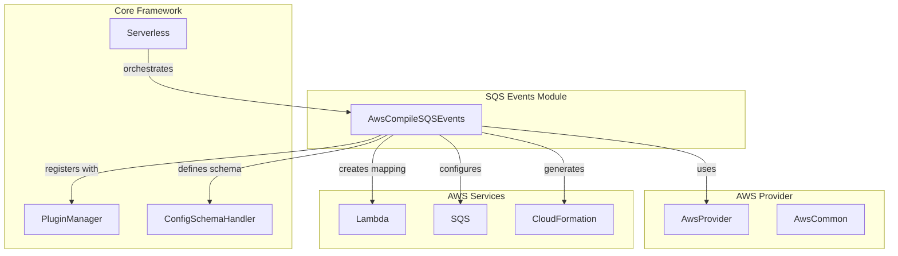
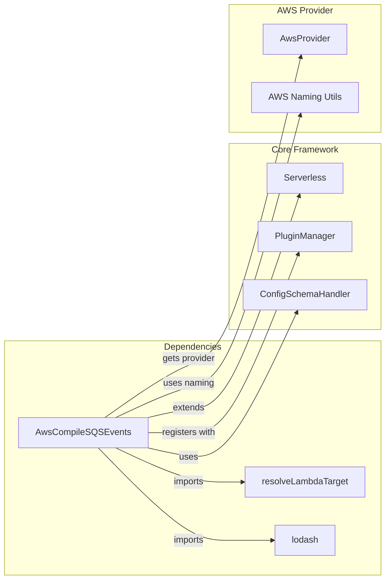
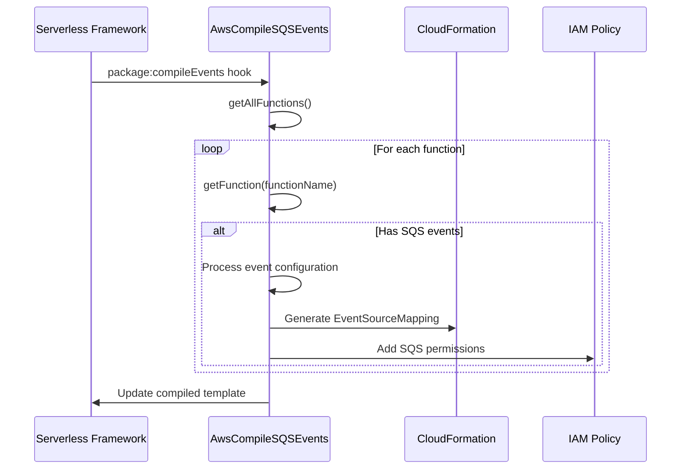
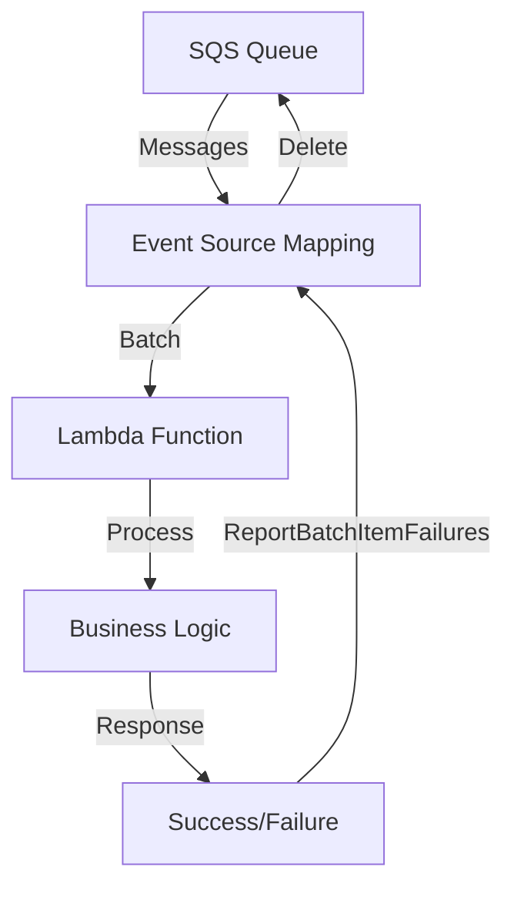
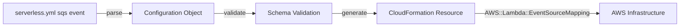

# SQS Events Module Documentation

## Overview

The SQS Events module is a specialized component within the AWS provider plugin system that handles the compilation and configuration of Amazon SQS (Simple Queue Service) event sources for AWS Lambda functions. This module enables serverless applications to process messages from SQS queues through Lambda function invocations, providing scalable and reliable message processing capabilities.

## Purpose and Core Functionality

The primary purpose of the SQS Events module is to:

1. **Event Source Mapping**: Create AWS Lambda EventSourceMapping resources that connect SQS queues to Lambda functions
2. **IAM Policy Management**: Automatically generate the necessary IAM permissions for Lambda functions to access SQS queues
3. **Configuration Validation**: Validate SQS event configurations against defined schemas
4. **CloudFormation Template Generation**: Compile SQS event configurations into AWS CloudFormation template resources

## Architecture

### Component Structure



### Dependencies and Integration



## Core Component: AwsCompileSQSEvents

### Class Definition

The `AwsCompileSQSEvents` class is the main component of this module, responsible for compiling SQS event configurations into AWS CloudFormation resources.

#### Constructor

```javascript
constructor(serverless) {
  this.serverless = serverless
  this.provider = this.serverless.getProvider('aws')
  
  // Register hooks
  this.hooks = {
    'package:compileEvents': async () => this.compileSQSEvents()
  }
  
  // Define schema for SQS events
  this.serverless.configSchemaHandler.defineFunctionEvent('aws', 'sqs', {
    // Schema definition
  })
}
```

#### Key Properties

- **serverless**: Reference to the Serverless framework instance
- **provider**: AWS provider instance for accessing AWS-specific utilities
- **hooks**: Event hooks that register the compile function

### Configuration Schema

The module defines a comprehensive schema for SQS event configurations:

```yaml
sqs:
  # Simple ARN string format
  arn: "arn:aws:sqs:region:account:queue-name"
  
  # Or detailed object format
  arn: { Ref: "QueueResource" }
  batchSize: 10                    # 1-10000 messages
  enabled: true                    # Enable/disable event source
  maximumBatchingWindow: 0         # 0-300 seconds
  functionResponseType: "ReportBatchItemFailures"
  filterPatterns: []               # Event filtering patterns
  maximumConcurrency: 10           # 2-1000 concurrent executions
```

### Compilation Process



## Data Flow

### Event Processing Flow



### Configuration to Resource Mapping



## Key Features

### 1. Flexible ARN Support

The module supports multiple ARN formats:
- String ARNs: `"arn:aws:sqs:region:account:queue"`
- CloudFormation references: `{ Ref: "QueueResource" }`
- Import values: `{ Fn::ImportValue: "QueueExport" }`
- Join functions: `{ Fn::Join: [":", ["arn:aws:sqs", region, account, queue]]}`

### 2. Batch Processing Configuration

- **Batch Size**: Configurable from 1-10,000 messages
- **Maximum Batching Window**: 0-300 seconds for optimizing batch processing
- **Maximum Concurrency**: 2-1,000 concurrent Lambda executions

### 3. Error Handling

- **Function Response Types**: Support for `ReportBatchItemFailures` to handle partial batch failures
- **Filter Patterns**: Event filtering to process only relevant messages

### 4. IAM Policy Generation

Automatically generates IAM policies with required SQS permissions:
- `sqs:ReceiveMessage`
- `sqs:DeleteMessage`
- `sqs:GetQueueAttributes`

## Integration with Serverless Framework

### Plugin Registration

The module integrates with the Serverless Framework through the plugin system:

```javascript
// In serverless.yml
functions:
  processMessages:
    handler: handler.processMessages
    events:
      - sqs:
          arn: arn:aws:sqs:us-east-1:123456789012:my-queue
          batchSize: 10
          enabled: true
```

### Hook Integration

The module registers for the `package:compileEvents` hook, ensuring SQS events are compiled during the packaging phase.

## Error Handling and Validation

### Schema Validation

The module validates SQS event configurations against a strict JSON schema, ensuring:
- Required properties are present
- Property types are correct
- Value ranges are within AWS limits
- No additional properties are allowed

### Runtime Error Handling

- Invalid ARN formats are detected and handled
- Missing queue resources are identified during compilation
- IAM role dependencies are properly managed

## Performance Considerations

### Optimization Features

1. **Batch Processing**: Configurable batch sizes to optimize throughput
2. **Batching Window**: Time-based batching for better resource utilization
3. **Concurrency Control**: Maximum concurrency limits to prevent resource exhaustion
4. **Event Filtering**: Reduce unnecessary Lambda invocations through filtering

### Best Practices

- Use appropriate batch sizes based on message processing time
- Configure maximum concurrency based on downstream service limits
- Implement proper error handling with `ReportBatchItemFailures`
- Use event filtering to reduce processing overhead

## Related Modules

The SQS Events module works closely with other AWS provider modules:

- **[aws-provider](aws-provider.md)**: Core AWS provider functionality
- **[aws-package-compile](aws-package-compile.md)**: General compilation framework
- **[aws-events](aws-events.md)**: Parent events module
- **[storage-events](storage-events.md)**: Sibling storage event modules (S3, SNS)

## CloudFormation Resources Generated

The module generates `AWS::Lambda::EventSourceMapping` resources with the following structure:

```yaml
Type: AWS::Lambda::EventSourceMapping
Properties:
  BatchSize: 10
  EventSourceArn: arn:aws:sqs:region:account:queue
  FunctionName: !Ref FunctionName
  Enabled: true
  MaximumBatchingWindowInSeconds: 0
  FunctionResponseTypes:
    - ReportBatchItemFailures
  FilterCriteria:
    Filters:
      - Pattern: '{"key": ["value"]}'
  ScalingConfig:
    MaximumConcurrency: 10
```

## Conclusion

The SQS Events module provides a robust and flexible solution for integrating SQS queues with Lambda functions in serverless applications. Its comprehensive configuration options, automatic IAM policy generation, and seamless integration with the Serverless Framework make it an essential component for building event-driven architectures on AWS.