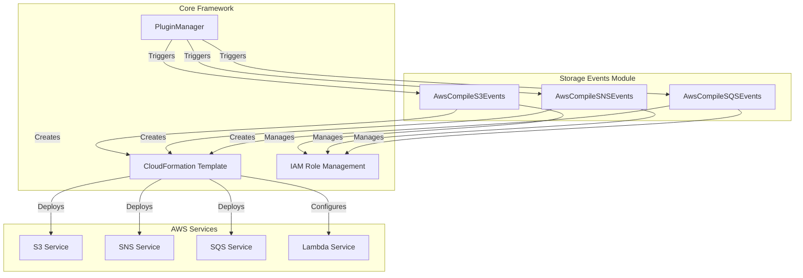
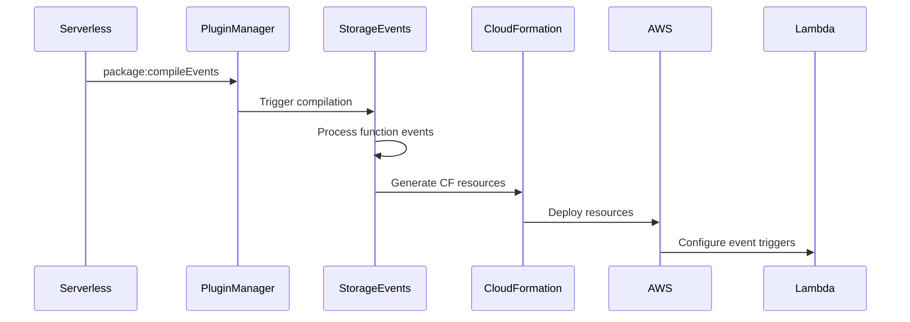

# Storage Events Module Documentation

## Overview

The storage-events module is a critical component of the AWS provider plugin system that handles the compilation and configuration of AWS storage-related event sources for Lambda functions. This module enables serverless applications to respond to events from AWS storage services including Amazon S3, SNS, and SQS.

## Purpose

The storage-events module provides functionality to:
- Compile S3 bucket events (object creation, deletion, etc.) into CloudFormation resources
- Configure SNS topic subscriptions for Lambda functions
- Set up SQS queue event source mappings for Lambda functions
- Manage permissions and IAM roles required for storage event processing
- Support both new and existing storage resources

## Architecture



## Module Structure

The storage-events module consists of three main sub-modules:

### 1. S3 Events Compiler
- **Component**: `lib.plugins.aws.package.compile.events.s3.index.AwsCompileS3Events`
- **Purpose**: Handles S3 bucket event configuration and Lambda trigger setup
- **Documentation**: [Detailed S3 Events Documentation](s3-events.md)
- **Key Features**:
  - New bucket creation with event notifications
  - Existing bucket configuration
  - Event filtering with prefix/suffix rules
  - Lambda permission management

### 2. SNS Events Compiler
- **Component**: `lib.plugins.aws.package.compile.events.sns.AwsCompileSNSEvents`
- **Purpose**: Manages SNS topic subscriptions for Lambda functions
- **Documentation**: [Detailed SNS Events Documentation](sns-events.md)
- **Key Features**:
  - Topic creation and subscription management
  - Filter policy configuration
  - Dead letter queue (DLQ) support
  - Cross-region topic support

### 3. SQS Events Compiler
- **Component**: `lib.plugins.aws.package.compile.events.sqs.AwsCompileSQSEvents`
- **Purpose**: Configures SQS queue event source mappings for Lambda functions
- **Documentation**: [Detailed SQS Events Documentation](sqs-events.md)
- **Key Features**:
  - Event source mapping creation
  - Batch size and window configuration
  - Filter pattern support
  - Maximum concurrency settings

## Data Flow



## Integration Points

### Core Framework Dependencies
- **PluginManager**: Registers event compilation hooks
- **ConfigSchemaHandler**: Defines event configuration schemas
- **CloudFormation Template**: Merges generated resources
- **IAM Role Management**: Updates execution role policies

### AWS Provider Integration
- **AwsProvider**: Access to AWS service configurations
- **Naming Conventions**: Consistent resource naming patterns
- **Custom Resources**: Support for existing resource management
- **Utils**: Lambda target resolution and ARN handling

## Configuration Schema

Each storage event type has its own configuration schema defined through the `configSchemaHandler`:

### S3 Events Schema
- String or object configuration
- Bucket name (required)
- Event type (default: `s3:ObjectCreated:*`)
- Existing bucket flag
- Force deploy option
- Filtering rules (prefix/suffix)

### SNS Events Schema
- String, ARN, or object configuration
- Topic name or ARN (required)
- Display name
- Filter policy and scope
- Redrive policy for DLQ

### SQS Events Schema
- ARN or object configuration
- Queue ARN (required)
- Batch size (1-10000)
- Enabled flag
- Maximum batching window
- Function response type
- Filter patterns
- Maximum concurrency

## Error Handling

The module implements comprehensive error handling for:
- Invalid bucket names (S3)
- Multiple buckets per function (S3)
- Missing topic names (SNS)
- Invalid ARN formats
- CloudFormation template validation

## Security Considerations

- **IAM Permissions**: Automatically generates required IAM policies
- **Lambda Permissions**: Creates resource-based policies for invocation
- **Cross-service Access**: Manages permissions between storage services and Lambda
- **Resource Isolation**: Ensures proper resource separation and access control

## Usage Examples

### S3 Event Configuration
```yaml
functions:
  processFile:
    handler: handler.processFile
    events:
      - s3:
          bucket: my-bucket
          event: s3:ObjectCreated:*
          rules:
            - prefix: uploads/
            - suffix: .jpg
```

### SNS Event Configuration
```yaml
functions:
  processMessage:
    handler: handler.processMessage
    events:
      - sns:
          topicName: my-topic
          filterPolicy:
            attribute:
              - value1
              - value2
```

### SQS Event Configuration
```yaml
functions:
  processQueue:
    handler: handler.processQueue
    events:
      - sqs:
          arn: arn:aws:sqs:region:account:queue-name
          batchSize: 10
          maximumConcurrency: 5
```

## Related Documentation

- [AWS Provider Module](aws-provider.md) - Parent AWS provider documentation
- [AWS Events Module](aws-events.md) - Broader events system documentation
- [Core Framework](core-framework.md) - Core serverless framework documentation