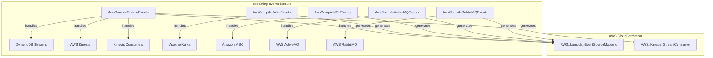
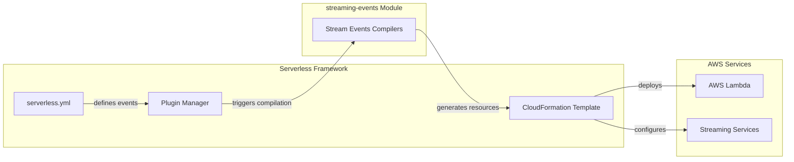

# Streaming Events Module Documentation

## Overview

The streaming-events module is a specialized component within the AWS provider plugin system that handles the compilation and configuration of streaming data event sources for AWS Lambda functions. This module enables serverless applications to process real-time data streams from various messaging and streaming platforms including AWS Kinesis, DynamoDB Streams, Apache Kafka, Amazon MSK (Managed Streaming for Kafka), ActiveMQ, and RabbitMQ.

## Purpose

The primary purpose of this module is to:
- Transform streaming event configurations into AWS CloudFormation resources
- Manage event source mappings between Lambda functions and streaming platforms
- Handle authentication and access configurations for various streaming services
- Provide comprehensive IAM role permissions for streaming data access
- Support advanced features like batch processing, filtering, and error handling

## Architecture

### Module Structure



### Integration with Serverless Framework



## Core Components

### 1. Stream Events Compiler
- **Component**: `AwsCompileStreamEvents`
- **Purpose**: Handles AWS native streaming services (DynamoDB Streams, Kinesis)
- **Documentation**: [Detailed Stream Events Documentation](aws-compile-stream-events.md)
- **Key Features**:
  - DynamoDB Streams integration with batch processing
  - Kinesis stream support with enhanced fan-out consumers
  - Configurable batch sizes, starting positions, and retry policies
  - Support for destination configurations (SNS/SQS on failure)
  - Event filtering capabilities

### 2. Kafka Events Compiler
- **Component**: `AwsCompileKafkaEvents`
- **Purpose**: Manages Apache Kafka event sources
- **Documentation**: [Detailed Kafka Events Documentation](aws-compile-kafka-events.md)
- **Key Features**:
  - Self-managed Kafka cluster support
  - Multiple authentication methods (SASL, TLS)
  - VPC configuration for secure connectivity
  - Consumer group management
  - Event filtering and batch processing

### 3. MSK Events Compiler
- **Component**: `AwsCompileMSKEvents`
- **Purpose**: Handles Amazon Managed Streaming for Kafka events
- **Documentation**: [Detailed MSK Events Documentation](aws-compile-msk-events.md)
- **Key Features**:
  - Managed Kafka cluster integration
  - SASL/SCRAM authentication support
  - VPC networking configuration
  - Cluster ARN-based event source mapping

### 4. ActiveMQ Events Compiler
- **Component**: `AwsCompileActiveMQEvents`
- **Purpose**: Processes AWS ActiveMQ message broker events
- **Documentation**: [Detailed ActiveMQ Events Documentation](aws-compile-activemq-events.md)
- **Key Features**:
  - ActiveMQ broker integration
  - Basic authentication via Secrets Manager
  - Queue-based event processing
  - VPC networking support

### 5. RabbitMQ Events Compiler
- **Component**: `AwsCompileRabbitMQEvents`
- **Purpose**: Handles AWS RabbitMQ message broker events
- **Documentation**: [Detailed RabbitMQ Events Documentation](aws-compile-rabbitmq-events.md)
- **Key Features**:
  - RabbitMQ broker support
  - Virtual host configuration
  - Basic authentication
  - Queue-based event processing

## Common Features Across All Compilers

### Event Source Mapping
All compilers generate `AWS::Lambda::EventSourceMapping` resources that establish the connection between Lambda functions and streaming event sources.

### IAM Role Management
Each compiler automatically generates the necessary IAM policy statements required for:
- Reading from streaming sources
- Managing network interfaces (for VPC-enabled sources)
- Accessing authentication credentials from Secrets Manager
- Describing cluster/broker information

### Configuration Validation
All compilers implement comprehensive JSON schema validation to ensure:
- Required parameters are provided
- Parameter values are within acceptable ranges
- Authentication configurations are complete
- Network settings are properly specified

### Advanced Features
- **Batch Processing**: Configurable batch sizes and batching windows
- **Error Handling**: Retry policies, bisect batch on error, and failure destinations
- **Event Filtering**: JSON pattern-based event filtering
- **Starting Position**: Control over where to start processing in the stream
- **Consumer Management**: Support for consumer groups and enhanced fan-out

## Dependencies

### Internal Dependencies
- **AWS Provider**: All compilers depend on the AWS provider for:
  - Resource naming conventions
  - CloudFormation template management
  - IAM role resolution
  - Utility functions

### External Dependencies
- **resolve-lambda-target**: Utility for resolving Lambda function targets
- **serverless-error**: Custom error handling
- **lodash**: Utility functions for object manipulation

## Usage Patterns

### Basic Stream Configuration
```yaml
functions:
  processStream:
    handler: handler.process
    events:
      - stream:
          arn: arn:aws:dynamodb:region:account:table/TableName/stream/timestamp
          batchSize: 100
          startingPosition: LATEST
```

### Kafka with Authentication
```yaml
functions:
  processKafka:
    handler: handler.process
    events:
      - kafka:
          bootstrapServers:
            - broker1:9092
            - broker2:9092
          topic: my-topic
          accessConfigurations:
            saslScram512Auth:
              - arn:aws:secretsmanager:region:account:secret:secret-name
```

### MSK with Consumer Group
```yaml
functions:
  processMSK:
    handler: handler.process
    events:
      - msk:
          arn: arn:aws:kafka:region:account:cluster/cluster-name/cluster-id
          topic: my-topic
          consumerGroupId: my-consumer-group
```

## Error Handling

The module implements comprehensive error handling for:
- Invalid configuration parameters
- Missing required fields
- Authentication configuration errors
- Network connectivity issues
- Resource dependency problems

## Performance Considerations

### Batch Processing Optimization
- Configurable batch sizes (1-10,000 records)
- Batching windows (0-300 seconds)
- Parallelization factors for Kinesis streams

### Resource Management
- Automatic IAM role permission generation
- Efficient CloudFormation resource creation
- Dependency management for proper deployment ordering

## Security Features

### Authentication Support
- SASL/PLAIN, SASL/SCRAM authentication for Kafka
- TLS client certificate authentication
- Basic authentication via AWS Secrets Manager
- VPC security group and subnet configuration

### IAM Permissions
- Least privilege access principles
- Service-specific permissions
- Network interface management permissions
- Secrets Manager access permissions

## Related Documentation

- [AWS Events Module](aws-events.md) - Parent module containing all AWS event types
- [AWS Provider Module](aws-provider.md) - Core AWS provider functionality
- [Configuration Management](configuration-management.md) - Service configuration handling
- [Plugin Management](plugin-management.md) - Plugin system architecture