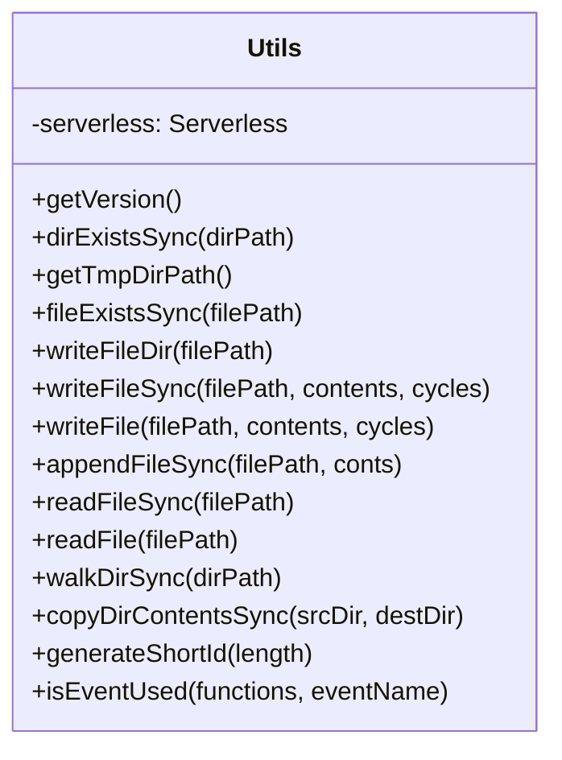
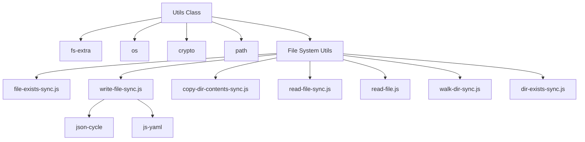
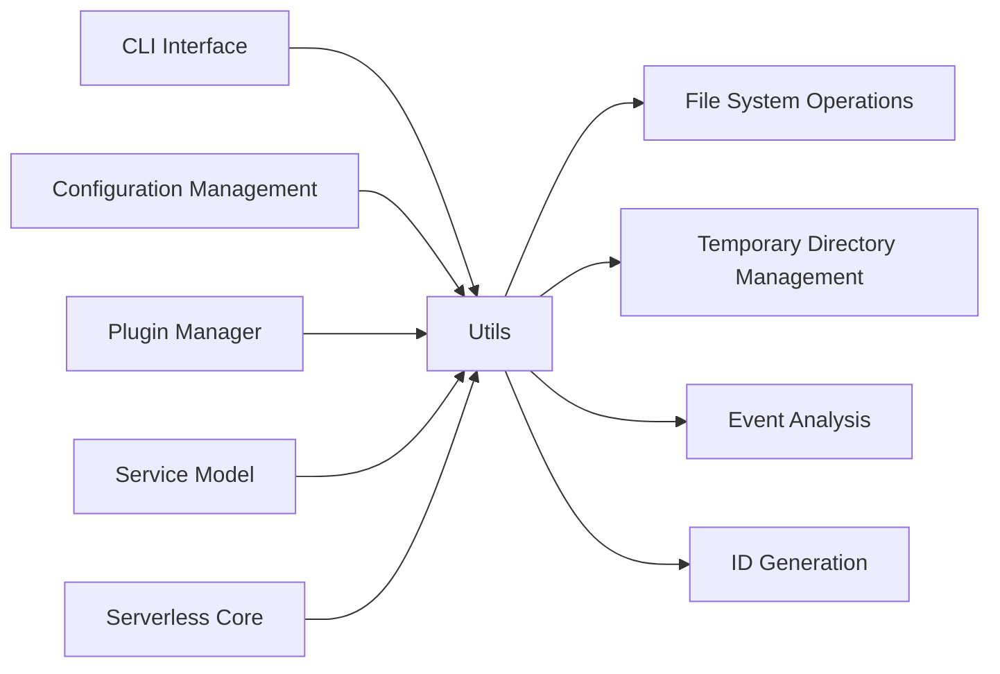
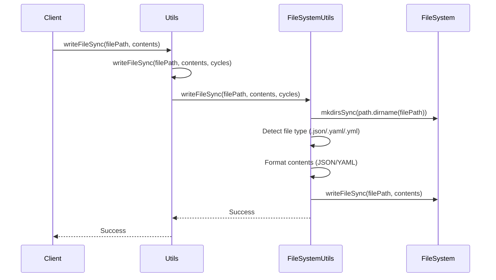
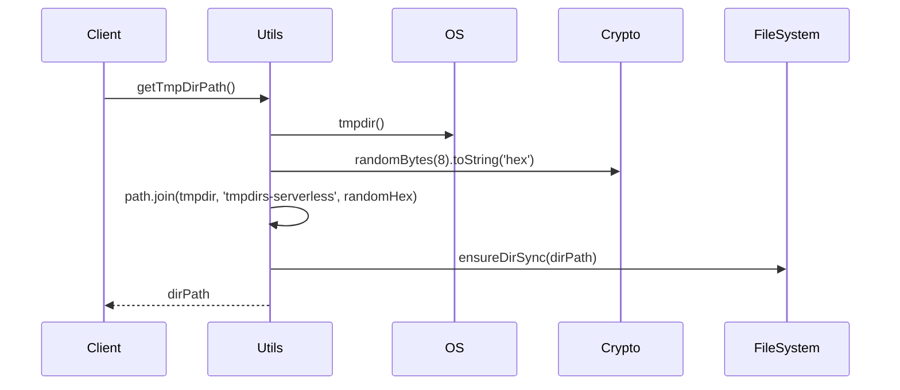

# Utility Functions Module

The utility-functions module provides essential utility operations and helper functions for the Serverless Framework. It serves as a centralized utility layer that offers file system operations, temporary directory management, ID generation, and event detection capabilities that are used throughout the framework.

## Overview

The utility-functions module is built around the `Utils` class, which acts as a facade for various utility operations. It provides both synchronous and asynchronous file operations, temporary directory management, and helper functions for analyzing serverless configurations. The module is designed to be dependency-injected into other components, making it easily accessible throughout the framework.

## Architecture

### Core Components



### Module Dependencies



### Integration with Core Framework



## Component Details

### Utils Class

The `Utils` class is the main entry point for all utility operations. It is initialized with a reference to the Serverless instance, providing access to framework-level configuration and version information.

#### Constructor
```javascript
constructor(serverless) {
  this.serverless = serverless
}
```

#### Key Methods

**File System Operations**
- `dirExistsSync(dirPath)`: Checks if a directory exists synchronously
- `fileExistsSync(filePath)`: Checks if a file exists synchronously
- `writeFileSync(filePath, contents, cycles)`: Writes files with automatic format detection (JSON/YAML)
- `writeFile(filePath, contents, cycles)`: Asynchronous version of writeFileSync
- `readFileSync(filePath)`: Reads files synchronously
- `readFile(filePath)`: Reads files asynchronously
- `walkDirSync(dirPath)`: Recursively walks directory contents
- `copyDirContentsSync(srcDir, destDir)`: Copies directory contents recursively

**Temporary Directory Management**
- `getTmpDirPath()`: Creates and returns a unique temporary directory path under the system temp directory

**Utility Functions**
- `getVersion()`: Returns the Serverless Framework version
- `generateShortId(length)`: Generates a short random ID of specified length
- `isEventUsed(functions, eventName)`: Checks if a specific event type is used in any function configuration

## Data Flow

### File Operations Flow



### Temporary Directory Creation Flow



## Usage Patterns

### File System Operations

The Utils class provides a unified interface for file operations with automatic format detection:

```javascript
// Writing JSON files (automatic formatting)
utils.writeFileSync('config.json', { key: 'value' })

// Writing YAML files (automatic formatting)
utils.writeFileSync('config.yaml', { key: 'value' })

// Reading files
const content = utils.readFileSync('file.txt')

// Directory operations
if (utils.dirExistsSync('/path/to/dir')) {
  const files = utils.walkDirSync('/path/to/dir')
}
```

### Temporary Directory Management

```javascript
// Get temporary directory for build artifacts
const tmpDir = utils.getTmpDirPath()
// Creates: /tmp/tmpdirs-serverless/a1b2c3d4e5f6/
```

### Event Analysis

```javascript
// Check if S3 events are used in any function
const hasS3Events = utils.isEventUsed(serverless.service.functions, 's3')
```

## Integration with Other Modules

The utility-functions module is integrated with several core modules:

- **[Configuration Management](configuration-management.md)**: Uses Utils for reading/writing configuration files
- **[Plugin Management](plugin-management.md)**: Utilizes Utils for file operations during plugin installation
- **[Service Model](service-model.md)**: Uses Utils for service file operations
- **[CLI Interface](cli-interface.md)**: Leverages Utils for file operations and temporary directory management

## Error Handling

The Utils class implements consistent error handling patterns:

- **File Operations**: Wraps file system operations in try-catch blocks and returns appropriate error responses
- **Async Operations**: Uses Promise-based error handling for asynchronous methods
- **Validation**: Delegates validation to underlying utility functions

## Performance Considerations

- **Caching**: No caching is implemented; each operation performs fresh file system calls
- **Async Operations**: Provides both synchronous and asynchronous versions of file operations
- **Memory Usage**: Minimal memory footprint as operations are generally file-system bound
- **Temporary Directory Cleanup**: Does not implement automatic cleanup; consumers are responsible for managing temporary directories

## Security Considerations

- **Path Traversal**: Relies on underlying file system utilities for path validation
- **Temporary Directory Security**: Uses cryptographically secure random bytes for temporary directory names
- **File Permissions**: Delegates permission management to the underlying file system

## Extension Points

The Utils class can be extended by:

1. **Adding New Utility Methods**: New helper functions can be added to the Utils class
2. **Custom File Operations**: Additional file system utilities can be integrated
3. **Format Support**: The writeFileSync method can be extended to support additional file formats
4. **Validation**: Additional validation logic can be added to existing methods

## Testing Considerations

- **File System Mocking**: Tests should mock file system operations to avoid side effects
- **Temporary Directory Isolation**: Tests should use isolated temporary directories
- **Async Operation Testing**: Both sync and async versions of methods should be tested
- **Error Condition Testing**: File system error conditions should be properly tested