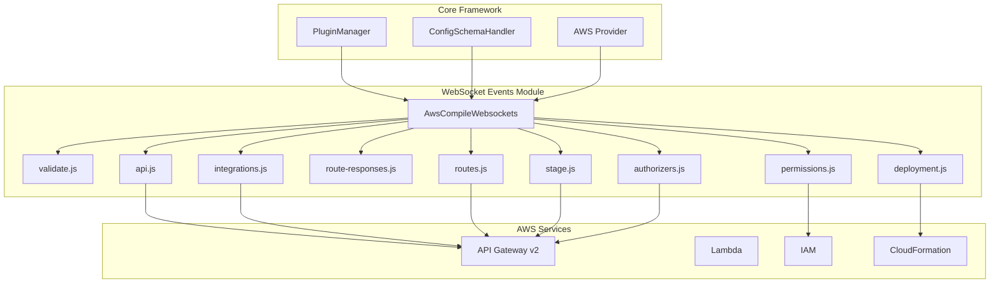
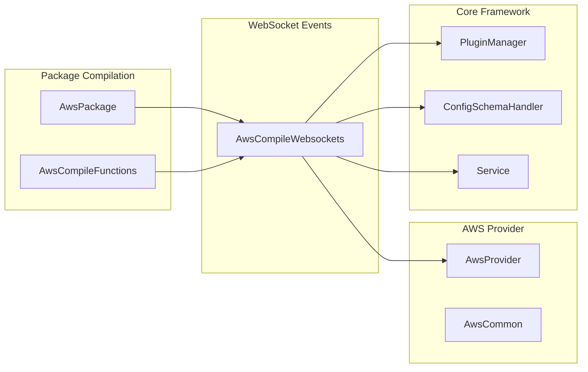
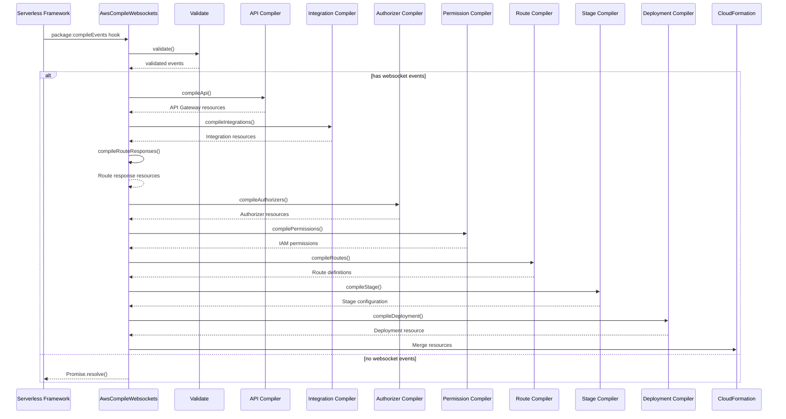
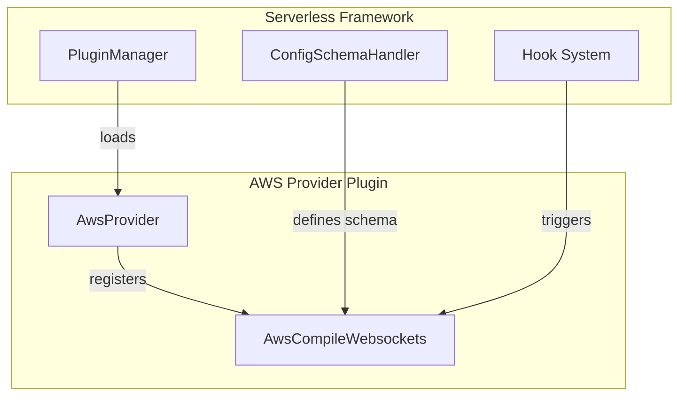
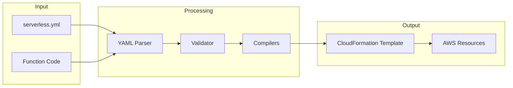

# WebSocket Events Module Documentation

## Introduction

The WebSocket Events module is a specialized component within the AWS provider plugin system that handles the compilation and configuration of WebSocket API events for serverless applications. This module transforms WebSocket event definitions in the `serverless.yml` configuration into AWS CloudFormation resources, enabling real-time bidirectional communication between clients and serverless functions through AWS API Gateway WebSocket APIs.

## Module Overview

The WebSocket Events module (`lib.plugins.aws.package.compile.events.websockets.index.AwsCompileWebsockets`) is responsible for:
- Validating WebSocket event configurations
- Compiling WebSocket API Gateway resources
- Creating integrations between WebSocket routes and Lambda functions
- Configuring route responses and authorizers
- Setting up necessary IAM permissions
- Managing WebSocket deployment and stage configurations

## Architecture

### Component Structure



### Module Dependencies



## Core Components

### AwsCompileWebsockets Class

The main orchestrator class that coordinates the compilation of WebSocket events into AWS resources.

**Key Responsibilities:**
- Event validation and schema definition
- Orchestration of compilation phases
- Integration with the serverless framework lifecycle
- CloudFormation template generation

**Constructor Parameters:**
- `serverless`: Serverless framework instance
- `options`: Command-line options

**Hook Integration:**
- `package:compileEvents`: Main compilation hook triggered during the package phase

## Compilation Process Flow



## Event Configuration Schema

The module defines a comprehensive schema for WebSocket event configuration:

```yaml
functions:
  myFunction:
    handler: handler.websocket
    events:
      - websocket:
          route: $connect
          authorizer:
            name: authFunction
            identitySource:
              - route.request.header.Authorization
          routeResponseSelectionExpression: $default
```

### Schema Definition

```javascript
{
  anyOf: [
    { type: 'string' },  // Simple route name
    {
      type: 'object',
      properties: {
        route: { type: 'string' },  // Required route name
        routeResponseSelectionExpression: {
          const: '$default',
        },
        authorizer: {
          anyOf: [
            { $ref: '#/definitions/awsArnString' },
            { $ref: '#/definitions/functionName' },
            {
              type: 'object',
              properties: {
                name: { $ref: '#/definitions/functionName' },
                arn: { $ref: '#/definitions/awsArn' },
                identitySource: {
                  type: 'array',
                  items: { type: 'string' },
                },
              },
              anyOf: [{ required: ['name'] }, { required: ['arn'] }],
              additionalProperties: false,
            },
          ],
        },
      },
      required: ['route'],
      additionalProperties: false,
    },
  ],
}
```

## Integration with Serverless Framework

### Plugin Registration

The WebSocket Events module integrates with the serverless framework through the plugin system:



### Lifecycle Integration

The module hooks into the serverless package lifecycle:

1. **Configuration Phase**: Schema definition and validation setup
2. **Package Phase**: WebSocket event compilation triggered
3. **Deployment Phase**: CloudFormation resources deployed to AWS

## Data Flow



## Error Handling

The module implements comprehensive error handling:

- **Validation Errors**: Schema validation failures with detailed messages
- **Compilation Errors**: Resource compilation issues with context
- **AWS Errors**: Provider-specific error handling and retry logic

## Security Considerations

### IAM Permissions

The module automatically generates necessary IAM permissions:
- Lambda function invocation permissions
- API Gateway management permissions
- CloudFormation stack permissions

### Authorizer Support

WebSocket routes can be protected using:
- Lambda authorizers
- IAM authorizers
- Custom authorization logic

## Performance Optimization

### Compilation Efficiency

- Lazy loading of compilation modules
- Parallel processing where possible
- Caching of validated configurations

### Resource Optimization

- Minimal CloudFormation template generation
- Reuse of existing AWS resources when possible
- Efficient IAM policy creation

## Testing Strategy

### Unit Testing

- Individual compiler function testing
- Schema validation testing
- Error condition testing

### Integration Testing

- End-to-end compilation testing
- CloudFormation template validation
- AWS resource creation verification

## Related Modules

The WebSocket Events module interacts with several other modules in the system:

- **[aws-provider](aws-provider.md)**: Core AWS provider functionality
- **[aws-package-compile](aws-package-compile.md)**: General package compilation
- **[api-gateway-events](api-gateway-events.md)**: REST API event handling
- **[http-api-events](http-api-events.md)**: HTTP API event handling
- **[core-framework](core-framework.md)**: Core serverless framework components

## Best Practices

### Configuration

1. **Route Naming**: Use descriptive route names that follow WebSocket conventions
2. **Authorizer Setup**: Implement proper authentication for sensitive routes
3. **Response Handling**: Configure appropriate route responses

### Performance

1. **Function Optimization**: Keep WebSocket handler functions lightweight
2. **Connection Management**: Implement proper connection lifecycle management
3. **Error Handling**: Handle WebSocket connection errors gracefully

### Security

1. **Authorization**: Always use authorizers for production WebSocket APIs
2. **Input Validation**: Validate all incoming WebSocket messages
3. **Rate Limiting**: Implement appropriate rate limiting for WebSocket connections

## Troubleshooting

### Common Issues

1. **Route Conflicts**: Ensure unique route names across all functions
2. **Authorizer Errors**: Verify authorizer function permissions and configuration
3. **Deployment Failures**: Check CloudFormation template syntax and AWS limits

### Debug Information

Enable debug logging to trace compilation issues:
```bash
SLS_DEBUG=* serverless package
```

## Future Enhancements

### Planned Features

- Enhanced WebSocket route testing capabilities
- Improved authorizer integration
- Better error reporting and diagnostics

### Potential Improvements

- WebSocket connection pooling optimization
- Advanced routing capabilities
- Integration with AWS WebSocket API v2 features