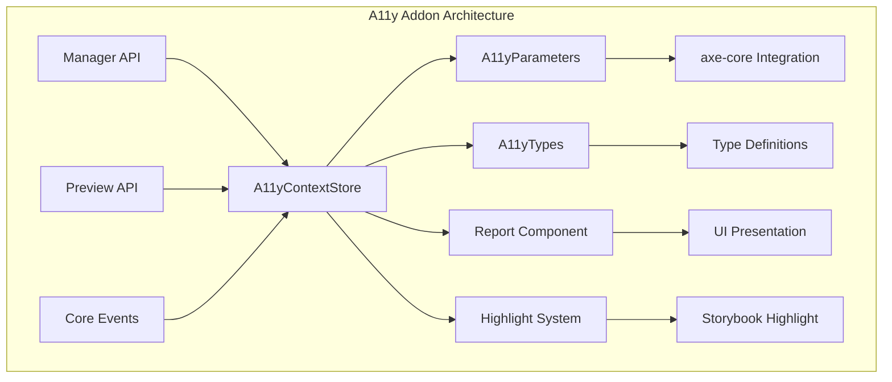
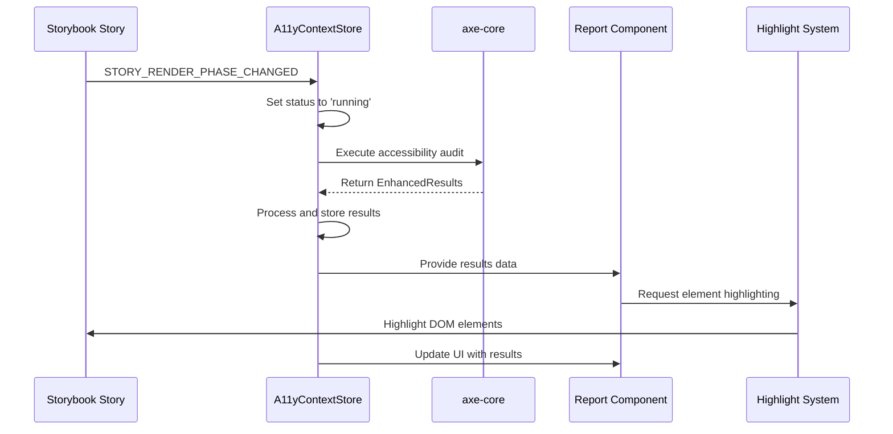

# Accessibility (A11y) Addon Documentation

## Introduction

The Accessibility (A11y) Addon is a Storybook addon that provides automated accessibility testing capabilities for components and stories. It integrates with axe-core to perform comprehensive accessibility audits and presents the results in an intuitive interface within Storybook's addon panel. The addon helps developers identify and fix accessibility issues early in the development process, ensuring that components meet WCAG guidelines and are usable by people with disabilities.

## Architecture Overview

The A11y Addon follows a modular architecture with clear separation of concerns:



## Core Components

### A11yContextStore

The `A11yContextStore` is the central state management component that orchestrates all accessibility testing functionality. It manages the complete lifecycle of accessibility audits, from initialization to result presentation.

**Key Responsibilities:**
- State management for accessibility test results
- Coordination with Storybook's event system
- Integration with axe-core for automated testing
- Highlighting system for visual feedback
- Manual testing trigger management

**State Management:**
```typescript
interface A11yContextStore {
  parameters: A11yParameters;
  results: EnhancedResults | undefined;
  highlighted: boolean;
  toggleHighlight: () => void;
  tab: RuleType;
  handleCopyLink: (key: string) => void;
  setTab: (type: RuleType) => void;
  status: Status;
  setStatus: (status: Status) => void;
  error: unknown;
  handleManual: () => void;
  discrepancy: TestDiscrepancy;
  selectedItems: Map<string, string>;
  toggleOpen: (event: React.SyntheticEvent<Element>, type: RuleType, item: EnhancedResult) => void;
  allExpanded: boolean;
  handleCollapseAll: () => void;
  handleExpandAll: () => void;
  handleJumpToElement: (target: string) => void;
  handleSelectionChange: (key: string) => void;
}
```

### A11yParameters

The `A11yParameters` component defines the configuration interface for accessibility testing, providing fine-grained control over axe-core behavior.

**Configuration Options:**
```typescript
interface A11yParameters {
  context?: ContextSpecWithoutNode;
  options?: RunOptions;
  config?: Spec;
  disable?: boolean;
  test?: A11yTest;
}
```

**Key Features:**
- Context specification for targeted testing
- axe-core options configuration
- Test execution control (off/todo/error)
- Disable functionality for specific stories

### A11yTypes

The `A11yTypes` component provides comprehensive type definitions for the addon's data structures and interfaces.

**Type System:**
```typescript
interface A11yTypes {
  parameters: A11yParameters;
  globals: A11yGlobals;
}

enum RuleType {
  VIOLATION = 'violations',
  PASS = 'passes',
  INCOMPLETION = 'incomplete'
}
```

**Enhanced Results:**
- Extended axe-core results with additional metadata
- Link path integration for documentation
- Structured data for UI presentation

### Report Component

The `Report` component is responsible for presenting accessibility test results in a user-friendly format within the addon panel.

**Features:**
- Collapsible result items with detailed information
- Impact level visualization (minor, moderate, serious, critical)
- Interactive element highlighting
- Expand/collapse all functionality
- Empty state handling

## Data Flow Architecture



## Integration Points

### Manager API Integration

The addon integrates with Storybook's Manager API for:
- Global state management
- Parameter access
- Event channel communication
- Status store integration

### Preview API Integration

Integration with the Preview API enables:
- Story lifecycle event handling
- Reporter system integration
- Cross-frame communication
- Test result processing

### Highlight System Integration

The addon leverages Storybook's highlight system for:
- Visual indication of accessibility issues
- Interactive element selection
- Contextual menu integration
- Color-coded feedback based on impact level

## Testing Modes

### Automated Testing

The addon automatically runs accessibility tests when:
- Stories are loaded or changed
- Hot module replacement occurs
- Manual refresh is triggered

### Manual Testing

Manual testing mode provides:
- User-controlled test execution
- On-demand accessibility audits
- Preservation of existing results
- Integration with development workflow

## Error Handling and Discrepancies

### Error States

The addon handles various error conditions:
- axe-core execution errors
- Configuration validation errors
- Network-related issues
- Component test integration errors

### Test Discrepancies

The system identifies and reports discrepancies between:
- CLI test results and browser test results
- Different testing environments
- Manual and automated test modes

## Configuration and Customization

### Story-Level Configuration

```typescript
export default {
  title: 'Components/Button',
  parameters: {
    a11y: {
      config: {
        rules: [
          { id: 'color-contrast', enabled: false }
        ]
      },
      options: {
        runOnly: ['wcag2a', 'wcag2aa']
      }
    }
  }
};
```

### Global Configuration

Global settings can be configured through:
- Storybook configuration files
- Global parameters
- Environment-specific settings

## Dependencies

The A11y Addon relies on several key dependencies:

- **[axe-core](https://github.com/dequelabs/axe-core)**: Core accessibility testing engine
- **[Manager API](manager_api_and_ui.md)**: Storybook's manager-level APIs
- **[Preview API](preview_api.md)**: Storybook's preview-level APIs
- **[Core UI Library](core_ui_library.md)**: Shared UI components
- **[Highlight System](core_addon_types.md)**: Element highlighting functionality

## Best Practices

### Performance Optimization

- Use context parameters to limit test scope
- Configure appropriate axe-core options
- Leverage manual mode for development
- Implement selective testing strategies

### Result Interpretation

- Understand impact levels and their significance
- Review both violations and incomplete results
- Consider user experience implications
- Implement appropriate remediation strategies

### Integration Workflow

- Incorporate into CI/CD pipelines
- Establish accessibility standards
- Train team on accessibility principles
- Regular audit and review processes

## Troubleshooting

### Common Issues

1. **Tests not running**: Check manual mode settings
2. **Incomplete results**: Verify axe-core configuration
3. **Highlight not working**: Inspect highlight system integration
4. **Performance issues**: Optimize test scope and frequency

### Debug Information

The addon provides detailed status information:
- Current testing status
- Error messages and stack traces
- Configuration validation results
- Integration health indicators

## Future Enhancements

Potential areas for improvement include:
- Enhanced reporting capabilities
- Integration with additional testing tools
- Performance optimization features
- Advanced filtering and search options
- Custom rule development support