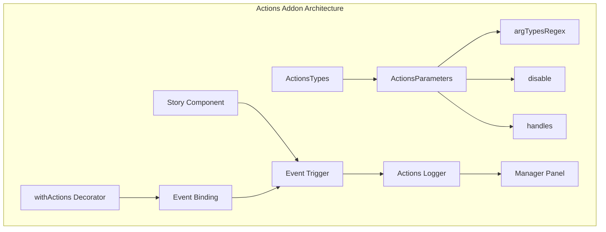
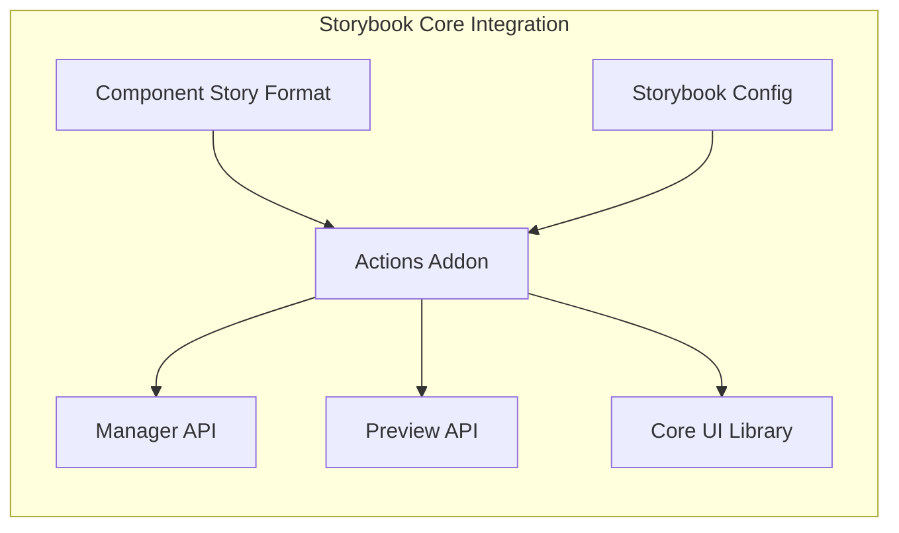
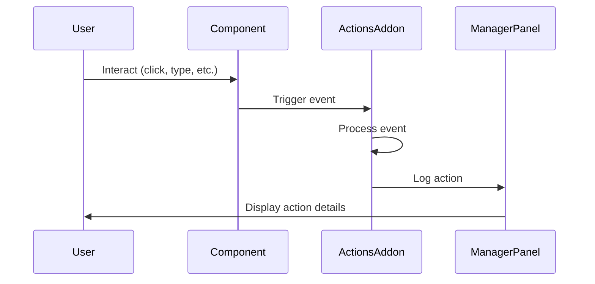
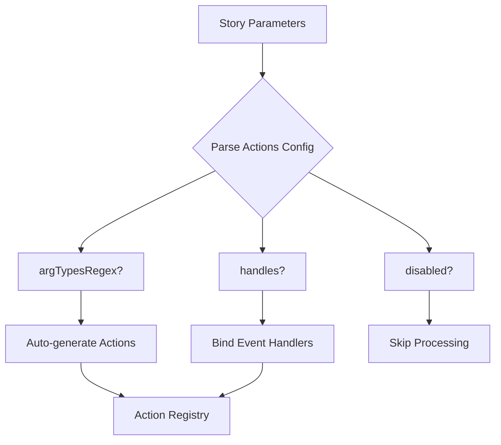

# Actions Addon Module Documentation

## Introduction

The Actions addon is a core Storybook addon that provides event tracking and action logging functionality for component stories. It enables developers to monitor and debug component interactions by capturing and displaying events, function calls, and user actions in a centralized panel within the Storybook interface.

## Overview

The Actions addon serves as an essential debugging and development tool that automatically detects and logs component events, making it easier to understand component behavior and interaction patterns during development and testing phases.

## Architecture

### Core Architecture



### Component Integration



## Core Components

### ActionsTypes

The primary interface that defines the structure and configuration options for the Actions addon.

**Location**: `code.core.src.actions.types.ActionsTypes`

**Purpose**: Provides type definitions and configuration parameters for action logging functionality.

### ActionsParameters

Configuration interface that controls how actions are captured and displayed.

**Properties**:
- `argTypesRegex`: Pattern matching for automatic action creation
- `disable`: Toggle to enable/disable the addon
- `handles`: Array of event handlers to bind to components

## Key Features

### 1. Automatic Action Detection

The addon can automatically detect and create actions based on prop names matching specified regex patterns.

```typescript
// Example configuration
parameters: {
  actions: {
    argTypesRegex: '^on.*' // Automatically create actions for props starting with 'on'
  }
}
```

### 2. Manual Event Handling

Developers can explicitly define which events to track using the `handles` configuration.

```typescript
// Example configuration
parameters: {
  actions: {
    handles: ['click', 'mouseover .button', 'focus input']
  }
}
```

### 3. withActions Decorator

The `withActions` decorator enables advanced event binding capabilities for HTML elements.

## Data Flow

### Action Capture Flow



### Configuration Processing



## Integration Points

### Manager API Integration

The Actions addon integrates with the Manager API to provide the user interface for action logging:

- **Sidebar Integration**: Displays action logs in a dedicated panel
- **Explorer Integration**: Shows action history and details
- **Settings Integration**: Provides configuration options

### Preview API Integration

Integration with the Preview API enables:

- **Event Capture**: Real-time event monitoring in the preview iframe
- **Action Dispatch**: Communication between preview and manager
- **State Synchronization**: Keeping action logs synchronized

### Core UI Library Dependencies

The addon utilizes core UI components:

- **Button Components**: For action replay functionality
- **Bar Components**: For action panel layout
- **Tooltip Components**: For action details display
- **Tabs Components**: For organizing different action views

## Configuration Options

### Basic Configuration

```typescript
// storybook/preview.js
export const parameters = {
  actions: {
    argTypesRegex: '^on[A-Z].*',
    handles: ['click', 'change']
  }
}
```

### Advanced Configuration

```typescript
// storybook/preview.js
export const parameters = {
  actions: {
    argTypesRegex: '^on.*',
    handles: [
      'click .btn-primary',
      'mouseover .tooltip-trigger',
      'focus input[type="text"]'
    ]
  }
}
```

### Disabling Actions

```typescript
// storybook/preview.js
export const parameters = {
  actions: {
    disable: true
  }
}
```

## Usage Patterns

### 1. Component Development

Use actions to debug component behavior during development:

```typescript
export default {
  title: 'Button',
  component: Button,
  parameters: {
    actions: {
      handles: ['click']
    }
  }
}
```

### 2. Event Testing

Verify that components emit expected events:

```typescript
export const Primary = {
  parameters: {
    actions: {
      handles: ['click', 'focus', 'blur']
    }
  }
}
```

### 3. Interactive Documentation

Create interactive examples that show event handling:

```typescript
export const Interactive = {
  parameters: {
    actions: {
      argTypesRegex: '^on.*'
    }
  }
}
```

## Best Practices

### 1. Regex Pattern Usage

- Use specific patterns to avoid capturing unintended props
- Test patterns thoroughly with your component library
- Document the patterns used in your project

### 2. Event Handler Configuration

- Be specific with CSS selectors to target the right elements
- Use semantic class names for better maintainability
- Consider performance impact of too many event handlers

### 3. Performance Considerations

- Disable actions in production builds when not needed
- Use specific event handlers instead of broad patterns when possible
- Clean up event listeners properly

## Dependencies

### Core Dependencies

- **Manager API**: For UI panel integration ([manager_api_and_ui.md](manager_api_and_ui.md))
- **Preview API**: For event capture functionality ([preview_api.md](preview_api.md))
- **Core UI Library**: For panel components ([core_ui_library.md](core_ui_library.md))
- **Component Story Format**: For story integration ([component_story_format.md](component_story_format.md))

### Related Addon Types

The Actions addon is part of the core addon types system ([core_addon_types.md](core_addon_types.md)), which includes:

- Backgrounds addon
- Viewport addon
- Controls addon
- Outline addon
- Measure addon
- Themes addon

## Troubleshooting

### Common Issues

1. **Actions not appearing**: Check if the addon is properly configured
2. **Too many actions**: Refine regex patterns or use specific handles
3. **Performance issues**: Reduce the number of tracked events
4. **Events not captured**: Verify event handler configuration

### Debug Steps

1. Verify addon is enabled in configuration
2. Check browser console for errors
3. Validate event handler selectors
4. Test with simple configurations first

## Extension Points

### Custom Action Processors

Developers can extend the Actions addon by:

- Creating custom action formatters
- Adding new event types
- Implementing custom display modes
- Integrating with external logging systems

### Integration with Testing

The Actions addon can be integrated with:

- Play functions for automated testing
- Visual regression testing
- Accessibility testing
- Performance monitoring

## Migration Guide

### From Manual Logging

Replace manual console.log statements with action parameters:

```typescript
// Before
const handleClick = (e) => {
  console.log('Button clicked', e);
};

// After
// Configure actions to capture automatically
```

### Version Compatibility

The Actions addon maintains backward compatibility across Storybook versions while introducing new features and improvements.

## Conclusion

The Actions addon is a fundamental tool in the Storybook ecosystem that enhances the development experience by providing transparent event tracking and debugging capabilities. Its flexible configuration options and seamless integration with the Storybook architecture make it an essential addon for component-driven development workflows.