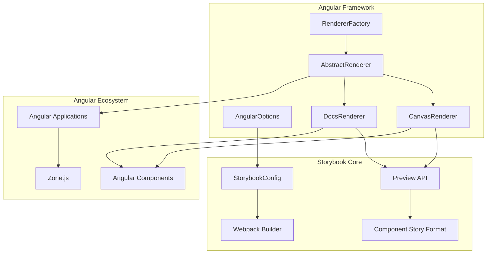
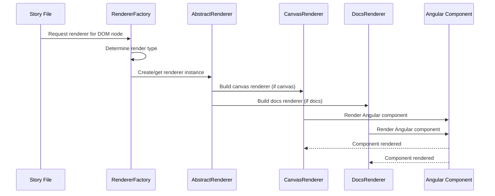

# Angular Framework for Storybook

## Overview

The Angular framework module provides Storybook with the capability to render and manage Angular components within the Storybook environment. It serves as a bridge between Storybook's core functionality and Angular's component architecture, enabling developers to create, document, and test Angular components in isolation.

## Architecture

The Angular framework integrates with Storybook's modular architecture through several key integration points:



## Core Components

### AngularOptions

The `AngularOptions` interface defines the configuration options specific to the Angular framework. Currently, it supports:

- `enableIvy?: boolean` - Controls whether Angular's Ivy renderer is enabled

This interface is integrated with Storybook's main configuration through the `StorybookConfig` type, which combines Angular-specific options with general Storybook configuration and Webpack builder settings.

### RendererFactory

The `RendererFactory` is a central component that manages the creation and lifecycle of Angular renderers. It implements a factory pattern to provide appropriate renderer instances based on the render context:

- **Canvas Renderer**: Used for rendering components in the main Storybook canvas
- **Docs Renderer**: Used for rendering components within documentation pages

The factory maintains a cache of renderer instances and handles cleanup when switching between different render types.

## Integration with Storybook Modules

The Angular framework integrates with several Storybook modules:

### Storybook Configuration
- Extends the base `StorybookConfig` with Angular-specific options
- Integrates with the Webpack builder for proper module resolution
- Supports TypeScript configuration for Angular projects

### Component Story Format (CSF)
- Leverages CSF for defining Angular component stories
- Supports Angular's input/output bindings through Storybook args
- Integrates with Storybook's type system for proper inference

### Preview API
- Uses the Preview API to render Angular components in isolation
- Supports both canvas and docs rendering modes
- Integrates with Storybook's addon ecosystem

### Package Manager Abstraction
- Works with various package managers (npm, yarn, pnpm, bun) through the abstraction layer
- Ensures proper Angular dependency management

## Sub-modules

The Angular framework module consists of several interconnected sub-modules:

### [Storybook Configuration](storybook_configuration.md)
Manages the overall Storybook setup, including builder configuration, TypeScript settings, and framework integration. This module provides the foundation for configuring Storybook with Angular-specific options and integrates with the Webpack builder for proper module resolution.

### [Component Story Format](component_story_format.md)
Handles the story definition format, type system, and component metadata for Angular stories. This module defines how Angular components are structured as stories and provides the type system that enables proper inference of component properties and args.

### [Preview API](preview_api.md)
Manages the rendering pipeline and component lifecycle within the Storybook preview environment. This module is responsible for rendering Angular components in the preview iframe and handling the communication between the manager and preview contexts.

### [Package Manager Abstraction](package_manager_abstraction.md)
Handles dependency management and package installation across different package managers (npm, yarn, pnpm, bun). This module ensures that Angular dependencies and Storybook addons are properly managed regardless of the package manager used in the project.

### [Webpack Builder](webpack_builder.md)
Manages the build process and module bundling for Angular applications within Storybook. This module configures Webpack to properly handle Angular's module system, TypeScript compilation, and component templates.

## Renderer Architecture



## Key Features

### Angular Ivy Support
The framework provides optional support for Angular's Ivy renderer, allowing developers to leverage the latest Angular features and optimizations.

### Dual Rendering Modes
Supports both canvas rendering for interactive component development and docs rendering for documentation generation.

### Application Lifecycle Management
Properly manages Angular application bootstrapping and teardown to prevent memory leaks and ensure clean state between story renders.

### TypeScript Integration
Full TypeScript support with proper type inference for Angular components, inputs, outputs, and services.

## Usage

The Angular framework is configured in the Storybook main configuration file:

```typescript
// .storybook/main.ts
import type { StorybookConfig } from '@storybook/angular';

const config: StorybookConfig = {
  framework: {
    name: '@storybook/angular',
    options: {
      enableIvy: true,
      builder: {
        // Webpack builder options
      }
    }
  },
  stories: ['../src/**/*.stories.ts'],
  addons: [
    '@storybook/addon-essentials',
    '@storybook/addon-docs'
  ]
};

export default config;
```

## Dependencies

The Angular framework module depends on:
- `@storybook/builder-webpack5` for build tooling
- `@storybook/core-webpack` for core Webpack integration
- Angular framework packages for component rendering
- TypeScript for type safety and compilation