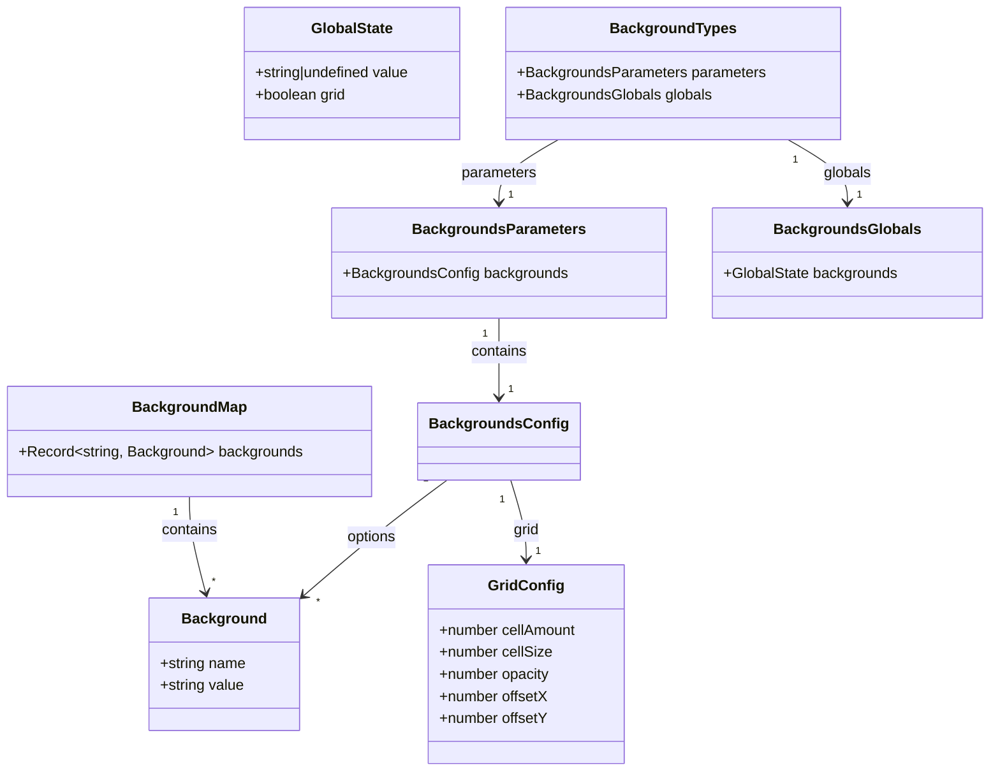
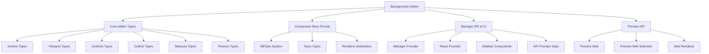
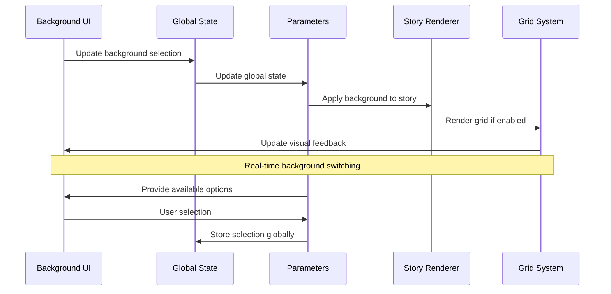
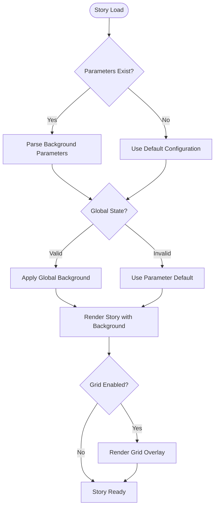

# Backgrounds Addon Module Documentation

## Introduction

The Backgrounds Addon is a core Storybook addon that provides visual background customization capabilities for component stories. It enables developers to test their components against different background colors and patterns, ensuring components remain visible and accessible across various visual contexts. This addon is essential for building robust UI components that work well in different themes and environments.

## Module Overview

The Backgrounds Addon is part of Storybook's essential addons collection, providing a simple yet powerful interface for switching between predefined background options while viewing stories. It integrates seamlessly with Storybook's parameter and global state systems, allowing both story-level and global background configuration.

## Core Architecture

### Type System Architecture



### Module Dependencies



## Core Components

### BackgroundTypes Interface

The `BackgroundTypes` interface serves as the main type definition for the backgrounds addon, extending Storybook's core type system. It defines the structure for parameters and globals used by the addon.

```typescript
export interface BackgroundTypes {
  parameters: BackgroundsParameters;
  globals: BackgroundsGlobals;
}
```

### Background Configuration

#### Background Interface
Defines individual background options with a human-readable name and CSS-compatible value.

```typescript
export interface Background {
  name: string;  // Display name in UI
  value: string; // CSS color value or gradient
}
```

#### Grid Configuration
Provides customizable grid overlay settings for precise component alignment and spacing verification.

```typescript
export interface GridConfig {
  cellAmount: number; // Number of grid cells
  cellSize: number;   // Size of each cell in pixels
  opacity: number;    // Grid transparency (0-1)
  offsetX?: number;   // Horizontal offset
  offsetY?: number;   // Vertical offset
}
```

### Parameters and Globals

#### BackgroundsParameters
Defines story-level configuration through Storybook's parameters API.

```typescript
export interface BackgroundsParameters {
  backgrounds?: {
    default?: string;        // Default background name/value
    disable?: boolean;       // Disable addon for this story
    grid?: GridConfig;       // Grid configuration
    options?: BackgroundMap; // Available backgrounds
  };
}
```

#### BackgroundsGlobals
Manages global state for background selection across stories.

```typescript
export interface BackgroundsGlobals {
  [PARAM_KEY]?: GlobalState | GlobalState['value'];
}
```

## Data Flow Architecture



## Integration Points

### Storybook Core Integration

The backgrounds addon integrates with Storybook's core systems through:

1. **Parameter System**: Story-level configuration via `backgrounds` parameter
2. **Global State**: User selections persisted across stories
3. **Addon API**: Panel registration and UI integration
4. **Preview Integration**: Background application to story canvas

### Component Story Format (CSF) Integration

The addon leverages CSF's type system for:
- Story parameter typing
- Global state management
- Renderer abstraction
- Type-safe configuration

### Manager API Integration

Integration with Storybook's manager provides:
- Sidebar panel registration
- UI component theming
- Keyboard shortcuts
- Settings persistence

## Usage Patterns

### Basic Configuration

```typescript
// Story-level configuration
export default {
  title: 'Components/Button',
  parameters: {
    backgrounds: {
      default: 'dark',
      options: {
        dark: { name: 'Dark', value: '#1a1a1a' },
        light: { name: 'Light', value: '#ffffff' }
      }
    }
  }
}
```

### Grid Configuration

```typescript
// Grid overlay for alignment testing
parameters: {
  backgrounds: {
    grid: {
      cellAmount: 5,
      cellSize: 20,
      opacity: 0.5
    }
  }
}
```

### Global Configuration

```typescript
// Global backgrounds for all stories
export const globalTypes = {
  backgrounds: {
    default: 'light',
    options: [
      { name: 'Light', value: '#ffffff' },
      { name: 'Dark', value: '#000000' }
    ]
  }
}
```

## Process Flow



## Related Modules

- [core_addon_types.md](core_addon_types.md) - Base type definitions for all Storybook addons
- [component_story_format.md](component_story_format.md) - Story format and parameter system
- [manager_api_and_ui.md](manager_api_and_ui.md) - UI integration and panel management
- [preview_api.md](preview_api.md) - Story rendering and canvas integration

## Best Practices

### Configuration Guidelines

1. **Color Selection**: Choose colors that represent your application's theme variants
2. **Naming Conventions**: Use descriptive names that indicate the background's purpose
3. **Accessibility**: Include high-contrast options for accessibility testing
4. **Grid Usage**: Use grid overlays for precise component alignment verification

### Performance Considerations

- Background changes are applied via CSS for optimal performance
- Grid rendering is optimized for minimal impact on story rendering
- Global state updates are debounced to prevent excessive re-renders

### Testing Scenarios

The backgrounds addon is particularly useful for:
- **Theme Testing**: Verify component visibility across light/dark themes
- **Accessibility Testing**: Ensure sufficient contrast ratios
- **Responsive Testing**: Test components against different background contexts
- **Design System Validation**: Confirm component consistency across brand colors

## API Reference

### Types

- `BackgroundTypes` - Main type interface
- `Background` - Individual background definition
- `BackgroundMap` - Collection of backgrounds
- `GridConfig` - Grid overlay configuration
- `BackgroundsParameters` - Story parameters
- `BackgroundsGlobals` - Global state interface

### Constants

- `PARAM_KEY` - Parameter key for backgrounds configuration

## Troubleshooting

### Common Issues

1. **Background Not Applied**: Check parameter configuration and global state
2. **Grid Not Visible**: Verify grid opacity and cell size settings
3. **Performance Issues**: Reduce number of background options or grid complexity

### Debug Steps

1. Verify parameter structure matches `BackgroundsParameters` interface
2. Check global state initialization
3. Validate CSS background application in browser dev tools
4. Review addon panel for UI state consistency