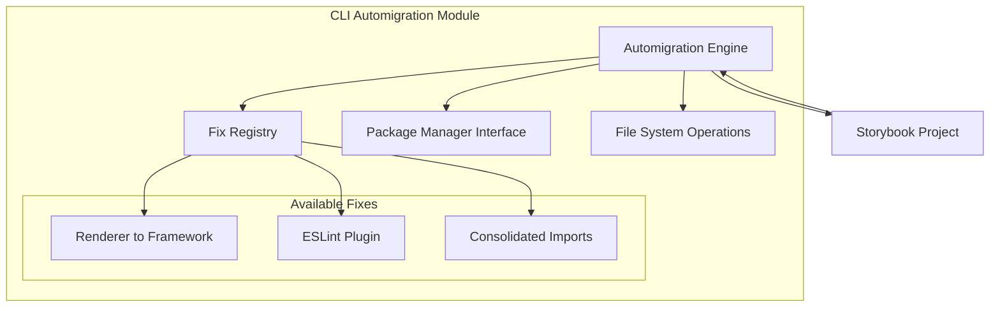
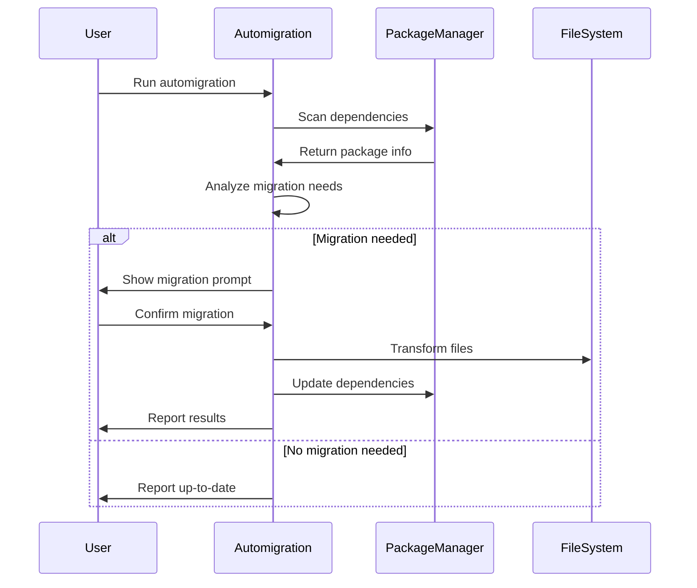

# CLI Automigration Module

## Overview

The CLI Automigration module is a critical component of the Storybook ecosystem that provides automated migration capabilities to help users upgrade their Storybook configurations and dependencies. This module analyzes existing Storybook setups and automatically applies necessary transformations to keep projects up-to-date with the latest Storybook standards and best practices.

## Purpose

The primary purpose of the CLI Automigration module is to:
- Automate the migration process from older Storybook versions to newer ones
- Transform deprecated configurations and imports to their modern equivalents
- Reduce manual effort required for Storybook upgrades
- Ensure consistency across Storybook projects during version transitions

## Architecture

The module follows a plugin-based architecture where each migration is implemented as a separate "fix" that can be automatically detected and applied. The architecture consists of:

## Core Components

### 1. Renderer to Framework Migration
**File**: `renderer-to-framework.ts`

This component handles the migration from renderer-based to framework-based configuration, which is a significant architectural change in Storybook. It:
- Detects deprecated renderer packages in dependencies
- Transforms import statements from renderer packages to framework packages
- Updates package.json files to remove old renderer dependencies
- Supports multiple package.json files in monorepo setups

**Key Features**:
- Automatic detection of frameworks and renderers
- Batch file transformation with error handling
- Support for dry-run mode
- Concurrent processing with rate limiting

**Detailed Documentation**: [renderer-to-framework.md](renderer-to-framework.md)

### 2. ESLint Plugin Integration
**File**: `eslint-plugin.ts`

This component automates the installation and configuration of the Storybook ESLint plugin. It:
- Detects if ESLint is present in the project
- Checks for existing Storybook ESLint plugin installation
- Installs the plugin with appropriate version matching
- Configures the plugin based on the project's ESLint setup

**Key Features**:
- Support for both legacy and flat ESLint config formats
- Automatic dependency management
- Warning system for unsupported configurations
- Version synchronization with Storybook

**Detailed Documentation**: [eslint-plugin.md](eslint-plugin.md)

### 3. Consolidated Imports Migration
**File**: `consolidated-imports.ts`

This component handles the migration of packages that have been consolidated or renamed in newer Storybook versions. It:
- Scans package.json files for deprecated packages
- Transforms import statements to use new package names
- Updates dependency versions and references
- Handles complex package consolidation scenarios

**Key Features**:
- Comprehensive package mapping system
- Import statement transformation
- Version coordination across consolidated packages
- Error aggregation and reporting

**Detailed Documentation**: [consolidated-imports.md](consolidated-imports.md)

## Data Flow

## Integration with Storybook Ecosystem

The CLI Automigration module integrates with several other Storybook modules:

- **[Package Manager Abstraction](package_manager_abstraction.md)**: Uses the package manager abstraction layer to handle different package managers (npm, yarn, pnpm, bun)
- **[Storybook Configuration](storybook_configuration.md)**: Updates and transforms Storybook configuration files during migrations
- **[Component Story Format](component_story_format.md)**: Transforms story files and CSF imports during migrations

## Migration Process

Each migration follows a standardized process:

1. **Detection Phase**: Scan the project to identify if the migration is needed
2. **Analysis Phase**: Determine the scope and impact of the migration
3. **User Confirmation**: Present the migration details to the user for approval
4. **Execution Phase**: Apply the migration transformations
5. **Verification Phase**: Ensure the migration was successful

## Error Handling

The module implements comprehensive error handling:
- Individual file transformation failures don't stop the entire migration
- Errors are collected and reported at the end of the process
- Dry-run mode allows users to preview changes before applying them
- Rollback mechanisms for failed migrations

## Best Practices

When using the CLI Automigration module:
- Always run in dry-run mode first to preview changes
- Review the migration prompts carefully before confirming
- Keep backups of important configuration files
- Test migrations in development environments before applying to production
- Monitor the migration output for any warnings or errors

## Future Enhancements

The module is designed to be extensible, allowing for:
- Additional migration fixes as Storybook evolves
- Support for custom migration rules
- Integration with CI/CD pipelines
- Enhanced reporting and analytics
- Automated migration scheduling