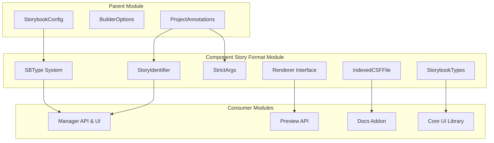
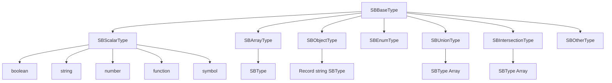
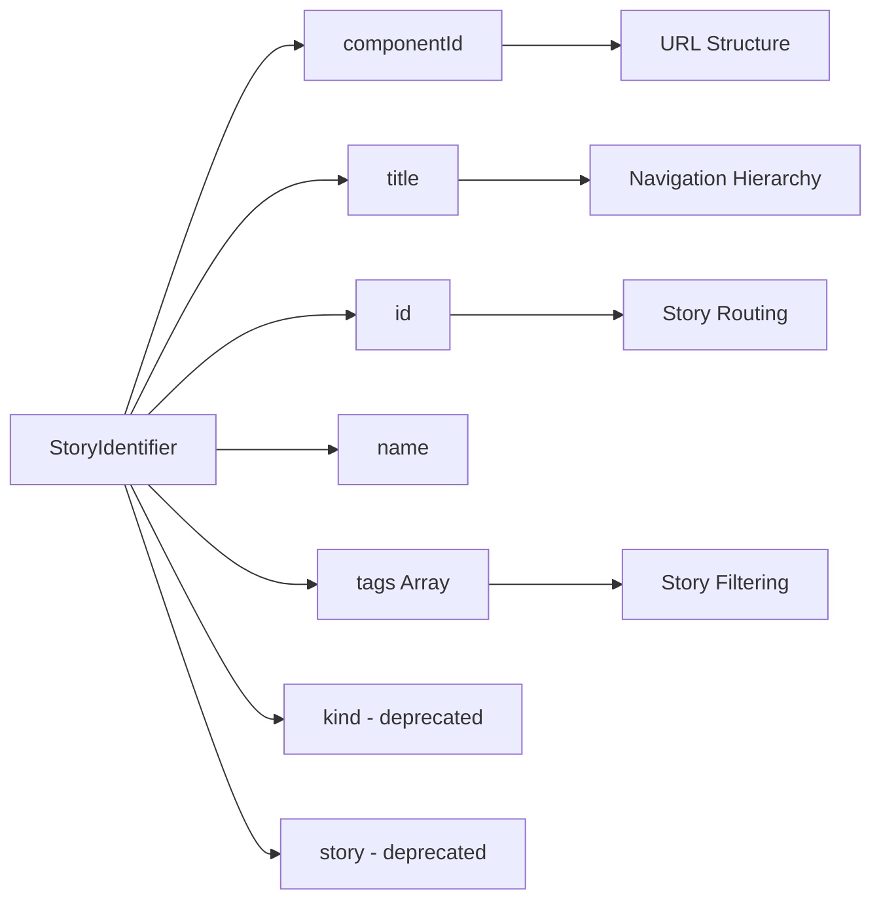
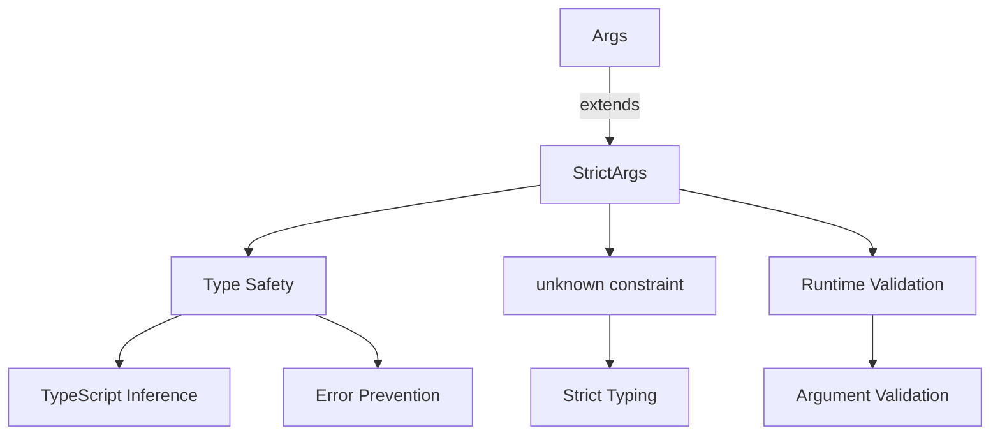
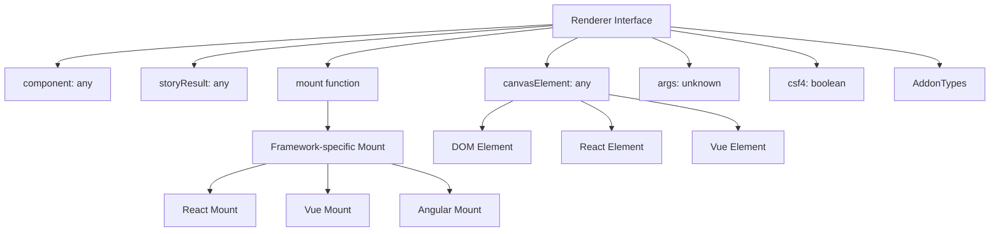
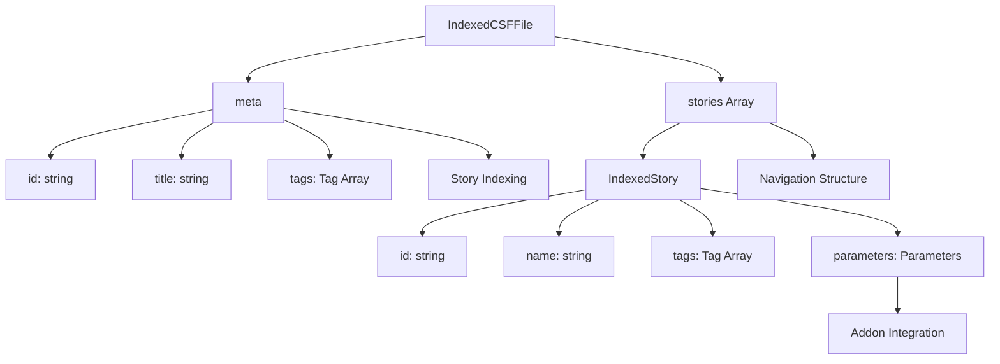
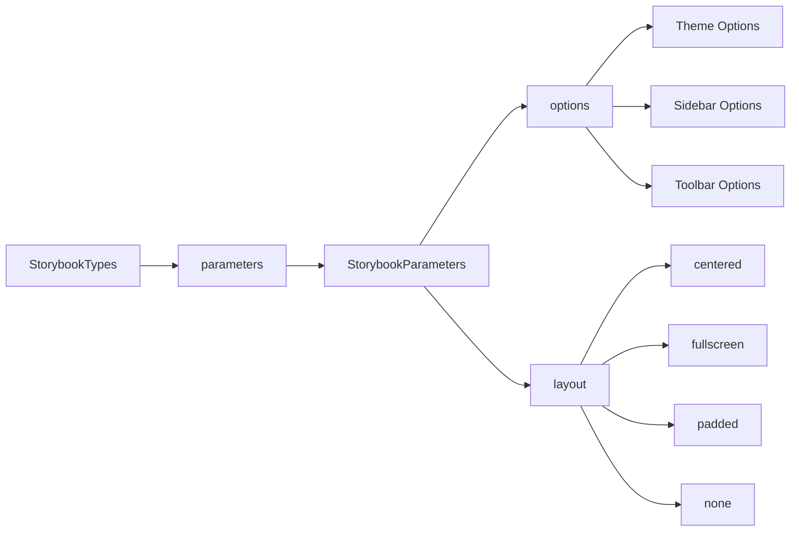
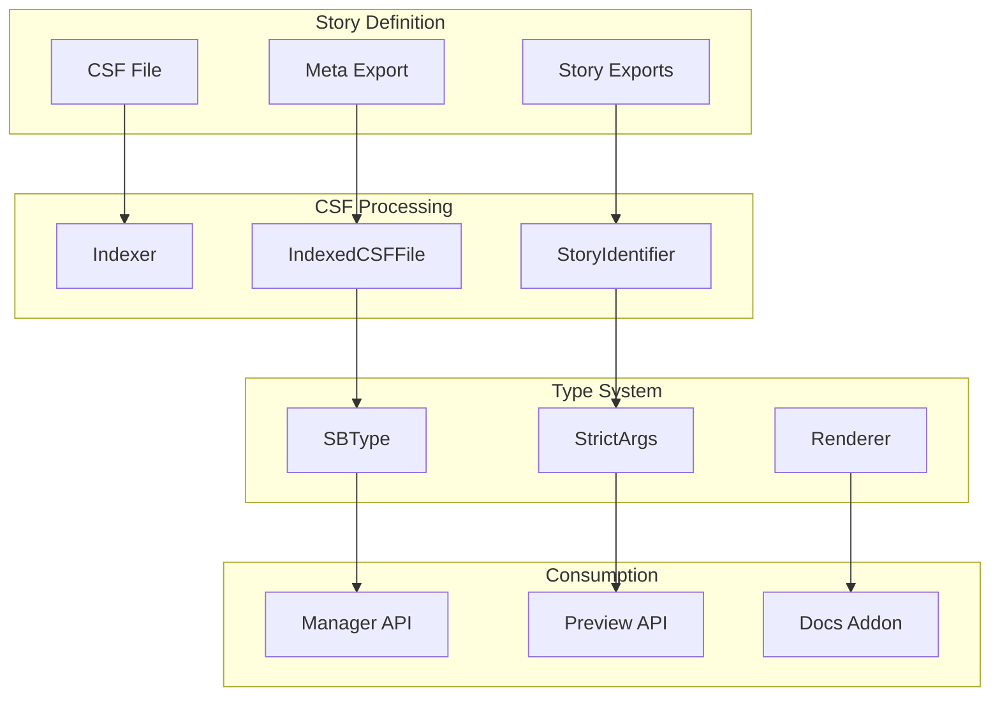

# Component Story Format (CSF) Module

## Introduction

The Component Story Format (CSF) module is the foundational type system and data structure layer of Storybook. It defines the core types, interfaces, and data structures that enable Storybook to understand, process, and render component stories across different frameworks and renderers. CSF provides the standardized format for defining stories, components, and their associated metadata, making it the backbone of Storybook's story management system.

## Architecture Overview

The CSF module serves as the central type definition layer that connects various parts of the Storybook ecosystem. It provides the fundamental building blocks for story identification, type definitions, and renderer abstractions that enable framework-agnostic story handling.



## Core Components

### SBType System

The SBType system provides a comprehensive type definition framework for describing story arguments, component props, and data structures within Storybook. It supports various type categories including scalars, arrays, objects, enums, unions, intersections, and custom types.



**Key Features:**
- **Extensible Type System**: Supports primitive types, complex data structures, and custom types
- **Framework Agnostic**: Works across different component frameworks (React, Vue, Angular, etc.)
- **Runtime Type Information**: Provides metadata for dynamic UI generation and validation
- **Nested Type Support**: Handles complex nested data structures and recursive types

### StoryIdentifier

The StoryIdentifier interface provides a unique identification system for stories within Storybook's navigation and URL structure. It establishes the relationship between components and their stories while maintaining backward compatibility.



**Key Features:**
- **Unique Identification**: Ensures each story has a unique identifier across the application
- **Hierarchical Organization**: Supports nested component structures using title paths
- **Tag-based Filtering**: Enables categorization and filtering of stories
- **URL Compatibility**: Provides stable URLs for story sharing and deep linking
- **Legacy Support**: Maintains backward compatibility with older Storybook versions

### StrictArgs

StrictArgs represents a type-safe approach to story arguments, enforcing stricter type constraints compared to the more permissive Args type. This enhances type safety and reduces runtime errors in TypeScript environments.



**Key Features:**
- **Type Safety**: Enforces strict typing for story arguments
- **Unknown Constraints**: Uses `unknown` type for better type inference
- **Runtime Validation**: Supports runtime argument validation
- **Framework Integration**: Works seamlessly with component prop types

### Renderer Interface

The Renderer interface provides an abstraction layer that allows Storybook to work with different component frameworks and rendering systems. It defines the contract between Storybook's core and framework-specific implementations.



**Key Features:**
- **Framework Abstraction**: Provides a unified interface for different frameworks
- **Flexible Component Types**: Supports any component type through generic typing
- **Mount System**: Defines how components are mounted and rendered
- **Canvas Management**: Handles the rendering canvas for different frameworks
- **CSF4 Compatibility**: Supports both CSF 3.0 and 4.0 formats

### IndexedCSFFile

IndexedCSFFile represents the processed and indexed version of a Component Story Format file, containing metadata and story definitions that have been extracted and organized for efficient access by Storybook's indexing system.



**Key Features:**
- **Efficient Indexing**: Optimized data structure for fast story lookup
- **Metadata Preservation**: Maintains component and story metadata
- **Tag Support**: Enables story categorization and filtering
- **Parameter Storage**: Stores story-specific parameters and configurations
- **Navigation Integration**: Supports hierarchical story organization

### StorybookTypes

StorybookTypes extends the core CSF types with Storybook-specific parameters and configurations, providing additional metadata for UI presentation and behavior customization.



**Key Features:**
- **UI Customization**: Provides parameters for UI behavior and appearance
- **Layout Options**: Supports different story layout configurations
- **Theme Integration**: Enables theme-specific parameter handling
- **Sidebar Configuration**: Controls sidebar behavior and appearance
- **Toolbar Customization**: Manages toolbar options and visibility

## Data Flow

The CSF module facilitates data flow between different parts of the Storybook system through well-defined type interfaces and data structures.



## Integration with Other Modules

### Storybook Configuration Integration
The CSF module integrates with the [storybook_configuration](storybook_configuration.md) module through ProjectAnnotations and core configuration types, providing the type foundation for story and component definitions.

### Manager API Integration
The [manager_api_and_ui](manager_api_and_ui.md) module consumes CSF types for story navigation, sidebar organization, and UI presentation, using StoryIdentifier and IndexedCSFFile for efficient story management.

### Preview API Integration
The [preview_api](preview_api.md) module relies on Renderer interfaces and story types to handle story rendering, argument processing, and framework-specific implementations.

### Docs Addon Integration
The [docs_addon](docs_addon.md) module utilizes SBType system and story annotations to generate documentation, prop tables, and interactive controls for stories.

## Usage Patterns

### Basic Story Definition
```typescript
import type { StoryAnnotations, Renderer } from '@storybook/csf';

interface MyRenderer extends Renderer {
  component: React.ComponentType<any>;
  storyResult: React.ReactElement;
  canvasElement: HTMLElement;
}

const story: StoryAnnotations<MyRenderer, { label: string }> = {
  args: {
    label: 'Hello World'
  },
  parameters: {
    layout: 'centered'
  }
};
```

### Type-Safe Arguments
```typescript
import type { StrictArgs, SBType } from '@storybook/csf';

interface ButtonArgs extends StrictArgs {
  variant: 'primary' | 'secondary';
  size: 'small' | 'medium' | 'large';
  disabled: boolean;
}

const argTypes: StrictArgTypes<ButtonArgs> = {
  variant: {
    type: 'string' as SBScalarType['name'],
    options: ['primary', 'secondary'],
    control: { type: 'select' }
  }
};
```

### Custom Renderer Implementation
```typescript
import type { Renderer } from '@storybook/csf';

interface VueRenderer extends Renderer {
  component: Vue.Component;
  storyResult: Vue.VNode;
  canvasElement: Element;
  mount(): Promise<Canvas>;
}
```

## Best Practices

1. **Type Safety**: Use StrictArgs and StrictArgTypes for better type inference and error prevention
2. **Framework Abstraction**: Leverage the Renderer interface for framework-agnostic story definitions
3. **Consistent Identification**: Maintain consistent story identification patterns using StoryIdentifier
4. **Parameter Organization**: Use well-structured parameters for story configuration and addon integration
5. **Tag Utilization**: Implement meaningful tags for story organization and filtering

## Migration Considerations

When migrating between CSF versions or implementing new features:

- **CSF 4.0 Support**: Ensure compatibility with both CSF 3.0 and 4.0 formats
- **Type Updates**: Update custom types to align with SBType system changes
- **Renderer Compatibility**: Verify renderer implementations support required interface methods
- **Parameter Migration**: Migrate legacy parameters to new structured formats
- **Identifier Changes**: Update story identification patterns while maintaining backward compatibility

This comprehensive type system and data structure foundation enables Storybook to provide a consistent, type-safe, and extensible platform for component development and documentation across multiple frameworks and use cases.