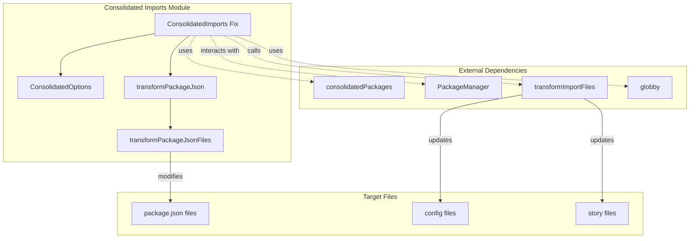
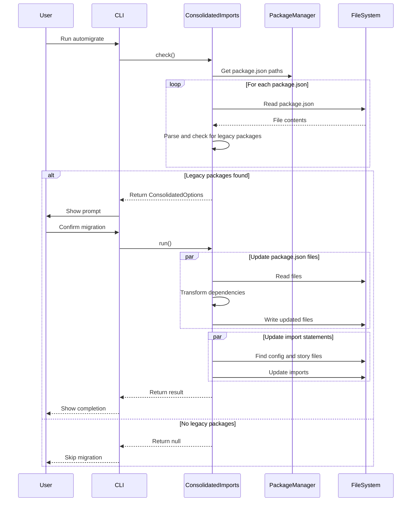
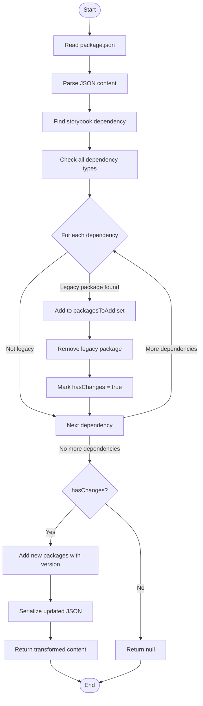

# Consolidated Imports Module

## Introduction

The consolidated-imports module is an automated migration tool within Storybook's CLI that helps users transition from legacy, deprecated Storybook packages to their modern consolidated equivalents. This module is part of Storybook's effort to streamline its package architecture by reducing the number of individual packages while maintaining backward compatibility through automated migration.

## Purpose and Core Functionality

The primary purpose of this module is to:

1. **Detect Legacy Dependencies**: Scan project package.json files to identify deprecated Storybook packages that have been consolidated into newer packages
2. **Automate Package Updates**: Transform package.json files by replacing legacy packages with their consolidated equivalents
3. **Update Import Statements**: Scan and update import statements across the codebase to use the new package names
4. **Ensure Version Consistency**: Maintain version alignment across all Storybook dependencies during the migration process

## Architecture and Component Relationships

### Core Components

#### ConsolidatedOptions Interface
```typescript
export interface ConsolidatedOptions {
  consolidatedDeps: Set<keyof typeof consolidatedPackages>;
}
```

This interface defines the configuration options for the migration process, containing a set of legacy package names that need to be consolidated.

#### Main Migration Fix
The module exports a `Fix<ConsolidatedOptions>` object that implements the standard Storybook migration interface with:
- **id**: 'consolidated-imports' - Unique identifier for this migration
- **link**: Documentation reference for the migration
- **check**: Detection logic to identify affected projects
- **prompt**: User-facing message explaining the migration
- **run**: Execution logic for performing the migration

### Architecture Diagram



## Data Flow and Process Flow

### Migration Process Flow



### Package Transformation Logic



## Key Features and Implementation Details

### 1. Multi-Package.json Support
The module supports monorepo structures by processing all package.json files found in the project, not just the root one. This is handled through the `packageManager.packageJsonPaths` property.

### 2. Dependency Type Preservation
When migrating packages, the module preserves the original dependency type (dependencies, devDependencies, peerDependencies) to maintain the project's dependency structure.

### 3. Version Consistency
The module ensures version consistency by:
- Detecting the existing Storybook version in the project
- Using the same version for all new consolidated packages
- Defaulting to a known version if no Storybook dependency is found

### 4. Comprehensive File Scanning
The migration process scans:
- All package.json files for dependency updates
- Configuration files in the config directory
- Story files for import statement updates

### 5. Error Handling and Reporting
The module implements robust error handling:
- Collects errors from all file operations
- Provides detailed error messages with file paths
- Fails gracefully with comprehensive error reporting

## Integration with Storybook Ecosystem

### Relationship to Other Modules

The consolidated-imports module interacts with several other Storybook modules:

1. **[Package Manager Abstraction](package-manager-abstraction.md)**: Uses the package manager abstraction to handle different package managers (npm, yarn, pnpm, bun) uniformly

2. **[CLI Automigration](cli-automigration.md)**: Part of the broader automigration system that helps users upgrade their Storybook configurations

3. **[Storybook Configuration](storybook_configuration.md)**: Updates configuration files that may contain imports from legacy packages

### Dependency on Consolidated Packages

The module relies on the `consolidatedPackages` mapping (from `../helpers/consolidated-packages`) which defines the relationship between legacy packages and their modern equivalents. This mapping is maintained separately and updated as Storybook's package architecture evolves.

## Usage and Configuration

### Automatic Detection
The module automatically detects when a migration is needed by:
1. Scanning all package.json files in the project
2. Checking for the presence of any legacy packages
3. Returning migration options if legacy packages are found

### Manual Execution
Users can trigger the migration through Storybook's CLI automigration command:
```bash
npx storybook@latest automigrate
```

### Dry Run Support
The module supports dry-run mode to preview changes without modifying files, allowing users to review the migration before applying it.

## Error Handling and Edge Cases

### Common Issues Addressed

1. **Missing Storybook Dependency**: If no Storybook dependency is found, the module uses a default version from the versions configuration

2. **Complex Import Paths**: The module handles sub-path imports and ensures they're correctly mapped to the new package structure

3. **Monorepo Structures**: Properly handles multiple package.json files in monorepo setups

4. **Concurrent File Operations**: Uses p-limit to control concurrency and prevent file system overload

### Error Reporting
When errors occur, the module provides:
- File path where the error occurred
- Specific error message
- Aggregated error summary for multiple failures

## Future Considerations

### Maintenance Requirements

1. **Package Mapping Updates**: The `consolidatedPackages` mapping must be kept current as Storybook's package architecture evolves

2. **Version Management**: Default versions should be updated to reflect current Storybook releases

3. **Import Pattern Support**: New import patterns may need to be added as the codebase evolves

### Extensibility

The module is designed to be extensible, allowing for:
- Additional package consolidations
- New import transformation patterns
- Support for new file types or directory structures

This module represents a critical part of Storybook's commitment to maintaining backward compatibility while evolving its architecture, providing users with a seamless upgrade experience.