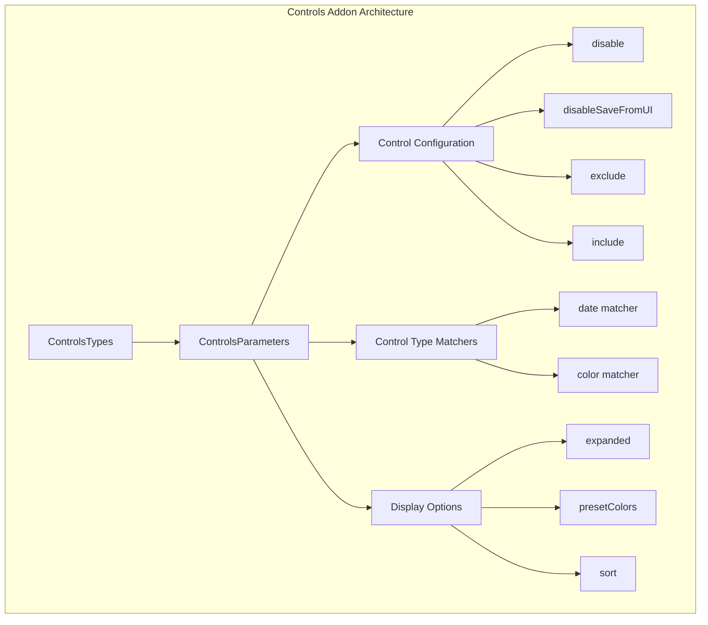
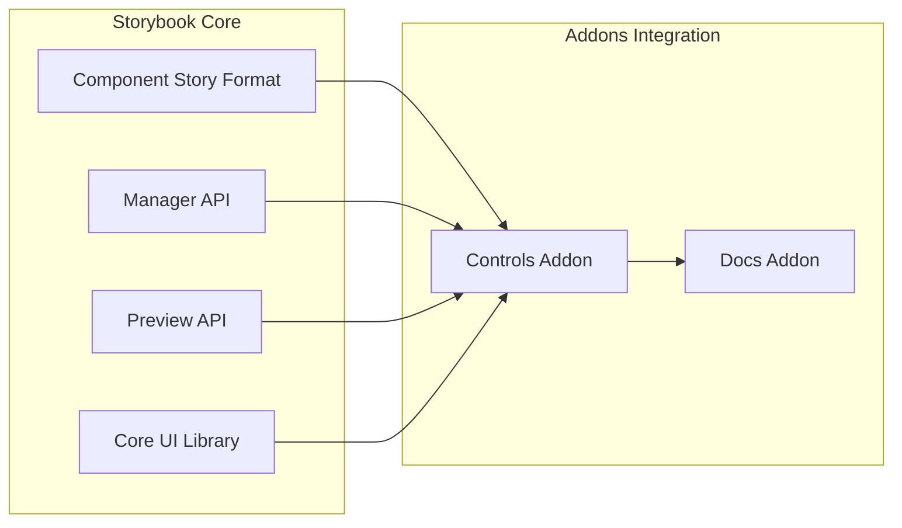
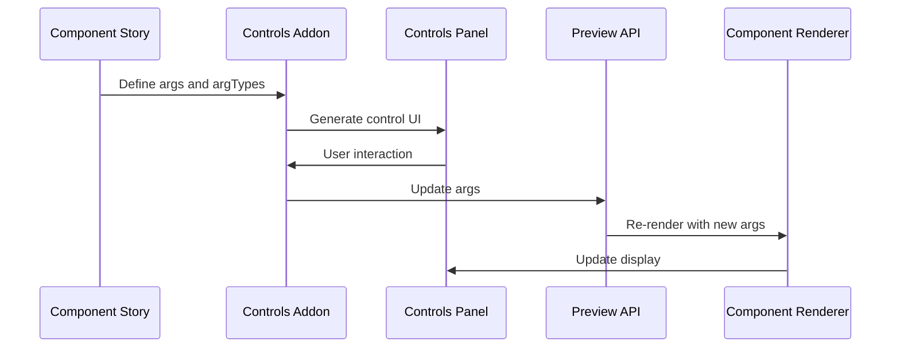
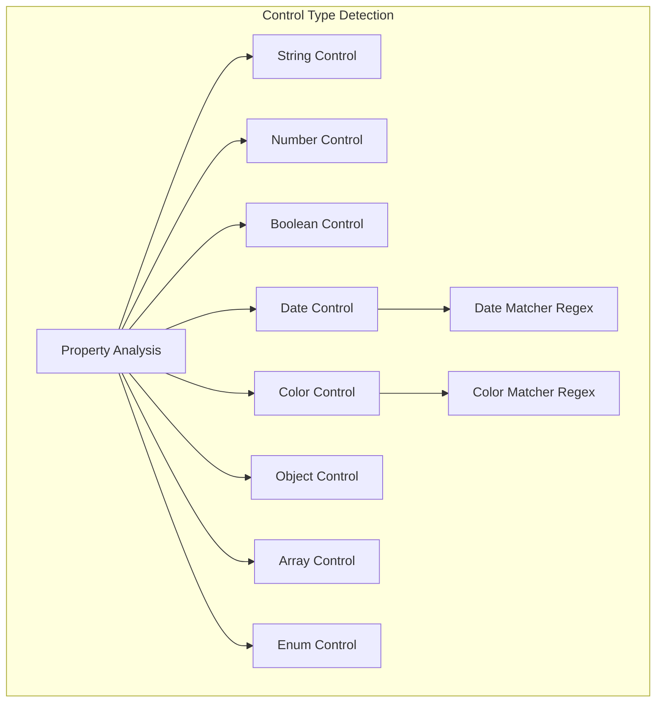
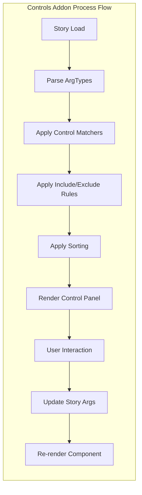

# Controls Addon Module Documentation

## Introduction

The Controls addon is a core Storybook addon that provides an interactive controls panel, allowing developers to dynamically manipulate component props and arguments in real-time. This addon is essential for component development and documentation, enabling users to test different component states without modifying code.

## Module Overview

The Controls addon is part of the core addon types module and provides a comprehensive system for managing component arguments through an intuitive UI panel. It integrates with Storybook's Component Story Format (CSF) and works seamlessly with the Docs addon to provide a complete component documentation experience.

## Core Architecture

### Component Structure



### Integration with Storybook Ecosystem



## Core Components

### ControlsTypes

The main interface that defines the structure of controls-related types within Storybook. It encapsulates all controls functionality and serves as the primary type definition for the addon.

**Location**: `code.core.src.controls.types.ControlsTypes`

### ControlsParameters

The configuration interface that defines how controls behave within a story or component. This interface provides extensive customization options for the controls panel appearance and functionality.

**Location**: `code.core.src.controls.types.ControlsParameters`

## Configuration Options

### Basic Configuration

```typescript
interface ControlsParameters {
  controls?: {
    // Disable the controls panel entirely
    disable?: boolean;
    
    // Prevent users from saving changes through the UI
    disableSaveFromUI?: boolean;
    
    // Control property inclusion/exclusion
    exclude?: string[] | RegExp;
    include?: string[] | RegExp;
    
    // Display options
    expanded?: boolean;
    sort?: 'none' | 'alpha' | 'requiredFirst';
  }
}
```

### Advanced Features

#### Control Type Matchers

Automatically detect and assign appropriate control types based on property names:

```typescript
matchers?: {
  date?: RegExp;    // Properties matching this pattern get date pickers
  color?: RegExp;   // Properties matching this pattern get color pickers
}
```

#### Preset Colors

Define a custom color palette for color picker controls:

```typescript
presetColors?: Array<string | { 
  color: string; 
  title?: string 
}>
```

## Data Flow Architecture



## Integration with Other Modules

### Component Story Format Integration

The Controls addon integrates deeply with the [Component Story Format (CSF)](component_story_format.md) module:

- **StoryIdentifier**: Controls use story identifiers to associate control panels with specific stories
- **StrictArgs**: Type-safe argument handling ensures controls manipulate the correct story properties
- **Renderer**: Integration with the rendering system to update components when control values change

### Docs Addon Integration

Controls work seamlessly with the [Docs addon](docs_addon.md):

- **ArgsTable**: Controls configuration affects how arguments are displayed in documentation
- **ControlProps**: Shared control property definitions between interactive and documentation contexts
- **ArgTypes**: Control configurations are reflected in the generated documentation

### Manager API Integration

The [Manager API](manager_api_and_ui.md) provides:

- **ManagerProvider**: Context for controls panel state management
- **Sidebar Integration**: Controls appear in the addon panel within the Storybook UI
- **Shortcuts**: Keyboard shortcuts for common control operations

## Control Types and Matchers

### Automatic Control Detection

The Controls addon automatically detects appropriate control types based on:

1. **TypeScript types** from component prop definitions
2. **ArgTypes configuration** provided in stories
3. **Custom matchers** for property name patterns
4. **Default value analysis**

### Supported Control Types



## Usage Examples

### Basic Story Configuration

```typescript
export default {
  title: 'Button',
  component: Button,
  parameters: {
    controls: {
      expanded: true,
      sort: 'alpha'
    }
  }
};
```

### Advanced Configuration with Matchers

```typescript
export default {
  title: 'Calendar',
  component: Calendar,
  parameters: {
    controls: {
      matchers: {
        date: /Date$/i,
        color: /(background|color)$/i
      },
      presetColors: [
        { color: '#ff4785', title: 'Coral' },
        'rgba(0, 159, 183, 1)',
        '#fe4a49'
      ]
    }
  }
};
```

### Selective Control Display

```typescript
export default {
  title: 'ComplexComponent',
  component: ComplexComponent,
  parameters: {
    controls: {
      include: ['title', 'size', 'variant'],
      exclude: /internal.*/i
    }
  }
};
```

## Process Flow



## Best Practices

### 1. Control Configuration

- Use `include` to show only relevant controls for complex components
- Configure matchers to automatically detect date and color properties
- Set appropriate `presetColors` for brand consistency
- Use `sort: 'requiredFirst'` to prioritize important controls

### 2. Performance Optimization

- Exclude internal or computed properties using regex patterns
- Disable controls for static stories that don't need interactivity
- Use `disableSaveFromUI` in production environments if needed

### 3. User Experience

- Enable `expanded` mode for comprehensive documentation
- Provide meaningful control labels through argTypes
- Configure appropriate control types for better user interaction

## Related Documentation

- [Component Story Format](component_story_format.md) - Understanding story structure and argTypes
- [Docs Addon](docs_addon.md) - Integration with documentation features
- [Manager API and UI](manager_api_and_ui.md) - UI framework and panel management
- [Core Addon Types](core_addon_types.md) - Overview of all core addons

## API Reference

### ControlsTypes

```typescript
interface ControlsTypes {
  parameters: ControlsParameters;
}
```

### ControlsParameters

```typescript
interface ControlsParameters {
  controls?: {
    disable?: boolean;
    disableSaveFromUI?: boolean;
    exclude?: string[] | RegExp;
    expanded?: boolean;
    include?: string[] | RegExp;
    matchers?: {
      date?: RegExp;
      color?: RegExp;
    };
    presetColors?: Array<string | { color: string; title?: string }>;
    sort?: 'none' | 'alpha' | 'requiredFirst';
  };
}
```

## Troubleshooting

### Common Issues

1. **Controls not appearing**: Check that `argTypes` are properly defined in your story
2. **Wrong control types**: Verify your TypeScript types or provide explicit `argTypes` configuration
3. **Performance issues**: Use `exclude` patterns to hide unnecessary controls
4. **Color picker not working**: Ensure color properties match the configured regex pattern

### Debug Steps

1. Verify story configuration includes controls parameters
2. Check browser console for type detection warnings
3. Validate argTypes configuration matches component props
4. Test with minimal configuration to isolate issues