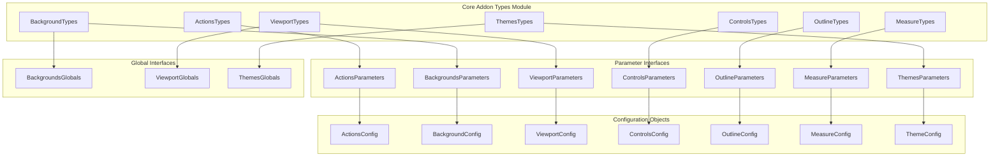
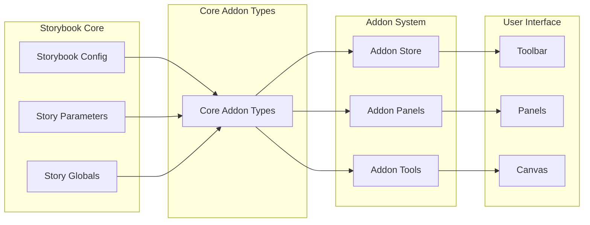

# Core Addon Types Module

## Introduction and Purpose

The `core_addon_types` module serves as the central type definition system for Storybook's essential addons. This module provides TypeScript interfaces and type definitions that standardize how core addons interact with the Storybook ecosystem. It acts as a contract between Storybook's core functionality and its addon system, ensuring consistent behavior and configuration across all essential addons.

The module encompasses seven core addon categories: Actions, Backgrounds, Viewport, Controls, Outline, Measure, and Themes. Each addon type defines the structure for parameters and globals that control addon behavior, providing a unified API for addon configuration and state management.

## Architecture Overview



## Module Structure

The core_addon_types module is organized into seven distinct addon type definitions, each serving specific functionality within the Storybook ecosystem:

### 1. Actions Addon ([actions_addon.md](actions_addon.md))
The Actions addon provides functionality for tracking and displaying component events and method calls. It enables developers to monitor component interactions through a standardized event logging system.

**Key Features:**
- Event handler tracking via regex patterns
- Custom event binding with selectors
- Action panel integration
- Play function compatibility

### 2. Backgrounds Addon ([backgrounds_addon.md](backgrounds_addon.md))
The Backgrounds addon allows developers to test components against different background colors and patterns. It provides visual context switching capabilities for component testing.

**Key Features:**
- Multiple background color options
- Configurable grid overlay
- Global state management
- Default background selection

### 3. Viewport Addon ([viewport_addon.md](viewport_addon.md))
The Viewport addon enables responsive design testing by simulating different device viewports. It provides preset and custom viewport configurations for comprehensive responsive testing.

**Key Features:**
- Device-specific viewport presets
- Custom viewport definitions
- Orientation rotation support
- Responsive testing capabilities

### 4. Controls Addon ([controls_addon.md](controls_addon.md))
The Controls addon provides dynamic component prop manipulation through an interactive UI panel. It enables real-time component testing and documentation generation.

**Key Features:**
- Dynamic prop control interface
- Custom control type matchers
- Preset color swatches
- Property filtering and sorting

### 5. Outline Addon ([outline_addon.md](outline_addon.md))
The Outline addon provides visual debugging capabilities by displaying element boundaries. It helps developers understand component structure and layout relationships.

**Key Features:**
- Element boundary visualization
- Simple enable/disable configuration
- Non-intrusive debugging tool
- Performance-focused implementation

### 6. Measure Addon ([measure_addon.md](measure_addon.md))
The Measure addon provides dimensional analysis tools for precise element measurement. It displays exact pixel dimensions and spacing information for UI elements.

**Key Features:**
- Precise element measurement
- Dimension display overlay
- Simple configuration interface
- Real-time measurement updates

### 7. Themes Addon ([themes_addon.md](themes_addon.md))
The Themes addon enables theme switching capabilities for components that support multiple visual themes. It provides dynamic theme application and management.

**Key Features:**
- Multiple theme support
- Theme list management
- Default theme configuration
- Runtime theme switching

## Integration with Storybook Ecosystem



## Type System Architecture

The module implements a consistent type pattern across all addons:

1. **Parameters Interface**: Defines configuration options that can be set at the story, component, or global level
2. **Globals Interface**: Defines stateful properties that can be manipulated via the UI toolbar (where applicable)
3. **Types Interface**: Combines parameters and globals into a unified type definition

This pattern ensures that each addon follows the same configuration paradigm, making it easier for developers to understand and use different addons consistently.

## Dependencies and Relationships

The core_addon_types module has minimal external dependencies, primarily relying on:
- TypeScript type system for interface definitions
- Addon-specific constants for parameter keys
- Storybook's global state management system

The module serves as a foundation for other Storybook components:
- [storybook_configuration](storybook_configuration.md) module uses these types for configuration validation
- [manager_api_and_ui](manager_api_and_ui.md) module references these types for panel and toolbar implementations
- [preview_api](preview_api.md) module utilizes these types for runtime behavior control

## Usage Patterns

### Basic Configuration
```typescript
// Story-level configuration
export default {
  title: 'Components/Button',
  parameters: {
    actions: { argTypesRegex: '^on.*' },
    backgrounds: { default: 'dark' },
    viewport: { defaultViewport: 'mobile1' },
    controls: { expanded: true }
  }
}
```

### Global State Management
```typescript
// Global configuration in preview.js
export const globalTypes = {
  backgrounds: {
    defaultValue: 'light'
  },
  viewport: {
    defaultValue: 'responsive'
  },
  theme: {
    defaultValue: 'light'
  }
}
```

## Extensibility

The modular design of core_addon_types allows for easy extension:
- New addons can follow the established pattern
- Existing addon types can be extended with additional properties
- Custom addon implementations can reference these base types
- Type safety is maintained across all addon interactions

This architecture ensures that Storybook's addon ecosystem remains consistent and maintainable while providing the flexibility needed for diverse use cases.