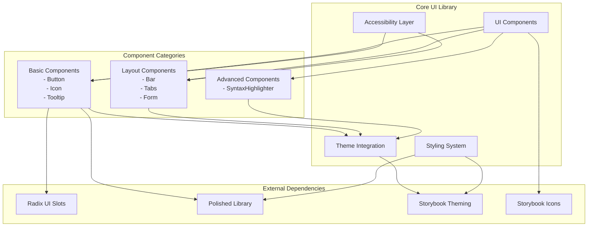
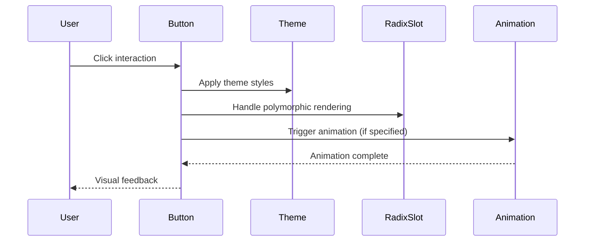
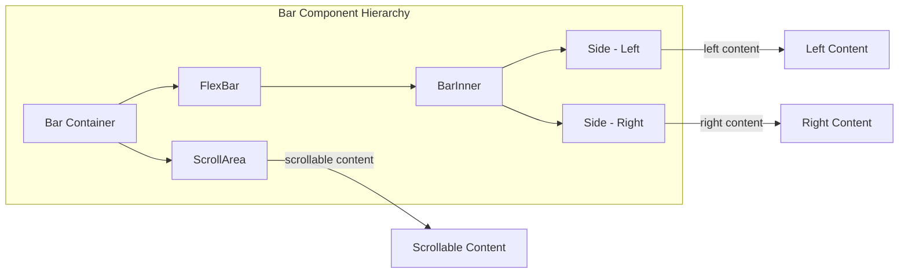
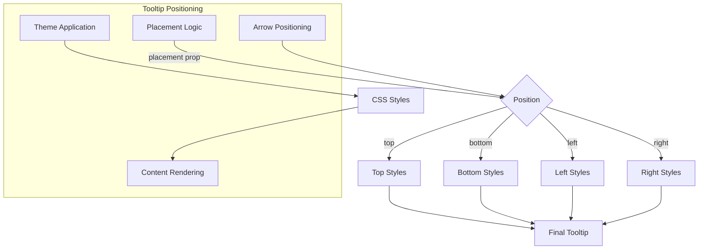
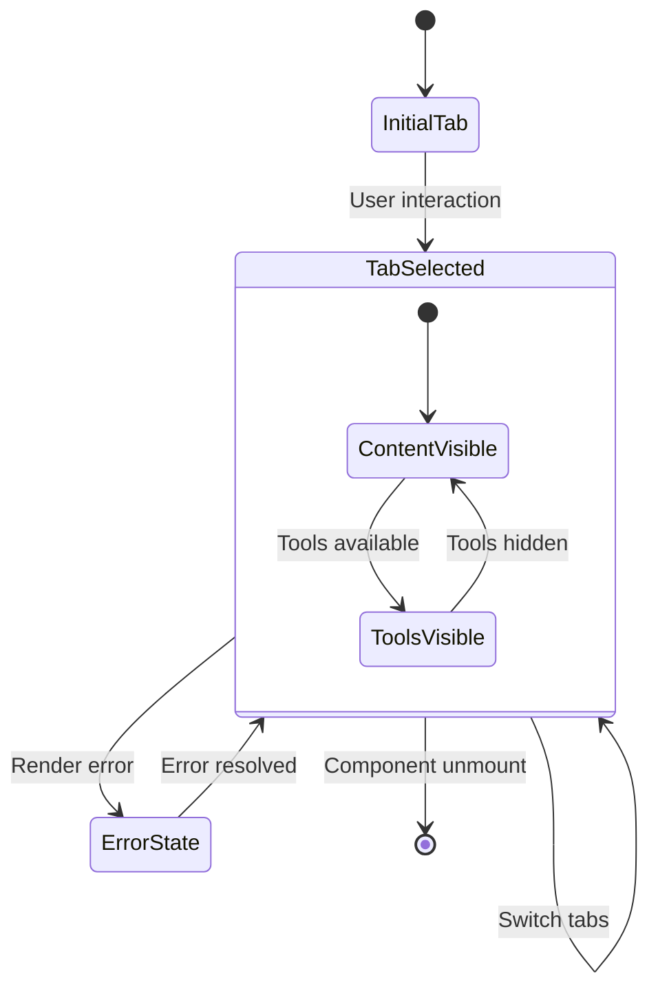
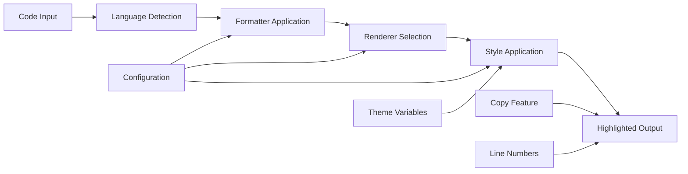
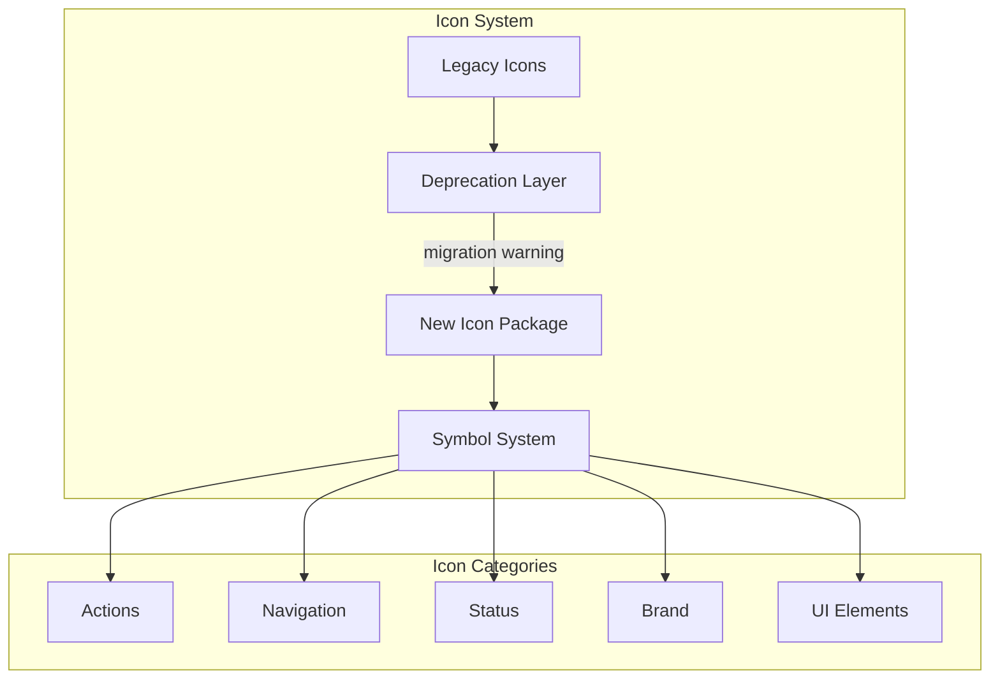
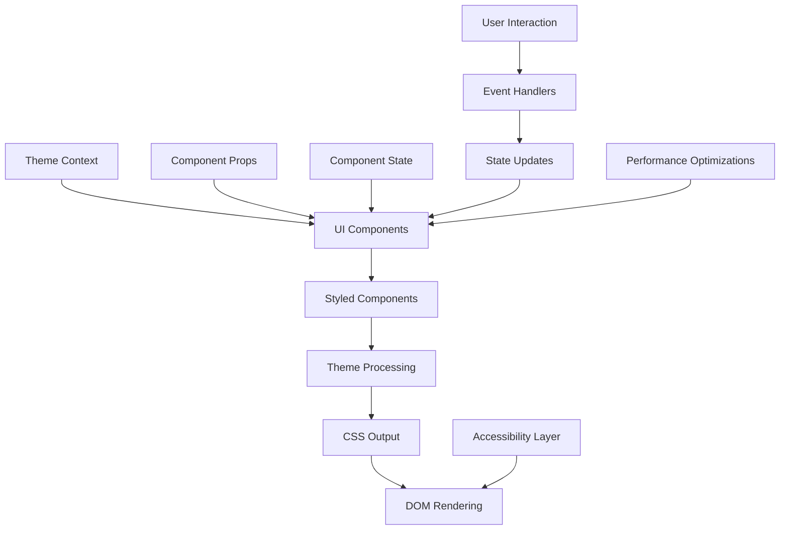

# Core UI Library Module Documentation

## Introduction

The Core UI Library module provides the foundational user interface components that power Storybook's visual interface. This module contains a comprehensive set of reusable React components that implement Storybook's design system, including buttons, tooltips, tabs, forms, icons, and syntax highlighting. These components are designed to be theme-aware, accessible, and consistent across the entire Storybook application.

## Architecture Overview

The Core UI Library serves as the central design system for Storybook, providing atomic and composite UI components that are used throughout the application. The module follows a component-based architecture with clear separation of concerns, theme integration, and accessibility considerations.



## Core Components

### Button Component

The Button component is a versatile, theme-aware button that supports multiple variants, sizes, and animations. It serves as the primary interactive element throughout Storybook.

**Key Features:**
- Multiple variants: `outline`, `solid`, `ghost`
- Size options: `small`, `medium`
- Animation support: `rotate360`, `glow`, `jiggle`
- Radix UI Slot integration for polymorphic behavior
- Comprehensive theming support
- Accessibility features

**Component Flow:**


**Props Interface:**
```typescript
interface ButtonProps extends ButtonHTMLAttributes<HTMLButtonElement> {
  asChild?: boolean;           // Use Radix Slot for polymorphic rendering
  size?: 'small' | 'medium';   // Button size
  padding?: 'small' | 'medium' | 'none'; // Internal padding
  variant?: 'outline' | 'solid' | 'ghost'; // Visual style
  onClick?: (event: SyntheticEvent) => void; // Click handler
  disabled?: boolean;          // Disabled state
  active?: boolean;            // Active state styling
  animation?: 'none' | 'rotate360' | 'glow' | 'jiggle'; // Animation type
}
```

### Bar Component

The Bar component provides flexible layout containers for organizing UI elements horizontally. It includes variants for scrollable content and flexible layouts.

**Key Features:**
- Horizontal layout container
- Scrollable and non-scrollable variants
- Flexible bar with left/right content areas
- Theme integration for consistent styling
- Responsive design support

**Component Structure:**


### Tooltip Component

The Tooltip component provides contextual information overlays with customizable positioning, styling, and arrow indicators.

**Key Features:**
- Multiple placement options (top, bottom, left, right)
- Customizable arrow indicators
- Theme-aware styling
- Chrome/no-chrome variants
- Color customization

**Positioning System:**


### Tabs Component

The Tabs component provides a comprehensive tabbed interface system with state management, accessibility features, and flexible content rendering.

**Key Features:**
- State-managed tab selection
- Accessibility compliance (ARIA roles)
- Error boundary integration
- Flexible content rendering
- Tools and actions support
- Bordered and absolute positioning options

**State Management Flow:**


### SyntaxHighlighter Component

The SyntaxHighlighter component provides code syntax highlighting with extensive customization options and multiple language support.

**Key Features:**
- Multiple language support
- Customizable formatting options
- Copy functionality
- Bordered and padded variants
- Custom renderer support
- Line number display

**Rendering Pipeline:**


### Form Field Component

The Form Field component provides structured form input layouts with consistent labeling and styling.

**Key Features:**
- Consistent field layout
- Flexible label positioning
- Theme integration
- Responsive design
- Accessibility support

### Icon Component

The Icon component provides a comprehensive icon system with deprecation handling and migration path to the new Storybook Icons package.

**Key Features:**
- Extensive icon library
- Deprecation warnings
- Migration guidance
- Symbol-based rendering
- Theme integration

**Icon System Architecture:**


## Theme Integration

The Core UI Library deeply integrates with Storybook's theming system, providing consistent visual appearance across all components.

**Theme Variables Used:**
- `theme.color.secondary` - Primary accent colors
- `theme.background.app` - Application background
- `theme.typography.size.s1` - Font sizing
- `theme.input.borderRadius` - Border radius values
- `theme.appBorderColor` - Border colors
- `theme.barTextColor` - Bar text colors
- `theme.animation` - Animation definitions

## Data Flow



## Component Dependencies

The Core UI Library has several key dependencies that enable its functionality:

**External Dependencies:**
- `@radix-ui/react-slot` - Polymorphic component rendering
- `polished` - Color manipulation and CSS utilities
- `storybook/theming` - Theme system integration
- `@storybook/icons` - Icon system
- `memoizerific` - Performance optimization for memoization

**Internal Dependencies:**
- [theming.md](theming.md) - Theme system documentation
- [manager_api_and_ui.md](manager_api_and_ui.md) - UI integration points
- [preview_api.md](preview_api.md) - Preview rendering context

## Performance Considerations

The Core UI Library implements several performance optimizations:

1. **Memoization**: Components like `Tooltip` and `Icons` use memoization to prevent unnecessary re-renders
2. **Lazy Loading**: Advanced components load dependencies on demand
3. **CSS-in-JS Optimization**: Styled components use efficient CSS generation
4. **Event Debouncing**: User interactions are optimized with appropriate debouncing
5. **Virtual Scrolling**: Large lists implement virtual scrolling where applicable

## Accessibility Features

All components in the Core UI Library include comprehensive accessibility features:

- **ARIA Labels**: Proper ARIA attributes for screen readers
- **Keyboard Navigation**: Full keyboard support for interactive components
- **Focus Management**: Proper focus indicators and management
- **Color Contrast**: WCAG compliant color contrast ratios
- **Semantic HTML**: Proper HTML semantics for assistive technologies

## Testing Strategy

The Core UI Library components are designed with testability in mind:

- **Unit Tests**: Individual component behavior testing
- **Visual Regression Tests**: Screenshot-based visual testing
- **Accessibility Tests**: Automated accessibility compliance testing
- **Interaction Tests**: User interaction behavior validation
- **Theme Tests**: Theme variation testing

## Migration and Deprecation

The Core UI Library maintains backward compatibility while providing clear migration paths:

- **Icon Component**: Deprecated in favor of `@storybook/icons` package
- **Component APIs**: Gradual API evolution with deprecation warnings
- **Theme System**: Migration guidance for theme updates
- **Documentation**: Comprehensive migration guides

## Integration Examples

### Basic Button Usage
```typescript
import { Button } from '@storybook/core/components';

// Primary button
<Button variant="solid" size="medium" onClick={handleClick}>
  Click Me
</Button>

// Ghost button with animation
<Button variant="ghost" animation="glow" active={isActive}>
  Active State
</Button>
```

### Tab Configuration
```typescript
import { Tabs, TabWrapper } from '@storybook/core/components';

<Tabs selected={selectedTab} actions={{ onSelect: setSelectedTab }}>
  <TabWrapper id="tab1" title="First Tab">
    <ContentOne />
  </TabWrapper>
  <TabWrapper id="tab2" title="Second Tab">
    <ContentTwo />
  </TabWrapper>
</Tabs>
```

### Tooltip Implementation
```typescript
import { Tooltip } from '@storybook/core/components';

<Tooltip placement="bottom" hasChrome withArrows color="primary">
  This is helpful information
</Tooltip>
```

## Future Enhancements

The Core UI Library continues to evolve with planned enhancements:

- **Design System 2.0**: Updated design tokens and component library
- **Performance Improvements**: Further optimization of rendering performance
- **Accessibility Enhancements**: Expanded accessibility features
- **New Components**: Additional UI components for common patterns
- **Theme System Updates**: Enhanced theming capabilities

## Related Documentation

- [theming.md](theming.md) - Theme system implementation
- [manager_api_and_ui.md](manager_api_and_ui.md) - UI integration in manager
- [preview_api.md](preview_api.md) - Preview rendering context
- [component_story_format.md](component_story_format.md) - Component documentation format
- [storybook_configuration.md](storybook_configuration.md) - Configuration system