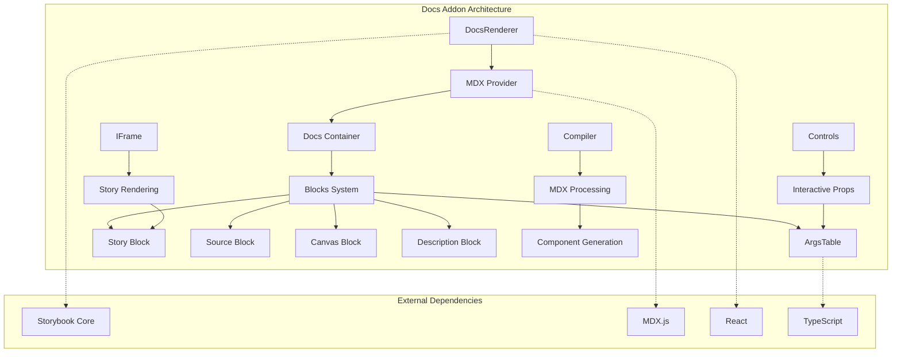
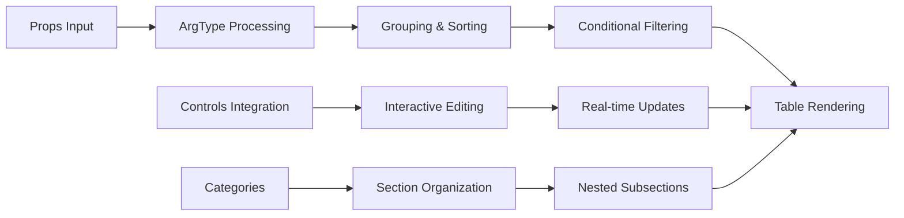
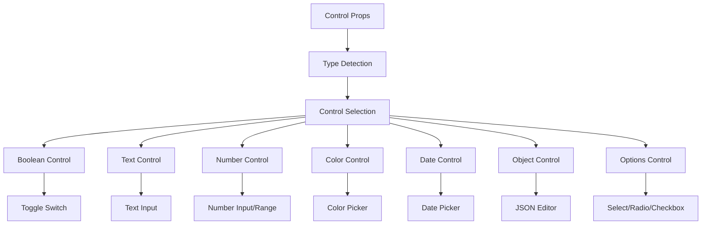
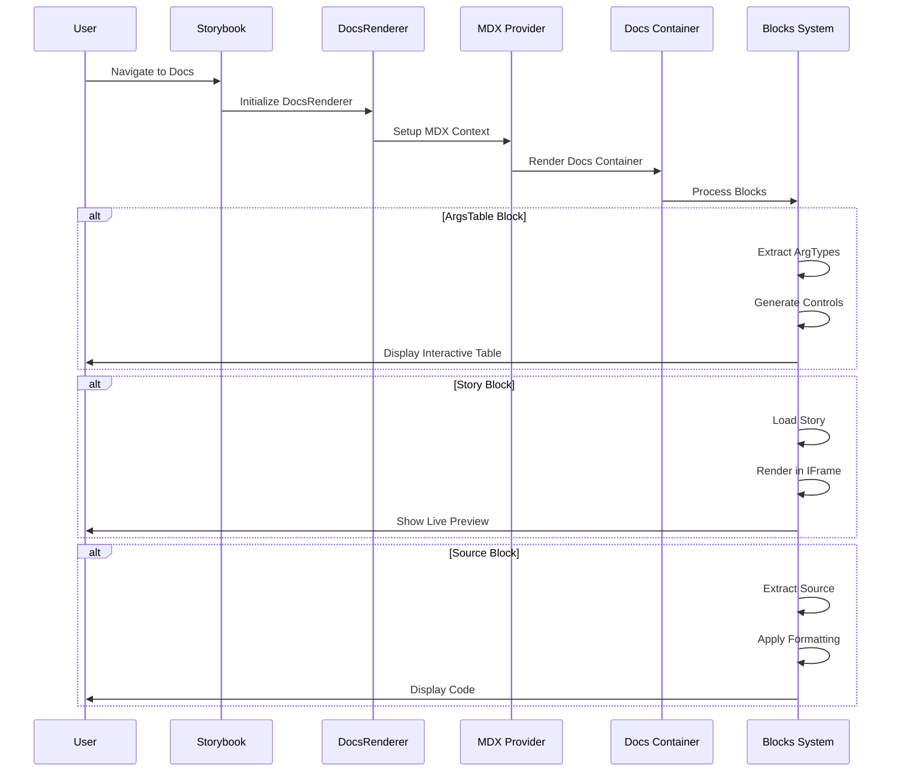
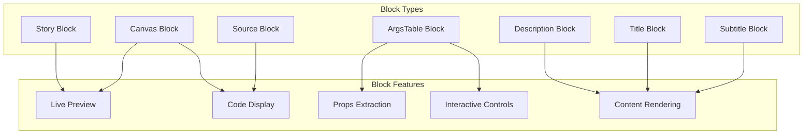

# Docs Addon Module Documentation

## Introduction

The Docs Addon module is a core component of Storybook that provides comprehensive documentation capabilities for components and stories. It enables developers to create rich, interactive documentation pages that combine live component previews, props documentation, source code, and narrative content in a single, cohesive interface.

The module transforms Storybook from a simple component showcase into a powerful documentation platform, supporting MDX-based documentation, automatic props extraction, interactive controls, and customizable documentation templates.

## Architecture Overview

The Docs Addon module follows a layered architecture that integrates with Storybook's core systems while providing its own rendering and processing capabilities:



## Core Components

### 1. DocsRenderer

The `DocsRenderer` is the primary rendering engine for documentation pages. It orchestrates the rendering process by:

- Managing MDX component providers and context
- Handling error boundaries for robust documentation rendering
- Coordinating between React components and MDX content
- Providing mount/unmount lifecycle management

**Key Features:**
- Asynchronous rendering with Promise-based API
- Error boundary integration for graceful failure handling
- Configurable component mapping for MDX elements
- Support for custom documentation components

### 2. ArgsTable Component

The `ArgsTable` component provides comprehensive props documentation with interactive controls:



**Capabilities:**
- Automatic props extraction from component definitions
- Interactive controls for live prop manipulation
- Advanced filtering and sorting options
- Support for nested categorization and subcategorization
- Conditional argument display based on story context
- Reset functionality for individual or all controls

### 3. IFrame Component

The `IFrame` component enables isolated story rendering within documentation:

- Scalable story previews with transform-based scaling
- Full-screen support for immersive viewing
- Lazy loading for performance optimization
- Secure sandboxing for story execution

### 4. Controls System

The controls system provides a comprehensive set of input types for interactive documentation:



### 5. Compiler Integration

The compiler system processes MDX content and integrates with Storybook's build pipeline:

- MDX compilation with custom options
- Component extraction and registration
- TypeScript integration for type safety
- Source map generation for debugging

## Data Flow Architecture



## Integration with Storybook Core

The Docs Addon integrates deeply with Storybook's core systems:

### Component Story Format (CSF) Integration
- Leverages CSF for story definitions and metadata
- Integrates with [component_story_format.md](component_story_format.md) for story processing
- Supports story parameters and decorators

### Manager API Integration
- Communicates with [manager_api_and_ui.md](manager_api_and_ui.md) for UI state management
- Integrates with sidebar navigation and explorer components
- Coordinates with settings and shortcuts

### Preview API Integration
- Works with [preview_api.md](preview_api.md) for story rendering
- Utilizes WebRenderer for component display
- Manages story selection and context

### Core UI Library Integration
- Uses components from [core_ui_library.md](core_ui_library.md)
- Leverages theming system for consistent styling
- Integrates with form components and icons

## Configuration and Customization

The Docs Addon provides extensive configuration options:

```typescript
interface DocsParameters {
  docs?: {
    // Container customization
    container?: ComponentType<DocsContainerProps>;
    
    // Page template
    page?: ComponentType;
    
    // Theming
    theme?: ThemeVars;
    
    // Block-specific configurations
    argTypes?: ArgTypesBlockParameters;
    canvas?: CanvasBlockParameters;
    controls?: ControlsBlockParameters;
    source?: SourceBlockParameters;
    story?: StoryBlockParameters;
    
    // Content configuration
    title?: string;
    subtitle?: string;
    description?: DescriptionBlockParameters;
    
    // Feature toggles
    disable?: boolean;
    codePanel?: boolean;
    toc?: TocParameters;
  };
}
```

## Block System Architecture

The Docs Addon implements a modular block system for flexible documentation composition:



## Type System Integration

The Docs Addon provides comprehensive TypeScript support:

- **ArgTypes**: Defines component prop types and documentation
- **ControlProps**: Specifies control input configurations
- **DocsTypes**: Centralizes documentation parameter types
- **CompileOptions**: Configures MDX compilation settings

## Performance Optimizations

The module implements several performance optimizations:

- **Lazy Loading**: IFrame components load content on demand
- **Conditional Rendering**: Blocks only render when needed
- **Memoization**: Expensive computations are cached
- **Virtual Scrolling**: Large tables use virtualized rendering
- **Code Splitting**: MDX compilation is code-split for faster initial loads

## Error Handling and Resilience

The Docs Addon implements robust error handling:

- **Error Boundaries**: React error boundaries prevent cascading failures
- **Graceful Degradation**: Failed blocks don't break the entire page
- **Fallback Content**: Missing data shows helpful fallback messages
- **Validation**: Input validation prevents runtime errors
- **Logging**: Comprehensive logging for debugging

## Extensibility and Plugin Architecture

The module supports extensive customization:

- **Custom Blocks**: Developers can create custom documentation blocks
- **Component Mapping**: MDX components can be overridden
- **Theme Integration**: Full integration with Storybook's theming system
- **Plugin System**: Hooks for extending functionality
- **Template System**: Customizable documentation templates

## Security Considerations

The Docs Addon implements security best practices:

- **Content Sanitization**: User-generated content is properly sanitized
- **Iframe Sandboxing**: Stories run in isolated iframes
- **CSP Compliance**: Content Security Policy compatible
- **XSS Prevention**: Cross-site scripting prevention measures
- **Safe Evaluation**: Code evaluation is sandboxed and controlled

## Testing and Quality Assurance

The module includes comprehensive testing strategies:

- **Unit Tests**: Individual component testing
- **Integration Tests**: Cross-component interaction testing
- **Visual Regression**: Screenshot-based visual testing
- **Accessibility**: A11y compliance testing
- **Performance**: Load time and rendering performance testing

## Future Enhancements

The Docs Addon roadmap includes:

- **Advanced Search**: Full-text search across documentation
- **Versioning**: Documentation versioning and comparison
- **Collaboration**: Real-time collaborative editing
- **Analytics**: Documentation usage analytics
- **AI Integration**: AI-powered documentation generation
- **Mobile Optimization**: Enhanced mobile documentation experience

## Related Documentation

- [Storybook Configuration](storybook_configuration.md) - Core configuration system
- [Component Story Format](component_story_format.md) - Story definition format
- [Manager API and UI](manager_api_and_ui.md) - UI and state management
- [Preview API](preview_api.md) - Story rendering system
- [Core UI Library](core_ui_library.md) - Shared UI components
- [Theming System](theming.md) - Visual customization

## Conclusion

The Docs Addon module transforms Storybook into a comprehensive documentation platform, providing developers with powerful tools for creating, maintaining, and sharing component documentation. Its modular architecture, extensive customization options, and deep integration with Storybook's core systems make it an essential component for modern component-driven development workflows.