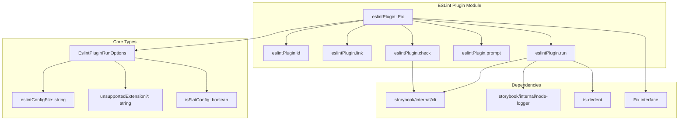
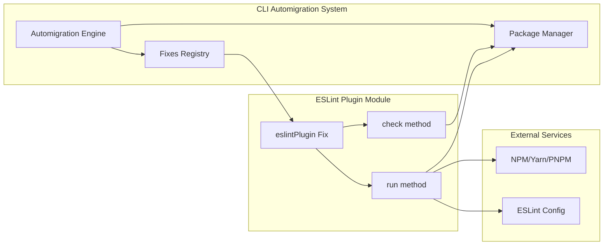
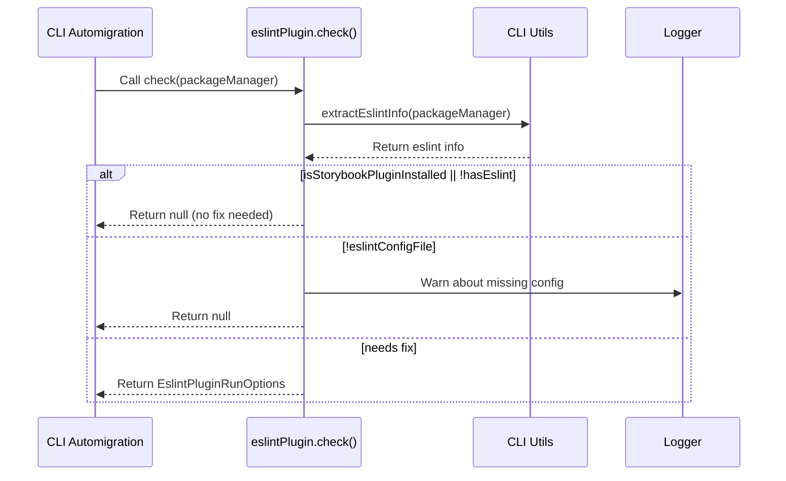
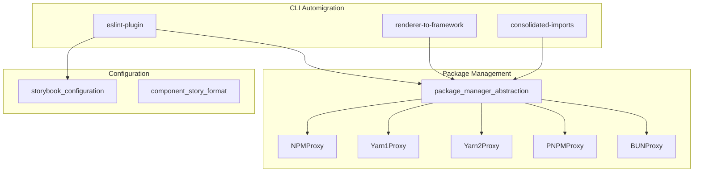

# ESLint Plugin Module

## Introduction

The ESLint Plugin module is a Storybook automigration fix that handles the installation and configuration of the `eslint-plugin-storybook` package. This module ensures that Storybook projects have proper ESLint integration for maintaining code quality and consistency across Storybook configurations, stories, and related files.

## Overview

The eslint-plugin module is part of Storybook's CLI automigration system, specifically designed to:
- Detect if a project has ESLint configured but lacks the Storybook ESLint plugin
- Automatically install the `eslint-plugin-storybook` package
- Configure the plugin in the project's ESLint configuration
- Handle different ESLint configuration formats (flat config and legacy formats)

## Architecture

### Component Structure



### Integration with CLI Automigration System



## Core Components

### EslintPluginRunOptions Interface

The `EslintPluginRunOptions` interface defines the configuration options for the ESLint plugin automigration:

```typescript
interface EslintPluginRunOptions {
  eslintConfigFile: string;        // Path to the ESLint configuration file
  unsupportedExtension?: string;   // Unsupported file extension (if any)
  isFlatConfig: boolean;           // Whether using ESLint flat config format
}
```

### eslintPlugin Fix Object

The main export of this module is the `eslintPlugin` fix object that implements the `Fix<EslintPluginRunOptions>` interface:

#### Properties
- `id: 'eslintPlugin'` - Unique identifier for this fix
- `link` - Documentation URL for the ESLint plugin configuration

#### Methods

##### check()
Analyzes the project to determine if the ESLint plugin needs to be installed:



##### prompt()
Returns a user-friendly message explaining what the fix will do:
- "We'll install and configure the Storybook ESLint plugin for you."

##### run()
Executes the fix by installing and configuring the ESLint plugin:

The run method follows this process:

1. **Extract options** from the result object
2. **Define dependencies** - sets up eslint-plugin-storybook with the appropriate version
3. **Check dry-run mode** - if true, skips actual installation
4. **Install dependencies** - adds the plugin as a dev dependency (unless in dry-run)
5. **Check for unsupported extensions** - if found, warns user and skips configuration
6. **Configure plugin** - automatically configures the plugin in ESLint config (unless in dry-run)

Flow:
- If dry-run: extract → define deps → check extension → warn/configure → end
- If normal: extract → define deps → install → check extension → warn/configure → end

## Dependencies

### Internal Dependencies

The module relies on several internal Storybook utilities:

1. **storybook/internal/cli**
   - `SUPPORTED_ESLINT_EXTENSIONS` - List of supported ESLint config file extensions
   - `configureEslintPlugin()` - Function to configure the plugin in ESLint config
   - `extractEslintInfo()` - Function to extract ESLint configuration information

2. **storybook/internal/node-logger**
   - `logger` - Logging utility for warnings and debug messages

### External Dependencies

1. **ts-dedent**
   - Template literal tag for removing indentation from multi-line strings

## Configuration Support

The module supports different ESLint configuration formats:

### Supported Formats
- `.eslintrc.js`
- `.eslintrc.json`
- `.eslintrc.yml`
- `.eslintrc.yaml`
- `eslint.config.js` (flat config)

### Unsupported Formats
When an unsupported format is detected, the module:
1. Installs the plugin successfully
2. Warns the user about the unsupported format
3. Provides a link to manual configuration documentation
4. Skips automatic configuration

## Error Handling

The module implements several error handling strategies:

1. **Missing ESLint Configuration**: Warns and skips if no ESLint config file is found
2. **Unsupported Extensions**: Installs plugin but defers configuration to manual setup
3. **Package Manager Issues**: Relies on package manager abstraction for consistent behavior
4. **Dry Run Mode**: Skips actual installation/configuration in dry-run mode

## Integration with Storybook Ecosystem

### Relationship to Other Modules



The eslint-plugin module integrates with:
- **Package Manager Abstraction**: Uses the factory pattern to work with different package managers
- **Storybook Configuration**: Ensures ESLint rules align with Storybook best practices
- **Component Story Format**: Validates CSF syntax and patterns through ESLint rules

## Usage Examples

### Successful Installation
```typescript
// The module automatically detects missing plugin and installs it
const result = await eslintPlugin.check({ packageManager });
if (result) {
  await eslintPlugin.run({ 
    result, 
    packageManager, 
    dryRun: false,
    storybookVersion: '^7.0.0'
  });
}
```

### Handling Unsupported Extensions
```typescript
// When .eslintrc.toml is detected
// Plugin installs but configuration is skipped
// User receives warning with manual configuration link
```

## Best Practices

1. **Always check first**: Use the `check()` method before running the fix
2. **Handle dry-run mode**: Respect the dry-run flag during development
3. **Provide clear feedback**: Use logger for warnings and user guidance
4. **Support multiple formats**: Handle both legacy and flat ESLint configs
5. **Graceful degradation**: Continue installation even if auto-configuration fails

## Troubleshooting

### Common Issues

1. **Plugin not configuring automatically**
   - Check if your ESLint config format is supported
   - Refer to manual configuration documentation
   - Verify file permissions on config files

2. **Installation fails**
   - Ensure package manager is properly configured
   - Check network connectivity for registry access
   - Verify storybookVersion is valid

3. **False positive detection**
   - Plugin may be installed globally rather than locally
   - ESLint config might be in an unconventional location

## References

- [Package Manager Abstraction](package_manager_abstraction.md) - For dependency installation details
- [Storybook Configuration](storybook_configuration.md) - For overall configuration patterns
- [CLI Automigration](cli_automigration.md) - For the broader automigration system context