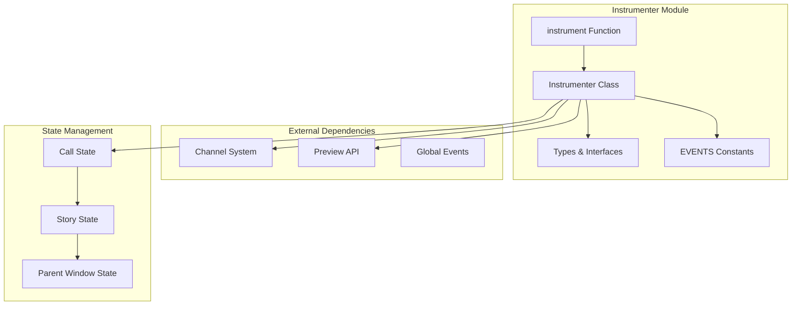
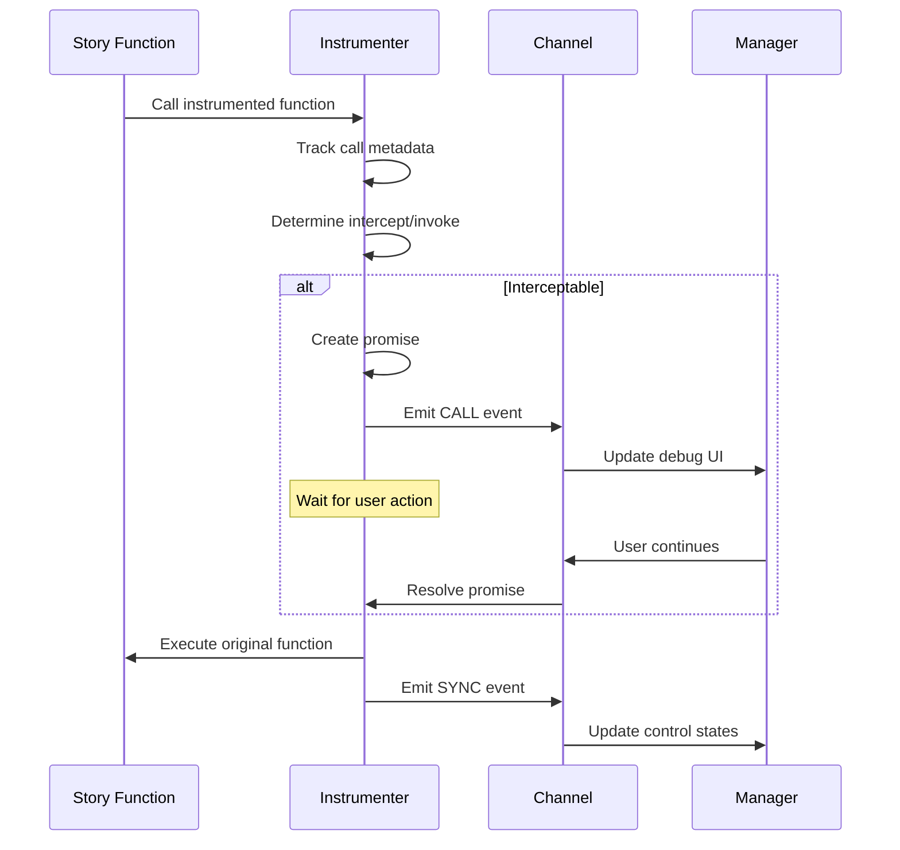

# Instrumenter Module

## Overview

The **Instrumenter** module is a core component of Storybook's debugging and testing infrastructure. It provides runtime code instrumentation capabilities that enable interactive debugging, step-through execution, and interaction tracking within Storybook stories. This module is essential for the Interactions addon and play function debugging features.

## Purpose

The instrumenter module serves several key purposes:

1. **Runtime Code Instrumentation**: Patches functions and methods to track their execution
2. **Interactive Debugging**: Enables step-through debugging of story interactions
3. **Call Tracing**: Records and manages function calls for debugging purposes
4. **State Management**: Maintains debugging state across story renders and iframe reloads
5. **Integration**: Works with Storybook's channel system and preview API

## Architecture

### Core Components



### Data Flow



## Key Features

### 1. Function Instrumentation

The instrumenter patches functions to track their execution:
- Recursively traverses object properties
- Patches functions with tracking wrappers
- Maintains references to original functions
- Handles getters and complex object structures

### 2. Interactive Debugging

Supports step-through debugging with controls:
- **Start**: Begin debugging session
- **Back**: Step backward through calls
- **Next**: Step to next call
- **Goto**: Jump to specific call
- **End**: End debugging session

### 3. State Persistence

Maintains debugging state across:
- Story remounts
- Iframe reloads
- Story switches
- Parent window communication

### 4. Call Management

Manages complex call scenarios:
- Call chaining detection
- Ancestor tracking for nested calls
- Exception handling and propagation
- Promise resolution tracking

## Integration Points

### Channel System Integration

The instrumenter integrates with Storybook's channel system to:
- Emit debugging events (`CALL`, `SYNC`)
- Receive control commands (`START`, `BACK`, `NEXT`, etc.)
- Synchronize state with the manager UI

### Preview API Integration

Works with the preview API to:
- Access story selection and metadata
- Handle story render phases
- Coordinate with story lifecycle

### Parent Window Communication

Maintains state synchronization with parent window:
- Persists state across iframe reloads
- Handles cross-origin scenarios
- Manages detached mode for composed Storybooks

## Usage Patterns

### Basic Instrumentation

```typescript
import { instrument } from '@storybook/instrumenter';

// Instrument an object or module
const instrumentedObj = instrument(myObject, {
  intercept: true, // Enable debugging
  retain: false,   // Don't retain after play completes
});
```

### Advanced Options

```typescript
const options = {
  intercept: (method, path) => method === 'importantMethod',
  retain: true,
  mutate: false,
  path: ['user', 'actions'],
  getKeys: (obj, depth) => Object.keys(obj).filter(key => !key.startsWith('_')),
  getArgs: (call, state) => sanitizeArgs(call.args),
};
```

## Error Handling

The instrumenter includes comprehensive error handling:
- Exception capture with stack traces
- Chai assertion error processing
- Error propagation to parent calls
- Special handling for post-play execution

## Performance Considerations

- Uses 0ms debounce for synchronization
- Implements efficient call deduplication
- Provides serialization depth limits
- Supports selective instrumentation

## Sub-modules

### [Instrumenter Core](instrumenter_core.md)
Detailed documentation of the main Instrumenter class and its core functionality, including state management, debugging controls, and instrumentation logic.

### [Instrumenter Types](instrumenter_types.md)
Comprehensive reference of all TypeScript interfaces and types used throughout the instrumenter module, including call states, control states, and data structures.

## Related Documentation

- [Component Story Format](component_story_format.md) - Story format that works with instrumenter
- [Preview API](preview_api.md) - API that coordinates with instrumenter
- [Manager API and UI](manager_api_and_ui.md) - UI components that display instrumenter data