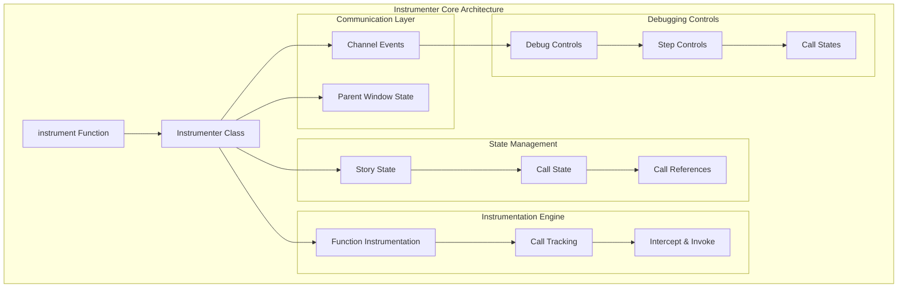
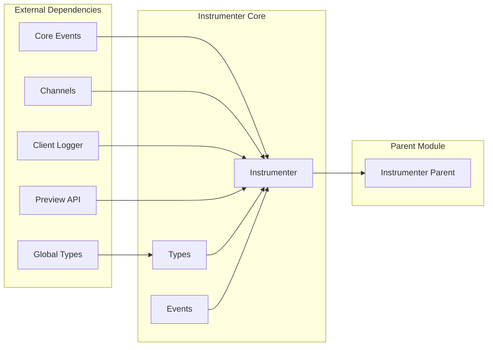
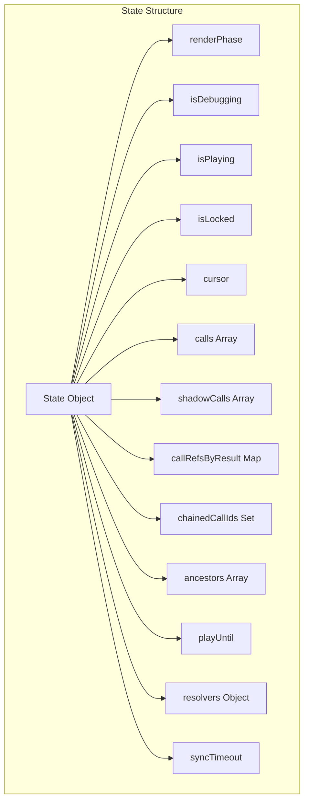
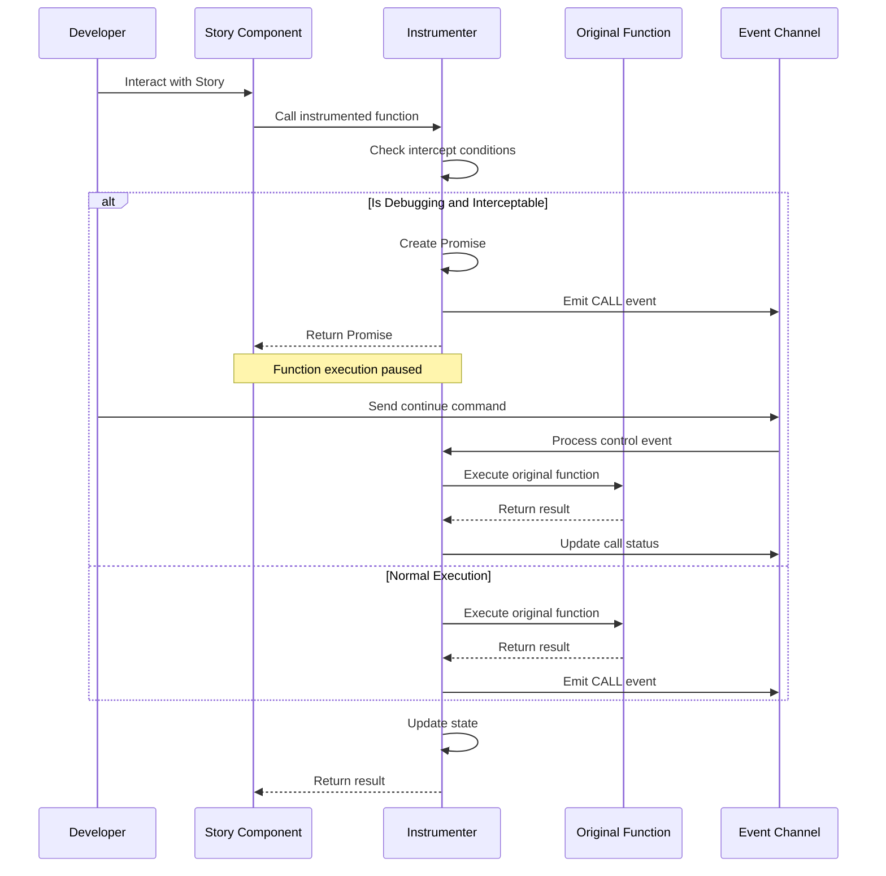
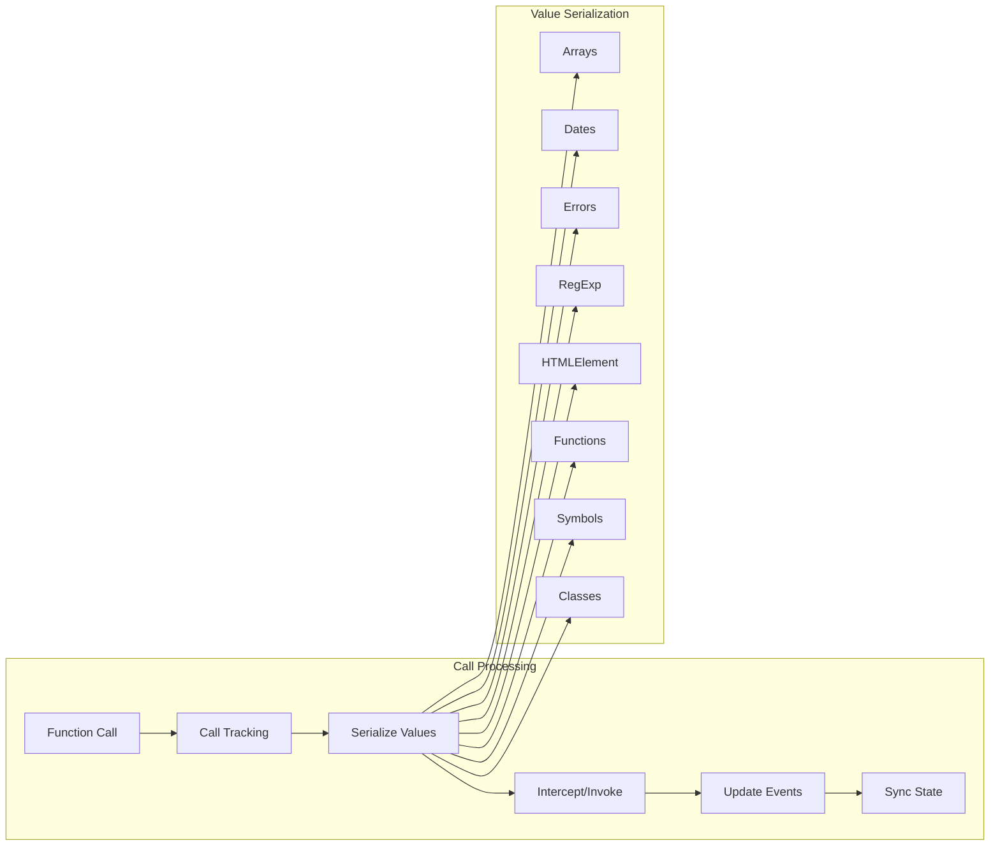
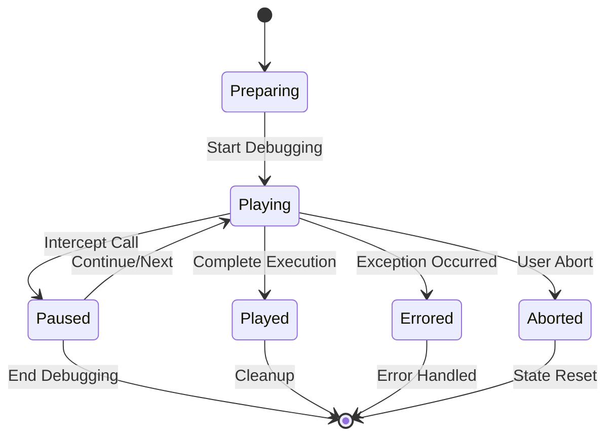
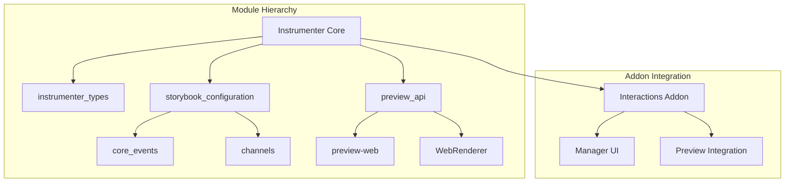

# Instrumenter Core Module

## Introduction

The instrumenter_core module is a sophisticated debugging and interaction tracking system for Storybook. It provides runtime instrumentation capabilities that enable developers to monitor, intercept, and debug function calls within stories and components. This module is essential for the Storybook Interactions addon, offering step-through debugging, call tracing, and interactive testing features.

## Core Purpose

The instrumenter_core module serves as the foundation for:
- **Function Call Instrumentation**: Dynamically patches functions to track their execution
- **Interactive Debugging**: Provides step-through debugging capabilities for story interactions
- **Call Tracing**: Records and manages function call hierarchies and dependencies
- **State Management**: Maintains per-story debugging state across iframe reloads
- **Exception Handling**: Captures and processes errors with detailed context information

## Architecture Overview



## Component Relationships



## Core Components

### Instrumenter Class

The `Instrumenter` class is the main orchestrator that manages the instrumentation process. It maintains per-story state, handles communication with the Storybook manager, and coordinates the debugging workflow.

**Key Responsibilities:**
- State management for multiple stories
- Event handling and channel communication
- Function instrumentation coordination
- Exception handling and error processing
- Parent window state synchronization

### State Management

The module maintains sophisticated state tracking with the following structure:



### Function Instrumentation Process



## Data Flow

### Call Processing Pipeline



### Debugging Control Flow



## Key Features

### 1. Dynamic Function Instrumentation

The module can dynamically patch any function to add tracking capabilities:

```typescript
// Functions are wrapped with tracking logic
originalFunction(...args) {
  // Track call metadata
  // Handle interception logic
  // Execute original function
  // Process results and exceptions
  // Update state and emit events
}
```

### 2. Advanced Value Serialization

Complex values are serialized for cross-frame communication:

- **Circular Reference Detection**: Prevents infinite loops
- **Special Object Handling**: Dates, Errors, RegExp, DOM elements
- **Function Serialization**: Preserves function names and mock information
- **Class Instance Tracking**: Maintains constructor information

### 3. Exception Processing

Errors are enhanced with debugging context:

```typescript
exception = {
  name: error.name,
  message: error.message,
  stack: error.stack,
  callId: originatingCallId,
  showDiff: boolean,     // For assertion errors
  diff: string,          // Visual diff for assertions
  actual: unknown,       // Expected value
  expected: unknown      // Actual value
}
```

### 4. Parent Window State Synchronization

State persists across iframe reloads through parent window communication:

```typescript
// State is synchronized with parent window
global.window.parent.__STORYBOOK_ADDON_INTERACTIONS_INSTRUMENTER_STATE__ = state;
```

## Integration Points

### Channel Events

The module communicates through a dedicated event system:

- `EVENTS.START`: Begin debugging session
- `EVENTS.BACK`: Step backward
- `EVENTS.GOTO`: Jump to specific call
- `EVENTS.NEXT`: Step forward
- `EVENTS.END`: End debugging session
- `EVENTS.SYNC`: Synchronize state
- `EVENTS.CALL`: Report function call

### Core Events Integration

Integrates with Storybook's core event system:

- `FORCE_REMOUNT`: Handle story remounting
- `STORY_RENDER_PHASE_CHANGED`: Track render phases
- `SET_CURRENT_STORY`: Handle story switching

## Usage Patterns

### Basic Instrumentation

```typescript
// Instrument an object or module
const instrumented = instrument(obj, {
  intercept: true,        // Enable interception
  retain: false,          // Don't retain after execution
  mutate: false,          // Create new object
  path: [],               // Base path
});
```

### Advanced Configuration

```typescript
// Custom key selection for instrumentation
const instrumented = instrument(obj, {
  getKeys: (obj, depth) => {
    // Custom logic for selecting properties to instrument
    return Object.keys(obj).filter(key => shouldInstrument(key));
  },
  getArgs: (call, state) => {
    // Custom argument processing
    return transformArgs(call.args);
  }
});
```

## Error Handling

### Exception Types

1. **Already Completed Exception**: Thrown when functions run after play completion
2. **Chaining Exceptions**: Errors that bubble up through call chains
3. **Serialization Errors**: Handled gracefully during value processing
4. **Cross-Origin Errors**: Managed when parent window access is restricted

### Error Context Preservation

Errors maintain their originating call context for debugging:

```typescript
// Errors track their source call
if (call.ancestors?.length) {
  Object.defineProperty(e, 'callId', { value: call.id });
  throw e; // Bubble up to parent call
}
```

## Performance Considerations

### Optimization Strategies

1. **Debounced Synchronization**: State sync uses 0ms timeout for batching
2. **Selective Instrumentation**: Only instrumentable objects are processed
3. **Memory Management**: Retained state is cleaned up appropriately
4. **Circular Reference Prevention**: Serialization limits depth and detects cycles

### State Retention

```typescript
// Only retain necessary state
const getRetainedState = (state: State, isDebugging = false) => {
  const calls = (isDebugging ? state.shadowCalls : state.calls)
    .filter((call) => call.retain);
  
  if (!calls.length) {
    return undefined; // No retention needed
  }
  // Return minimal retained state
};
```

## Dependencies

### Internal Dependencies

- **[instrumenter_types](instrumenter_types.md)**: Type definitions and enums
- **[preview_api](preview_api.md)**: Preview integration and channel access
- **[core_events](storybook_configuration.md)**: Event system integration

### External Dependencies

- **storybook/internal/channels**: Event communication
- **storybook/internal/client-logger**: Logging utilities
- **storybook/internal/types**: Core type definitions
- **@storybook/global**: Global object access
- **@vitest/utils/error**: Error processing utilities

## Module Relationships



This comprehensive documentation provides developers with a deep understanding of the instrumenter_core module's architecture, functionality, and integration points within the Storybook ecosystem.