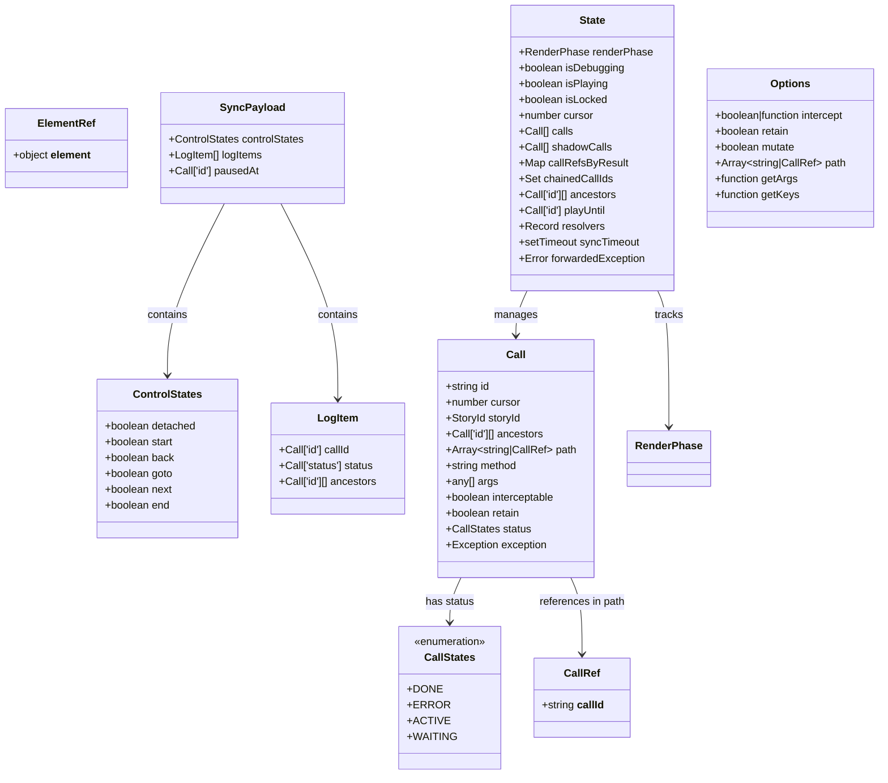
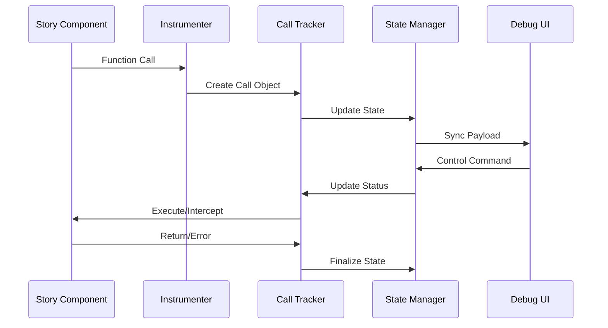
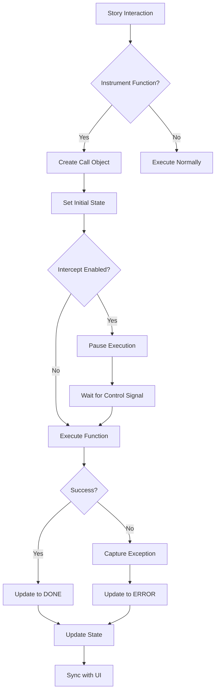

# Instrumenter Types Module Documentation

## Introduction

The `instrumenter_types` module provides the foundational type definitions for Storybook's interaction testing and debugging system. It defines the core data structures that enable tracking, monitoring, and controlling the execution of story interactions, making it essential for Storybook's interactive features and testing capabilities.

## Core Architecture

### Type System Overview

The module implements a comprehensive type system that models the lifecycle of instrumented function calls within Storybook's interactive environment. These types support:

- **Call Tracking**: Monitoring function invocations and their states
- **State Management**: Managing the debugging and playback state
- **Interaction Control**: Providing fine-grained control over story execution
- **Error Handling**: Capturing and reporting exceptions during interactions

### Core Components

## Detailed Component Specifications

### Call Interface

The `Call` interface represents a single instrumented function invocation within the Storybook environment. It captures comprehensive metadata about each call:

- **Identification**: Unique `id` and `cursor` position for tracking
- **Context**: Associated `storyId` and hierarchical `ancestors`
- **Execution Path**: Array of method names and call references
- **Arguments**: Function arguments for replay and inspection
- **State Management**: Current execution status and error information
- **Control Flags**: `interceptable` and `retain` for behavior control

### CallStates Enumeration

Defines the lifecycle states of instrumented calls:

- **`DONE`**: Call completed successfully
- **`ERROR`**: Call failed with an exception
- **`ACTIVE`**: Call currently executing
- **`WAITING`**: Call queued for execution

### State Management

The `State` interface serves as the central state container for the instrumenter:

- **Execution Control**: `isDebugging`, `isPlaying`, `isLocked` flags
- **Call Management**: Arrays for active and shadow calls
- **Reference Tracking**: Maps for call references and chained executions
- **Navigation**: Cursor position and playback controls
- **Error Handling**: Exception forwarding and resolver management

### Control and Synchronization

The `ControlStates` and `SyncPayload` interfaces enable remote control and state synchronization:

- **Playback Controls**: Start, stop, step-through capabilities
- **State Synchronization**: Real-time updates between components
- **Logging**: Structured event logging for debugging

## Data Flow Architecture

## Integration with Storybook Ecosystem

### Dependencies

The `instrumenter_types` module integrates with several key Storybook components:

- **[storybook_configuration](storybook_configuration.md)**: Uses `StoryId` from core types
- **[preview_api](preview_api.md)**: Shares `RenderPhase` for execution tracking
- **[instrumenter](instrumenter.md)**: Provides types for the main instrumenter implementation

### Usage Patterns

1. **Interaction Testing**: Types enable recording and replaying user interactions
2. **Debug Mode**: Support for step-through debugging of story executions
3. **Error Reporting**: Structured error capture and display
4. **State Inspection**: Real-time monitoring of story state changes

## Process Flow

## Key Features

### 1. Hierarchical Call Tracking

The system maintains parent-child relationships between calls through the `ancestors` array, enabling:
- Call stack reconstruction
- Selective debugging of call branches
- Context-aware error reporting

### 2. Flexible Interception

The `Options` interface provides configurable interception:
- Global or selective function interception
- Custom argument transformation
- Path-based filtering

### 3. Error Context Preservation

Exception handling includes:
- Full error details (name, message, stack)
- Call context identification
- Diff information for assertion failures
- Actual vs expected value tracking

### 4. State Synchronization

Real-time state updates ensure:
- UI consistency across components
- Collaborative debugging sessions
- Playback state persistence

## Best Practices

### Type Usage

1. **Call Creation**: Always provide complete call metadata for accurate tracking
2. **State Updates**: Use immutable updates to prevent race conditions
3. **Error Handling**: Capture exceptions at the call level for detailed reporting
4. **Reference Management**: Properly manage call references to prevent memory leaks

### Performance Considerations

1. **Selective Instrumentation**: Use interception filters to minimize overhead
2. **Call Retention**: Manage `retain` flags to control memory usage
3. **Sync Timing**: Batch state updates to reduce UI churn
4. **Shadow Calls**: Use shadow calls for non-intrusive monitoring

## Related Documentation

- [instrumenter](instrumenter.md) - Main instrumenter implementation using these types
- [storybook_configuration](storybook_configuration.md) - Core configuration and types
- [preview_api](preview_api.md) - Preview functionality and render phases
- [component_story_format](component_story_format.md) - Story format and type definitions

## Summary

The `instrumenter_types` module provides a robust foundation for Storybook's interaction testing capabilities. Through its comprehensive type system, it enables precise tracking, control, and debugging of story interactions while maintaining flexibility for various use cases and integration patterns.