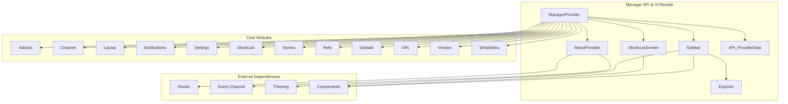
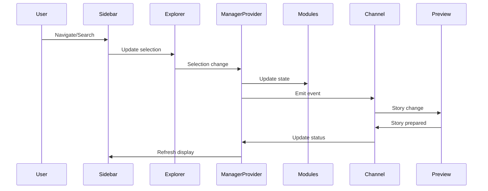
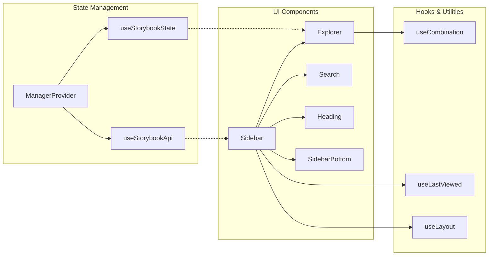

# Manager API and UI Module

## Introduction

The Manager API and UI module serves as the central orchestration layer for Storybook's user interface and state management. It provides the foundational architecture that connects the Storybook manager (the UI shell) with the preview (where stories are rendered), handles routing, manages global state, and coordinates between various subsystems including addons, shortcuts, notifications, and user preferences.

This module is essential for understanding how Storybook's interface operates, how different components communicate, and how the overall user experience is managed across the application.

## Architecture Overview

The Manager API and UI module follows a modular architecture pattern with clear separation of concerns:



## Core Components

### ManagerProvider

The `ManagerProvider` is the central state management component that orchestrates the entire Storybook manager. It combines multiple modules into a cohesive API and state management system.

**Key Responsibilities:**
- Initialize and manage global application state
- Coordinate between different functional modules (addons, stories, layout, etc.)
- Provide a unified API surface for components to interact with Storybook
- Handle routing and navigation state
- Manage provider data and configuration

**State Management:**
The ManagerProvider maintains a comprehensive state that includes:
- Layout configuration and preferences
- Story index and navigation structure
- Addon states and configurations
- Global variables and parameters
- UI preferences and settings
- Notification and version information

**Module Integration:**
The provider integrates 12 core modules, each responsible for specific functionality:
- **Provider**: Core provider functionality
- **Channel**: Event communication system
- **Addons**: Addon management and registration
- **Layout**: UI layout and panel management
- **Notifications**: User notification system
- **Settings**: User preference management
- **Shortcuts**: Keyboard shortcut handling
- **Stories**: Story index and management
- **Refs**: External reference handling
- **Globals**: Global variable management
- **URL**: URL routing and state synchronization
- **Version**: Version information and updates
- **WhatsNew**: New feature announcements

### ReactProvider

The `ReactProvider` serves as the entry point for the Storybook manager UI, handling the initialization and configuration of the React-based interface.

**Key Features:**
- Channel creation and management for event communication
- Addon registration and lifecycle management
- WebSocket connection handling with automatic reconnection logic
- Toolbar integration and management
- Error handling for connection issues

**Initialization Process:**
1. Creates browser channel for communication
2. Registers toolbar addon
3. Sets up WebSocket disconnect handling
4. Renders the main Storybook UI

### Sidebar Component

The `Sidebar` component provides the primary navigation interface for Storybook, enabling users to browse and search through stories, components, and documentation.

**Core Functionality:**
- Story tree navigation and exploration
- Search and filtering capabilities
- Tag-based filtering system
- Story creation workflow (in development mode)
- Responsive design for mobile and desktop
- Integration with keyboard shortcuts

**Key Features:**
- **Explorer**: Hierarchical story navigation
- **Search**: Real-time story and component search
- **Tags Filter**: Filter stories by tags
- **Create Story**: Quick story creation for React projects
- **Responsive Design**: Adaptive layout for different screen sizes

### Explorer Component

The `Explorer` component renders the hierarchical tree structure of stories and components, providing keyboard navigation and highlighting capabilities.

**Responsibilities:**
- Render story hierarchy as interactive tree
- Handle keyboard navigation and selection
- Manage highlighted states and visual feedback
- Coordinate with sidebar for user interactions

### ShortcutsScreen

The `ShortcutsScreen` component provides a comprehensive interface for managing and customizing keyboard shortcuts throughout Storybook.

**Features:**
- Visual shortcut configuration interface
- Conflict detection and validation
- Default shortcut restoration
- Real-time shortcut testing
- Support for addon-specific shortcuts

## Data Flow Architecture



## API Integration

### API_ProviderData

The `API_ProviderData` interface defines the contract between the manager and external providers, ensuring consistent data flow and configuration management.

**Key Properties:**
- **provider**: Core provider implementation
- **docsOptions**: Documentation configuration
- **renderPreview**: Preview rendering function
- **handleAPI**: API initialization callback
- **getConfig**: Configuration retrieval

### State Management Patterns

The module employs several state management patterns:

1. **Centralized State**: Single source of truth through ManagerProvider
2. **Module-based State**: Each module manages its own sub-state
3. **Event-driven Updates**: Channel-based communication for state changes
4. **Persistent State**: Local storage integration for user preferences

## Component Relationships



## Integration with Other Modules

### Component Story Format Integration
The manager API integrates with the [component_story_format](component_story_format.md) module to:
- Parse and index story files
- Handle story identifiers and metadata
- Manage story arguments and parameters
- Support different rendering types

### Preview API Integration
Coordinates with the [preview_api](preview_api.md) module for:
- Story rendering coordination
- State synchronization
- Event communication
- Preview configuration

### Core UI Library Integration
Leverages the [core_ui_library](core_ui_library.md) for:
- Consistent UI components
- Theming and styling
- Icon management
- Form controls and interactions

### Addon System Integration
Works with various addon modules including:
- [docs_addon](docs_addon.md): Documentation rendering
- [a11y_addon](a11y_addon.md): Accessibility testing
- [core_addon_types](core_addon_types.md): Core addon functionality

## Key Features and Capabilities

### 1. Modular Architecture
- 12 specialized modules for different functionalities
- Clear separation of concerns
- Extensible design for custom modules

### 2. Event-Driven Communication
- Channel-based event system
- Real-time state synchronization
- Decoupled component communication

### 3. Responsive Design
- Mobile-first approach
- Adaptive layouts
- Touch-friendly interactions

### 4. Accessibility Support
- Keyboard navigation throughout
- Screen reader compatibility
- High contrast mode support

### 5. Performance Optimization
- Memoized components for efficient re-renders
- Lazy loading for large story sets
- Optimized search and filtering

## Usage Patterns

### Basic State Access
```typescript
const state = useStorybookState();
const api = useStorybookApi();
```

### Parameter Access
```typescript
const parameter = useParameter('parameterKey', defaultValue);
```

### Shared State Management
```typescript
const [state, setState] = useSharedState('stateId', initialValue);
```

### Args Management
```typescript
const [args, updateArgs, resetArgs, initialArgs] = useArgs();
```

### Globals Management
```typescript
const [globals, updateGlobals, storyGlobals, userGlobals] = useGlobals();
```

## Error Handling and Resilience

The module implements comprehensive error handling:

1. **Connection Management**: Automatic reconnection for WebSocket failures
2. **State Validation**: Input validation and sanitization
3. **Error Boundaries**: React error boundaries for component failures
4. **Graceful Degradation**: Continued operation when non-critical features fail

## Extension Points

The modular architecture provides several extension points:

1. **Custom Modules**: Implement new functionality modules
2. **Addon Integration**: Register custom addons
3. **Provider Extensions**: Custom provider implementations
4. **UI Customization**: Theme and component overrides
5. **Shortcut Customization**: Custom keyboard shortcuts

## Best Practices

### For Developers
1. Use provided hooks for state access
2. Follow the established module pattern
3. Implement proper error handling
4. Consider performance implications
5. Maintain accessibility standards

### For Integrators
1. Understand the event flow
2. Respect the modular boundaries
3. Use the channel system for communication
4. Follow the provider pattern
5. Implement proper cleanup

This comprehensive documentation provides the foundation for understanding and working with the Manager API and UI module, enabling effective development and integration with the broader Storybook ecosystem.