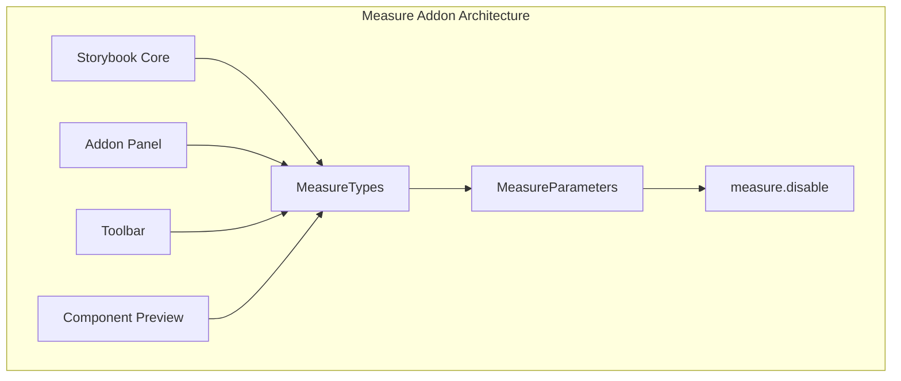
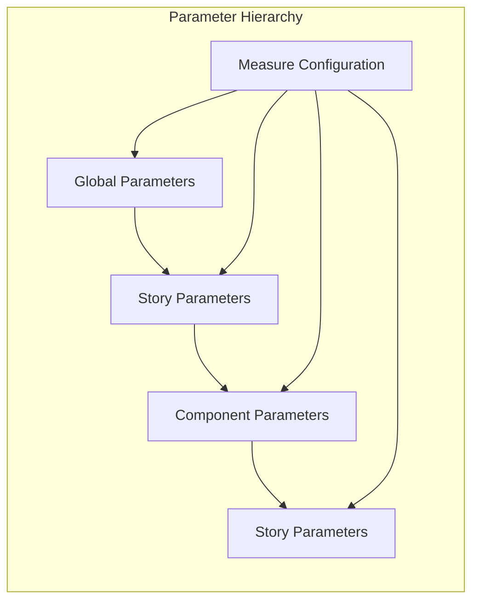
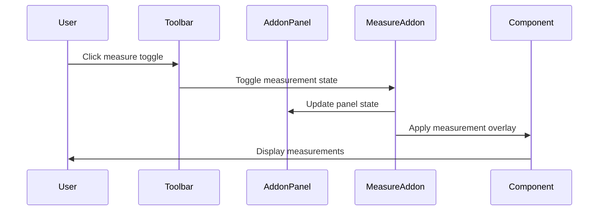
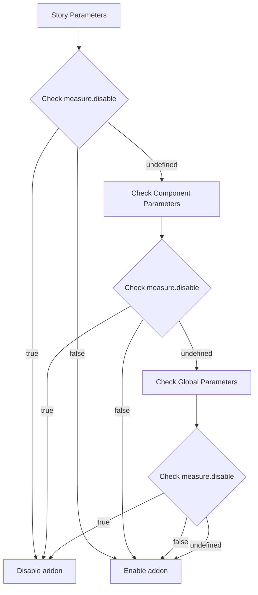

# Measure Addon Module Documentation

## Introduction

The Measure addon is a core Storybook addon that provides visual measurement tools for inspecting component dimensions, spacing, and positioning. It enables developers to overlay measurement guides on components during development, making it easier to verify layout specifications, check spacing consistency, and debug visual alignment issues.

## Core Functionality

The Measure addon provides a simple yet powerful interface for visual debugging of component layouts. Through the `MeasureParameters` interface, users can control the addon's behavior at both global and component levels.

### Key Features

- **Visual Measurement Overlays**: Displays pixel-perfect measurement guides on components
- **Toggle Control**: Enable/disable measurements through Storybook's UI or programmatically
- **Parameter-based Configuration**: Configure measurement behavior through Storybook parameters
- **Integration with Storybook UI**: Seamlessly integrates with Storybook's addon panel and toolbar

## Architecture

### Component Structure



### Type Definitions

The Measure addon exports two main interfaces that define its configuration structure:

#### MeasureParameters Interface

```typescript
interface MeasureParameters {
  measure?: {
    disable?: boolean;
  };
}
```

- `measure`: Optional configuration object
- `disable`: Boolean flag to disable the addon's behavior and remove it from the addon panel

#### MeasureTypes Interface

```typescript
interface MeasureTypes {
  parameters: MeasureParameters;
}
```

- `parameters`: Container for all measure-related configuration options

## Integration with Storybook Ecosystem

### Parameter System Integration

The Measure addon integrates with Storybook's parameter system, allowing configuration at multiple levels:



### UI Integration Points

The Measure addon integrates with several Storybook UI components:

- **Addon Panel**: Provides the main interface for measurement controls
- **Toolbar**: Offers quick toggle access to measurement features
- **Preview Area**: Renders measurement overlays on components

## Usage Patterns

### Basic Configuration

```typescript
// .storybook/preview.js
export const parameters = {
  measure: {
    disable: false
  }
};
```

### Component-Level Configuration

```typescript
// Component story
export default {
  title: 'Components/Button',
  parameters: {
    measure: {
      disable: true // Disable measurements for this component
    }
  }
};
```

### Conditional Configuration

```typescript
// Conditionally enable based on environment
export const parameters = {
  measure: {
    disable: process.env.NODE_ENV === 'production'
  }
};
```

## Data Flow

### Measurement Activation Flow



### Parameter Resolution Flow



## Dependencies and Relationships

### Core Dependencies

The Measure addon depends on several Storybook core systems:

- **[core_addon_types](core_addon_types.md)**: Provides the base type system for addon integration
- **[storybook_configuration](storybook_configuration.md)**: Supplies configuration infrastructure
- **[manager_api_and_ui](manager_api_and_ui.md)**: Enables UI integration and panel management
- **[preview_api](preview_api.md)**: Facilitates preview area overlay rendering

### Related Addons

The Measure addon works closely with other visual debugging addons:

- **[outline_addon](outline_addon.md)**: Provides component outline visualization
- **[viewport_addon](viewport_addon.md)**: Manages responsive design testing
- **[backgrounds_addon](backgrounds_addon.md)**: Controls preview background settings

## Configuration Reference

### MeasureParameters

| Property | Type | Default | Description |
|----------|------|---------|-------------|
| `measure` | `object` | `undefined` | Measure addon configuration object |
| `measure.disable` | `boolean` | `false` | Disables the addon when set to `true` |

### Usage Examples

#### Global Configuration

```typescript
// .storybook/preview.js
export const parameters = {
  measure: {
    disable: false
  }
};
```

#### Story-Level Configuration

```typescript
export const Primary = {
  parameters: {
    measure: {
      disable: true
    }
  }
};
```

#### Conditional Configuration

```typescript
export const parameters = {
  measure: {
    disable: process.env.NODE_ENV === 'production'
  }
};
```

## Best Practices

### When to Use Measure Addon

- **Layout Debugging**: Verify component spacing and alignment
- **Design System Compliance**: Ensure components match design specifications
- **Responsive Testing**: Check measurements across different viewport sizes
- **Component Documentation**: Provide visual measurement references

### Configuration Guidelines

1. **Global Level**: Set default behavior for all stories
2. **Component Level**: Override for specific components when needed
3. **Story Level**: Fine-tune for individual story scenarios
4. **Environment Awareness**: Disable in production builds to reduce bundle size

### Performance Considerations

- The Measure addon has minimal performance impact when disabled
- Measurement overlays are only rendered when actively enabled
- Consider disabling in production builds to reduce bundle size

## Troubleshooting

### Common Issues

1. **Measurements Not Appearing**
   - Verify the addon is not disabled in parameters
   - Check that the measure toggle is enabled in the toolbar
   - Ensure the addon is properly registered in `main.js`

2. **Performance Issues**
   - Disable measurements for complex components
   - Use component-level configuration to selectively enable

3. **Configuration Conflicts**
   - Check parameter hierarchy resolution
   - Verify no conflicting configurations at different levels

### Debug Steps

1. Check browser console for addon loading errors
2. Verify `measure` parameter is correctly structured
3. Test with minimal configuration to isolate issues
4. Review Storybook addon registration in `main.js`

## API Reference

### Types

#### MeasureParameters

```typescript
interface MeasureParameters {
  measure?: {
    disable?: boolean;
  };
}
```

#### MeasureTypes

```typescript
interface MeasureTypes {
  parameters: MeasureParameters;
}
```

### Parameters

The Measure addon respects the following parameter structure:

```typescript
{
  measure: {
    disable?: boolean
  }
}
```

## Future Considerations

### Potential Enhancements

- **Custom Measurement Units**: Support for rem, em, percentage measurements
- **Measurement Persistence**: Save measurement preferences across sessions
- **Advanced Overlays**: Grid lines, baseline indicators, spacing guides
- **Export Functionality**: Export measurements as design tokens
- **Integration APIs**: Programmatic access to measurement data

### Migration Notes

The Measure addon maintains backward compatibility with existing parameter configurations. Future updates will preserve the current API while potentially adding new optional features.

## Related Documentation

- [Storybook Configuration](storybook_configuration.md) - Core configuration system
- [Core Addon Types](core_addon_types.md) - Base type system for addons
- [Outline Addon](outline_addon.md) - Related visual debugging addon
- [Viewport Addon](viewport_addon.md) - Responsive design testing
- [Backgrounds Addon](backgrounds_addon.md) - Preview background management