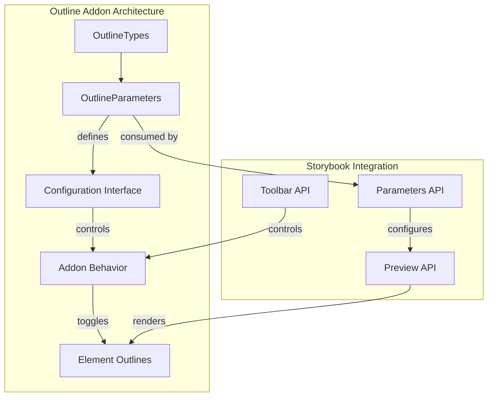
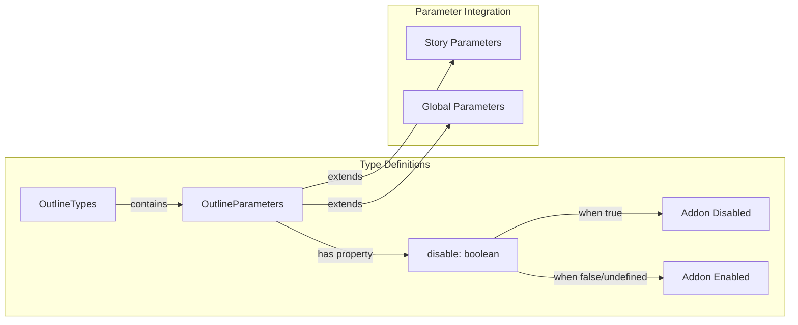
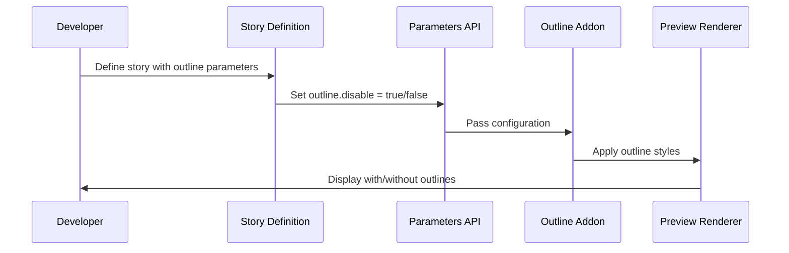
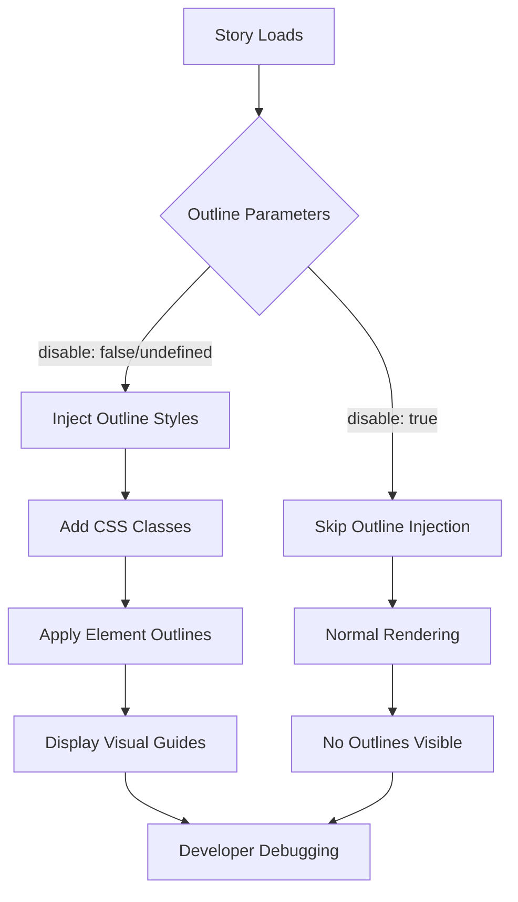

# Outline Addon Module Documentation

## Introduction

The Outline addon is a core Storybook addon that provides visual debugging capabilities by displaying element outlines in the preview area. This essential development tool helps developers visualize component boundaries, spacing, and layout structure during the component development process. The addon is part of Storybook's built-in essentials package and integrates seamlessly with the preview API to overlay visual guides on rendered components.

## Module Overview

The Outline addon serves as a lightweight yet powerful debugging utility within the Storybook ecosystem. It operates by injecting CSS outlines around DOM elements in the preview iframe, allowing developers to quickly identify component boundaries, detect spacing issues, and understand layout relationships. The module follows Storybook's addon architecture pattern, providing both parameter-based configuration and toolbar integration for easy toggling.

## Architecture

### Component Architecture



### Type System Architecture



## Core Components

### OutlineTypes

The `OutlineTypes` interface serves as the primary type definition for the Outline addon, establishing the contract between the addon and the Storybook framework.

**Location**: `code.core.src.outline.types.OutlineTypes`

**Purpose**: Defines the complete type structure for outline-related functionality within Storybook.

**Interface Definition**:
```typescript
export interface OutlineTypes {
  parameters: OutlineParameters;
}
```

### OutlineParameters

The `OutlineParameters` interface provides the configuration options for controlling the Outline addon's behavior at the story, component, or global level.

**Location**: `code.core.src.outline.types.OutlineParameters`

**Purpose**: Enables fine-grained control over outline functionality through Storybook's parameter system.

**Interface Definition**:
```typescript
export interface OutlineParameters {
  /**
   * Outline configuration
   *
   * @see https://storybook.js.org/docs/essentials/measure-and-outline#parameters
   */
  outline?: {
    /** Remove the addon panel and disable the addon's behavior */
    disable?: boolean;
  };
}
```

## Data Flow

### Parameter Flow



### Runtime Behavior



## Integration Points

### Preview API Integration

The Outline addon integrates with the [preview_api](preview_api.md) module to access the rendered DOM and apply outline styles. This integration occurs through the preview's lifecycle hooks, allowing the addon to modify the rendered output before presentation.

### Parameters API Integration

Configuration flows through Storybook's parameters system, allowing outline settings to be defined at multiple levels:
- **Global**: Applied to all stories
- **Component**: Applied to all stories of a component
- **Story**: Applied to individual stories

### Toolbar Integration

The addon typically integrates with Storybook's toolbar system, providing a toggle button for quick enable/disable functionality during development sessions.

## Configuration Options

### Parameter-Based Configuration

```typescript
// Story-level configuration
export const MyStory = {
  parameters: {
    outline: {
      disable: true // Disable outlines for this specific story
    }
  }
};

// Component-level configuration
export default {
  title: 'MyComponent',
  parameters: {
    outline: {
      disable: false // Enable outlines for all stories of this component
    }
  }
};
```

### Global Configuration

```typescript
// .storybook/preview.js
export const parameters = {
  outline: {
    disable: false // Global outline configuration
  }
};
```

## Dependencies

### Core Dependencies

- **[core_addon_types](core_addon_types.md)**: The Outline addon extends the core addon types system, specifically through the `OutlineTypes` interface which contributes to the unified addon type definitions.

### Runtime Dependencies

- **[preview_api](preview_api.md)**: Provides access to the preview environment and DOM manipulation capabilities
- **[storybook_configuration](storybook_configuration.md)**: Leverages the core configuration system for parameter handling

### Type Dependencies

- **[component_story_format](component_story_format.md)**: Integrates with the CSF (Component Story Format) for parameter type safety

## Usage Patterns

### Development Workflow

1. **Enable Outlines**: Toggle the outline feature via toolbar or parameters
2. **Visual Inspection**: Examine component boundaries and spacing
3. **Layout Debugging**: Identify alignment and positioning issues
4. **Disable When Complete**: Turn off outlines for final review

### Best Practices

- Use outlines during active development and debugging phases
- Disable outlines for documentation and presentation stories
- Consider component-level configuration for consistent behavior
- Combine with other debugging tools like the Measure addon

## Extension Points

### Custom Styling

While the core addon provides basic outline functionality, the architecture allows for potential extensions:
- Custom outline colors and styles
- Element-specific outline rules
- Integration with design system tokens

### Advanced Features

Future enhancements could include:
- Element information overlays
- Spacing measurements
- Accessibility outline validation
- Responsive breakpoint visualization

## Relationship to Other Modules

### Sibling Addons

The Outline addon is part of the essential debugging toolkit alongside:
- **[measure_addon](measure_addon.md)**: Provides measurement tools for precise spacing
- **[a11y_addon](a11y_addon.md)**: Offers accessibility debugging capabilities
- **[docs_addon](docs_addon.md)**: Handles documentation rendering

### Core Integration

The module integrates with Storybook's core systems:
- **[manager_api_and_ui](manager_api_and_ui.md)**: For toolbar and UI integration
- **[core_ui_library](core_ui_library.md)**: For consistent UI components
- **[theming](theming.md)**: For theme-aware outline styling

## Technical Implementation Notes

### Performance Considerations

- Outline styles are applied via CSS classes for minimal performance impact
- Dynamic toggling uses efficient DOM manipulation
- No persistent state management required

### Browser Compatibility

- Relies on standard CSS outline properties
- Compatible with all modern browsers
- Graceful degradation for older browsers

### Accessibility

- Outline colors respect user preferences
- High contrast mode compatibility
- No interference with screen readers

## Troubleshooting

### Common Issues

1. **Outlines Not Visible**: Check if disabled at story, component, or global level
2. **Performance Impact**: Disable for complex stories with many elements
3. **Style Conflicts**: Ensure outline styles don't conflict with component styles

### Debug Steps

1. Verify parameter configuration
2. Check addon registration
3. Inspect applied CSS classes
4. Review browser console for errors

## Future Enhancements

### Potential Improvements

- Element hierarchy visualization
- Custom outline themes
- Integration with design tokens
- Advanced filtering options
- Export functionality for documentation

### API Evolution

The type system is designed to accommodate future enhancements while maintaining backward compatibility through optional properties and extensible interfaces.

## Conclusion

The Outline addon represents a focused, single-purpose tool that exemplifies Storybook's addon architecture. Its simple type definition belies its utility in the development workflow, providing essential visual debugging capabilities that enhance the component development experience. The module's integration with Storybook's parameter system demonstrates the framework's flexible configuration approach, while its minimal API surface ensures ease of use and maintenance.