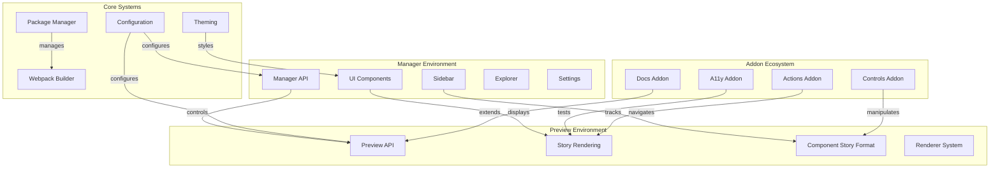

# Storybook Repository Overview

## Purpose

The `storybookjs--storybook` repository is the monorepo that contains the complete source code for Storybook, an open-source tool for developing UI components in isolation. Storybook enables developers to build, document, and test components independently of their application context, providing a powerful environment for component-driven development.

## Architecture

Storybook follows a modular architecture with clear separation between the manager (UI shell) and preview (component rendering) environments. The system is built around a plugin-based addon architecture that allows for extensive customization and extension.

## Core Modules

### 1. Storybook Configuration (`storybook_configuration`)
Central configuration system that orchestrates all aspects of Storybook's behavior. Defines core interfaces for build processes, addon management, framework integration, and development server settings.

### 2. Component Story Format (`component_story_format`)
Foundational type system and data structures that enable Storybook to understand, process, and render component stories across different frameworks. Provides standardized formats for story definitions.

### 3. Manager API and UI (`manager_api_and_ui`)
Central orchestration layer for Storybook's user interface and state management. Handles routing, global state, and coordinates between subsystems including addons, shortcuts, and user preferences.

### 4. Preview API (`preview_api`)
Manages the rendering and lifecycle of stories within the preview iframe. Serves as the bridge between the manager UI and actual story rendering, handling story selection and state management.

### 5. Core UI Library (`core_ui_library`)
Foundational user interface components that implement Storybook's design system. Provides theme-aware, accessible, and consistent React components including buttons, tooltips, tabs, and forms.

### 6. Package Manager Abstraction (`package_manager_abstraction`)
Unified interface for interacting with different JavaScript package managers (npm, yarn, pnpm, bun). Enables Storybook to work seamlessly regardless of the package manager used.

### 7. Webpack Builder (`webpack_builder`)
Manages Webpack configurations and build processes for bundling Storybook's UI components, addons, and user stories using Webpack 5.

### 8. Theming (`theming`)
Comprehensive theming system providing consistent visual styling across the application. Supports light/dark themes with extensive customization options.

## Addon Ecosystem

### Docs Addon (`docs_addon`)
Provides comprehensive documentation capabilities for components and stories, enabling rich, interactive documentation pages with live previews and props documentation.

### A11y Addon (`a11y_addon`)
Automated accessibility testing capabilities that integrate with axe-core to perform comprehensive accessibility audits and present results within Storybook's addon panel.

### Core Addon Types (`core_addon_types`)
Central type definition system for Storybook's essential addons including Actions, Backgrounds, Viewport, Controls, Outline, Measure, and Themes.

## Additional Modules

### Angular Framework (`angular_framework`)
Provides Storybook with the capability to render and manage Angular components, serving as a bridge between Storybook's core functionality and Angular's component architecture.

### CLI Automigration (`cli_automigration`)
Automated migration capabilities to help users upgrade their Storybook configurations and dependencies, reducing manual effort required for Storybook upgrades.

### Instrumenter (`instrumenter`)
Runtime code instrumentation capabilities that enable interactive debugging, step-through execution, and interaction tracking within Storybook stories.

## Key Features

- **Framework Agnostic**: Supports React, Vue, Angular, Web Components, and more
- **Addon Architecture**: Extensible plugin system for custom functionality
- **TypeScript Support**: Comprehensive type safety throughout the system
- **Multiple Builders**: Support for Webpack, Vite, and other build tools
- **Theme System**: Flexible theming with light/dark mode support
- **Testing Integration**: Built-in support for interaction testing and accessibility
- **Documentation Generation**: Automatic docs generation from components and stories
- **Package Manager Support**: Works with npm, yarn, pnpm, and bun

## Development Workflow

Storybook's architecture supports a component-driven development workflow where developers can:

1. Create isolated component stories using the Component Story Format
2. Develop and test components in the preview environment
3. Document components with the Docs addon
4. Test accessibility with the A11y addon
5. Share components through the manager UI
6. Export for testing and static site generation

This repository represents a comprehensive, production-ready tool for modern frontend development, providing everything needed for building, documenting, and testing UI components at scale.