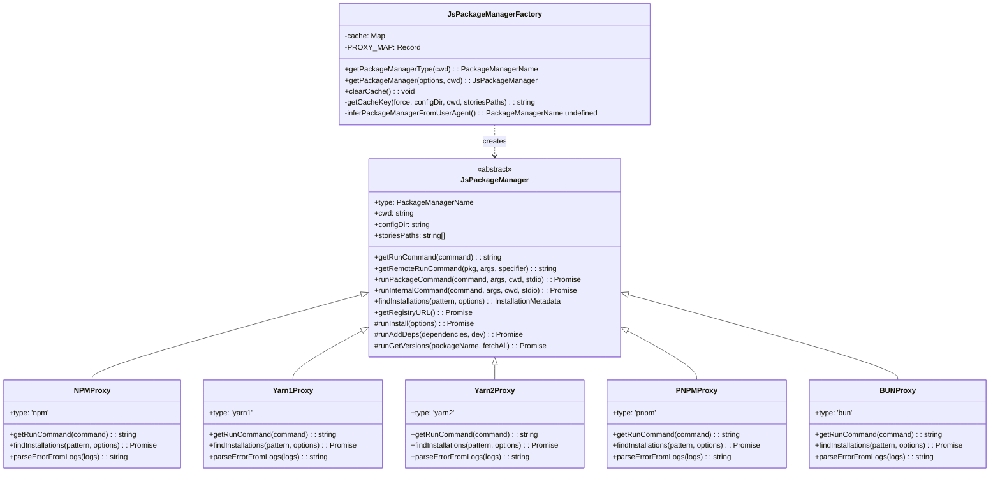
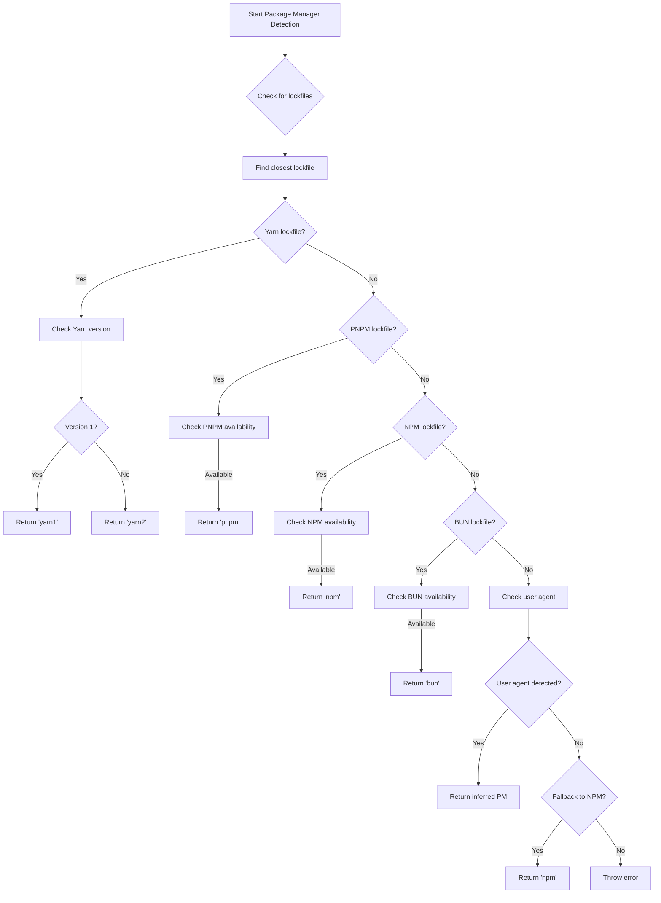
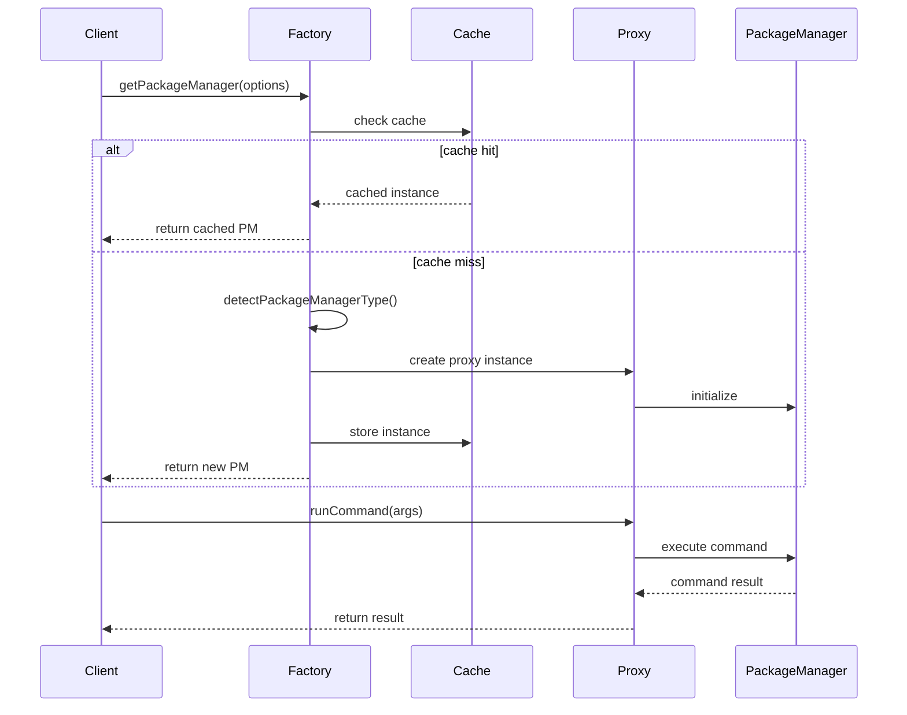
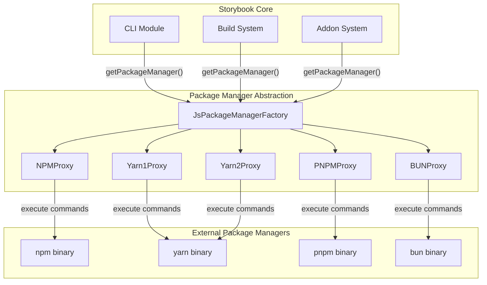
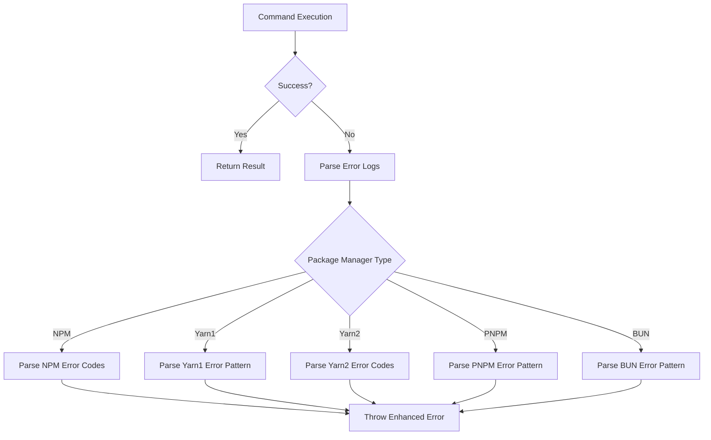
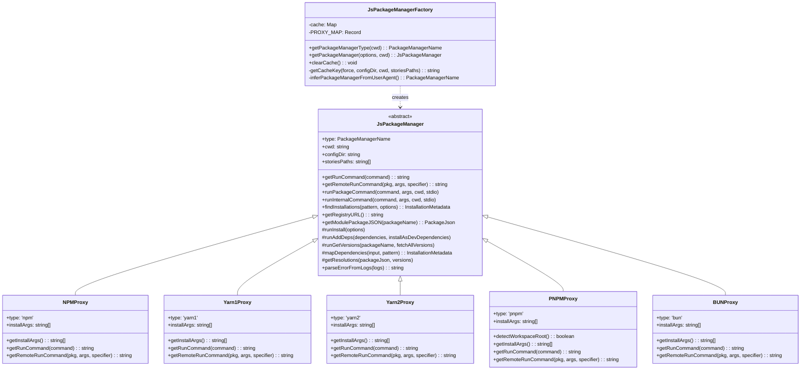
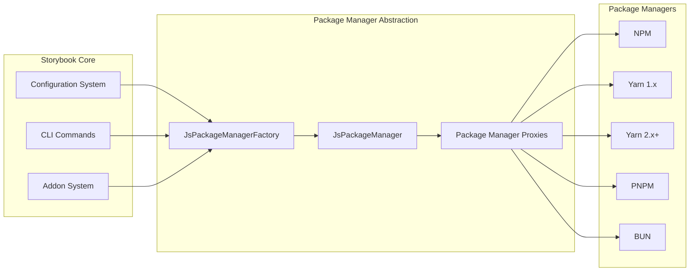

# Package Manager Abstraction Module

## Introduction

The package_manager_abstraction module provides a unified interface for interacting with different JavaScript package managers in Storybook. It abstracts away the differences between npm, yarn (v1 and v2), pnpm, and bun, allowing Storybook to work seamlessly regardless of which package manager the user has installed.

This module is essential for Storybook's CLI operations, dependency management, and build processes, ensuring consistent behavior across different package management ecosystems.

## Architecture Overview

The module follows a factory pattern with proxy implementations for each supported package manager. The architecture consists of:

- **JsPackageManagerFactory**: Central factory for creating package manager instances
- **JsPackageManager**: Abstract base class defining the common interface
- **Package-specific proxies**: Concrete implementations for each package manager
- **Type definitions**: Shared types and interfaces

### Class Architecture



### Package Manager Detection Flow



## Core Components

### JsPackageManagerFactory

The factory class responsible for detecting and instantiating the appropriate package manager. It uses a multi-step detection strategy:

1. **Lockfile Detection**: Searches for lockfiles (package-lock.json, yarn.lock, pnpm-lock.yaml, bun.lockb) from the current directory upward
2. **Command Detection**: Verifies which package manager commands are available
3. **User Agent Detection**: Examines the `npm_config_user_agent` environment variable
4. **Fallback Strategy**: Defaults to npm if available, throws error if no package manager is found

## Data Flow Architecture



## Key Features

### 1. Automatic Package Manager Detection
The module automatically detects which package manager to use based on:
- Lockfile presence and proximity
- Available commands in the system
- User agent information from the execution environment

### 2. Command Abstraction
Provides unified methods for common operations:
- `getRunCommand()`: Generate run scripts
- `getRemoteRunCommand()`: Execute remote packages (npx equivalent)
- `runPackageCommand()`: Execute package binaries
- `runInternalCommand()`: Run package manager internal commands

### 3. Dependency Management
- `findInstallations()`: Discover installed packages matching patterns
- `runAddDeps()`: Add dependencies with dev/prod classification
- `runInstall()`: Install dependencies with force options
- `getResolutions()`: Handle dependency resolution overrides

### 4. Error Handling
Each proxy includes package manager-specific error parsing:
- NPM error codes and messages
- Yarn 1 error patterns
- Yarn 2 error codes with detailed descriptions
- PNPM error patterns
- BUN error compatibility

### 5. Caching Strategy
The factory implements intelligent caching:
- Cache key based on force flag, config directory, working directory, and story paths
- Prevents redundant package manager detection
- Cache clearing capability for testing and development

## Integration with Storybook Ecosystem

The package manager abstraction is used throughout Storybook for:

### CLI Operations
- Project initialization and setup
- Dependency installation during automigrations
- Package version checking and updates

### Build Process
- Installing build dependencies
- Running build scripts
- Managing development dependencies

### Addon Management
- Installing addon dependencies
- Managing addon peer dependencies
- Version compatibility checking



## Configuration and Usage

### Basic Usage
```typescript
import { JsPackageManagerFactory } from '@storybook/core/js-package-manager';

// Get the detected package manager
const packageManager = JsPackageManagerFactory.getPackageManager();

// Run a script
await packageManager.runInternalCommand('install', []);

// Add dependencies
await packageManager.runAddDeps(['react', 'react-dom'], true);
```

### Forced Package Manager
```typescript
// Force a specific package manager
const packageManager = JsPackageManagerFactory.getPackageManager({
  force: 'pnpm'
});
```

### Cache Management
```typescript
// Clear the package manager cache
JsPackageManagerFactory.clearCache();
```

## Error Handling

The module provides comprehensive error handling with package manager-specific error messages:



## Testing and Development

The module is designed for testability:
- Mock-friendly interface through the factory pattern
- Cache clearing for test isolation
- Force option for deterministic behavior in tests
- Comprehensive error messages for debugging

## Future Considerations

The architecture supports easy addition of new package managers:
1. Create a new proxy class extending `JsPackageManager`
2. Implement required abstract methods
3. Add to the `PROXY_MAP` in the factory
4. Update detection logic if needed

This modular design ensures Storybook can adapt to the evolving JavaScript package management landscape while maintaining backward compatibility and consistent behavior across all supported package managers.

## Dependencies and Integration

### Internal Dependencies
The package manager abstraction module integrates with several other Storybook modules:

- **[storybook_configuration](storybook_configuration.md)**: Uses configuration settings for package manager selection and project setup
- **[core_ui_library](core_ui_library.md)**: Manages UI component dependencies and installations
- **[docs_addon](docs_addon.md)**: Handles documentation-related package installations
- **[webpack_builder](webpack_builder.md)**: Manages build tool dependencies and webpack-specific packages

### External Dependencies
- `cross-spawn`: Cross-platform process spawning for command execution
- `find-up`: File system traversal for lockfile detection
- `semver`: Version sorting and comparison for package version management
- `@yarnpkg/fslib`, `@yarnpkg/libzip`: Yarn 2.x PnP (Plug'n'Play) support

## Advanced Features

### Workspace Support
Each package manager proxy handles workspace-specific functionality:

- **NPM**: Supports npm workspaces with appropriate flags
- **Yarn 1**: Handles classic workspace structures
- **Yarn 2**: Full PnP support with virtual filesystem access
- **PNPM**: Native workspace support with pnpm-workspace.yaml detection
- **BUN**: Emerging workspace capabilities

### Registry Management
The module provides registry URL detection for each package manager:
- NPM: `npm config get registry`
- Yarn 1: `yarn config get registry`
- Yarn 2: `yarn config get npmRegistryServer`
- PNPM: `pnpm config get registry`
- BUN: Uses npm registry configuration

### Version Management
Comprehensive version handling capabilities:
- Fetch single version: `runGetVersions(packageName, false)`
- Fetch all versions: `runGetVersions(packageName, true)`
- Version pattern matching with wildcard support
- Semantic version sorting and comparison

## Performance Optimization

### Intelligent Caching
The factory implements sophisticated caching mechanisms:

```typescript
// Cache key includes all relevant parameters
private static getCacheKey(
  force?: PackageManagerName,
  configDir = '.storybook',
  cwd = process.cwd(),
  storiesPaths?: string[]
): string {
  return JSON.stringify({ force: force || null, configDir, cwd, storiesPaths });
}
```

### Command Optimization
- Uses package manager-specific flags for optimal performance
- CI environment detection for appropriate argument selection
- Parallel command execution where possible
- Efficient lockfile parsing and detection

## Error Recovery and Resilience

### Fallback Mechanisms
The detection system includes multiple fallback strategies:
1. Primary: Lockfile-based detection
2. Secondary: Command availability check
3. Tertiary: User agent parsing
4. Final: Default to npm if available

### Error Context Preservation
Each proxy preserves and enhances error context:
- Original error messages from package managers
- Translated error codes with human-readable descriptions
- Suggested remediation steps
- Command context for debugging

## Security Considerations

### Command Execution Safety
- Uses spawn instead of exec for better control
- Sanitizes command arguments
- Validates package names before installation
- Restricts command execution to safe operations

### Registry Security
- Supports private registry configurations
- Handles authentication errors appropriately
- Validates SSL certificates for HTTPS registries
- Provides secure defaults for registry URLs

## Migration and Compatibility

### Backward Compatibility
The module maintains compatibility with:
- Legacy project structures
- Older package manager versions
- Existing Storybook configurations
- Traditional npm workflows

### Migration Support
Facilitates smooth migrations between package managers:
- Lockfile format detection and handling
- Dependency resolution across different managers
- Configuration translation and adaptation
- Command mapping and equivalence

## Monitoring and Diagnostics

### Debug Information
Rich debugging capabilities for troubleshooting:
- Package manager detection process logging
- Command execution tracing
- Error context preservation
- Performance metrics collection

### Health Checks
Built-in health check mechanisms:
- Package manager availability verification
- Registry connectivity testing
- Permission and access validation
- Workspace configuration validation

This comprehensive module serves as the backbone of Storybook's package management operations, ensuring reliable and consistent behavior across the diverse JavaScript ecosystem while maintaining the flexibility to adapt to future developments in package management technology.



### Package Manager Detection Flow


### Data Flow Architecture



## Core Functionality

### Package Manager Detection

The module uses a multi-layered approach to detect the appropriate package manager:

1. **Lockfile Analysis**: Examines the project directory for lockfiles (package-lock.json, yarn.lock, pnpm-lock.yaml, bun.lockb)
2. **Command Availability**: Checks if package manager commands are available in the system
3. **User Agent Detection**: Uses npm_config_user_agent environment variable to infer the package manager
4. **Fallback Strategy**: Defaults to npm if no specific package manager is detected

### Supported Package Managers

#### NPM (npm)
- Standard npm client
- Supports package-lock.json
- Full feature parity with npm CLI

#### Yarn 1.x (yarn1)
- Classic Yarn version
- Supports yarn.lock v1 format
- Workspace support

#### Yarn 2.x+ (yarn2)
- Modern Yarn versions (Berry)
- Plug'n'Play (PnP) support
- Enhanced workspace features

#### PNPM (pnpm)
- Efficient package manager with hard linking
- Workspace support with pnpm-workspace.yaml
- PnP compatibility

#### BUN (bun)
- Fast JavaScript runtime and package manager
- Emerging package manager support
- Performance-focused operations

### Key Operations

#### Installation Management
```typescript
// Install dependencies
await packageManager.runInstall({ force: true });

// Add new dependencies
await packageManager.runAddDeps(['react', 'react-dom'], true); // dev dependencies
```

#### Script Execution
```typescript
// Run package scripts
const runCommand = packageManager.getRunCommand('storybook');
// Returns: 'npm run storybook' or 'yarn storybook' etc.

// Execute remote packages
const remoteCommand = packageManager.getRemoteRunCommand('create-react-app', ['my-app']);
// Returns: 'npx create-react-app my-app' or 'yarn dlx create-react-app my-app'
```

#### Package Information
```typescript
// Get package versions
const versions = await packageManager.runGetVersions('react', true);

// Find installed packages
const installations = await packageManager.findInstallations(['react*']);

// Get registry URL
const registry = await packageManager.getRegistryURL();
```

## Integration Points

### Storybook Configuration
The package manager abstraction integrates with Storybook's configuration system to:
- Install required dependencies for addons and presets
- Manage peer dependencies
- Handle workspace configurations

### CLI and Automation
Used by Storybook CLI for:
- Project initialization
- Dependency installation during setup
- Migration scripts and automigrations
- Addon installation and management

### Builder Integration
Works with various builders ([webpack_builder.md](webpack_builder.md)) to:
- Install builder-specific dependencies
- Manage build tool configurations
- Handle development dependencies

## Error Handling

Each package manager proxy implements specific error parsing to provide meaningful error messages:

### NPM Error Codes
- E401: Authentication failed
- E403: Access forbidden
- E404: Resource not found
- ERESOLVE: Dependency resolution error

### Yarn Error Handling
- Yarn 1.x: Regex-based error extraction
- Yarn 2.x+: Comprehensive error code mapping with YN#### format

### PNPM Error Handling
- ELIFECYCLE and ERR_PNPM_ prefix detection
- Specific error message extraction

## Performance Considerations

### Caching Strategy
- Package manager instances are cached based on configuration parameters
- Cache can be cleared when needed for fresh instances
- Reduces overhead of repeated package manager detection

### Command Optimization
- Uses appropriate flags for each package manager (e.g., --force, --ignore-workspace-root-check)
- Optimizes for CI environments with different argument sets
- Leverages package manager-specific features for better performance

## Dependencies

### Internal Dependencies
- [storybook_configuration.md](storybook_configuration.md): Uses configuration for package manager selection
- [core_ui_library.md](core_ui_library.md): May install UI-related dependencies
- [docs_addon.md](docs_addon.md): Manages documentation dependencies

### External Dependencies
- `cross-spawn`: Cross-platform process spawning
- `find-up`: File system traversal for lockfile detection
- `semver`: Version sorting and comparison
- `@yarnpkg/fslib`, `@yarnpkg/libzip`: Yarn 2.x PnP support

## Usage Examples

### Basic Usage
```typescript
import { JsPackageManagerFactory } from '@storybook/core/package-manager';

// Get package manager (auto-detected)
const packageManager = JsPackageManagerFactory.getPackageManager();

// Install dependencies
await packageManager.runInstall();

// Add a new dependency
await packageManager.runAddDeps(['@storybook/addon-essentials'], true);
```

### Advanced Configuration
```typescript
// Force specific package manager
const packageManager = JsPackageManagerFactory.getPackageManager({
  force: 'pnpm',
  configDir: '.storybook',
  storiesPaths: ['src/**/*.stories.@(js|jsx|ts|tsx)']
});

// Clear cache for fresh detection
JsPackageManagerFactory.clearCache();
```

### Error Handling
```typescript
try {
  await packageManager.runInstall();
} catch (error) {
  const errorMessage = packageManager.parseErrorFromLogs(error.logs);
  console.error(`Installation failed: ${errorMessage}`);
}
```

## Future Considerations

### Emerging Package Managers
The architecture supports easy addition of new package managers through the proxy pattern. Future additions might include:
- New JavaScript package managers
- Language-specific package managers (for multi-language projects)
- Enterprise package management solutions

### Enhanced Features
- Workspace-aware dependency management
- Advanced peer dependency resolution
- Package audit integration
- Performance metrics and optimization

This module serves as a critical abstraction layer that enables Storybook to work consistently across diverse JavaScript ecosystems while maintaining flexibility for future package manager innovations.