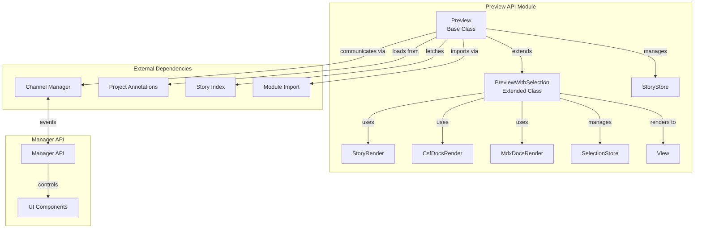
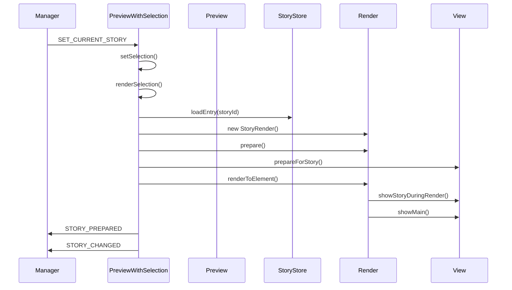
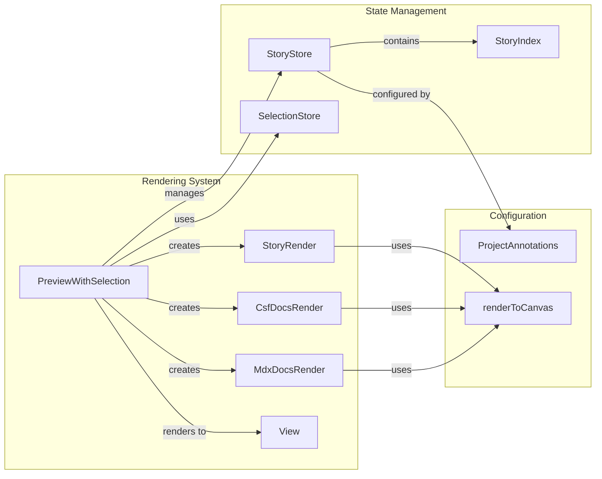
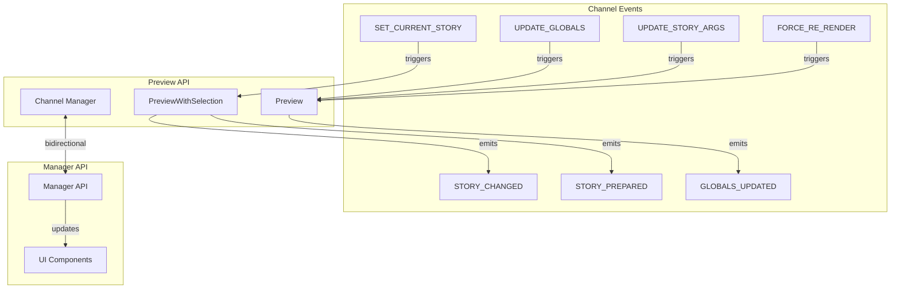
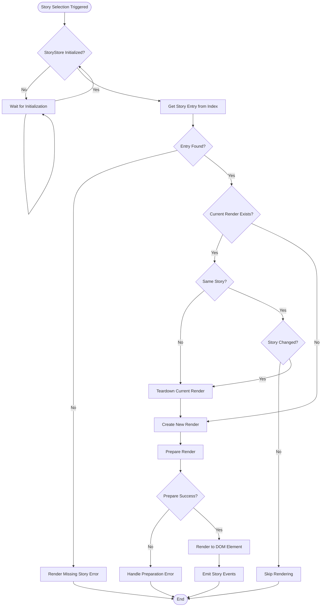
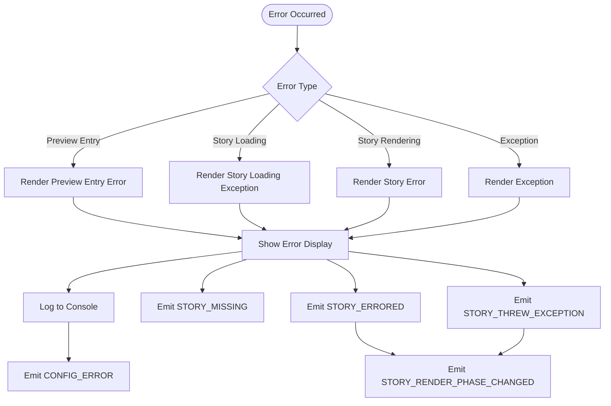

# Preview API Module Documentation

## Introduction

The Preview API module is a core component of Storybook that manages the rendering and lifecycle of stories and documentation within the preview iframe. It serves as the bridge between the Storybook manager (UI) and the actual story rendering, handling story selection, state management, and communication between different parts of the Storybook ecosystem.

## Core Purpose

The Preview API module is responsible for:
- **Story Rendering**: Managing the lifecycle of story rendering in the preview pane
- **State Management**: Handling story selection, args, globals, and other story state
- **Event Coordination**: Processing events between the manager UI and story renders
- **Error Handling**: Managing and displaying errors that occur during story loading or rendering
- **Documentation Rendering**: Supporting both story and docs (MDX/CSF) rendering modes

## Architecture Overview



## Core Components

### Preview Class

The `Preview` class is the foundation of the preview system. It handles:

- **Initialization**: Setting up the preview environment, loading project annotations, and fetching the story index
- **Store Management**: Creating and managing the StoryStore instance
- **Event Handling**: Processing events from the channel (globals updates, args changes, etc.)
- **Story Rendering**: Managing story render lifecycle through the `renderStoryToElement` method

Key responsibilities:
```typescript
class Preview<TRenderer extends Renderer> {
  // Core properties
  protected storyStoreValue?: StoryStore<TRenderer>;
  renderToCanvas?: RenderToCanvas<TRenderer>;
  storyRenders: StoryRender<TRenderer>[] = [];
  
  // Initialization and setup
  protected async initialize()
  protected async initializeWithProjectAnnotations(projectAnnotations)
  protected initializeWithStoryIndex(storyIndex)
  
  // Event handlers
  async onUpdateGlobals({ globals, currentStory })
  async onUpdateArgs({ storyId, updatedArgs })
  async onForceReRender()
  
  // Story management
  async loadStory({ storyId })
  renderStoryToElement(story, element, callbacks, options)
}
```

### PreviewWithSelection Class

The `PreviewWithSelection` class extends Preview to add story selection capabilities:

- **Story Selection**: Managing the currently selected story and view mode
- **Navigation**: Handling story changes and URL synchronization
- **Rendering Modes**: Supporting both story and documentation rendering
- **Error Display**: Managing error states and user feedback

Key features:
```typescript
class PreviewWithSelection<TRenderer extends Renderer> extends Preview<TRenderer> {
  currentSelection?: Selection;
  currentRender?: PossibleRender<TRenderer>;
  
  // Selection management
  async selectSpecifiedStory()
  async renderSelection({ persistedArgs })
  async onSetCurrentStory(selection)
  
  // Render type detection
  function isStoryRender(render)
  function isDocsRender(render)
  function isCsfDocsRender(render)
}
```

### WebRenderer Type

Defines the interface for renderers that work with HTML elements:

```typescript
export interface WebRenderer extends Renderer {
  canvasElement: HTMLElement;
}
```

## Data Flow Architecture



## Component Relationships



## Event Flow and Communication



## Process Flows

### Story Selection and Rendering Process



### Error Handling Flow



## Key Dependencies

The Preview API module integrates with several other Storybook modules:

### Direct Dependencies
- **[Storybook Configuration](storybook_configuration.md)**: Uses `StorybookConfig`, `BuilderOptions`, and `ProjectAnnotations` for configuration
- **[Component Story Format](component_story_format.md)**: Leverages `StoryIdentifier`, `StrictArgs`, and `Renderer` types for story handling
- **[Manager API and UI](manager_api_and_ui.md)**: Communicates through the channel system and receives user interactions

### Indirect Dependencies
- **[Core UI Library](core_ui_library.md)**: Renders error displays and loading states using UI components
- **[Docs Addon](docs_addon.md)**: Supports documentation rendering through `DocsRenderer` integration
- **[Instrumenter](instrumenter.md)**: May interact with story instrumentation for testing purposes

## Integration Points

### With Manager API
The Preview API communicates with the Manager API through a channel-based event system:
- Receives story selection events (`SET_CURRENT_STORY`)
- Emits story state changes (`STORY_CHANGED`, `STORY_PREPARED`)
- Handles global state updates (`UPDATE_GLOBALS`, `GLOBALS_UPDATED`)

### With Story Store
The Preview API manages the StoryStore lifecycle:
- Initializes the store with project annotations and story index
- Coordinates story loading and caching
- Manages story context and state updates

### With Renderers
The Preview API works with various renderers through the `RenderToCanvas` interface:
- Provides rendering context to story renders
- Manages canvas element lifecycle
- Handles renderer-specific teardown and cleanup

## Error Handling Strategy

The Preview API implements comprehensive error handling:

1. **Preview Initialization Errors**: Catches and displays errors during preview setup
2. **Story Loading Errors**: Handles missing stories or index loading failures
3. **Rendering Errors**: Manages errors during story execution and rendering
4. **Network Errors**: Handles story index fetching failures
5. **Configuration Errors**: Validates project annotations and render functions

Error information is propagated through:
- Channel events to the manager UI
- Visual error displays in the preview pane
- Console logging for debugging
- Error boundaries in the rendering system

## Performance Considerations

The Preview API includes several performance optimizations:

- **Lazy Loading**: Stories are loaded on-demand rather than all at once
- **Caching**: Story store caches prepared stories and CSF files
- **Render Reuse**: Avoids unnecessary re-renders when story hasn't changed
- **Async Preparation**: Story preparation happens asynchronously to avoid blocking
- **Teardown Management**: Proper cleanup of renders to prevent memory leaks

## Future Considerations

The Preview API is designed to be extensible for future enhancements:

- **Multi-Renderer Support**: Architecture supports different renderer types
- **Addon Integration**: Event system allows for addon participation
- **Testing Integration**: Instrumentation hooks for testing frameworks
- **Performance Monitoring**: Built-in timing and performance measurement points
- **Hot Module Replacement**: Support for HMR in development environments

## Related Documentation

- [Storybook Configuration](storybook_configuration.md) - Project-level configuration and setup
- [Component Story Format](component_story_format.md) - Story definition format and CSF handling
- [Manager API and UI](manager_api_and_ui.md) - Manager-side integration and event handling
- [Core UI Library](core_ui_library.md) - UI components used for error displays and loading states

## API Reference

### Preview Class Methods

#### Core Methods
- `initialize()` - Initialize the preview environment and load configuration
- `ready()` - Returns a promise that resolves when preview is ready
- `getProjectAnnotationsOrRenderError()` - Load project annotations with error handling
- `initializeWithProjectAnnotations(projectAnnotations)` - Initialize with loaded annotations
- `initializeWithStoryIndex(storyIndex)` - Complete initialization with story index

#### Story Management
- `loadStory({ storyId })` - Load a story by ID from the store
- `getStoryContext(story, options)` - Get rendering context for a story
- `renderStoryToElement(story, element, callbacks, options)` - Render story to DOM element
- `extract(options)` - Extract stories for testing or static generation

#### Event Handlers
- `onUpdateGlobals({ globals, currentStory })` - Handle global variable updates
- `onUpdateArgs({ storyId, updatedArgs })` - Handle story argument updates
- `onForceReRender()` - Force re-render of all active stories
- `onStoryIndexChanged()` - Handle story index updates

### PreviewWithSelection Class Methods

#### Selection Management
- `selectSpecifiedStory()` - Select initial story based on URL/configuration
- `renderSelection({ persistedArgs })` - Render the current story selection
- `onSetCurrentStory(selection)` - Handle story change requests from manager
- `onPreloadStories({ ids })` - Preload stories for faster navigation

#### Error Handling
- `renderMissingStory()` - Display when no story is selected
- `renderStoryLoadingException(storySpecifier, err)` - Handle story loading errors
- `renderException(storyId, error)` - Handle runtime rendering errors
- `renderError(storyId, { title, description })` - Handle validation errors

### WebRenderer Interface

```typescript
interface WebRenderer extends Renderer {
  canvasElement: HTMLElement;
}
```

### Key Events

#### Incoming Events (Preview → Action)
- `SET_CURRENT_STORY` - Change the currently selected story
- `UPDATE_GLOBALS` - Update global variables
- `UPDATE_STORY_ARGS` - Update story arguments
- `RESET_STORY_ARGS` - Reset story arguments to initial values
- `FORCE_RE_RENDER` - Force re-render of stories
- `FORCE_REMOUNT` - Force remount of specific story

#### Outgoing Events (Preview → Manager)
- `STORY_CHANGED` - Emitted when story selection changes
- `STORY_PREPARED` - Emitted when story is ready for rendering
- `STORY_ERRORED` - Emitted when story validation fails
- `STORY_THREW_EXCEPTION` - Emitted when story throws runtime error
- `GLOBALS_UPDATED` - Emitted when global variables change
- `STORY_ARGS_UPDATED` - Emitted when story arguments change
- `CONFIG_ERROR` - Emitted when configuration errors occur