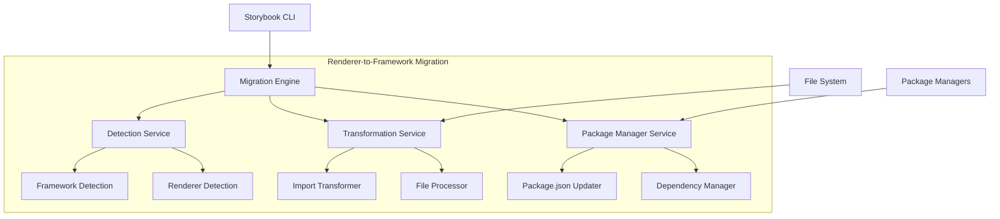
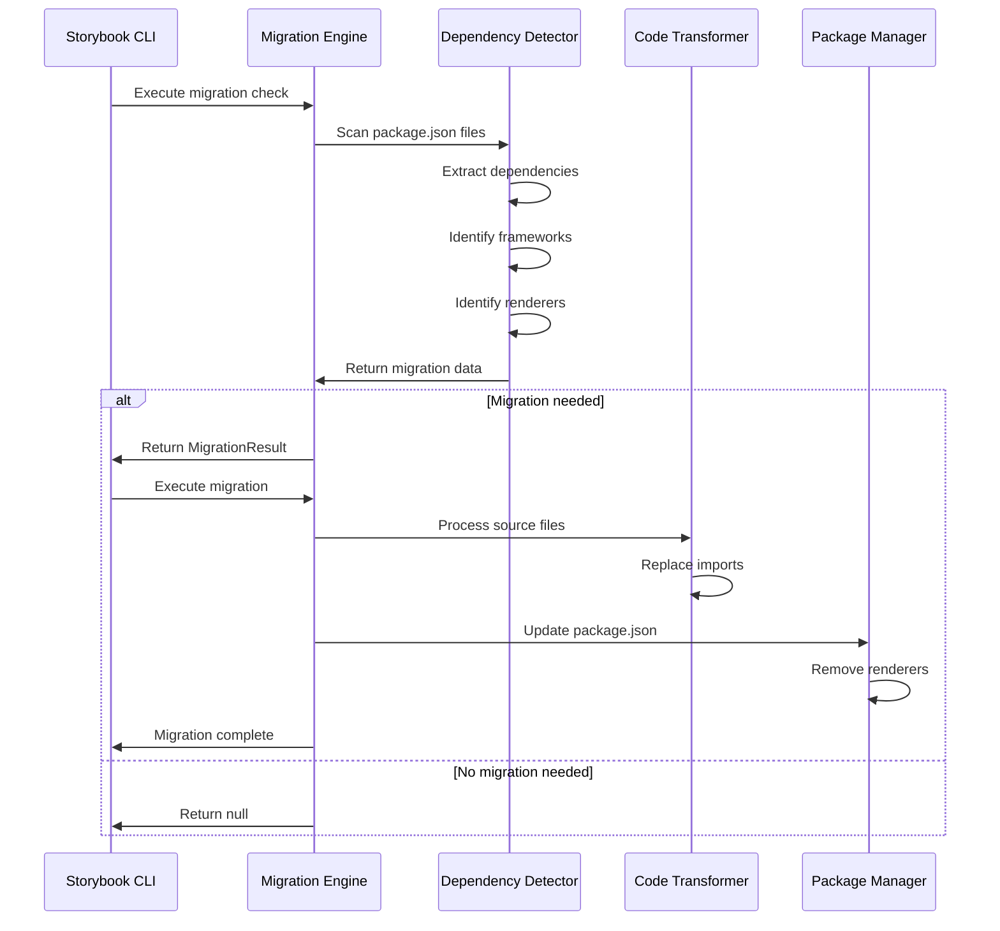
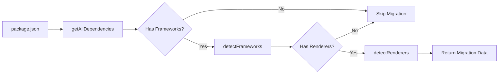
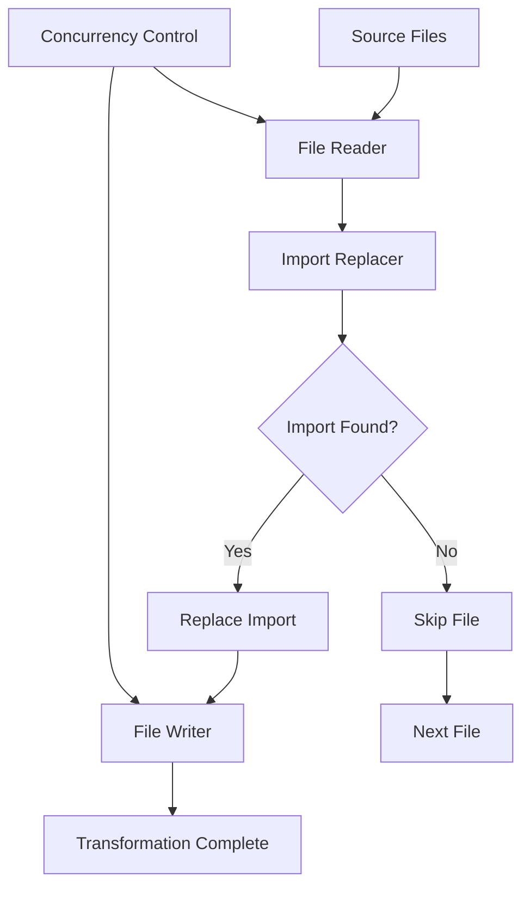
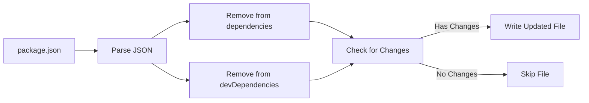
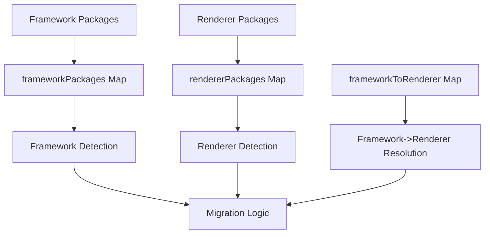
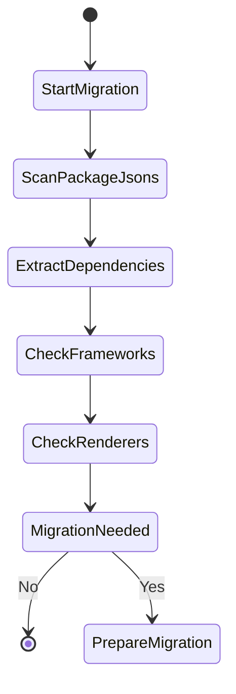
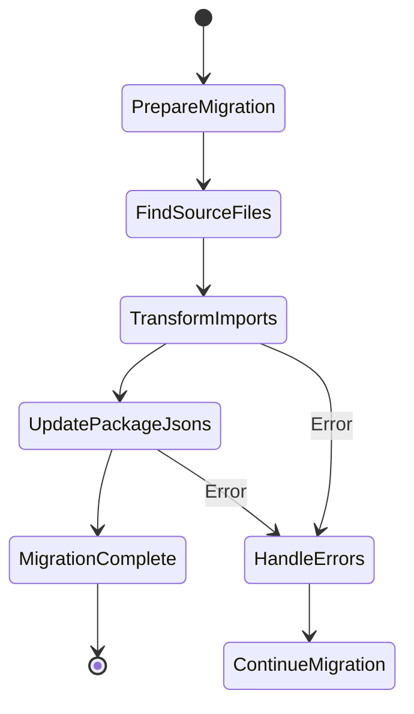

# Renderer-to-Framework Migration Module

## Introduction

The renderer-to-framework module is an automated migration tool within Storybook's CLI that facilitates the transition from renderer-based to framework-based configuration. This migration is part of Storybook's evolution to provide a more unified and streamlined configuration experience for developers.

## Purpose and Core Functionality

The module automatically detects projects using the old renderer-based configuration and migrates them to the new framework-based approach by:

1. **Detection**: Identifying projects that use both frameworks and renderers simultaneously
2. **Analysis**: Determining which renderer packages need to be replaced with their corresponding framework packages
3. **Transformation**: Updating import statements and package dependencies across the codebase
4. **Cleanup**: Removing obsolete renderer packages from package.json files

## Architecture

### Component Overview



### Core Components

#### MigrationResult Interface
The primary data structure that encapsulates migration results:

```typescript
interface MigrationResult {
  frameworks: string[];      // List of detected framework packages
  renderers: string[];       // List of detected renderer packages
  packageJsonFiles: string[]; // Paths to package.json files that need updates
}
```

#### Migration Engine
The main orchestrator that coordinates the migration process through three key phases:

1. **Check Phase**: Analyzes project dependencies to identify migration requirements
2. **Prompt Phase**: Provides user-facing migration information
3. **Run Phase**: Executes the actual migration transformations

### Data Flow Architecture



## Key Services

### Detection Service

The detection service analyzes project dependencies to determine if migration is required:



**Key Functions:**
- `getAllDependencies()`: Merges dependencies and devDependencies from package.json
- `detectFrameworks()`: Identifies framework packages using the `frameworkPackages` mapping
- `detectRenderers()`: Identifies renderer packages, excluding those that are also frameworks

### Transformation Service

Handles the actual code transformation process:



**Key Features:**
- **Concurrent Processing**: Uses `p-limit` to process up to 10 files simultaneously
- **Regex-based Replacement**: Uses regular expressions to find and replace import statements
- **Error Handling**: Collects and reports transformation errors without stopping the migration

### Package Manager Service

Manages package.json updates and dependency cleanup:



## Integration with Storybook Ecosystem

### Framework and Renderer Mapping

The migration relies on Storybook's internal mapping system:



### Supported Frameworks and Renderers

The module works with Storybook's comprehensive framework ecosystem, including but not limited to:

- **React**: `@storybook/react` framework with React renderer
- **Vue**: `@storybook/vue3` framework with Vue renderer  
- **Angular**: `@storybook/angular` framework with Angular renderer
- **Web Components**: `@storybook/web-components` framework
- **HTML**: `@storybook/html` framework

## Migration Process Flow

### Phase 1: Pre-migration Analysis



### Phase 2: Migration Execution



## Error Handling and Resilience

The module implements robust error handling to ensure migration reliability:

1. **File Access Errors**: Gracefully handles read/write failures with detailed error reporting
2. **JSON Parsing Errors**: Validates package.json structure before processing
3. **Transformation Errors**: Collects errors without stopping the migration process
4. **Missing Mappings**: Handles cases where framework-to-renderer mappings are not found

## Configuration and Customization

### Migration Options

The migration supports several configuration options:

- **dryRun**: Preview changes without modifying files
- **storiesPaths**: Custom paths to story files for transformation
- **configDir**: Custom configuration directory path
- **packageManager**: Package manager instance for dependency analysis

### File Pattern Support

Uses `globby` for flexible file pattern matching:
- Configuration files: `${configDir}/**/*`
- Story files: Custom paths provided via `storiesPaths`
- Concurrent processing with configurable limits

## Best Practices and Recommendations

### Pre-migration Checklist

1. **Backup**: Create backups of your project before running migrations
2. **Version Control**: Ensure all changes are committed before migration
3. **Testing**: Run the migration with `dryRun: true` first to preview changes
4. **Dependencies**: Verify that all framework packages are properly installed

### Post-migration Verification

1. **Import Validation**: Check that all imports have been correctly updated
2. **Dependency Cleanup**: Verify that renderer packages have been removed
3. **Build Testing**: Ensure the project builds successfully after migration
4. **Story Testing**: Verify that stories render correctly with the new framework configuration

## Related Documentation

- [Storybook Configuration](storybook_configuration.md) - Core configuration system
- [Component Story Format](component_story_format.md) - Story format specifications
- [Package Manager Abstraction](package_manager_abstraction.md) - Package management utilities
- [CLI Automigration](cli_automigration.md) - General migration framework

## Migration Example

### Before Migration

```json
{
  "dependencies": {
    "@storybook/react": "^7.0.0",
    "@storybook/addon-essentials": "^7.0.0"
  },
  "devDependencies": {
    "@storybook/react-webpack5": "^7.0.0"
  }
}
```

```javascript
// .storybook/main.js
import { StorybookConfig } from '@storybook/react-webpack5';

const config: StorybookConfig = {
  stories: ['../src/**/*.stories.@(js|jsx|ts|tsx)'],
  addons: ['@storybook/addon-essentials'],
  framework: '@storybook/react-webpack5'
};

export default config;
```

### After Migration

```json
{
  "dependencies": {
    "@storybook/react-webpack5": "^7.0.0",
    "@storybook/addon-essentials": "^7.0.0"
  }
}
```

```javascript
// .storybook/main.js
import { StorybookConfig } from '@storybook/react-webpack5';

const config: StorybookConfig = {
  stories: ['../src/**/*.stories.@(js|jsx|ts|tsx)'],
  addons: ['@storybook/addon-essentials'],
  framework: '@storybook/react-webpack5'
};

export default config;
```

The migration automatically handles the transition, ensuring that your Storybook configuration remains functional while adopting the new framework-based approach.