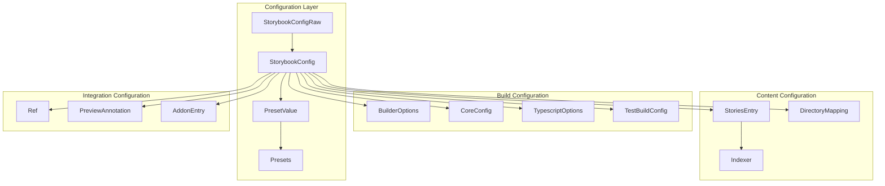
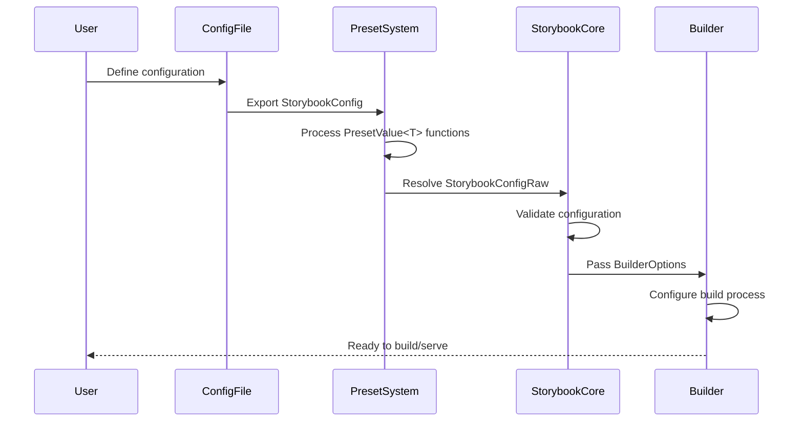
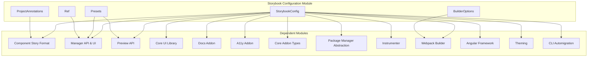
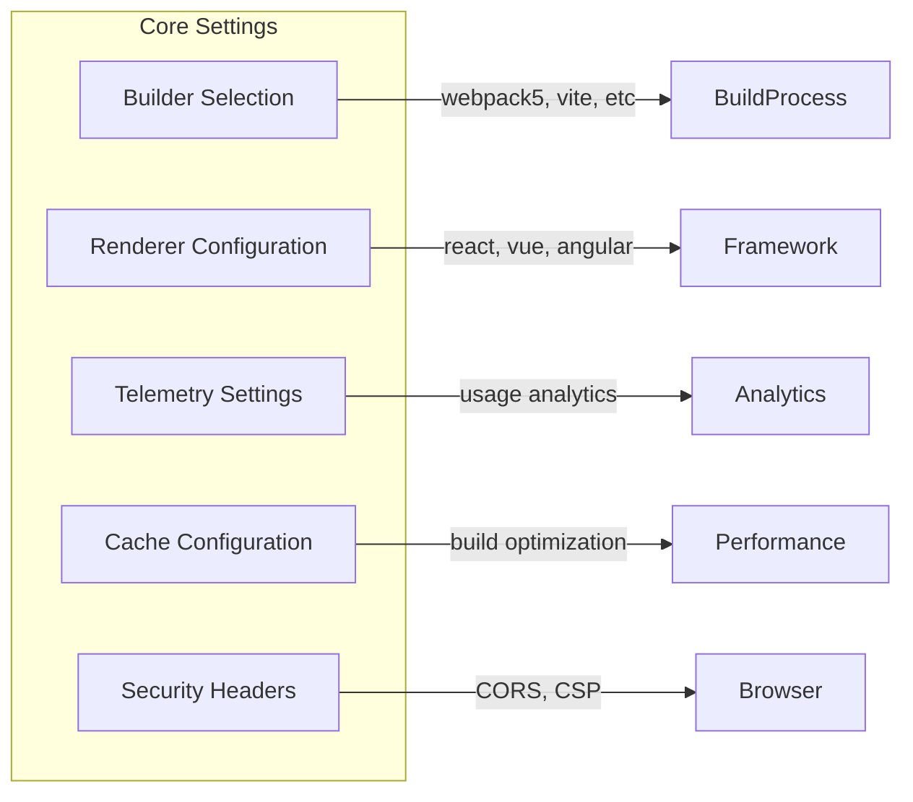
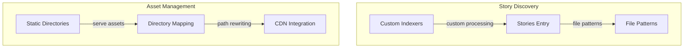
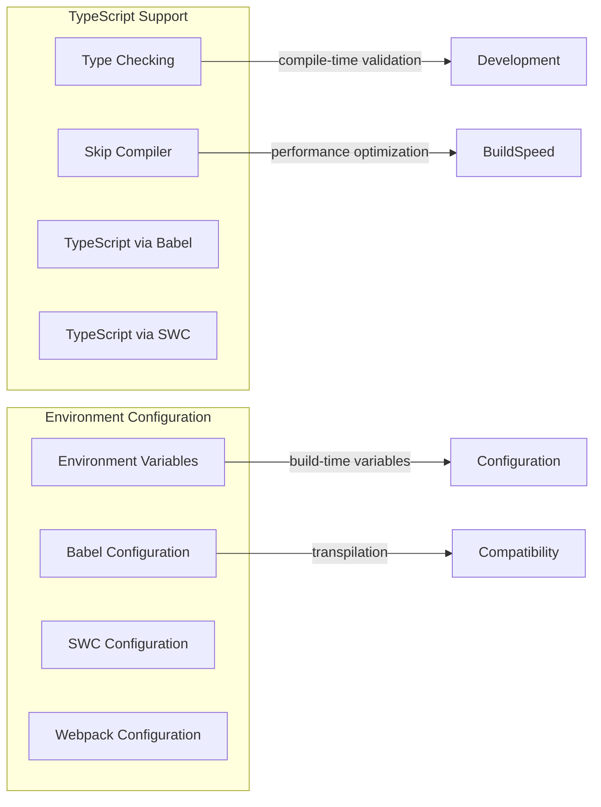
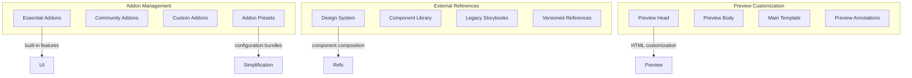
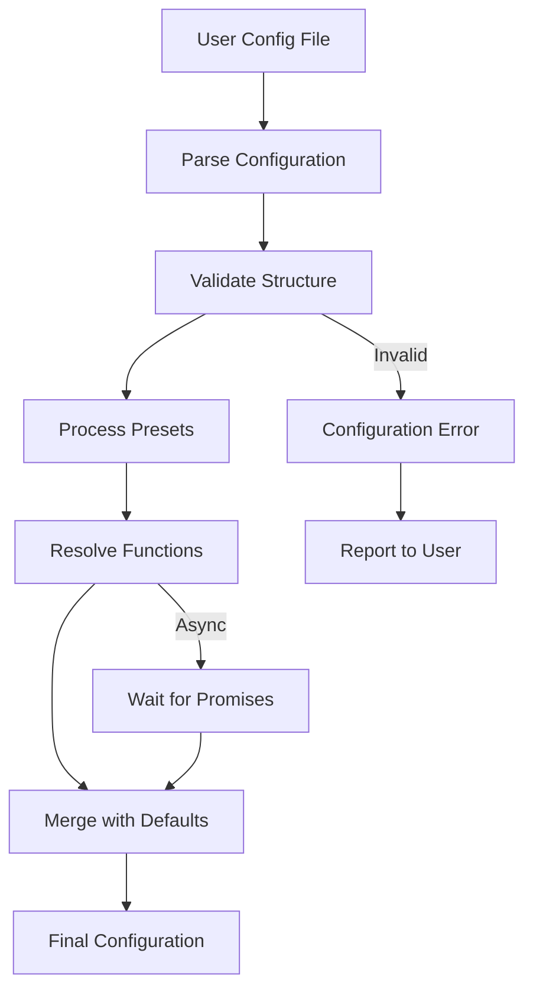
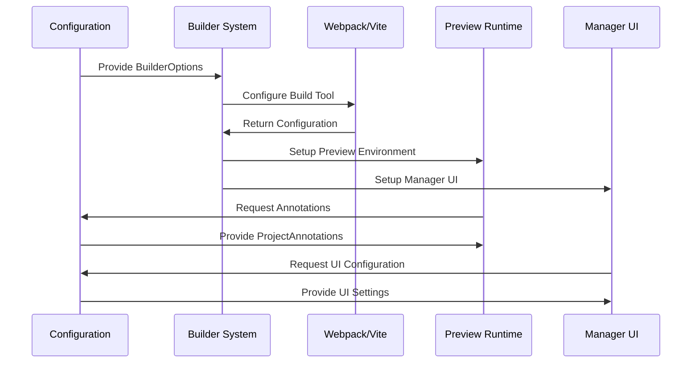

# Storybook Configuration Module

The Storybook Configuration module is the central configuration system that orchestrates all aspects of Storybook's behavior, from build processes to addon management, framework integration, and development server settings. It serves as the primary interface between users and Storybook's internal systems, providing a unified configuration API that abstracts complex implementation details.

## Overview

The configuration module defines the core interfaces and types that govern how Storybook operates. It establishes the contract between user configuration files (`.storybook/main.js|ts`) and Storybook's internal systems, ensuring consistent behavior across different frameworks, builders, and deployment scenarios.

## Architecture

### Core Configuration System



### Configuration Processing Flow



### Module Dependencies



## Core Components

### StorybookConfig

The primary interface for user configuration, providing a type-safe way to configure all aspects of Storybook. This interface wraps configuration values with `PresetValue<T>` to support both static values and dynamic configuration functions.

**Key Features:**
- Type-safe configuration with IntelliSense support
- Support for both static values and dynamic configuration functions
- Comprehensive coverage of all Storybook features
- Framework-agnostic design with renderer-specific extensions

**Configuration Categories:**
- **Core Settings**: Builder selection, renderer configuration, telemetry settings
- **Content Management**: Story discovery, indexing, static asset handling
- **Development Features**: TypeScript support, environment configuration
- **Integration**: Addon management, external references, preview customization
- **Build Optimization**: Test-specific builds, feature flags, performance tuning

### StorybookConfigRaw

The internal representation of configuration after preset processing. This interface represents the resolved configuration that Storybook's internal systems consume.

**Processing Pipeline:**
1. User defines `StorybookConfig` in `.storybook/main.js|ts`
2. Preset system processes `PresetValue<T>` functions
3. Configuration is resolved to `StorybookConfigRaw`
4. Internal systems consume the raw configuration

### BuilderOptions

Configuration specific to the build process, including development vs production modes, caching strategies, and server configuration.

**Key Responsibilities:**
- Build mode configuration (development/production)
- Cache management and optimization
- Server channel configuration
- Feature flag propagation

### PresetValue<T>

A utility type that allows configuration values to be either static or dynamic functions. This enables powerful configuration patterns where values can be computed based on the current build context.

**Usage Patterns:**
```typescript
// Static configuration
stories: ['../src/**/*.stories.@(js|jsx|ts|tsx)']

// Dynamic configuration
stories: (config, options) => {
  return options.configType === 'DEVELOPMENT' 
    ? ['../src/**/*.stories.@(js|jsx|ts|tsx)']
    : ['../src/**/*.stories.@(js|jsx|ts|tsx)', '!../src/**/*.dev.stories.@(js|jsx|ts|tsx)'];
}
```

### Ref

Represents external Storybook references, enabling composition of multiple Storybook instances. This is crucial for large organizations with multiple teams or design systems.

**Composition Benefits:**
- Centralized component library management
- Cross-team component sharing
- Version-controlled design system distribution
- Consistent UI across multiple applications

### ProjectAnnotations

Global annotations that apply to all stories in a project, including decorators, parameters, and lifecycle hooks. This is the foundation of Storybook's theming and global behavior system.

**Global Capabilities:**
- Universal decorators for all stories
- Global parameter configuration
- Lifecycle hooks (beforeAll, beforeEach, afterEach)
- Args and argTypes enhancement
- Global theming and styling

## Configuration Categories

### Core Configuration



**Builder Configuration:**
- Selection of build tool (webpack5, Vite, etc.)
- Builder-specific options and optimizations
- Development vs production build strategies

**Renderer Configuration:**
- Framework selection (React, Vue, Angular, etc.)
- Renderer-specific optimizations
- Component rendering strategies

### Content Management



**Story Discovery:**
- Glob patterns for story file discovery
- Custom indexers for non-standard file formats
- Recursive directory scanning
- File watching and hot reload

**Asset Management:**
- Static file serving configuration
- Directory mapping for asset organization
- CDN integration for production deployments
- Asset optimization and caching

### Development Features



**TypeScript Integration:**
- Optional type checking during builds
- Compiler bypass for performance
- Integration with Babel and SWC
- Type definition generation

### Integration Configuration



**Addon Architecture:**
- Essential addons (actions, controls, viewport, etc.)
- Community addon integration
- Custom addon development support
- Preset-based addon configuration

**External Composition:**
- Design system integration
- Component library sharing
- Cross-team collaboration
- Version management

## Data Flow

### Configuration Resolution



### Build Process Integration



## Integration Points

### Framework Integration

The configuration module provides seamless integration with various frameworks through the renderer configuration system. Each framework can extend the base configuration with framework-specific options and optimizations.

**Supported Frameworks:**
- React (with concurrent features support)
- Vue 2/3 (with Composition API support)
- Angular (with Ivy renderer support)
- Web Components (with custom element support)
- Svelte (with reactivity system integration)

### Builder Integration

Multiple build tools are supported through a unified builder interface, allowing users to choose the optimal build strategy for their project.

**Supported Builders:**
- Webpack 5 (with module federation support)
- Vite (with HMR optimization)
- esbuild (for fast builds)
- Custom builders via plugin system

### Addon Ecosystem

The configuration system provides a robust foundation for addon development, with support for:

- **Preset-based configuration**: Addons can provide their own configuration presets
- **Lifecycle integration**: Addons can hook into build and runtime processes
- **UI customization**: Addons can extend the manager UI and preview runtime
- **Parameter injection**: Addons can inject parameters into story contexts

## Key Features

### Type Safety
The module provides comprehensive TypeScript interfaces that ensure configuration validity at compile-time, reducing runtime errors and improving developer experience.

### Extensibility
Through the preset system, the configuration can be extended and modified by addons, frameworks, and user customizations without modifying core code.

### Framework Agnostic
The configuration system is designed to work with multiple frameworks (React, Vue, Angular, etc.) through a unified interface while allowing framework-specific customization.

### Build Optimization
Provides fine-grained control over build behavior, including feature flags, optimization settings, and development vs production configurations.

## Usage Examples

### Basic Configuration
```typescript
// main.ts
import type { StorybookConfig } from '@storybook/types';

const config: StorybookConfig = {
  stories: ['../src/**/*.stories.@(js|jsx|ts|tsx)'],
  addons: ['@storybook/addon-essentials'],
  framework: '@storybook/react-vite',
  features: {
    viewport: true,
    backgrounds: true,
  }
};

export default config;
```

### Advanced Configuration with Presets
```typescript
// main.ts
import type { StorybookConfig } from '@storybook/types';

const config: StorybookConfig = {
  stories: async () => {
    // Custom story discovery logic
    return [...stories];
  },
  addons: [
    '@storybook/addon-essentials',
    {
      name: '@storybook/addon-docs',
      options: {
        configureJSX: true,
      }
    }
  ],
  framework: {
    name: '@storybook/react-vite',
    options: {
      builder: {
        viteConfig: customViteConfig,
      }
    }
  },
  refs: {
    'design-system': {
      title: 'Design System',
      url: 'https://your-design-system.vercel.app'
    }
  }
};

export default config;
```

## Best Practices

### Configuration Organization

```typescript
// .storybook/main.ts
export default {
  // Framework and builder selection
  framework: '@storybook/react-vite',
  
  // Story discovery with clear patterns
  stories: ['../src/**/*.stories.@(js|jsx|ts|tsx|mdx)'],
  
  // Essential addons with custom configuration
  addons: [
    '@storybook/addon-essentials',
    '@storybook/addon-interactions',
    {
      name: '@storybook/addon-docs',
      options: {
        transcludeMarkdown: true,
      },
    },
  ],
  
  // TypeScript configuration
  typescript: {
    check: true,
    skipCompiler: false,
  },
  
  // Feature flags for development
  features: {
    interactionsDebugger: true,
    buildStoriesJson: true,
  },
  
  // Static asset serving
  staticDirs: ['../public'],
  
  // Framework-specific configuration
  viteFinal: (config) => {
    // Customize Vite configuration
    return config;
  },
} satisfies StorybookConfig;
```

### Performance Optimization

- **Selective story loading**: Use specific glob patterns to avoid loading unnecessary stories
- **TypeScript optimization**: Consider skipping the compiler for faster builds
- **Static asset optimization**: Organize static assets efficiently
- **Feature flag management**: Disable unused features to reduce bundle size

### Team Collaboration

- **Shared configuration**: Use configuration presets across teams
- **Composition patterns**: Leverage external references for design systems
- **Version management**: Use versioned references for stable component libraries
- **Documentation**: Document custom configuration choices and rationale

## Related Modules

### Core Modules
- **[Component Story Format](component_story_format.md)**: Defines the story format and component annotations that work with the configuration system
- **[Manager API & UI](manager_api_and_ui.md)**: Provides the UI components that consume configuration settings
- **[Preview API](preview_api.md)**: Handles the preview runtime that uses configuration for story rendering
- **[Core UI Library](core_ui_library.md)**: Supplies UI component configuration and reusable UI elements

### Addon Modules
- **[Docs Addon](docs_addon.md)**: Manages documentation-specific settings for automatic documentation generation
- **[A11y Addon](a11y_addon.md)**: Handles accessibility configuration and testing parameters
- **[Core Addon Types](core_addon_types.md)**: Defines addon type interfaces for integrated addons (actions, backgrounds, controls, etc.)

### Build & Tooling Modules
- **[Package Manager Abstraction](package_manager_abstraction.md)**: Manages package manager settings and dependencies
- **[Webpack Builder](webpack_builder.md)**: Manages Webpack-specific build settings and configuration
- **[Instrumenter](instrumenter.md)**: Handles code instrumentation configuration (referenced from core-common types)
- **[Angular Framework](angular_framework.md)**: Provides Angular-specific configuration (framework-specific)
- **[Theming](theming.md)**: Manages theme configuration and variables
- **[CLI Automigration](cli_automigration.md)**: Handles migration configuration for automated updates

## Migration and Compatibility

The configuration system is designed with backward compatibility in mind, providing migration paths for deprecated features and gradual adoption of new capabilities. The preset system enables incremental updates and feature flag management for smooth transitions between major versions.