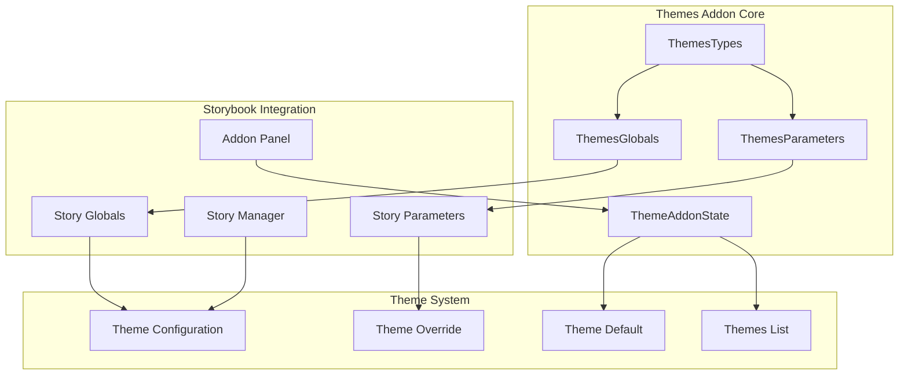
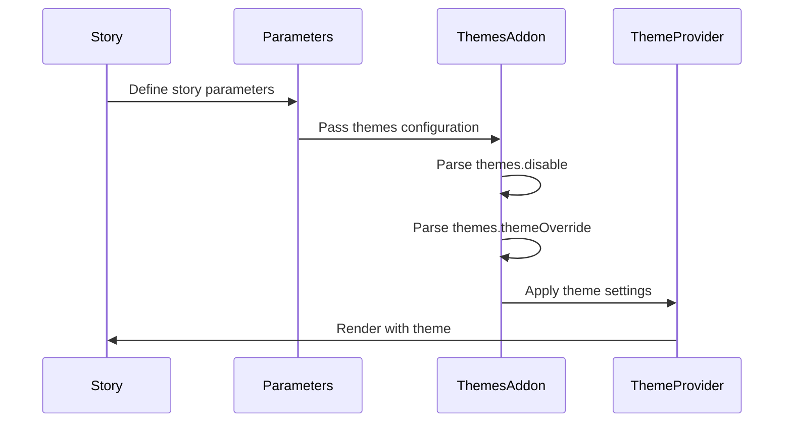
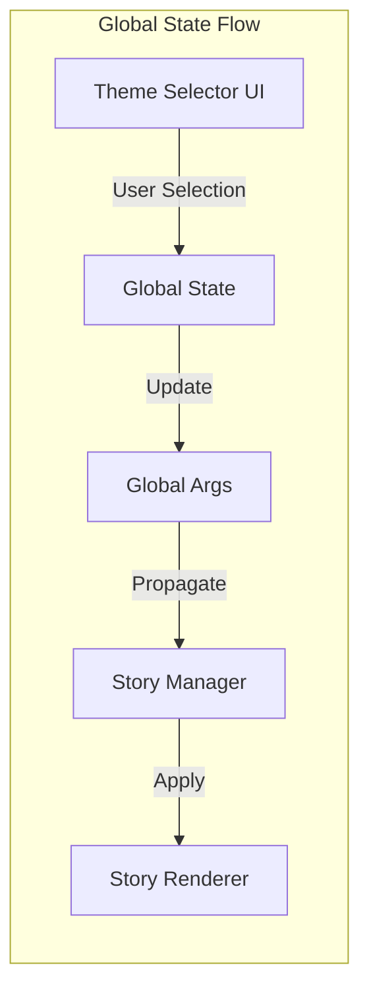
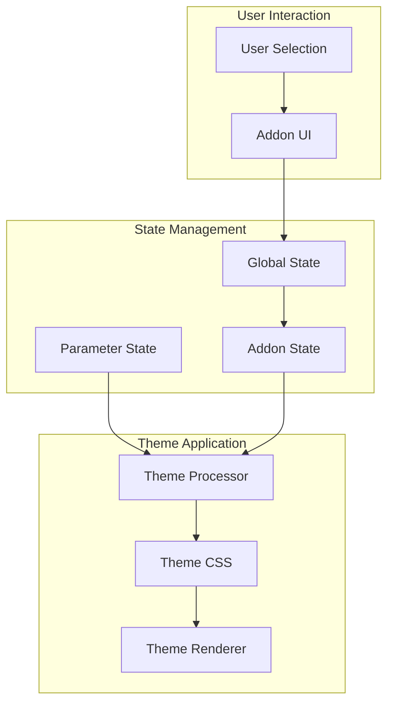

# Themes Addon Documentation

## Introduction

The Themes addon is a Storybook addon that provides theme switching functionality for components and stories. It allows developers to test their components across different visual themes (light, dark, custom themes) directly within the Storybook interface. This addon integrates with Storybook's parameter and global systems to provide seamless theme management capabilities.

## Core Functionality

The Themes addon enables:
- **Theme Switching**: Dynamically switch between different themes while viewing stories
- **Theme Override**: Override the default theme for specific stories or components
- **Global Theme State**: Maintain a consistent theme across the Storybook application
- **Addon Panel Integration**: Provide UI controls for theme selection in Storybook's addon panel

## Architecture Overview

### Component Structure



### Type Definitions

The addon defines several key interfaces that integrate with Storybook's type system:

#### ThemesTypes
The main interface that combines parameters and globals for theme management:
```typescript
interface ThemesTypes {
  parameters: ThemesParameters;
  globals: ThemesGlobals;
}
```

#### ThemesParameters
Defines how themes are configured within story parameters:
```typescript
interface ThemesParameters {
  themes?: {
    disable?: boolean;           // Disable the addon
    themeOverride?: string;      // Override theme for specific story
  };
}
```

#### ThemesGlobals
Manages global theme state across Storybook:
```typescript
interface ThemesGlobals {
  theme?: string;               // Current active theme
}
```

#### ThemeAddonState
Internal state management for the addon:
```typescript
interface ThemeAddonState {
  themesList: string[];         // Available themes
  themeDefault?: string;        // Default theme selection
}
```

## Integration with Storybook System

### Parameter System Integration



### Global State Management



## Dependencies and Relationships

### Core Dependencies

The Themes addon integrates with several Storybook core systems:

1. **[Storybook Configuration](storybook_configuration.md)**: Inherits from core configuration types
2. **[Component Story Format](component_story_format.md)**: Uses CSF for story definitions
3. **[Manager API and UI](manager_api_and_ui.md)**: Integrates with Storybook's manager interface
4. **[Core Addon Types](core_addon_types.md)**: Part of the addon type system

### Related Modules

- **[Actions Addon](actions_addon.md)**: Can work alongside theme switching for interactive components
- **[Backgrounds Addon](backgrounds_addon.md)**: Often used together for comprehensive visual testing
- **[Controls Addon](controls_addon.md)**: Complements theme testing with component property controls
- **[Viewport Addon](viewport_addon.md)**: Combined with themes for responsive design testing

## Usage Patterns

### Basic Theme Configuration

```typescript
// Story configuration
export default {
  title: 'Components/Button',
  parameters: {
    themes: {
      themeOverride: 'dark' // Force dark theme for this story
    }
  }
}
```

### Global Theme Management

```typescript
// .storybook/preview.js
export const globalTypes = {
  theme: {
    name: 'Theme',
    description: 'Global theme for components',
    defaultValue: 'light',
    toolbar: {
      icon: 'paintbrush',
      items: ['light', 'dark', 'custom'],
      showName: true,
    },
  },
};
```

### Addon State Management

The addon maintains internal state for:
- Available themes list
- Current theme selection
- Default theme configuration
- User preferences

## Data Flow Architecture



## Configuration Options

### Parameters Configuration

| Option | Type | Description |
|--------|------|-------------|
| `themes.disable` | boolean | Disables the themes addon for specific stories |
| `themes.themeOverride` | string | Forces a specific theme for the story |

### Global Configuration

| Option | Type | Description |
|--------|------|-------------|
| `theme` | string | Current active theme globally |

### Addon State

| Property | Type | Description |
|----------|------|-------------|
| `themesList` | string[] | List of available themes |
| `themeDefault` | string | Default theme selection |

## Extension Points

The Themes addon provides several extension points:

1. **Custom Theme Providers**: Implement custom theme switching logic
2. **Theme Validation**: Add custom validation for theme configurations
3. **UI Customization**: Extend the addon panel with custom theme selectors
4. **Theme Persistence**: Implement theme preference storage

## Best Practices

1. **Theme Naming**: Use consistent, descriptive theme names
2. **Default Themes**: Always provide sensible default themes
3. **Accessibility**: Ensure theme switching maintains accessibility standards
4. **Performance**: Optimize theme switching to avoid unnecessary re-renders
5. **Testing**: Test components across all available themes

## Troubleshooting

### Common Issues

1. **Theme Not Applied**: Check parameter configuration and global state
2. **Addon Not Visible**: Verify addon registration in `main.js`
3. **Theme Switching Fails**: Ensure theme CSS is properly loaded
4. **Performance Issues**: Optimize theme switching logic and CSS

### Debug Information

The addon provides debugging capabilities through:
- Storybook's addon panel state inspection
- Console logging for theme changes
- Parameter validation warnings
- Global state monitoring

## Migration Guide

### From Manual Theme Switching

If migrating from manual theme implementation:

1. Remove custom theme switching logic
2. Configure themes through parameters
3. Update stories to use theme parameters
4. Test theme switching functionality

### Version Compatibility

The Themes addon maintains compatibility with:
- Storybook 6.0+
- React 16.8+
- Modern browsers supporting CSS custom properties

## API Reference

### Types

- `ThemesTypes`: Main addon interface
- `ThemesParameters`: Parameter configuration
- `ThemesGlobals`: Global state interface
- `ThemeAddonState`: Internal state management

### Interfaces

All interfaces are exported from `code.addons.themes.src.types` and can be imported for TypeScript support.

## Conclusion

The Themes addon provides a robust, flexible solution for theme management in Storybook. By integrating with Storybook's parameter and global systems, it enables seamless theme switching capabilities that enhance the component development and testing experience.