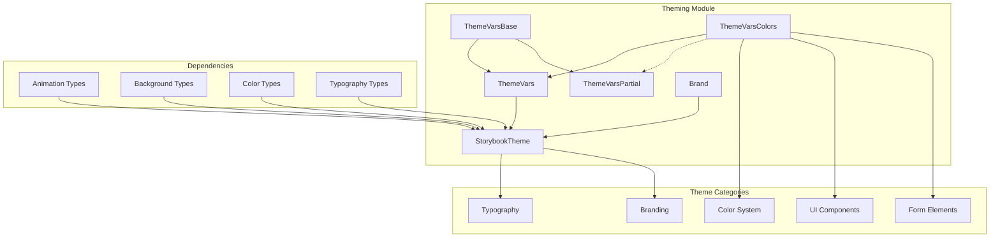
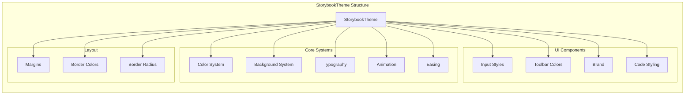
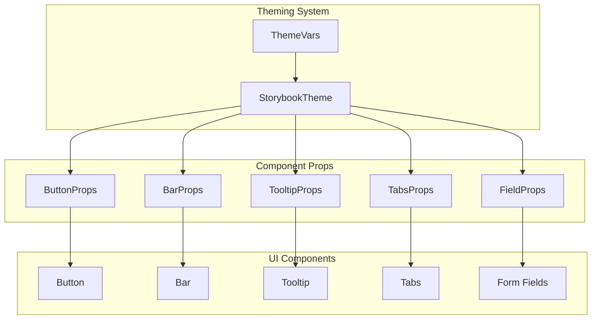
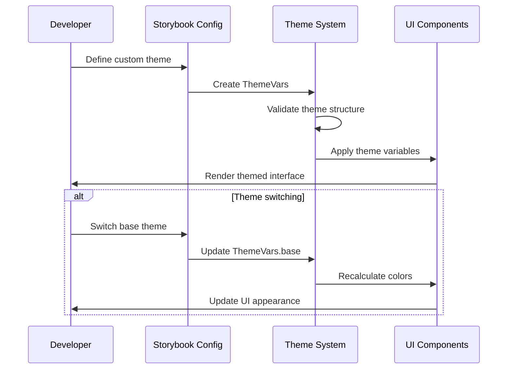
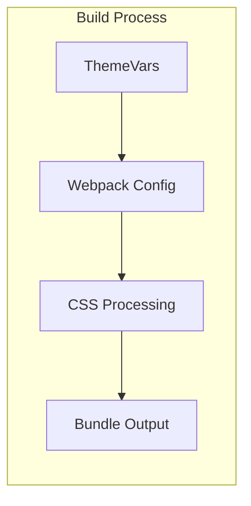

# Theming Module Documentation

## Introduction

The theming module provides a comprehensive theming system for Storybook, enabling consistent visual styling across the entire application. It defines the core theme variables, color schemes, and typography systems that power Storybook's user interface. The module supports both light and dark themes with extensive customization options for colors, typography, spacing, and branding elements.

## Architecture Overview

The theming module serves as the foundation for visual consistency across all Storybook components and addons. It provides a centralized theme configuration system that can be extended and customized by various parts of the application.



## Core Components

### ThemeVarsBase

The foundational interface that defines the base theme configuration with light/dark mode support.

```typescript
interface ThemeVarsBase {
  base: 'light' | 'dark';
}
```

**Purpose**: Establishes the fundamental theme mode that affects all color calculations and UI decisions throughout Storybook.

**Usage**: This is the minimum required configuration for any theme. All other theme properties extend from this base.

### ThemeVarsColors

Comprehensive color system defining all visual elements in the Storybook interface.

**Color Categories**:
- **Primary/Secondary Colors**: Core brand colors (`colorPrimary`, `colorSecondary`)
- **Application Backgrounds**: Main canvas and content backgrounds (`appBg`, `appContentBg`, `appPreviewBg`)
- **Typography Colors**: Text colors for different contexts (`textColor`, `textInverseColor`, `textMutedColor`)
- **UI Element Colors**: Toolbar, buttons, form elements, and borders
- **Brand Elements**: Logo, title, and URL configuration

### ThemeVars and ThemeVarsPartial

Complete theme configurations for different use cases:

- **ThemeVars**: Full theme configuration with all required properties
- **ThemeVarsPartial**: Partial configuration allowing optional color properties (useful for theme extensions and overrides)

### StorybookTheme

The comprehensive theme object that combines all theming aspects:



## Theme System Integration

### Integration with Core UI Library

The theming module provides the styling foundation for the [core UI library](core_ui_library.md). All UI components consume theme variables for consistent appearance:



### Integration with Manager API

The theming system integrates with the [manager API and UI](manager_api_and_ui.md) to provide consistent styling across the Storybook interface:

- **Sidebar**: Uses theme colors for navigation and explorer components
- **Settings**: Applies theme variables to shortcuts and configuration screens
- **Provider System**: Theme context is provided through the ManagerProvider

### Integration with Addons

Various addons extend and utilize the theming system:

- **[Docs Addon](docs_addon.md)**: Uses theme colors for documentation rendering
- **[A11y Addon](a11y_addon.md)**: Respects theme contrast ratios and color schemes
- **[Themes Addon](core_addon_types.md)**: Provides dynamic theme switching capabilities

## Theme Customization Flow



## Theme Variable Categories

### 1. Base Configuration
- `base`: Light or dark theme mode

### 2. Brand Colors
- `colorPrimary`: Primary brand color
- `colorSecondary`: Secondary brand color

### 3. Application Backgrounds
- `appBg`: Main application background
- `appContentBg`: Content area background
- `appPreviewBg`: Preview canvas background
- `appBorderColor`: Application border color
- `appBorderRadius`: Border radius for containers

### 4. Typography System
- `fontBase`: Base font family
- `fontCode`: Monospace font for code
- `textColor`: Primary text color
- `textInverseColor`: Inverse text color
- `textMutedColor`: Muted/secondary text color

### 5. UI Element Colors
- **Toolbar**: `barTextColor`, `barHoverColor`, `barSelectedColor`, `barBg`
- **Forms**: `buttonBg`, `buttonBorder`, `inputBg`, `inputBorder`, `inputTextColor`
- **Booleans**: `booleanBg`, `booleanSelectedBg`

### 6. Brand Elements
- `brandTitle`: Application title
- `brandUrl`: Brand URL
- `brandImage`: Brand logo URL
- `brandTarget`: Link target for brand

## Usage Patterns

### Basic Theme Configuration

```typescript
const theme: ThemeVars = {
  base: 'light',
  colorPrimary: '#FF4785',
  colorSecondary: '#1EA7FD',
  // ... other properties
};
```

### Theme Extension

```typescript
const customTheme: ThemeVarsPartial = {
  base: 'dark',
  appBg: '#1F1F1F',
  // Only override specific properties
};
```

### Brand Customization

```typescript
const brandedTheme: ThemeVars = {
  base: 'light',
  brandTitle: 'My Design System',
  brandUrl: 'https://mycompany.com',
  brandImage: '/logo.svg',
  brandTarget: '_self',
  // ... other properties
};
```

## Type System

The theming module exports several utility types for working with theme variables:

- `Color`: Color system type
- `Background`: Background system type
- `Typography`: Typography system type
- `Animation`: Animation configuration type
- `Easing`: Easing function type
- `TextSize`: Flexible text size type (number or string)
- `Brand`: Brand configuration type

## Best Practices

### 1. Theme Consistency
- Maintain consistent color relationships across light and dark themes
- Ensure sufficient contrast ratios for accessibility
- Use semantic color naming rather than specific color values

### 2. Brand Integration
- Provide all brand elements (title, URL, image) for complete customization
- Test brand appearance in both light and dark modes
- Consider brand visibility in different UI contexts

### 3. Performance
- Define themes statically when possible
- Use theme variables consistently to avoid style recalculation
- Leverage CSS custom properties for dynamic theme switching

### 4. Accessibility
- Ensure color contrast meets WCAG guidelines
- Test themes with accessibility tools
- Provide alternative text for brand images

## Integration with Build System

The theming module works with the [webpack builder](webpack_builder.md) to ensure theme variables are properly processed and available throughout the application:



## Related Documentation

- [Core UI Library](core_ui_library.md) - UI components that consume theme variables
- [Manager API and UI](manager_api_and_ui.md) - Interface components that apply themes
- [Storybook Configuration](storybook_configuration.md) - Main configuration system
- [Core Addon Types](core_addon_types.md) - Theme-related addon types
- [Webpack Builder](webpack_builder.md) - Build system integration