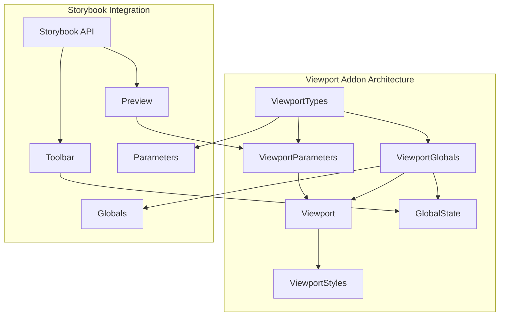
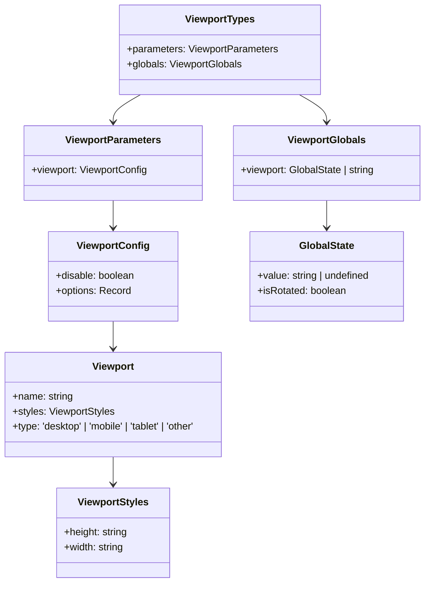
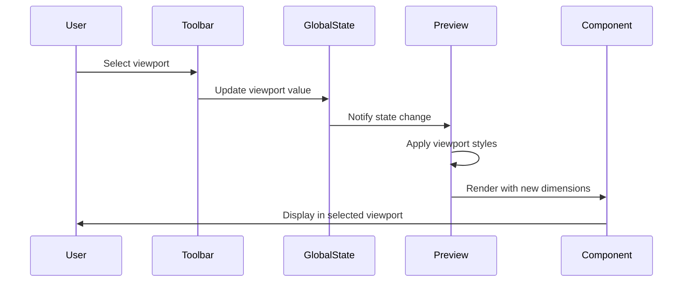
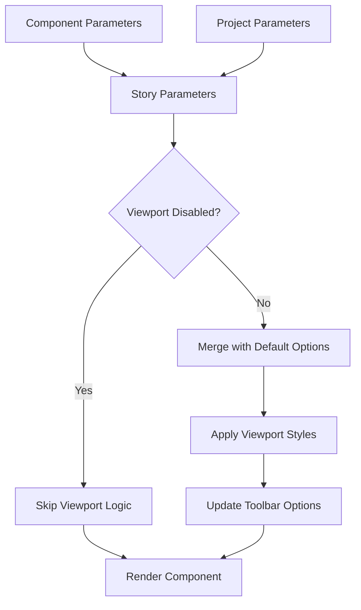
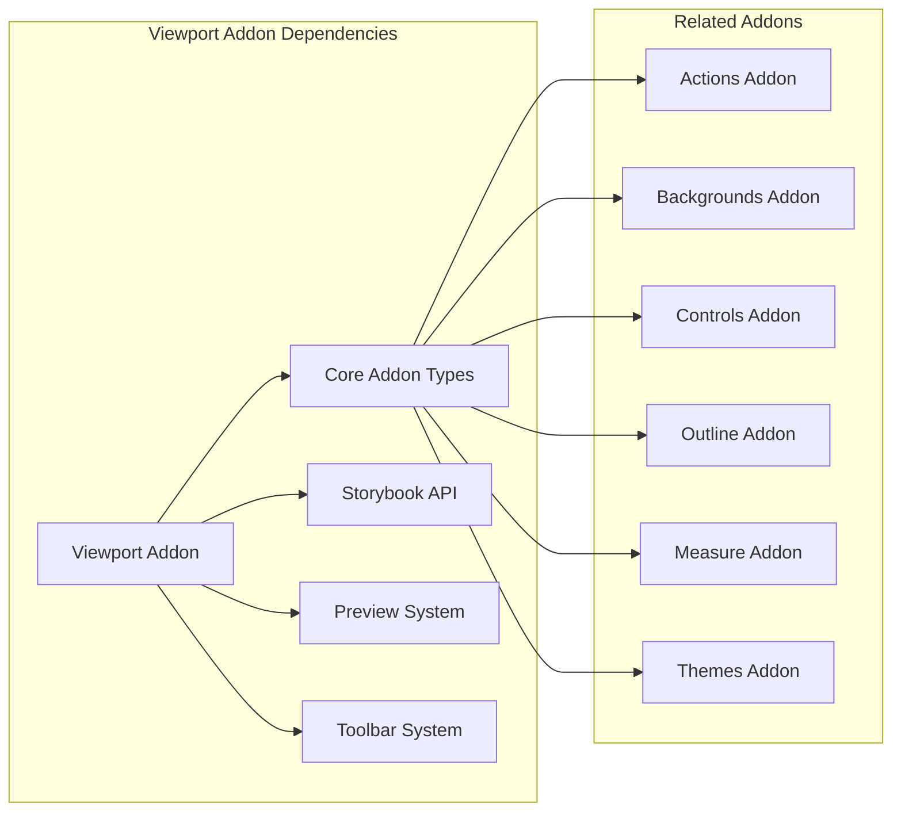

# Viewport Addon Documentation

## Introduction

The Viewport Addon is a core Storybook addon that enables developers to preview their components in different viewport sizes and device orientations. This addon is essential for responsive design testing, allowing users to simulate how components appear on various devices including mobile phones, tablets, and desktop screens.

The viewport addon integrates seamlessly with Storybook's toolbar, providing an intuitive interface for switching between predefined viewport configurations and custom dimensions. It supports both portrait and landscape orientations, making it an invaluable tool for comprehensive component testing across different screen sizes.

## Architecture Overview

The viewport addon follows Storybook's addon architecture pattern, implementing the standard addon interface while providing specialized viewport management functionality. The module is built around a type-safe system that defines viewport configurations, global state management, and parameter-based customization.

### Core Architecture Components



### Type System Architecture

The viewport addon implements a comprehensive type system that ensures type safety across all viewport operations:



## Core Components

### ViewportTypes Interface

The `ViewportTypes` interface serves as the main type definition for the viewport addon, providing the contract between the addon and Storybook's core systems. It defines two primary interfaces:

- **parameters**: Configuration options that can be set at the story, component, or project level
- **globals**: Global state that can be modified through the UI and persists across stories

### Viewport Interface

The `Viewport` interface defines the structure of individual viewport configurations:

```typescript
interface Viewport {
  name: string;           // Display name in the toolbar
  styles: ViewportStyles; // CSS dimensions
  type?: DeviceType;      // Optional device categorization
}
```

### ViewportStyles Interface

Defines the dimensional properties of a viewport:

```typescript
interface ViewportStyles {
  height: string; // Must include CSS unit (e.g., '768px')
  width: string;  // Must include CSS unit (e.g., '1024px')
}
```

### GlobalState Interface

Manages the current viewport state and rotation:

```typescript
interface GlobalState {
  value: string | undefined; // Current viewport key
  isRotated?: boolean;       // Rotation state
}
```

## Data Flow

### Viewport Selection Flow



### Parameter Resolution Flow



## Integration with Storybook Core

### Addon Registration

The viewport addon integrates with Storybook's addon system through the standard registration process. It extends the core functionality by:

1. **Toolbar Integration**: Adds viewport selection controls to Storybook's toolbar
2. **Preview Enhancement**: Modifies the preview iframe dimensions based on selected viewport
3. **Parameter Support**: Allows viewport configuration through Storybook parameters
4. **Global State Management**: Persists viewport selection across stories

### Dependency Relationships



## Configuration Options

### Viewport Parameters

The viewport addon supports extensive configuration through Storybook parameters:

```typescript
// Story-level configuration
export default {
  title: 'Components/Button',
  parameters: {
    viewport: {
      disable: false,
      options: {
        iphone: {
          name: 'iPhone',
          styles: { width: '375px', height: '667px' },
          type: 'mobile'
        }
      }
    }
  }
}
```

### Global Configuration

Global viewport state can be controlled through Storybook globals:

```typescript
// .storybook/preview.js
export const globalTypes = {
  viewport: {
    name: 'Viewport',
    description: 'Change the viewport dimensions',
    defaultValue: 'responsive',
    toolbar: {
      icon: 'mobile',
      items: ['responsive', 'iphone', 'ipad', 'desktop']
    }
  }
}
```

## Usage Patterns

### Basic Viewport Testing

```typescript
// Component story with viewport testing
export const MobileView = {
  parameters: {
    viewport: {
      defaultViewport: 'iphone6'
    }
  }
}
```

### Custom Viewport Definition

```typescript
// Define custom viewports
export const parameters = {
  viewport: {
    options: {
      customMobile: {
        name: 'Custom Mobile',
        styles: { width: '360px', height: '640px' },
        type: 'mobile'
      }
    }
  }
}
```

### Viewport Rotation

The addon supports viewport rotation for testing landscape orientations:

```typescript
// Programmatic rotation
import { useGlobals } from '@storybook/api';

const [globals, updateGlobals] = useGlobals();
updateGlobals({ viewport: { ...globals.viewport, isRotated: true } });
```

## Related Modules

The viewport addon is part of Storybook's essential addons ecosystem and works closely with:

- **[Actions Addon](actions_addon.md)**: For testing user interactions across different viewports
- **[Backgrounds Addon](backgrounds_addon.md)**: For testing components against different backgrounds in various viewport sizes
- **[Controls Addon](controls_addon.md)**: For adjusting component properties while testing responsive behavior
- **[Outline Addon](outline_addon.md)**: For visual debugging across different viewport dimensions
- **[Measure Addon](measure_addon.md)**: For precise dimension measurements in various viewports
- **[Themes Addon](themes_addon.md)**: For testing theme responsiveness across different screen sizes

## Best Practices

### Viewport Configuration

1. **Use Standard Device Sizes**: Include common device dimensions for comprehensive testing
2. **Organize by Type**: Categorize viewports (mobile, tablet, desktop) for better organization
3. **Include Edge Cases**: Add extreme dimensions to test responsive breakpoints
4. **Document Viewports**: Provide clear names and descriptions for each viewport

### Testing Strategies

1. **Test Critical Breakpoints**: Focus on viewport sizes where layout changes occur
2. **Verify Touch Interactions**: Ensure mobile viewports properly handle touch events
3. **Check Content Reflow**: Verify content adapts properly to different dimensions
4. **Test Orientation Changes**: Ensure components handle portrait/landscape transitions

### Performance Considerations

1. **Limit Viewport Options**: Too many viewport choices can overwhelm users
2. **Use CSS Transitions**: Smooth viewport changes for better user experience
3. **Lazy Load Previews**: Consider performance when switching between viewports
4. **Cache Viewport State**: Maintain user preferences across sessions

## Troubleshooting

### Common Issues

1. **Viewport Not Applied**: Check if viewport is disabled in parameters
2. **Styles Not Updating**: Verify CSS units are included in viewport definitions
3. **Toolbar Not Showing**: Ensure addon is properly registered in main.js
4. **State Not Persisting**: Check global state configuration in preview.js

### Debug Steps

1. Verify addon registration in `.storybook/main.js`
2. Check parameter configuration at story/component/project level
3. Inspect global state using Storybook's addon panel
4. Review browser console for any error messages
5. Validate viewport definitions include proper CSS units

## API Reference

### Types

- `Viewport`: Individual viewport configuration
- `ViewportStyles`: Dimensional properties with CSS units
- `ViewportMap`: Collection of named viewports
- `GlobalState`: Current viewport and rotation state
- `ViewportParameters`: Configuration options for stories
- `ViewportGlobals`: Global state interface
- `ViewportTypes`: Main addon type definitions

### Interfaces

All interfaces are exported from `code.core.src.viewport.types` and provide comprehensive type safety for viewport operations. The type system ensures that viewport configurations are properly validated and that state updates maintain consistency across the addon's functionality.