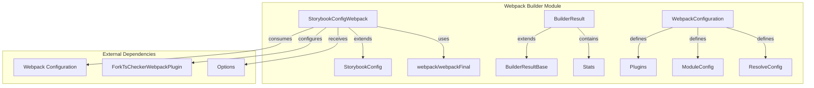
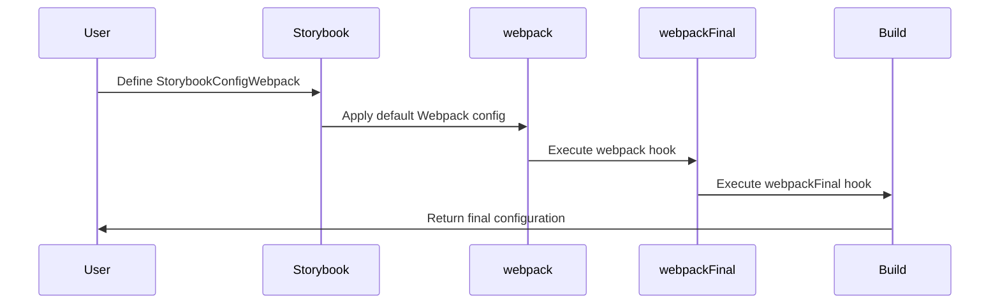
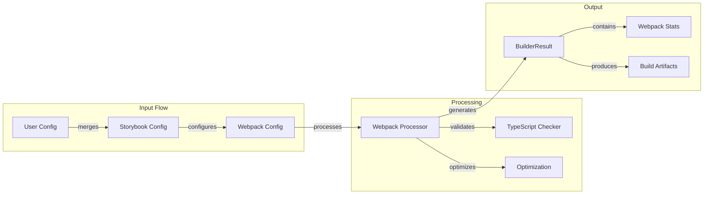
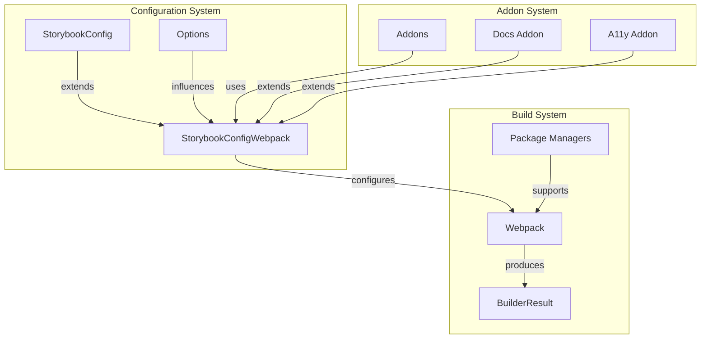
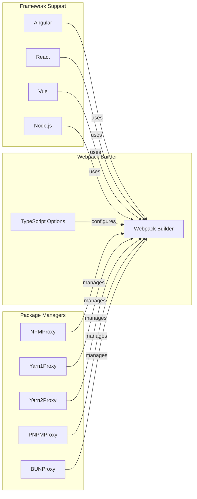
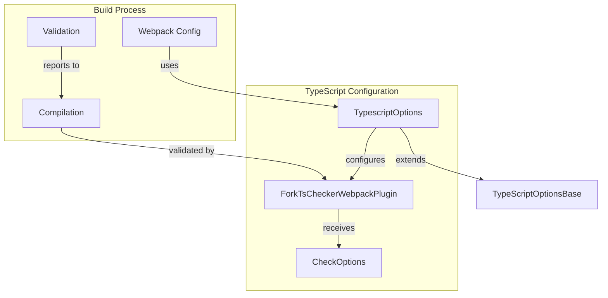
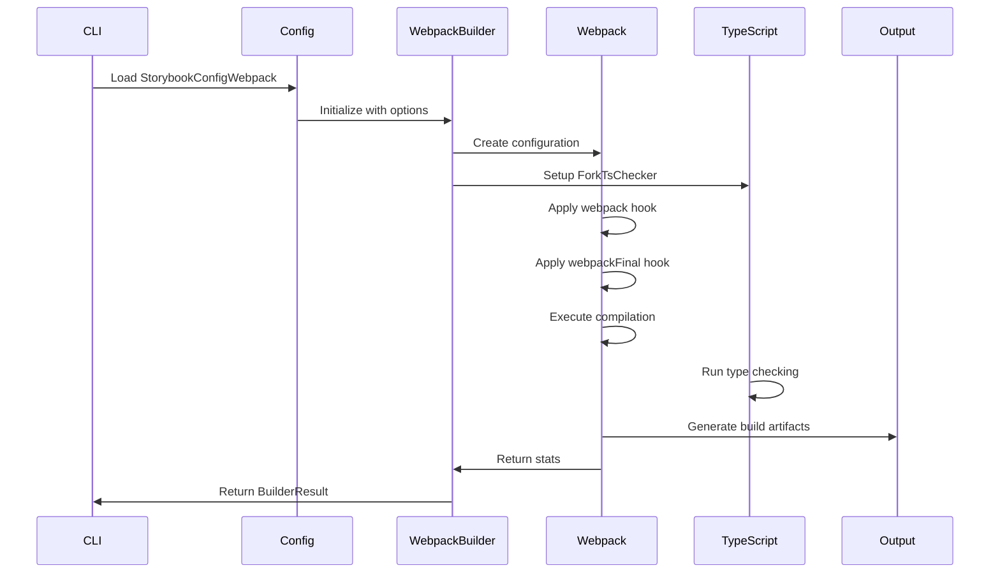
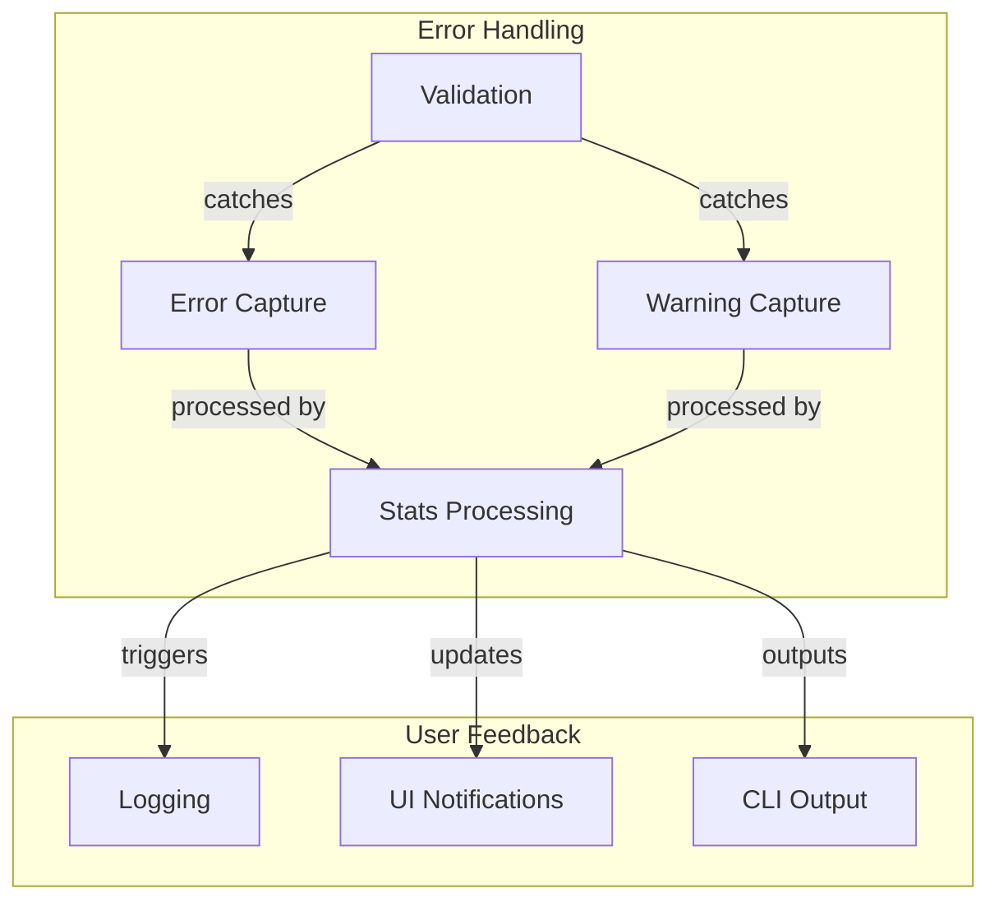

# Webpack Builder Module Documentation

## Introduction

The webpack_builder module is a core component of Storybook's build system, responsible for managing Webpack configurations and build processes. It provides the infrastructure for bundling Storybook's UI components, addons, and user stories using Webpack 5. This module serves as the bridge between Storybook's configuration system and Webpack's powerful bundling capabilities, enabling developers to customize their build pipeline while maintaining compatibility with Storybook's ecosystem.

## Architecture Overview

The webpack_builder module is structured around three main architectural layers:

1. **Configuration Layer**: Handles Storybook-specific Webpack configurations
2. **Build Execution Layer**: Manages the actual Webpack build process
3. **Result Processing Layer**: Processes and returns build results with metadata

## Core Components

### StorybookConfigWebpack

The `StorybookConfigWebpack` interface extends the base `StorybookConfig` to provide Webpack-specific configuration options. It serves as the primary configuration interface for users to customize their Webpack setup within Storybook.

**Key Features:**
- Extends base Storybook configuration with Webpack-specific properties
- Provides `webpack` and `webpackFinal` hooks for configuration customization
- Maintains type safety while allowing flexible Webpack configuration

**Configuration Flow:**

### BuilderResult

The `BuilderResult` interface encapsulates the results of the Webpack build process, extending the base builder result with Webpack-specific metadata.

**Properties:**
- `stats`: Webpack compilation statistics and build information
- Inherits all properties from `BuilderResultBase` (compilation status, errors, warnings)

### WebpackConfiguration

The `WebpackConfiguration` interface defines the structure of Webpack configurations used within Storybook, providing a typed interface for Webpack's complex configuration object.

**Configuration Sections:**
- **Plugins**: Array of Webpack plugins for build optimization and functionality
- **Module**: Module resolution and loading rules
- **Resolve**: File resolution configuration (extensions, aliases, main fields)
- **Optimization**: Build optimization settings
- **Devtool**: Source map configuration

## Data Flow Architecture

## Integration with Storybook Ecosystem

The webpack_builder module integrates with multiple Storybook components:

### Storybook Configuration Integration

### Framework Integration
The webpack_builder supports multiple frameworks through the package manager abstraction:

## TypeScript Integration

The webpack_builder provides comprehensive TypeScript support through the `TypescriptOptions` interface:

## Build Process Flow

The webpack_builder follows a systematic build process:

## Configuration Options

### Builder Options
- `fsCache`: Enable filesystem caching for faster rebuilds
- `lazyCompilation`: Enable lazy compilation for development mode

### Webpack Hooks
- `webpack`: Modify configuration after Storybook defaults
- `webpackFinal`: Final configuration modification after addons

### TypeScript Options
- `checkOptions`: Configure ForkTsCheckerWebpackPlugin behavior
- Extends base TypeScript options from core-webpack

## Error Handling and Validation

The webpack_builder implements comprehensive error handling:

## Performance Optimizations

The webpack_builder includes several performance optimizations:

1. **Filesystem Caching**: Reduces rebuild time by caching compilation results
2. **Lazy Compilation**: Only compiles modules when needed in development
3. **TypeScript Checking**: Runs type checking in parallel with compilation
4. **Module Federation**: Supports code splitting and lazy loading

## Dependencies and External Integrations

The webpack_builder module depends on several key external packages:

- **Webpack 5**: Core bundling engine
- **ForkTsCheckerWebpackPlugin**: TypeScript type checking
- **Storybook Core**: Base configuration and types
- **Package Managers**: NPM, Yarn, PNPM, BUN support

## Related Documentation

- [Storybook Configuration](storybook_configuration.md) - Base configuration system
- [Package Manager Abstraction](package_manager_abstraction.md) - Package manager integration
- [Core UI Library](core_ui_library.md) - UI components used in builds
- [Component Story Format](component_story_format.md) - Story format handling
- [Preview API](preview_api.md) - Preview rendering system
- [Manager API and UI](manager_api_and_ui.md) - Manager interface system

## Best Practices

1. **Configuration Management**: Use `webpack` for initial modifications and `webpackFinal` for final adjustments
2. **Performance**: Enable filesystem caching for faster development builds
3. **TypeScript**: Configure ForkTsCheckerWebpackPlugin for optimal type checking performance
4. **Addon Compatibility**: Test webpack modifications with all enabled addons
5. **Error Monitoring**: Regularly review build stats for optimization opportunities

## Migration and Compatibility

The webpack_builder module maintains backward compatibility while supporting modern Webpack 5 features. When migrating:

- Review deprecated configuration options
- Update custom webpack configurations for Webpack 5 compatibility
- Test TypeScript integration with new ForkTsCheckerWebpackPlugin versions
- Validate addon compatibility with updated webpack configurations