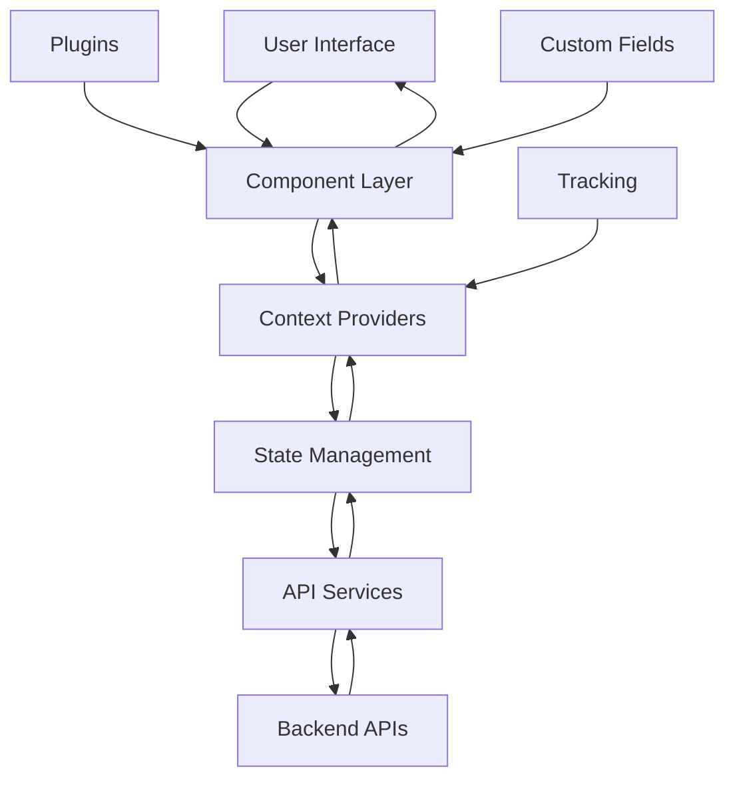
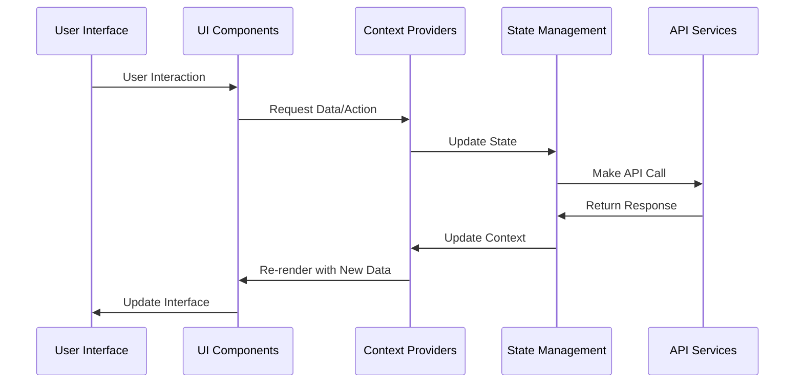

# Admin Module Documentation

## Introduction

The Admin module serves as the core administrative interface for Strapi, providing the foundational architecture for managing the content management system. This module handles authentication, configuration, UI components, and plugin management, forming the backbone of the Strapi administration panel.

## Architecture Overview

The Admin module is structured around several key architectural layers:

### Core State Management
- **Redux-based state management** with centralized application state
- **Authentication and authorization** handling
- **Theme and localization** management
- **Plugin lifecycle** management

### Feature Context System
- **Modular feature contexts** for different administrative functions
- **Configuration management** for project settings
- **Tracking and analytics** integration
- **Navigation and history** management

### UI Component Library
- **Reusable UI components** for consistent admin interface
- **Table management** with sorting, filtering, and pagination
- **Form input components** with validation
- **Filter and search** capabilities

## Core Components

### State Management (AppState)

The `AppState` component manages the global application state using Redux Toolkit:

```typescript
interface AppState {
  language: {
    locale: string;
    localeNames: Record<string, string>;
  };
  permissions: Partial<PermissionMap>;
  theme: {
    currentTheme: ThemeName;
    availableThemes: string[];
  };
  token?: string | null;
}
```

**Key Features:**
- Multi-language support with locale management
- Theme switching (light/dark/system)
- Permission-based access control
- JWT token authentication
- Persistent state across sessions

### Tracking System

The tracking system provides comprehensive analytics and telemetry:

```typescript
interface TrackingContextValue {
  uuid?: string | boolean;
  telemetryProperties?: TelemetryProperties;
}
```

**Capabilities:**
- Anonymous usage analytics
- Event tracking for user interactions
- Telemetry data collection
- Integration with Strapi Analytics Hub
- Configurable privacy settings

### Configuration Management

Manages project-wide configuration settings:

```typescript
interface ConfigurationContextValue {
  logos: {
    auth: ConfigurationLogo;
    menu: ConfigurationLogo;
  };
  showReleaseNotification: boolean;
  updateProjectSettings: (body: UpdateProjectSettingsBody) => Promise<void>;
}
```

**Features:**
- Logo customization (auth and menu)
- Project settings management
- File upload handling
- Notification system integration

### Navigation System

Advanced navigation with history management:

```typescript
interface HistoryContextValue extends HistoryState {
  pushState: (path: string | { to: string; search: string }) => void;
  goBack: () => void;
}
```

**Components:**
- Universal back button with fallback support
- Session-based navigation history
- Browser history synchronization
- Contextual navigation state

## UI Components

### Table Component

Comprehensive table management system:

```typescript
interface TableContextValue<TRow extends BaseRow, THeader extends TableHeader<TRow, THeader>> {
  colCount: number;
  hasHeaderCheckbox: boolean;
  headers: THeader[];
  isLoading: boolean;
  rowCount: number;
  rows: TRow[];
  selectedRows: TRow[];
  selectRow: (row: TRow | TRow[]) => void;
}
```

**Features:**
- Row selection with bulk operations
- Sortable columns with query parameter integration
- Loading and empty states
- Action bar for selected items
- Custom cell formatters

### Filter System

Advanced filtering capabilities:

```typescript
interface FiltersContextValue {
  disabled: boolean;
  onChange: (data: FilterFormData) => void;
  options: Filters.Filter[];
  setOpen: (open: boolean) => void;
}
```

**Capabilities:**
- Dynamic filter creation
- Multiple filter types (text, numeric, date, relation)
- Query parameter integration
- Custom input components
- Filter removal and management

### Pagination Component

Flexible pagination system:

```typescript
interface PaginationContextValue {
  currentQuery?: object;
  pageCount: string;
  pageSize: string;
  page: string;
  setPageSize: (pageSize: string) => void;
  total: number;
}
```

**Features:**
- Page size selection
- Smart link generation
- Ellipsis handling for large datasets
- Query parameter preservation
- Accessibility support

## Plugin Architecture

### Plugin Management

The plugin system provides extensibility:

```typescript
interface PluginConfig {
  name: string;
  id: string;
  apis?: Record<string, unknown>;
  initializer?: React.ComponentType<{ setPlugin(pluginId: string): void }>;
  injectionZones?: Record<string, Record<string, Array<{ name: string; Component: React.ComponentType }>>>;
  isReady?: boolean;
}
```

**Capabilities:**
- Dynamic plugin loading
- Component injection zones
- API registration
- Plugin lifecycle management
- Error handling and isolation

### Custom Fields

Extensible custom field system:

```typescript
interface CustomField {
  name: string;
  pluginId?: string;
  type: AllowedFieldType;
  intlLabel: MessageDescriptor;
  intlDescription: MessageDescriptor;
  icon?: ComponentType;
  components: {
    Input: () => Promise<{ default?: ComponentType }>;
  };
  options?: CustomFieldOptions;
}
```

**Features:**
- Field type validation
- Internationalization support
- Dynamic component loading
- Option configuration
- Namespace management

## Data Flow Architecture



## Component Interaction Flow



## Integration Points

### Content Manager Integration
The Admin module provides the foundational UI components and state management that the [Content Manager](content-manager.md) builds upon:
- Table components for content listing
- Filter system for content filtering
- Pagination for content navigation
- Form inputs for content editing

### Database Integration
While the Admin module doesn't directly interact with the database, it provides the UI layer that interfaces with the [Database](database.md) module through:
- Query parameter management
- Data transformation utilities
- Schema-aware components
- Relationship handling

## Security Considerations

### Authentication
- JWT token-based authentication
- Secure token storage (localStorage/cookies)
- Automatic token cleanup on logout
- Permission-based route access

### Authorization
- Role-based access control (RBAC)
- Permission mapping system
- Contextual permission checks
- Plugin-specific permissions

## Performance Optimizations

### State Management
- Redux Toolkit for efficient state updates
- Memoized selectors for derived state
- Context optimization to prevent unnecessary re-renders

### Component Optimization
- Lazy loading for heavy components
- Memoization of expensive computations
- Virtual scrolling for large datasets
- Debounced search and filter operations

## Extension Points

### Plugin Development
- Plugin registration system
- Injection zone API
- Custom field registration
- API endpoint registration

### Theme Customization
- Theme provider system
- CSS variable customization
- Component style overrides
- Logo and branding customization

### Internationalization
- React Intl integration
- Dynamic locale switching
- Message extraction and compilation
- RTL language support

## Best Practices

### Component Development
- Use provided context hooks for state access
- Follow the established component composition patterns
- Implement proper TypeScript interfaces
- Handle loading and error states appropriately

### Plugin Development
- Register plugins during application initialization
- Use injection zones for UI extensions
- Follow the established API patterns
- Implement proper error handling

### State Management
- Use Redux for global state
- Leverage context for feature-specific state
- Implement proper cleanup in useEffect hooks
- Avoid unnecessary state updates

## Troubleshooting

### Common Issues
1. **Plugin not loading**: Check plugin registration and initialization
2. **Context not available**: Ensure proper provider hierarchy
3. **State not updating**: Verify reducer logic and action dispatching
4. **Component not rendering**: Check for missing dependencies or permissions

### Debug Tools
- Redux DevTools for state inspection
- React DevTools for component hierarchy
- Browser developer tools for network requests
- Application logs for error tracking

## Related Documentation

- [Content Manager](content-manager.md) - Content management interface built on Admin components
- [Database](database.md) - Data persistence layer that Admin interfaces with
- [Plugin Development Guide](plugin-development.md) - Extending Admin functionality
- [Theme Customization](theme-customization.md) - Customizing Admin appearance